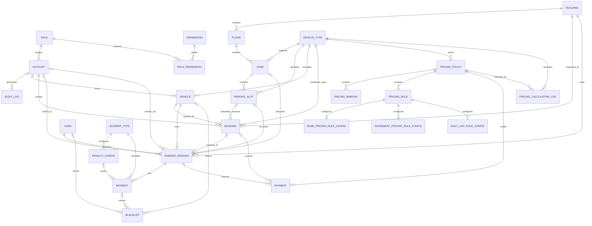
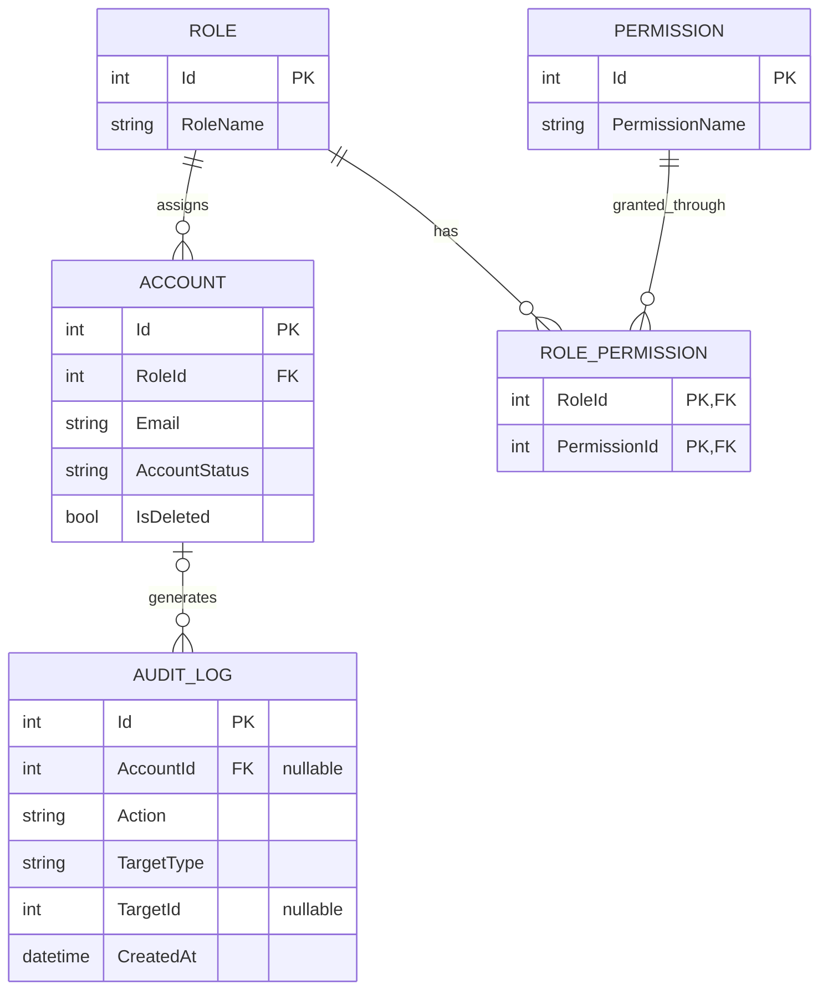
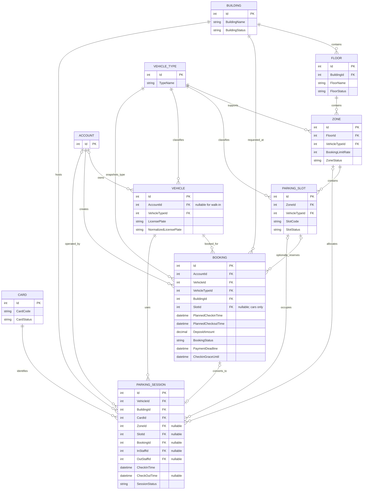
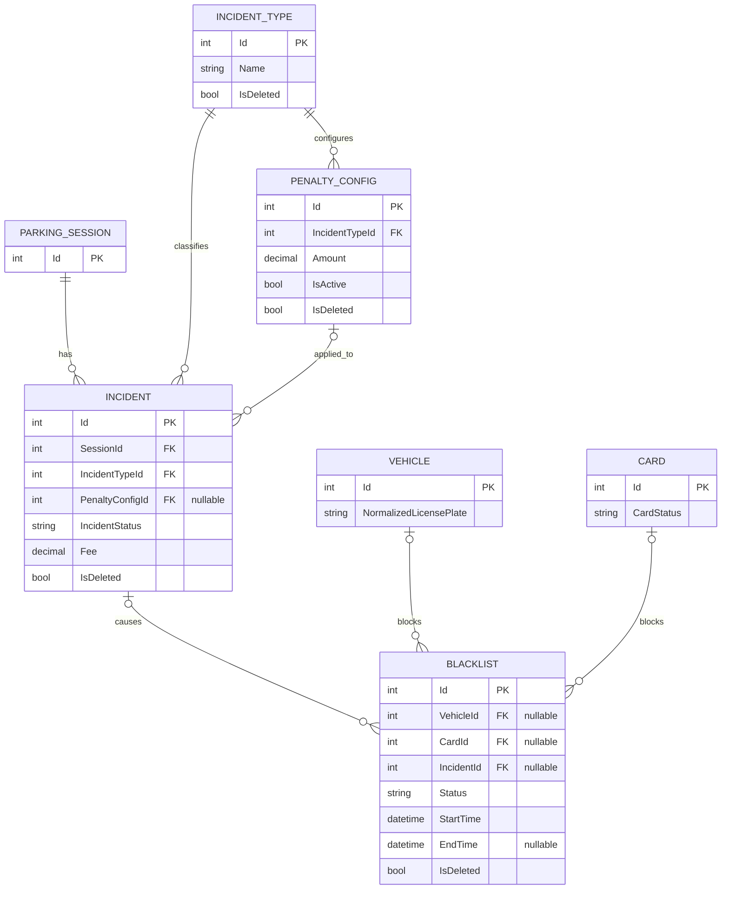
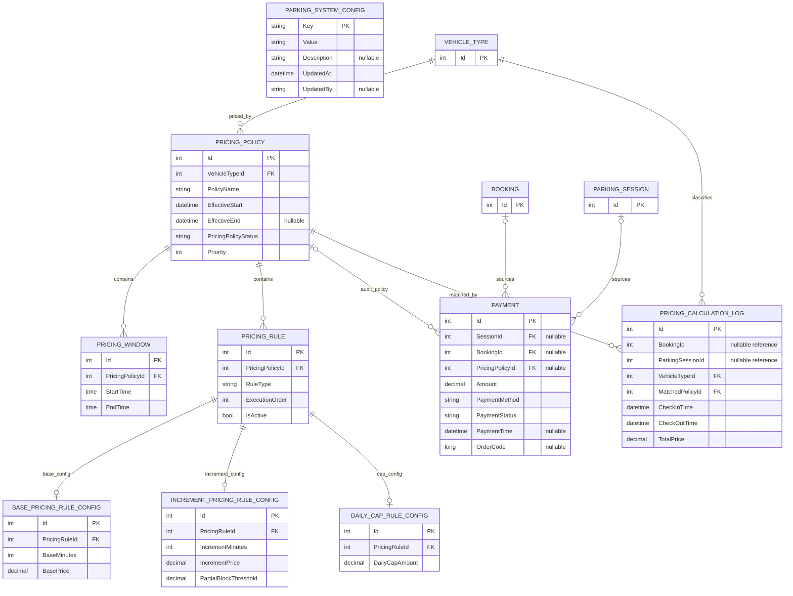

# PBMS Business Analysis

## Business Process, Logical ERD, and Business Rules

| Item | Value |
|---|---|
| Source baseline | `PBMS_SRS_Document.md`, version 1.2 |
| Baseline date | 2026-07-18 |
| Document status | REVIEW |
| Diagram languages | PlantUML activity, Mermaid ERD |
| Active scope | 12 use cases, 27 business rules |

This companion document presents the active PBMS business processes, logical data model, and business rules in a form suitable for review. It does not replace the normative requirements in `../PBMS_SRS_Document.md`.

## 1. Conventions

- Activity diagrams use swimlanes to separate human actors, PBMS components, external services, and background workers.
- Green terminal nodes represent a successful business outcome. Red terminal nodes represent a rejected or failed outcome.
- Entity names, requirement IDs, configuration keys, and state values remain in English to preserve traceability.
- `PK` and `FK` identify primary and foreign keys. A trailing `?` means an optional value or relationship.
- Monthly Subscription and other compatibility objects are not shown as active behavior.

## 2. Business Process Activity Diagrams

### 2.1 Registration and Authentication

**Traceability:** UC-DRV-001; FR-ACC-001 to FR-ACC-003; BR-ACC-001 to BR-ACC-004.

```plantuml
@startuml
title Registration and Authentication
skinparam WrapWidth 250
skinparam DefaultFontSize 48
skinparam TitleFontSize 69
skinparam TitleFontStyle bold
skinparam SwimlaneTitleFontSize 60
skinparam SwimlaneTitleFontStyle bold
skinparam ArrowFontSize 42
skinparam Nodesep 100
skinparam Ranksep 100
skinparam shadowing false
skinparam activity {
  BackgroundColor #F7F7F7
  BorderColor #454545
  DiamondBackgroundColor #FFF2CC
  DiamondBorderColor #8A6D1D
  StartColor #2E7D32
  EndColor #2E7D32
}

|Guest|
start
:Choose password or Google sign-in;

if (Authentication path?) then (Password registration)
  :Enter email;
  |Web UI|
  :Request registration OTP;
  |PBMS API|
  if (Resend cooldown elapsed?) then (No)
    :Reject resend request;
    |Guest|
    :Wait until 60-second cooldown ends; <<#FFCDD2>>
    stop
  else (Yes)
    :Generate six-digit OTP;
    :Store OTP with 5-minute expiry;
    |SMTP|
    :Deliver OTP email;
    |Guest|
    :Submit OTP;
    |PBMS API|
    if (Verification locked?) then (Yes)
      :Reject during 15-minute lockout; <<#FFCDD2>>
      stop
    elseif (OTP valid and not expired?) then (No)
      :Increment failed attempts;
      if (Five failed attempts?) then (Yes)
        :Lock verification for 15 minutes;
      endif
      |Guest|
      :Receive verification failure; <<#FFCDD2>>
      stop
    else (Yes)
      :Issue registration token\nvalid for 10 minutes;
      |Guest|
      :Submit profile, password,\nand registration token;
      |PBMS API|
      if (Token and profile valid?) then (No)
        :Reject account creation; <<#FFCDD2>>
        stop
      else (Yes)
        :Create active Driver account;
      endif
    endif
  endif
else (Google)
  |Google Identity|
  :Validate Google identity;
  |PBMS API|
  if (Existing linked account?) then (No)
    :Require verified new-account\nregistration path;
    |Guest|
    :Complete email verification and profile;
    |PBMS API|
    :Create active Driver account;
  endif
endif

|Guest|
:Submit password or Google credential;
|PBMS API|
if (Credentials belong to active account?) then (No)
  :Reject login; <<#FFCDD2>>
  stop
else (Yes)
  :Issue JWT and account data;
  |Web UI|
  :Store authenticated session;
  :Attach Bearer token to API requests;
  if (An API response is HTTP 401?) then (Yes)
    :Clear local authenticated session;
  endif
  :Authenticated session available; <<#C8E6C9>>
  stop
endif
@enduml
```

> **Known gap:** OQ-GEN-001 and RISK-AUTH-001 remain open. Normal password login currently issues a JWT directly; the disconnected login-OTP branch is not modeled as mandatory MFA.

### 2.2 Parking Structure and Pricing Policy Management

**Traceability:** UC-STR-001; UC-PRICE-001; FR-STR-001 to FR-STR-003; FR-PRICE-001; FR-CFG-001.

```plantuml
@startuml
title Parking Structure and Pricing Policy Management
skinparam WrapWidth 250
skinparam DefaultFontSize 48
skinparam TitleFontSize 69
skinparam TitleFontStyle bold
skinparam SwimlaneTitleFontSize 60
skinparam SwimlaneTitleFontStyle bold
skinparam ArrowFontSize 42
skinparam Nodesep 100
skinparam Ranksep 100
skinparam shadowing false
skinparam activity {
  BackgroundColor #F7F7F7
  BorderColor #454545
  DiamondBackgroundColor #FFF2CC
  DiamondBorderColor #8A6D1D
  StartColor #2E7D32
  EndColor #2E7D32
}

|Manager or Admin|
start
:Open management workspace;
if (Management area?) then (Structure)
  :Create or update Building, Floor,\nZone, VehicleType, or ParkingSlot;
  |Web UI|
  :Validate required fields and ranges;
  |PBMS API|
  if (Authorized and hierarchy valid?) then (No)
    :Reject operation; <<#FFCDD2>>
    stop
  else (Yes)
    if (Zone BookingLimitRate valid 1..100?) then (No)
      :Reject invalid rate; <<#FFCDD2>>
      stop
    endif
    |Database|
    :Persist hierarchy and operational status;
    |PBMS API|
    :Expose active structure to\nbooking, allocation, and monitoring;
  endif
elseif (Pricing policy)
  |Manager|
  :Define vehicle type, effective range,\nrules, caps, and integer priority;
  |PBMS API|
  if (Same-context policy overlaps\nat the same priority?) then (Yes)
    :Reject overlapping policy; <<#FFCDD2>>
    stop
  else (No)
    |Database|
    :Persist policy, windows, and rules;
  endif
else (Dynamic configuration)
  |Manager or Admin|
  :Update supported configuration key;
  |PBMS API|
  if (Type and range valid?) then (No)
    :Reject configuration value; <<#FFCDD2>>
    stop
  else (Yes)
    |Database|
    :Persist configuration value;
  endif
endif

|Pricing Cleanup Worker|
:Every 12 hours, find expired\nactive pricing policies;
|Database|
:Deactivate eligible policies;
|Manager or Admin|
:Management data available to operations; <<#C8E6C9>>
stop
@enduml
```

### 2.3 Booking Lifecycle

**Traceability:** UC-BOOK-001; UC-PAY-001; FR-BOOK-001 to FR-BOOK-006; BR-BOOK-001 to BR-BOOK-011; BR-PAY-001 to BR-PAY-003.

```plantuml
@startuml
title Booking Lifecycle
skinparam WrapWidth 300
skinparam DefaultFontSize 48
skinparam TitleFontSize 69
skinparam TitleFontStyle bold
skinparam SwimlaneTitleFontSize 60
skinparam SwimlaneTitleFontStyle bold
skinparam ArrowFontSize 42
skinparam Nodesep 100
skinparam Ranksep 100
skinparam shadowing false
skinparam activity {
  BackgroundColor #F7F7F7
  BorderColor #454545
  DiamondBackgroundColor #FFF2CC
  DiamondBorderColor #8A6D1D
  StartColor #2E7D32
  EndColor #2E7D32
}

|Driver|
start
:Select owned vehicle, building,\nplanned times, and optional car slot;
|Web UI|
:Submit booking request;
|PBMS API|
:Normalize plate and validate ownership;
if (Lead time >= 15 minutes\nand duration >= 4 hours?) then (No)
  :Reject invalid planned interval; <<#FFCDD2>>
  stop
endif
if (Active structure, compatible type,\nnot blacklisted, no conflict?) then (No)
  :Reject ineligible booking; <<#FFCDD2>>
  stop
endif
if (Slot selected?) then (Yes)
  if (Vehicle is car and slot is\navailable with configured buffer?) then (No)
    :Reject slot selection; <<#FFCDD2>>
    stop
  endif
endif
:Calculate effective capacity and\nzone booking load;
if (Allowed capacity exceeded?) then (Yes)
  :Reject insufficient capacity; <<#FFCDD2>>
  stop
endif
|Pricing Engine|
:Estimate complete planned interval;
|PBMS API|
:Create Pending booking;\nDeposit = full estimate;\nPayment deadline = creation + 15 minutes;\nGrace until = check-in + 30 minutes;
:Create ONLINE_BANKING payment;
:Mark older Pending payments\nfor this booking Failed;
|VNPay|
:Return signed payment URL;
|Driver|
:Complete payment;
|VNPay|
:Send signed IPN or browser return;
|PBMS API|
if (Signature, result, and window valid?) then (Yes)
  :Apply callback idempotently;
  :Set Payment = PAID;
  :Set Booking = Confirmed;
else (No)
  :Keep unsuccessful payment non-PAID;
endif

|Driver|
if (Next action?) then (Modify or extend)
  |PBMS API|
  if (State and new availability valid?) then (Yes)
    :Update Pending booking or apply\neligible extension;
    if (Additional fee required?) then (Yes)
      :Create additional Pending payment;
    endif
  else (No)
    :Reject update; <<#FFCDD2>>
    stop
  endif
elseif (Cancel)
  |PBMS API|
  if (Booking Pending or Confirmed?) then (No)
    :Reject cancellation; <<#FFCDD2>>
    stop
  endif
  :Set Booking = Cancelled;
  if (Confirmed, deposit PAID, and\ncancelled >= 60 minutes before check-in?) then (Yes)
    :Set Payment = REFUND_PENDING;
  else (No)
    :Do not open refund path;
  endif
else (Wait)
endif

|Booking Cleanup Worker|
:Approximately every 5 minutes;
if (Pending past payment deadline?) then (Yes)
  :Set Booking = Expired;
elseif (Confirmed past grace without check-in?) then (Yes)
  :Set Booking = NoShow;
endif
|Driver|
:Booking state and payment state recorded; <<#C8E6C9>>
stop
@enduml
```

### 2.4 Gate Check-in and Allocation

**Traceability:** UC-OPS-001; UC-ALLOC-001; FR-OPS-001 to FR-OPS-003; FR-ALLOC-001; BR-ALLOC-001 to BR-ALLOC-003.

```plantuml
@startuml
title Gate Check-in and Allocation
skinparam WrapWidth 250
skinparam DefaultFontSize 48
skinparam TitleFontSize 69
skinparam TitleFontStyle bold
skinparam SwimlaneTitleFontSize 60
skinparam SwimlaneTitleFontStyle bold
skinparam ArrowFontSize 42
skinparam Nodesep 100
skinparam Ranksep 100
skinparam shadowing false
skinparam activity {
  BackgroundColor #F7F7F7
  BorderColor #454545
  DiamondBackgroundColor #FFF2CC
  DiamondBorderColor #8A6D1D
  StartColor #2E7D32
  EndColor #2E7D32
}

|Staff|
start
:Start gate check-in;
|Gate UI and Camera|
if (Camera available and permitted?) then (Yes)
  :Capture image and submit Base64 payload;
  |Plate Recognizer|
  if (OCR returns candidates?) then (Yes)
    :Return highest-confidence candidate;
  else (No)
    :Return OCR failure;
  endif
else (No)
  :Keep manual plate input available;
endif
|Staff|
:Verify or correct plate manually;
:Provide card and facility context;
|PBMS API|
:Normalize plate: uppercase and remove\nspaces, hyphens, and dots;
:Resolve vehicle and eligible booking;
if (Vehicle/card blacklisted?) then (Yes)
  :Reject check-in; <<#FFCDD2>>
  stop
endif
if (Vehicle or card already has\nan active session?) then (Yes)
  :Reject duplicate active use; <<#FFCDD2>>
  stop
endif
if (Booking, building, vehicle type,\nand hierarchy valid?) then (No)
  :Reject invalid context; <<#FFCDD2>>
  stop
endif
|Allocation Service|
:Select compatible active zone;
if (Car requires concrete slot?) then (Yes)
  :Select compatible non-conflicting slot;
  if (Slot unavailable or conflicting?) then (Yes)
    :Reject allocation; <<#FFCDD2>>
    stop
  endif
else (No)
  :Use zone capacity without required slot;
endif
if (Effective capacity exceeded?) then (Yes)
  :Reject allocation; <<#FFCDD2>>
  stop
endif
|Database|
:Create ACTIVE ParkingSession;
:Bind vehicle, card, zone, optional slot,\nand optional booking;
:Store ImageIn when provided;
:Set Card = Active;
:Set car slot = Occupied when assigned;
:Set linked Booking = CheckedIn;
|Staff|
:Active parking session created; <<#C8E6C9>>
stop
@enduml
```

### 2.5 Session Query and Extension

**Traceability:** UC-SESSION-001; UC-PRICE-002; UC-PAY-001; FR-SESSION-001; FR-SESSION-002; FR-PRICE-002; FR-PRICE-003.

```plantuml
@startuml
title Session Query and Extension
skinparam WrapWidth 250
skinparam DefaultFontSize 48
skinparam TitleFontSize 69
skinparam TitleFontStyle bold
skinparam SwimlaneTitleFontSize 60
skinparam SwimlaneTitleFontStyle bold
skinparam ArrowFontSize 42
skinparam Nodesep 100
skinparam Ranksep 100
skinparam shadowing false
skinparam activity {
  BackgroundColor #F7F7F7
  BorderColor #454545
  DiamondBackgroundColor #FFF2CC
  DiamondBorderColor #8A6D1D
  StartColor #2E7D32
  EndColor #2E7D32
}

|Driver or Staff|
start
:Request active or historical session;
|Web UI|
:Send authenticated query;
|PBMS API|
if (Actor may access session?) then (No)
  :Reject unauthorized access; <<#FFCDD2>>
  stop
endif
:Return timing, allocation, images,\nand payment context;
|Pricing Engine|
:Calculate current estimate;
|Web UI|
:Display session and estimate;
|Driver or Staff|
if (Extension requested?) then (No)
  :Session viewed; <<#C8E6C9>>
  stop
endif
:Submit requested checkout time;
|PBMS API|
if (Session and extension eligible?) then (No)
  :Reject extension; <<#FFCDD2>>
  stop
endif
if (Slot-bound and later booking conflicts\nincluding configured buffer?) then (Yes)
  :Cap extension before conflict;
endif
|Pricing Engine|
:Calculate additional fee;
|PBMS API|
if (Additional fee > 0?) then (Yes)
  :Create or replace Pending payment;
  if (Online settlement selected?) then (Yes)
    |VNPay|
    :Return payment URL and verify result;
    |PBMS API|
    if (Payment PAID?) then (No)
      :Do not finalize extension; <<#FFCDD2>>
      stop
    endif
  else (Cash)
    :Apply configured cash rounding\nand settle synchronously;
  endif
endif
:Update planned checkout time;
|Driver or Staff|
:Accepted extension recorded; <<#C8E6C9>>
stop
@enduml
```

### 2.6 Standard Checkout

**Traceability:** UC-OPS-002; UC-PRICE-002; UC-PAY-001; FR-OPS-004; FR-PRICE-002 to FR-PRICE-003; FR-PAY-001 to FR-PAY-002; BR-FEE-001 to BR-FEE-005; BR-PAY-001 to BR-PAY-002.

```plantuml
@startuml
title Standard Checkout
skinparam WrapWidth 250
skinparam DefaultFontSize 48
skinparam TitleFontSize 69
skinparam TitleFontStyle bold
skinparam SwimlaneTitleFontSize 60
skinparam SwimlaneTitleFontStyle bold
skinparam ArrowFontSize 42
skinparam Nodesep 100
skinparam Ranksep 100
skinparam shadowing false
skinparam activity {
  BackgroundColor #F7F7F7
  BorderColor #454545
  DiamondBackgroundColor #FFF2CC
  DiamondBorderColor #8A6D1D
  StartColor #2E7D32
  EndColor #2E7D32
}

|Staff|
start
:Start checkout and identify session;
|Gate UI and Camera|
:Capture exit evidence or enter plate;
|PBMS API|
:Normalize detected plate;
:Validate active session, plate, and card;
if (Mismatch or lost-card condition?) then (Yes)
  :Route to exceptional checkout process;
  :Continue in Diagram 2.7; <<#FFECB3>>
  stop
endif
|Pricing Engine|
if (APPLY_SEGMENTED_PRICING true?) then (Yes)
  :Select each segment by highest Priority,\nlatest EffectiveStart, then identifier;
else (No)
  :Use non-segmented policy selected\nat check-in;
endif
:Apply base and increment blocks;
:Charge partial increment only\nat or above threshold;
:Apply UTC+7 calendar-day cap;
:Add Open or Processing incident penalties;
|PBMS API|
:Create payment and fail older Pending\npayments for this session;
if (Payment method?) then (CASH)
  :Round by configured unit;
  :Set Payment = PAID synchronously;
else (ONLINE_BANKING)
  |VNPay|
  :Return URL and signed result;
  |PBMS API|
  if (Verified success applied once?) then (No)
    :Do not complete checkout or\nrelease resources; <<#FFCDD2>>
    stop
  endif
  :Set Payment = PAID;
endif
|Database and Resources|
:Store ImageOut and detected plate;
:Set ParkingSession = COMPLETED;
:Release slot and card;
:Resolve applicable open incidents;
|Staff|
:Checkout completed; <<#C8E6C9>>
stop
@enduml
```

### 2.7 Exceptional Checkout, Incidents, and Blacklists

**Traceability:** UC-OPS-002; UC-INC-002; FR-OPS-005; FR-INC-001; FR-CARD-001; FR-BLK-001.

```plantuml
@startuml
title Exceptional Checkout, Incidents, and Blacklists
skinparam WrapWidth 250
skinparam DefaultFontSize 48
skinparam TitleFontSize 69
skinparam TitleFontStyle bold
skinparam SwimlaneTitleFontSize 60
skinparam SwimlaneTitleFontStyle bold
skinparam ArrowFontSize 42
skinparam Nodesep 100
skinparam Ranksep 100
skinparam shadowing false
skinparam activity {
  BackgroundColor #F7F7F7
  BorderColor #454545
  DiamondBackgroundColor #FFF2CC
  DiamondBorderColor #8A6D1D
  StartColor #2E7D32
  EndColor #2E7D32
}

|Staff|
start
:Select exceptional operation;
if (Operation?) then (Plate or card mismatch)
  :Capture evidence and description;
  |PBMS API|
  :Create or update Incident;
  |Incident and Penalty Service|
  :Attach IncidentType and configured penalty;
elseif (Unpaid exit)
  |PBMS API|
  :Mark session UNPAID;
  :Create Incident;
  |Card and Blacklist|
  :Create vehicle or card blacklist entry;
  :Release operational card and slot;
elseif (Lost card)
  |PBMS API|
  :Validate active session and card;
  |Card and Blacklist|
  :Set old Card = Lost;
  :Create related blacklist control;
  |Incident and Penalty Service|
  :Create lost-card Incident and penalty;
  |Staff|
  if (Replacement card supplied?) then (Yes)
    |PBMS API|
    if (Replacement card available\nand not used/blocked?) then (No)
      :Reject replacement card; <<#FFCDD2>>
      stop
    endif
    :Bind replacement card to session;
  endif
else (Rollback checkout)
  |PBMS API|
  if (Successful payment makes reversal unsafe?) then (Yes)
    :Reject rollback; <<#FFCDD2>>
    stop
  else (No)
    :Restore only safely reversible states;
    :Retain failed payment for audit;
  endif
endif

|Staff, Manager, or Admin|
:Review incident or blacklist;
|PBMS API|
if (Authorized update or resolution?) then (No)
  :Reject operation; <<#FFCDD2>>
  stop
else (Yes)
  :Update/resolve Incident and\nrelated resource controls;
  :Exceptional outcome recorded; <<#C8E6C9>>
  stop
endif
@enduml
```

### 2.8 Monitoring, Revenue, and Audit

**Traceability:** UC-MON-001; FR-RPT-001; FR-AUD-001; NFR-OBS-001; BR-PAY-004.

```plantuml
@startuml
title Monitoring, Revenue, and Audit
skinparam WrapWidth 250
skinparam DefaultFontSize 48
skinparam TitleFontSize 69
skinparam TitleFontStyle bold
skinparam SwimlaneTitleFontSize 60
skinparam SwimlaneTitleFontStyle bold
skinparam ArrowFontSize 42
skinparam Nodesep 100
skinparam Ranksep 100
skinparam shadowing false
skinparam activity {
  BackgroundColor #F7F7F7
  BorderColor #454545
  DiamondBackgroundColor #FFF2CC
  DiamondBorderColor #8A6D1D
  StartColor #2E7D32
  EndColor #2E7D32
}

|Staff, Manager, or Admin|
start
:Open operational or reporting view;
|Web UI|
:Submit filters and requested view;
|PBMS API|
if (Request type?) then (Active operations)
  |Operational Data|
  :Query active sessions, slots, cards,\nbookings, and incidents;
  |PBMS API|
  :Return actor-appropriate monitoring data;
elseif (Revenue)
  |Payment Data|
  :Select PAID payments only;
  :Resolve source through Booking\nor ParkingSession;
  :Group by UTC+7 day/month/year,\nbuilding, and vehicle type as requested;
  |PBMS API|
  :Return dynamic revenue totals;\nTotalSubscriptions = 0;
else (Audit log)
  if (Authorized administrator?) then (No)
    :Reject audit query; <<#FFCDD2>>
    stop
  endif
  |Audit Data|
  :Query available AuditLog records\nwith supported filters/pagination;
endif
|Web UI|
:Display result;

|Overtime Warning Worker|
:Every minute, evaluate active sessions\nfor overtime warning conditions;
|Operational Data|
:Record/log actionable warning outcome;
|Staff, Manager, or Admin|
:Operational information available; <<#C8E6C9>>
stop
@enduml
```

> **Authorization warning:** The lanes describe intended actor access. RISK-SEC-001 states that several operational controllers still lack complete server-side authorization.

## 3. Logical Entity-Relationship Diagrams

### 3.1 Active Model Overview

This overview intentionally omits attributes. Detailed PK/FK views follow it.



### 3.2 Identity and Access



### 3.3 Structure, Booking, and Operations



**Key integrity constraints**

- `NormalizedLicensePlate` is the normalized vehicle identity.
- A vehicle, card, or concrete slot cannot participate in two active sessions at once.
- PostgreSQL prevents overlapping Pending or Confirmed bookings for the same non-null `SlotId` over half-open planned intervals.
- Service validation additionally applies the configurable slot buffer and capacity rules.

### 3.4 Incidents and Restrictions



An active `Blacklist` row must identify a blocked vehicle, card, or both. Booking and check-in use normalized plate comparison when evaluating vehicle controls.

### 3.5 Pricing, Payment, and Configuration



Active payments must have a Booking or ParkingSession source. Dormant `MonthlySubscriptionId` compatibility columns are deliberately omitted. A new payment changes older Pending payments for the same active source to Failed.

`ParkingSystemConfig` is a standalone key-value entity. Important active keys include `BUFFER_TIME_MINUTES`, `WALKIN_STAY_THRESHOLD_HOURS`, and `APPLY_SEGMENTED_PRICING`.

### 3.6 Dormant and Compatibility Objects

| Object | Treatment in this document | Reason |
|---|---|---|
| MonthlySubscription and subscription FKs | Excluded from active diagrams | No active controller, application flow, UI, or acceptance target. |
| SubscriptionPriceConfig | Excluded | Persistence/API compatibility without an active consumer. |
| RevenueStatistic and RevenueStatisticPayment | Excluded | Current reports calculate revenue dynamically from PAID payments. |
| GracePeriodRuleConfig | Excluded from active pricing ERD | Persisted legacy configuration is not applied by the active PricingEngine. |

## 4. Business Rules

### 4.1 Quick Reference

| Parameter | Active value | Rule or requirement |
|---|---:|---|
| Registration OTP length | 6 digits | BR-ACC-001 |
| Registration OTP lifetime | 5 minutes | BR-ACC-001 |
| OTP resend cooldown | 60 seconds | BR-ACC-002 |
| OTP failure lockout | 5 failures / 15 minutes | BR-ACC-003 |
| Registration token lifetime | 10 minutes | BR-ACC-004 |
| Minimum booking lead time | 15 minutes | BR-BOOK-001 |
| Minimum booking duration | 4 hours | BR-BOOK-002 |
| Booking payment deadline | 15 minutes after creation | BR-BOOK-003 |
| Confirmed booking check-in grace | 30 minutes | BR-BOOK-004 |
| Default slot buffer | 30 minutes | BR-BOOK-006 |
| Default near-term walk-in threshold | 2 hours | BR-BOOK-007 |
| Default zone booking limit | 80%, valid range 1..100 | BR-BOOK-008 |
| Refund-eligible cancellation threshold | At least 60 minutes before check-in | BR-BOOK-011 |
| Revenue business timezone | UTC+7 | BR-FEE-004, BR-PAY-004 |

### 4.2 Account Verification Rules

| Rule ID | When or condition | Mandatory outcome | Traceability | Status |
|---|---|---|---|---|
| BR-ACC-001 | A registration OTP is issued. | It contains six digits and expires after five minutes. | UC-DRV-001; FR-ACC-001 | REVIEW |
| BR-ACC-002 | The guest requests another OTP. | A resend within sixty seconds is rejected. | UC-DRV-001; FR-ACC-001 | REVIEW |
| BR-ACC-003 | OTP verification fails five times. | Verification is locked for fifteen minutes. | UC-DRV-001; FR-ACC-001 | REVIEW |
| BR-ACC-004 | OTP verification succeeds. | The registration token expires after ten minutes. | UC-DRV-001; FR-ACC-001 | REVIEW |

### 4.3 Booking and Capacity Rules

| Rule ID | When or condition | Mandatory outcome | Traceability | Status |
|---|---|---|---|---|
| BR-BOOK-001 | A booking is created. | Planned check-in is at least fifteen minutes in the future. | UC-BOOK-001; FR-BOOK-001 | REVIEW |
| BR-BOOK-002 | A booking interval is submitted. | Its duration is at least four hours. | UC-BOOK-001; FR-BOOK-001 | REVIEW |
| BR-BOOK-003 | A valid booking is created. | Its payment deadline is creation time plus fifteen minutes. | UC-BOOK-001; FR-BOOK-001, FR-BOOK-006 | REVIEW |
| BR-BOOK-004 | A Confirmed booking awaits check-in. | The check-in grace endpoint is thirty minutes after planned check-in. | UC-BOOK-001; FR-BOOK-001, FR-BOOK-006 | REVIEW |
| BR-BOOK-005 | A booking requests a concrete slot. | Only a car booking may select one. | UC-BOOK-001; FR-BOOK-002 | REVIEW |
| BR-BOOK-006 | Booking or extension availability is evaluated. | The default separation buffer is thirty minutes. | UC-BOOK-001, UC-SESSION-001; FR-BOOK-002, FR-SESSION-002 | REVIEW |
| BR-BOOK-007 | Capacity is checked for a near-term booking. | The default walk-in threshold is two hours. | UC-BOOK-001; FR-BOOK-003 | REVIEW |
| BR-BOOK-008 | A zone booking limit is configured or enforced. | Default is 80%; accepted values are 1 through 100. | UC-STR-001, UC-BOOK-001; FR-STR-002, FR-BOOK-003 | REVIEW |
| BR-BOOK-009 | General capacity is calculated. | Subtract the ceiling of the vehicle-type buffer ratio. | UC-BOOK-001; FR-BOOK-003 | REVIEW |
| BR-BOOK-010 | A booking deposit is calculated. | It equals the pricing estimate for the complete planned interval. | UC-BOOK-001; FR-BOOK-004 | REVIEW |
| BR-BOOK-011 | A Confirmed booking is cancelled. | Cancellation at least sixty minutes before check-in opens the refund path; later cancellation does not. | UC-BOOK-001, UC-PAY-001; FR-BOOK-005, FR-PAY-003 | REVIEW |

#### Booking Cancellation Decision Table

| Booking state | Deposit state | Cancellation time | Booking result | Payment result |
|---|---|---|---|---|
| Pending | Pending/non-paid | Any eligible time | Cancelled | No refund transition |
| Confirmed | Paid | At least 60 minutes before check-in | Cancelled | RefundPending |
| Confirmed | Paid | Less than 60 minutes before check-in | Cancelled | No refund path |
| CheckedIn/NoShow/Expired | Any | Cancellation requested | Reject unless another explicit workflow permits it | Unchanged |

### 4.4 Allocation Rules

| Rule ID | When or condition | Mandatory outcome | Traceability | Status |
|---|---|---|---|---|
| BR-ALLOC-001 | A check-in or allocation is attempted. | The same vehicle cannot have two active sessions. | UC-OPS-001, UC-ALLOC-001; FR-OPS-002 | REVIEW |
| BR-ALLOC-002 | A card is assigned. | The same card cannot serve two active sessions. | UC-OPS-001, UC-ALLOC-001; FR-OPS-002, FR-CARD-001 | REVIEW |
| BR-ALLOC-003 | A concrete slot is assigned or reserved. | It cannot serve overlapping active use. | UC-ALLOC-001; FR-ALLOC-001, FR-BOOK-002 | REVIEW |

### 4.5 Pricing and Fee Rules

| Rule ID | When or condition | Mandatory outcome | Traceability | Status |
|---|---|---|---|---|
| BR-FEE-001 | `APPLY_SEGMENTED_PRICING` is absent or false. | Use non-segmented pricing. | UC-PRICE-002; FR-PRICE-002 | REVIEW |
| BR-FEE-002 | Segmented pricing selects a candidate policy. | Order by Priority, EffectiveStart, then identifier. | UC-PRICE-002; FR-PRICE-002 | REVIEW |
| BR-FEE-003 | A partial increment remains. | Charge it only when its percentage reaches the configured threshold. | UC-PRICE-002; FR-PRICE-003 | REVIEW |
| BR-FEE-004 | A daily cap boundary is calculated. | Use UTC+7 calendar boundaries. | UC-PRICE-002; FR-PRICE-003 | REVIEW |
| BR-FEE-005 | Current pricing is calculated. | Include penalties from Open or Processing incidents. | UC-PRICE-002, UC-INC-002; FR-PRICE-003, FR-INC-001 | REVIEW |

#### Pricing Mode Decision Table

| `APPLY_SEGMENTED_PRICING` | Selection behavior | Tie-breaking / cap behavior |
|---|---|---|
| Missing or false | One active policy at check-in governs selection. | Checkout-selected policy supplies the daily cap. |
| True | Each segment selects the policy applicable at the segment boundary. | Highest Priority, latest EffectiveStart, then identifier; checkout-selected policy supplies the daily cap. |

### 4.6 Payment and Refund Rules

| Rule ID | When or condition | Mandatory outcome | Traceability | Status |
|---|---|---|---|---|
| BR-PAY-001 | A new payment is created for a booking or session. | Older Pending payments for the same source become Failed. | UC-PAY-001; FR-PAY-001 | REVIEW |
| BR-PAY-002 | A payment method is selected. | CASH settles synchronously; ONLINE_BANKING settles only through verified VNPay processing. | UC-PAY-001; FR-PAY-001, FR-PAY-002 | REVIEW |
| BR-PAY-003 | The recorded refund operation is requested. | Only REFUND_PENDING may transition to REFUNDED. | UC-PAY-001; FR-PAY-003 | REVIEW |
| BR-PAY-004 | Revenue is calculated. | Include only PAID payments. | UC-MON-001; FR-RPT-001 | REVIEW |

#### Payment Transition Decision Table

| Current state | Event | Allowed result | Important condition |
|---|---|---|---|
| Pending | Cash completion | Paid | Apply configured cash rounding. |
| Pending | Verified VNPay success | Paid | Signature/result/window valid; apply idempotently. |
| Pending | Replaced, rejected, failed, or expired | Failed | Must not trigger booking/extension success. |
| Paid | Eligible booking cancellation | RefundPending | Cancellation satisfies BR-BOOK-011. |
| RefundPending | Authorized recorded refund | Refunded | This is a state record; external refund behavior remains OQ-PAY-001. |
| Any other state | Recorded refund requested | Reject | BR-PAY-003. |

### 4.7 Deprecated Rule Family

`BR-MONTH-001` through `BR-MONTH-024` are reserved and DEPRECATED under CR-GEN-001. They are not current acceptance rules and must not be reused. Other omitted historical rule IDs also remain reserved.

## 5. Open Questions and Known Gaps

| ID | Unresolved decision | Diagram/data impact |
|---|---|---|
| OQ-GEN-001 | Direct password login or mandatory login OTP/MFA. | Diagram 2.1 models current direct-JWT behavior and labels the gap. |
| OQ-DATA-001 | Retention/deletion periods for images, plates, incidents, audit logs, and payment metadata. | ERD identifies stored operational data but does not invent retention rules. |
| OQ-PRICE-001 | Apply GracePeriodRule in the active engine or retire it. | GracePeriodRuleConfig remains outside the active pricing ERD. |
| OQ-PAY-001 | Recorded state-only refund or external gateway refund. | Diagrams stop at the recorded REFUNDED transition. |
| OQ-OPS-001 | Roles allowed to approve refunds at the API boundary. | Diagrams require an authorized operator without assigning an unsupported role. |
| RISK-SEC-001 | Incomplete server-side authorization on operational controllers. | Actor lanes express intended access, not proof of enforcement. |
| RISK-PRICE-002 | Pricing priority is not clearly exposed by the manager UI. | Diagram 2.2 shows required policy input and preserves the implementation gap. |
| Unnumbered pricing-scope gap | FR-PRICE-001 describes policies by building and vehicle type, while the current `PricingPolicy` entity exposes `VehicleTypeId` but no `BuildingId`. | The logical ERD follows the current entity relationship and records this discrepancy for SRS/schema reconciliation. |

## 6. Traceability Matrix

| Diagram | Use cases | Principal functional requirements | Business rules | Core entities |
|---|---|---|---|---|
| 2.1 Registration and Authentication | UC-DRV-001 | FR-ACC-001 to FR-ACC-003 | BR-ACC-001 to BR-ACC-004 | Account, Role |
| 2.2 Structure and Pricing Management | UC-STR-001, UC-PRICE-001 | FR-STR-001 to FR-STR-003, FR-PRICE-001, FR-CFG-001 | BR-BOOK-008 | Building, Floor, Zone, ParkingSlot, VehicleType, PricingPolicy, ParkingSystemConfig |
| 2.3 Booking Lifecycle | UC-BOOK-001, UC-PAY-001 | FR-BOOK-001 to FR-BOOK-006, FR-PAY-001 to FR-PAY-003 | BR-BOOK-001 to BR-BOOK-011, BR-PAY-001 to BR-PAY-003 | Account, Vehicle, Booking, ParkingSlot, Payment |
| 2.4 Check-in and Allocation | UC-OPS-001, UC-ALLOC-001 | FR-OPS-001 to FR-OPS-003, FR-ALLOC-001 | BR-ALLOC-001 to BR-ALLOC-003 | Vehicle, Card, Booking, ParkingSession, Zone, ParkingSlot, Blacklist |
| 2.5 Session Extension | UC-SESSION-001, UC-PRICE-002, UC-PAY-001 | FR-SESSION-001 to FR-SESSION-002, FR-PRICE-002 to FR-PRICE-003, FR-PAY-001 | BR-FEE-001 to BR-FEE-005, BR-PAY-001 to BR-PAY-002 | ParkingSession, Booking, ParkingSlot, PricingPolicy, Payment |
| 2.6 Standard Checkout | UC-OPS-002, UC-PRICE-002, UC-PAY-001 | FR-OPS-004, FR-PRICE-002 to FR-PRICE-003, FR-PAY-001 to FR-PAY-002 | BR-FEE-001 to BR-FEE-005, BR-PAY-001 to BR-PAY-002 | ParkingSession, Card, ParkingSlot, Incident, PricingPolicy, Payment |
| 2.7 Exceptional Checkout | UC-OPS-002, UC-INC-002 | FR-OPS-005, FR-INC-001, FR-CARD-001, FR-BLK-001 | BR-ALLOC-002, BR-FEE-005 | ParkingSession, IncidentType, PenaltyConfig, Incident, Card, Blacklist |
| 2.8 Monitoring and Reporting | UC-MON-001 | FR-RPT-001, FR-AUD-001 | BR-PAY-004 | ParkingSession, Payment, AuditLog |

## 7. Review Checklist

- [ ] All PlantUML blocks render successfully.
- [ ] All Mermaid ERD blocks render successfully.
- [x] All 12 active use cases are represented by at least one activity diagram.
- [x] All 27 active business rules are listed once in the rule catalogue.
- [x] Monthly Subscription is excluded from active processes and ERDs.
- [x] Dynamic revenue uses PAID payments, not legacy RevenueStatistic tables.
- [x] Known authorization, authentication, pricing, refund, and retention gaps are disclosed.
- [ ] Product owner confirms the unresolved open questions.
- [ ] Security owner confirms actor authorization boundaries.

---

End of PBMS Business Analysis companion for SRS version 1.2.
