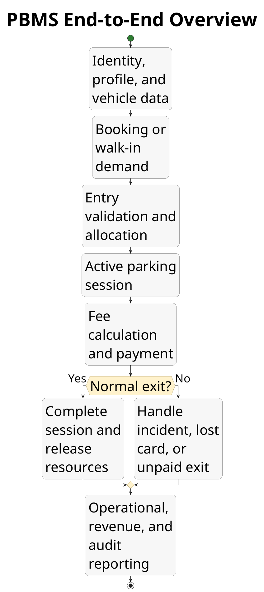
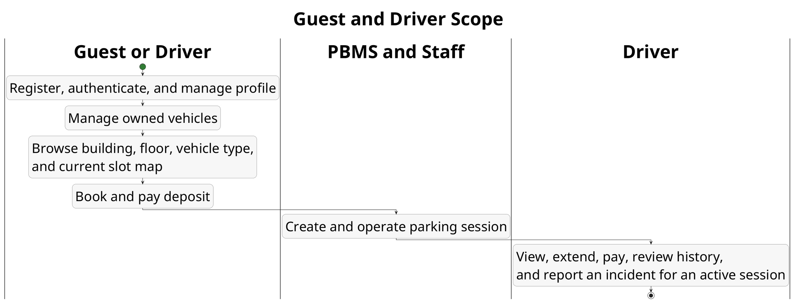
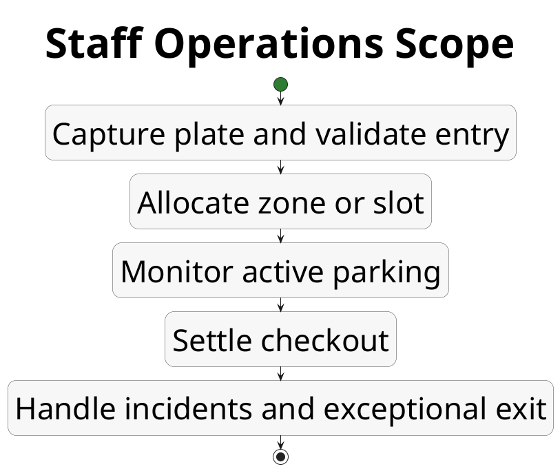
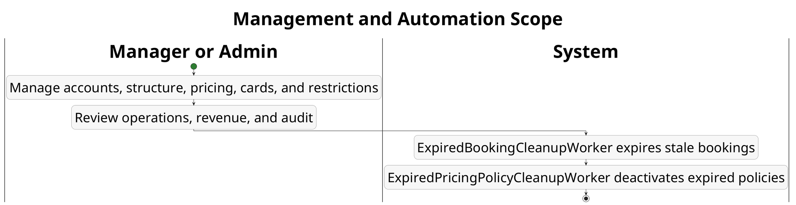
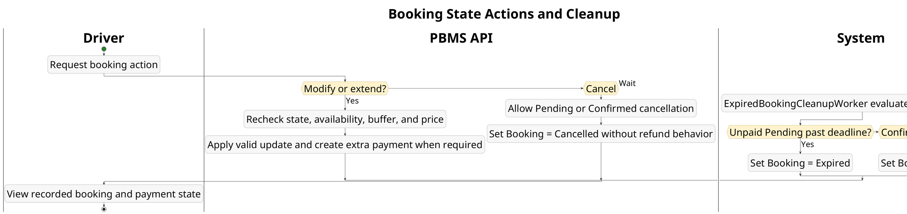
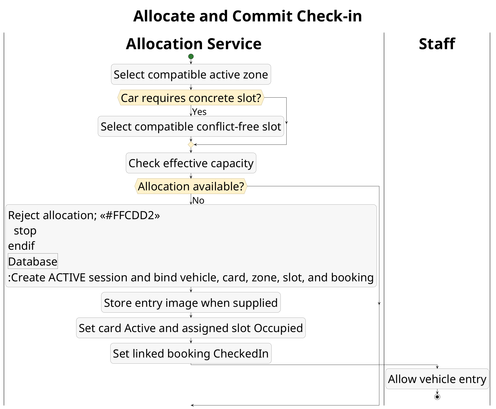
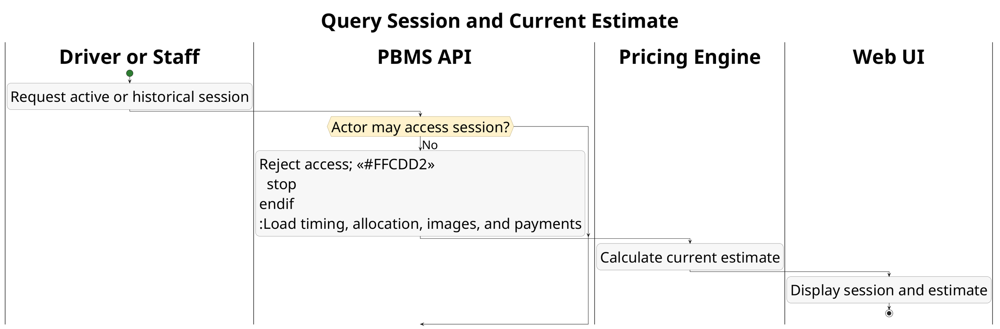

# PBMS Business Analysis

## Purpose

| Item | Value |
|---|---|
| Behavioral source of truth | Current API and web implementation |
| API baseline | `parking-system-api` `develop@daf8dfb` |
| Web baseline | `parking-system-web` `main@8e10c2a` |
| Requirements reference | `../PBMS_SRS_Document.md`, version 1.4 - CR-GEN-003 target baseline |
| Baseline date | 2026-07-20 |
| Document status | REVIEW |
| Diagram languages | PlantUML activity, Mermaid ERD |
| SRS trace scope | Current-release use cases and CR-GEN-003 remediation rules |

This companion document presents the decided PBMS release processes, active logical data model, business rules, and implementation gaps. Current code is evidence; the direct product decisions in CR-GEN-003 define the target where code must be remediated, hidden, or removed.

## Conventions

- Activity diagrams use swimlanes to separate human actors, PBMS components, external services, and background workers.
- Green-highlighted activities represent successful outcomes; red-highlighted activities represent rejection or failure. A terminal node only ends the current subflow.
- Entity names, requirement IDs, configuration keys, and state values remain in English to preserve traceability.
- `PK` and `FK` identify primary and foreign keys. A trailing `?` means an optional value or relationship.
- Refund and Monthly Subscription are removal targets. Notification and Shift Report are excluded release surfaces and are not shown as active behavior.
- A section numbered `x.0` is a consolidated overview. Sections `x.1`, `x.2`, and later isolate smaller independently reviewable subflows.
- `PARTIAL` means implementation exists on only part of the web/API path. `GAP` means the current code cannot complete the described outcome.
- When code and SRS differ, the activity/ERD follows code; traceability and gap sections record the difference.
- `System` identifies non-human background workers; `PBMS` or `PBMS API` identifies synchronous application processing.

## 0. Business Process Landscape

### 0.0 End-to-End Overview



### 0.1 Guest and Driver Scope



### 0.2 Staff Operations Scope



### 0.3 Management and Automation Scope



### 0.4 Six-Commit Web Impact

The reviewed range is `1b67150..8e10c2a` on `parking-system-web`. It changes presentation and Driver workflow composition, but it does not change the API baseline, database migrations, entities, physical relationships, or backend domain rules.

| Changed area | As-Is impact | Diagram impact | ERD / rule impact |
|---|---|---|---|
| Driver navigation | `Parking Utils` is renamed `Parking & Booking`. | Naming is updated where the booking workspace is referenced. | None. |
| Driver dashboard | Driver selects a building, an active compatible floor, vehicle type, and an available mapped slot; selecting the slot opens the booking workspace. | Added to 0.1 and 3.1; summarized in 3.0. | Reuses Building, Floor, Zone, ParkingSlot, VehicleType, Vehicle, and Booking. No relationship change. |
| Motorbike dashboard path | Motorbike uses the general zone and does not select a concrete slot. | Explicit branch in 3.1. | Continues BR-BOOK-005; no new rule. |
| Driver incident report | The UI offers every `IncidentType` returned by the API instead of filtering to `LOST_CARD_1` and `WRONG_SLOT`. | Added as 7.4 and summarized in 7.0. | Reuses ParkingSession, IncidentType, and Incident. No schema change and no new backend rule. |
| Dashboard styling, English text, `.npmrc`, lockfile | Build/presentation only. | No business-process change. | None. |

## 1. Registration and Authentication

### 1.0 Consolidated Overview

**Traceability:** UC-ACC-001, UC-ACC-002; FR-ACC-001 to FR-ACC-004; BR-ACC-001 to BR-ACC-005.

```plantuml
@startuml
title Registration and Authentication
skinparam WrapWidth 250
skinparam DefaultFontSize 48
skinparam TitleFontSize 69
skinparam TitleFontStyle bold
skinparam SwimlaneTitleFontSize 60
skinparam SwimlaneTitleFontStyle bold
skinparam ArrowFontSize 42
skinparam Nodesep 160
skinparam Ranksep 180
skinparam shadowing false
skinparam ConditionStyle inside
skinparam ActivityDiamondFontSize 48
skinparam ActivityDiamondFontStyle bold
skinparam ActivityDiamondBackgroundColor #FFF2CC
skinparam ActivityDiamondBorderColor #8A6D1D
skinparam activity {
  BackgroundColor #F7F7F7
  BorderColor #454545
  DiamondBackgroundColor #FFF2CC
  DiamondBorderColor #8A6D1D
  StartColor #2E7D32
  EndColor #C62828
  Padding 16
  Margin 12
}

|Guest|
start
:Choose password or Google sign-in;

if (\n  Authentication path?  \n) then (Password registration)
  :Enter email;
  |Web UI|
  :Request registration OTP;
  |PBMS API|
  if (\n  Resend cooldown elapsed?  \n) then (No)
    :Reject resend request;
    |Guest|
    :Wait until 60-second cooldown ends; <<#FFCDD2>>
    stop
  else (Yes)
    :Generate six-digit OTP;
    :Store OTP with 5-minute expiry;
    |SMTP|
    :Deliver OTP email;
    |Guest|
    :Submit OTP;
    |PBMS API|
    if (\n  Verification locked?  \n) then (Yes)
      :Reject during 15-minute lockout; <<#FFCDD2>>
      stop
    elseif (\n  OTP valid and not expired?  \n) then (No)
      :Increment failed attempts;
      if (\n  Five failed attempts?  \n) then (Yes)
        :Lock verification for 15 minutes;
      endif
      |Guest|
      :Receive verification failure; <<#FFCDD2>>
      stop
    else (Yes)
      :Issue registration token\nvalid for 10 minutes;
      |Guest|
      :Submit profile, password,\nand registration token;
      |PBMS API|
      if (\n  Token and profile valid?  \n) then (No)
        :Reject account creation; <<#FFCDD2>>
        stop
      else (Yes)
        :Create active Driver account;
      endif
    endif
  endif
else (Google)
  |Google Identity|
  :Validate Google identity;
  |PBMS API|
  if (\n  Existing linked account?  \n) then (No)
    :Require verified new-account\nregistration path;
    |Guest|
    :Complete email verification and profile;
    |PBMS API|
    :Create active Driver account;
  endif
endif

|Guest|
:Submit password or Google credential;
|PBMS API|
if (\n  Credentials belong to active account?  \n) then (No)
  :Reject login; <<#FFCDD2>>
  stop
else (Yes)
  :Issue JWT and account data;
  |Web UI|
  :Store authenticated session;
  :Attach Bearer token to API requests;
  if (\n  An API response is HTTP 401?  \n) then (Yes)
    :Clear local authenticated session;
  endif
  :Authenticated session available; <<#C8E6C9>>
  stop
endif
@enduml
```

> **Release decision:** Password and Google login issue JWT directly. Login OTP/MFA is not exposed in this release; any retained backend branch is future-only.

### 1.1 Registration Verification

```plantuml
@startuml
title Registration Verification
skinparam DefaultFontSize 44
skinparam TitleFontSize 60
skinparam TitleFontStyle bold
skinparam SwimlaneTitleFontSize 60
skinparam SwimlaneTitleFontStyle bold
skinparam ArrowFontSize 36
skinparam Nodesep 180
skinparam Ranksep 200
skinparam shadowing false
skinparam activity {
  BackgroundColor #F7F7F7
  BorderColor #454545
  DiamondBackgroundColor #FFF2CC
  DiamondBorderColor #8A6D1D
  StartColor #2E7D32
  EndColor #C62828
  Padding 16
  Margin 12
}

|Guest|
start
:Request registration OTP;
|PBMS API|
:Require an unregistered email and allowed resend state;
if (Request allowed?) then (No)
  :Reject request; <<#FFCDD2>>
  stop
endif
:Issue six-digit OTP with five-minute lifetime;
|SMTP|
:Send verification email;
|Guest|
:Submit OTP;
|PBMS API|
if (OTP valid before lockout?) then (Yes)
  :Issue ten-minute registration token;
  |Guest|
  :Submit profile and password;
  |PBMS API|
  :Create active Driver account;
  stop
else (No)
  :Count failure and lock after fifth failure; <<#FFCDD2>>
  stop
endif
@enduml
```

### 1.2 Login and Client Session

```plantuml
@startuml
title Login and Client Session
skinparam DefaultFontSize 44
skinparam TitleFontSize 60
skinparam TitleFontStyle bold
skinparam SwimlaneTitleFontSize 60
skinparam SwimlaneTitleFontStyle bold
skinparam ArrowFontSize 36
skinparam Nodesep 180
skinparam Ranksep 200
skinparam shadowing false
skinparam activity {
  BackgroundColor #F7F7F7
  BorderColor #454545
  DiamondBackgroundColor #FFF2CC
  DiamondBorderColor #8A6D1D
  StartColor #2E7D32
  EndColor #C62828
  Padding 16
  Margin 12
}

|Guest|
start
:Submit password or Google credential;
|PBMS API|
:Validate credential and active account;
if (Existing account accepted?) then (Yes)
  :Issue JWT and account data;
  |Web UI|
  :Store token and attach Bearer header;
  if (A later API response is HTTP 401?) then (Yes)
    :Clear local session;
  endif
  stop
else (No)
  :Reject login or route new Google user to verification; <<#FFCDD2>>
  stop
endif
@enduml
```

### 1.3 Password Recovery - Remediation Target

```plantuml
@startuml
title Password Recovery - Target Flow
skinparam DefaultFontSize 44
skinparam TitleFontSize 60
skinparam TitleFontStyle bold
skinparam SwimlaneTitleFontSize 60
skinparam SwimlaneTitleFontStyle bold
skinparam ArrowFontSize 36
skinparam Nodesep 180
skinparam Ranksep 200
skinparam shadowing false
skinparam activity {
  BackgroundColor #F7F7F7
  BorderColor #454545
  StartColor #2E7D32
  EndColor #C62828
  Padding 16
  Margin 12
}

|Guest|
start
:Open forgot password and submit email;
|Web UI|
:Request password recovery;
|PBMS API|
:Return the same generic response for known or unknown email;
:For an eligible existing account, issue a recovery-purpose OTP;
|SMTP|
:Deliver recovery OTP;
|Guest|
:Submit OTP;
|PBMS API|
if (OTP valid, unexpired, and not locked?) then (No)
  :Reject without changing password; <<#FFCDD2>>
  stop
endif
:Issue short-lived single-use recovery token;
|Guest|
:Submit recovery token and new password;
|PBMS API|
if (Token valid and unused?) then (No)
  :Reject replay or invalid token; <<#FFCDD2>>
  stop
endif
:Store new BCrypt password hash and consume token;
|Guest|
:Sign in with new password; <<#C8E6C9>>
stop
@enduml
```

The current code does not yet complete this flow. Implement AUTH-02 in `../PBMS_Remediation_Decision_Report.md` and attach request/verify/reset, expiry, lockout, replay, and E2E evidence before acceptance.

## 2. Parking Structure and Pricing Policy Management

### 2.0 Consolidated Overview

**Traceability:** UC-STR-001; UC-PRICE-001; FR-STR-001 to FR-STR-003; FR-PRICE-001; FR-CFG-001.

```plantuml
@startuml
title Parking Structure and Pricing Policy Management
skinparam WrapWidth 250
skinparam DefaultFontSize 48
skinparam TitleFontSize 69
skinparam TitleFontStyle bold
skinparam SwimlaneTitleFontSize 60
skinparam SwimlaneTitleFontStyle bold
skinparam ArrowFontSize 42
skinparam Nodesep 160
skinparam Ranksep 180
skinparam shadowing false
skinparam ConditionStyle inside
skinparam ActivityDiamondFontSize 48
skinparam ActivityDiamondFontStyle bold
skinparam ActivityDiamondBackgroundColor #FFF2CC
skinparam ActivityDiamondBorderColor #8A6D1D
skinparam activity {
  BackgroundColor #F7F7F7
  BorderColor #454545
  DiamondBackgroundColor #FFF2CC
  DiamondBorderColor #8A6D1D
  StartColor #2E7D32
  EndColor #C62828
  Padding 16
  Margin 12
}

|Manager or Admin|
start
:Open management workspace;
if (\n  Management area?  \n) then (Structure)
  :Create or update Building, Floor,\nZone, VehicleType, or ParkingSlot;
  |Web UI|
  :Validate required fields and ranges;
  |PBMS API|
  if (\n  Authorized and hierarchy valid?  \n) then (No)
    :Reject operation; <<#FFCDD2>>
    stop
  else (Yes)
    if (\n  Zone BookingLimitRate valid 1..100?  \n) then (No)
      :Reject invalid rate; <<#FFCDD2>>
      stop
    endif
    |Database|
    :Persist hierarchy and operational status;
    |PBMS API|
    :Expose active structure to\nbooking, allocation, and monitoring;
  endif
elseif (\n  Pricing policy  \n)
  |Manager|
  :Define vehicle type, effective range,\nrules, Grace Period, caps, and integer priority;
  |PBMS API|
  if (Same-context policy overlaps\nat the same priority?) then (Yes)
    :Reject overlapping policy; <<#FFCDD2>>
    stop
  else (No)
    |Database|
    :Persist policy, windows, and rules;
  endif
else (Dynamic configuration)
  |Manager or Admin|
  :Update supported configuration key;
  |PBMS API|
  if (\n  Type and range valid?  \n) then (No)
    :Reject configuration value; <<#FFCDD2>>
    stop
  else (Yes)
    |Database|
    :Persist configuration value;
  endif
endif

|System|
:ExpiredPricingPolicyCleanupWorker runs every 12 hours and finds expired active pricing policies;
|Database|
:Deactivate eligible policies;
|Manager or Admin|
:Management data available to operations; <<#C8E6C9>>
stop
@enduml
```

**Actor clarification:** Manager or Admin manages and activates pricing policies. System runs `ExpiredPricingPolicyCleanupWorker` automatically every 12 hours. Staff does not execute policy cleanup.

### 2.1 Parking Structure Management

```plantuml
@startuml
title Parking Structure Management
skinparam DefaultFontSize 44
skinparam TitleFontSize 60
skinparam TitleFontStyle bold
skinparam SwimlaneTitleFontSize 60
skinparam SwimlaneTitleFontStyle bold
skinparam ArrowFontSize 36
skinparam shadowing false
skinparam activity {
  BackgroundColor #F7F7F7
  BorderColor #454545
  DiamondBackgroundColor #FFF2CC
  DiamondBorderColor #8A6D1D
  StartColor #2E7D32
  EndColor #C62828
}

|Manager or Admin|
start
:Create or update building, floor, zone, slot, or vehicle type;
|PBMS API|
:Validate hierarchy, compatibility, status, and capacity values;
if (Management data valid?) then (Yes)
  |Database|
  :Persist active structure;
  |PBMS API|
  :Expose structure to booking, allocation, and monitoring;
  stop
else (No)
  :Reject operation; <<#FFCDD2>>
  stop
endif
@enduml
```

### 2.2 Pricing Policy and Dynamic Configuration

```plantuml
@startuml
title Pricing Policy and Dynamic Configuration
skinparam DefaultFontSize 44
skinparam TitleFontSize 60
skinparam TitleFontStyle bold
skinparam SwimlaneTitleFontSize 60
skinparam SwimlaneTitleFontStyle bold
skinparam ArrowFontSize 36
skinparam shadowing false
skinparam activity {
  BackgroundColor #F7F7F7
  BorderColor #454545
  DiamondBackgroundColor #FFF2CC
  DiamondBorderColor #8A6D1D
  StartColor #2E7D32
  EndColor #C62828
}

|Manager or Admin|
start
if (Pricing policy?) then (Yes)
  :Define vehicle type, period, windows, rules, Grace Period, caps, and priority;
  |PBMS API|
  :Validate full-day coverage, rule values, and same-priority overlap;
else (Configuration)
  :Submit supported key and value;
  |PBMS API|
  :Validate type and allowed range;
endif
if (Input accepted?) then (Yes)
  |Database|
  :Persist management data;
  stop
else (No)
  :Reject change; <<#FFCDD2>>
  stop
endif
@enduml
```

## 3. Booking Lifecycle

### 3.0 Consolidated Overview

**Traceability:** UC-BOOK-001; UC-PAY-001; FR-BOOK-001 to FR-BOOK-006; FR-PRICE-004; BR-BOOK-001 to BR-BOOK-011; BR-PAY-001 to BR-PAY-002.

```plantuml
@startuml
title Booking Lifecycle
skinparam WrapWidth 300
skinparam DefaultFontSize 48
skinparam TitleFontSize 69
skinparam TitleFontStyle bold
skinparam SwimlaneTitleFontSize 60
skinparam SwimlaneTitleFontStyle bold
skinparam ArrowFontSize 42
skinparam Nodesep 160
skinparam Ranksep 180
skinparam shadowing false
skinparam ConditionStyle inside
skinparam ActivityDiamondFontSize 48
skinparam ActivityDiamondFontStyle bold
skinparam ActivityDiamondBackgroundColor #FFF2CC
skinparam ActivityDiamondBorderColor #8A6D1D
skinparam activity {
  BackgroundColor #F7F7F7
  BorderColor #454545
  DiamondBackgroundColor #FFF2CC
  DiamondBorderColor #8A6D1D
  StartColor #2E7D32
  EndColor #C62828
  Padding 16
  Margin 12
}

|Driver|
start
:Select owned vehicle, building, active compatible floor,\nvehicle type, planned times, and optional available car slot;
|Web UI|
:Submit booking request;
|PBMS API|
:Normalize plate and validate ownership;
if (Lead time >= 15 minutes\nand duration >= 4 hours?) then (No)
  :Reject invalid planned interval; <<#FFCDD2>>
  stop
endif
if (Active structure, compatible type,\nnot blacklisted, no conflict?) then (No)
  :Reject ineligible booking; <<#FFCDD2>>
  stop
endif
if (\n  Slot selected?  \n) then (Yes)
  if (Vehicle is car and slot is\navailable with configured buffer?) then (No)
    :Reject slot selection; <<#FFCDD2>>
    stop
  endif
endif
:Calculate effective capacity and\nzone booking load;
if (\n  Allowed capacity exceeded?  \n) then (Yes)
  :Reject insufficient capacity; <<#FFCDD2>>
  stop
endif
|Pricing Engine|
:Estimate complete planned interval;
|PBMS API|
:Create Pending booking;\nDeposit = full estimate;\nPayment deadline = creation + 15 minutes;\nGrace until = check-in + 30 minutes;
:Persist one BOOKING_DEPOSIT calculation log\nwith the committed deposit;
:Create ONLINE_BANKING payment;
:Mark older Pending payments\nfor this booking Failed;
|VNPay|
:Return signed payment URL;
|Driver|
:Complete payment;
|VNPay|
:Send signed IPN or browser return;
|PBMS API|
if (\n  Signature, result, and window valid?  \n) then (Yes)
  :Apply callback idempotently;
  :Set Payment = PAID;
  :Set Booking = Confirmed;
else (No)
  :Keep unsuccessful payment non-PAID;
endif

|Driver|
if (\n  Next action?  \n) then (Modify or extend)
  |PBMS API|
  if (\n  State and new availability valid?  \n) then (Yes)
    :Update Pending booking or apply\neligible extension;
    if (\n  Additional fee required?  \n) then (Yes)
      :Create additional Pending payment;
    endif
  else (No)
    :Reject update; <<#FFCDD2>>
    stop
  endif
elseif (\n  Cancel  \n)
  |PBMS API|
  if (\n  Booking Pending or Confirmed?  \n) then (No)
    :Reject cancellation; <<#FFCDD2>>
    stop
  endif
  :Set Booking = Cancelled;
  :Do not initiate or record a refund;
else (Wait)
endif

|System|
:ExpiredBookingCleanupWorker runs approximately every 5 minutes;
if (\n  Pending past payment deadline?  \n) then (Yes)
  :Set Booking = Expired;
elseif (\n  Confirmed past grace without check-in?  \n) then (Yes)
  :Set Booking = NoShow;
endif
|Driver|
:Booking state and payment state recorded; <<#C8E6C9>>
stop
@enduml
```

### 3.1 Driver Map-to-Booking Selection

This subflow is the direct business impact of web range `1b67150..8e10c2a`. Slot status shown here is advisory UI state; the API revalidates availability, capacity, hierarchy, and conflicts when the booking is submitted.

```plantuml
@startuml
title Driver Map-to-Booking Selection
skinparam DefaultFontSize 44
skinparam TitleFontSize 60
skinparam TitleFontStyle bold
skinparam SwimlaneTitleFontSize 60
skinparam SwimlaneTitleFontStyle bold
skinparam ArrowFontSize 36
skinparam shadowing false
skinparam activity {
  BackgroundColor #F7F7F7
  BorderColor #454545
  DiamondBackgroundColor #FFF2CC
  DiamondBorderColor #8A6D1D
  StartColor #2E7D32
  EndColor #C62828
}

|Driver|
start
:Open dashboard or Parking & Booking;
|Web UI|
:Load all buildings;
|Driver|
:Select building and vehicle type;
|Web UI|
:Load building floors, General zones,\nand slots for compatibility;
:Show active compatible floors and current slot states;
|Driver|
:Select a floor;
if (Vehicle type is motorbike?) then (Yes)
  :Continue with general Motorbike Zone\nwithout a concrete slot;
else (No)
  :Select an available car slot on the map;
  |Web UI|
  :Open Parking & Booking with slot code\nand vehicle type parameters;
  :Resolve globally unique slot code to\nZone, Floor, and Building;
endif
|Driver|
:Complete vehicle, date, time, and summary steps;
|PBMS API|
:Revalidate structure, type, slot status,\noverlap, buffer, and capacity;
if (Booking selection remains eligible?) then (Yes)
  :Continue booking and deposit flow; <<#C8E6C9>>
  stop
else (No)
  :Reject stale or invalid selection; <<#FFCDD2>>
  stop
endif
@enduml
```

### 3.2 Create Booking and Pay Deposit

```plantuml
@startuml
title Create Booking and Pay Deposit
skinparam DefaultFontSize 44
skinparam TitleFontSize 60
skinparam TitleFontStyle bold
skinparam SwimlaneTitleFontSize 60
skinparam SwimlaneTitleFontStyle bold
skinparam ArrowFontSize 36
skinparam shadowing false
skinparam activity {
  BackgroundColor #F7F7F7
  BorderColor #454545
  DiamondBackgroundColor #FFF2CC
  DiamondBorderColor #8A6D1D
  StartColor #2E7D32
  EndColor #C62828
}

|Driver|
start
:Select owned vehicle, building, times, and optional mapped car slot;
|PBMS API|
:Require 15-minute lead and four-hour minimum duration;
:Check ownership, restriction, hierarchy, buffer, and capacity;
if (Booking eligible?) then (No)
  :Reject request; <<#FFCDD2>>
  stop
endif
|Pricing Engine|
:Estimate complete planned interval;
|PBMS API|
:Create Pending booking with 15-minute payment deadline;
:Persist one BOOKING_DEPOSIT calculation log;
:Create online payment and fail older Pending payments;
|VNPay|
:Return signed payment result;
|PBMS API|
if (Verified payment successful?) then (Yes)
  :Set Payment = PAID and Booking = Confirmed;
  stop
else (No)
  :Keep booking unconfirmed; <<#FFCDD2>>
  stop
endif
@enduml
```

### 3.3 Modify, Cancel, Extend, or Expire Booking



## 4. Gate Check-in and Allocation

### 4.0 Consolidated Overview

**Traceability:** UC-OPS-001; FR-OPS-001 to FR-OPS-003; FR-ALLOC-001; BR-ALLOC-001 to BR-ALLOC-003.

```plantuml
@startuml
title Gate Check-in and Allocation
skinparam WrapWidth 250
skinparam DefaultFontSize 48
skinparam TitleFontSize 69
skinparam TitleFontStyle bold
skinparam SwimlaneTitleFontSize 60
skinparam SwimlaneTitleFontStyle bold
skinparam ArrowFontSize 42
skinparam Nodesep 160
skinparam Ranksep 180
skinparam shadowing false
skinparam ConditionStyle inside
skinparam ActivityDiamondFontSize 48
skinparam ActivityDiamondFontStyle bold
skinparam ActivityDiamondBackgroundColor #FFF2CC
skinparam ActivityDiamondBorderColor #8A6D1D
skinparam activity {
  BackgroundColor #F7F7F7
  BorderColor #454545
  DiamondBackgroundColor #FFF2CC
  DiamondBorderColor #8A6D1D
  StartColor #2E7D32
  EndColor #C62828
  Padding 16
  Margin 12
}

|Staff|
start
:Start gate check-in;
|Gate UI and Camera|
if (\n  Camera available and permitted?  \n) then (Yes)
  :Capture image and submit Base64 payload;
  |Plate Recognizer|
  if (\n  OCR returns candidates?  \n) then (Yes)
    :Return highest-confidence candidate;
  else (No)
    :Return OCR failure;
  endif
else (No)
  :Keep manual plate input available;
endif
|Staff|
:Verify or correct plate manually;
:Provide card and facility context;
|PBMS API|
:Normalize plate: uppercase and remove\nspaces, hyphens, and dots;
:Resolve vehicle and eligible booking;
if (\n  Vehicle/card blacklisted?  \n) then (Yes)
  :Reject check-in; <<#FFCDD2>>
  stop
endif
if (Vehicle or card already has\nan active session?) then (Yes)
  :Reject duplicate active use; <<#FFCDD2>>
  stop
endif
if (Booking, building, vehicle type,\nand hierarchy valid?) then (No)
  :Reject invalid context; <<#FFCDD2>>
  stop
endif
|Allocation Service|
:Select compatible active zone;
if (\n  Car requires concrete slot?  \n) then (Yes)
  :Select compatible non-conflicting slot;
  if (\n  Slot unavailable or conflicting?  \n) then (Yes)
    :Reject allocation; <<#FFCDD2>>
    stop
  endif
else (No)
  :Use zone capacity without required slot;
endif
if (\n  Effective capacity exceeded?  \n) then (Yes)
  :Reject allocation; <<#FFCDD2>>
  stop
endif
|Database|
:Create ACTIVE ParkingSession;
:Bind vehicle, card, zone, optional slot,\nand optional booking;
:Store ImageIn when provided;
:Set Card = Active;
:Set car slot = Occupied when assigned;
:Set linked Booking = CheckedIn;
|Staff|
:Active parking session created; <<#C8E6C9>>
stop
@enduml
```

### 4.1 Capture and Entry Pre-check

```plantuml
@startuml
title Capture and Entry Pre-check
skinparam DefaultFontSize 44
skinparam TitleFontSize 60
skinparam TitleFontStyle bold
skinparam SwimlaneTitleFontSize 60
skinparam SwimlaneTitleFontStyle bold
skinparam ArrowFontSize 36
skinparam shadowing false
skinparam activity {
  BackgroundColor #F7F7F7
  BorderColor #454545
  DiamondBackgroundColor #FFF2CC
  DiamondBorderColor #8A6D1D
  StartColor #2E7D32
  EndColor #C62828
}

|Staff|
start
:Capture image or enter plate manually;
|Plate Recognizer|
:Return highest-confidence candidate when OCR succeeds;
|Staff|
:Verify or correct plate and provide card/building;
|PBMS API|
:Normalize plate and resolve vehicle and eligible booking;
:Check blacklists and duplicate active vehicle/card use;
if (Entry context valid?) then (Yes)
  :Forward to allocation;
  stop
else (No)
  :Reject entry; <<#FFCDD2>>
  stop
endif
@enduml
```

### 4.2 Allocate and Commit Check-in



## 5. Session Query and Extension

### 5.0 Consolidated Overview

**Traceability:** UC-SESSION-001; UC-PRICE-002; UC-PAY-001; FR-SESSION-001; FR-SESSION-002; FR-PRICE-002; FR-PRICE-003.

```plantuml
@startuml
title Session Query and Extension
skinparam WrapWidth 250
skinparam DefaultFontSize 48
skinparam TitleFontSize 69
skinparam TitleFontStyle bold
skinparam SwimlaneTitleFontSize 60
skinparam SwimlaneTitleFontStyle bold
skinparam ArrowFontSize 42
skinparam Nodesep 160
skinparam Ranksep 180
skinparam shadowing false
skinparam ConditionStyle inside
skinparam ActivityDiamondFontSize 48
skinparam ActivityDiamondFontStyle bold
skinparam ActivityDiamondBackgroundColor #FFF2CC
skinparam ActivityDiamondBorderColor #8A6D1D
skinparam activity {
  BackgroundColor #F7F7F7
  BorderColor #454545
  DiamondBackgroundColor #FFF2CC
  DiamondBorderColor #8A6D1D
  StartColor #2E7D32
  EndColor #C62828
  Padding 16
  Margin 12
}

|Driver or Staff|
start
:Request active or historical session;
|Web UI|
:Send authenticated query;
|PBMS API|
if (\n  Actor may access session?  \n) then (No)
  :Reject unauthorized access; <<#FFCDD2>>
  stop
endif
:Return timing, allocation, images,\nand payment context;
|Pricing Engine|
:Calculate current estimate;
|Web UI|
:Display session and estimate;
|Driver or Staff|
if (\n  Extension requested?  \n) then (No)
  :Session viewed; <<#C8E6C9>>
  stop
endif
:Submit requested checkout time;
|PBMS API|
if (\n  Session and extension eligible?  \n) then (No)
  :Reject extension; <<#FFCDD2>>
  stop
endif
if (Slot-bound and later booking conflicts\nincluding configured buffer?) then (Yes)
  :Cap extension before conflict;
endif
|Pricing Engine|
:Calculate additional fee;
|PBMS API|
if (\n  Additional fee > 0?  \n) then (Yes)
  :Create or replace Pending payment;
  if (\n  Online settlement selected?  \n) then (Yes)
    |VNPay|
    :Return payment URL and verify result;
    |PBMS API|
    if (\n  Payment PAID?  \n) then (No)
      :Do not finalize extension; <<#FFCDD2>>
      stop
    endif
  else (Cash)
    :Apply configured cash rounding\nand settle synchronously;
  endif
endif
:Update planned checkout time;
|Driver or Staff|
:Accepted extension recorded; <<#C8E6C9>>
stop
@enduml
```

### 5.1 Query Session and Current Estimate



### 5.2 Extend Session and Settle Difference

```plantuml
@startuml
title Extend Session and Settle Difference
skinparam DefaultFontSize 44
skinparam TitleFontSize 60
skinparam TitleFontStyle bold
skinparam SwimlaneTitleFontSize 60
skinparam SwimlaneTitleFontStyle bold
skinparam ArrowFontSize 36
skinparam shadowing false
skinparam activity {
  BackgroundColor #F7F7F7
  BorderColor #454545
  DiamondBackgroundColor #FFF2CC
  DiamondBorderColor #8A6D1D
  StartColor #2E7D32
  EndColor #C62828
}

|Driver or Staff|
start
:Submit requested checkout time;
|PBMS API|
:Check active state and cap at next slot conflict with buffer;
if (Extension eligible?) then (No)
  :Reject extension; <<#FFCDD2>>
  stop
endif
|Pricing Engine|
:Calculate additional fee;
|PBMS API|
if (Additional fee due?) then (Yes)
  :Settle cash or verified VNPay payment;
  if (Payment successful?) then (No)
    :Do not finalize extension; <<#FFCDD2>>
    stop
  endif
endif
:Update planned checkout time;
stop
@enduml
```

## 6. Standard Checkout

### 6.0 Consolidated Overview

**Traceability:** UC-OPS-002; UC-PRICE-002; UC-PAY-001; FR-OPS-004; FR-PRICE-002 to FR-PRICE-003; FR-PAY-001 to FR-PAY-002; BR-FEE-001 to BR-FEE-005; BR-PAY-001 to BR-PAY-002.

```plantuml
@startuml
title Standard Checkout
skinparam WrapWidth 250
skinparam DefaultFontSize 48
skinparam TitleFontSize 69
skinparam TitleFontStyle bold
skinparam SwimlaneTitleFontSize 60
skinparam SwimlaneTitleFontStyle bold
skinparam ArrowFontSize 42
skinparam Nodesep 160
skinparam Ranksep 180
skinparam shadowing false
skinparam ConditionStyle inside
skinparam ActivityDiamondFontSize 48
skinparam ActivityDiamondFontStyle bold
skinparam ActivityDiamondBackgroundColor #FFF2CC
skinparam ActivityDiamondBorderColor #8A6D1D
skinparam activity {
  BackgroundColor #F7F7F7
  BorderColor #454545
  DiamondBackgroundColor #FFF2CC
  DiamondBorderColor #8A6D1D
  StartColor #2E7D32
  EndColor #C62828
  Padding 16
  Margin 12
}

|Staff|
start
:Start checkout and identify session;
|Gate UI and Camera|
:Capture exit evidence or enter plate;
|PBMS API|
:Normalize detected plate;
:Validate active session, plate, and card;
if (\n  Mismatch or lost-card condition?  \n) then (Yes)
  :Route to exceptional checkout process;
  :Continue in Diagram 7.0; <<#FFECB3>>
  stop
endif
|Pricing Engine|
if (\n  APPLY_SEGMENTED_PRICING true?  \n) then (Yes)
  :Select each segment by highest Priority,\nlatest EffectiveStart, then identifier;
else (No)
  :Use non-segmented policy selected\nat check-in;
endif
:Apply base and increment blocks;
:Charge partial increment only\nat or above threshold;
:Apply UTC+7 calendar-day cap;
:Add Open or Processing incident penalties;
|PBMS API|
:Create payment and fail older Pending\npayments for this session;
if (\n  Payment method?  \n) then (CASH)
  :Round by configured unit;
  :Set Payment = PAID synchronously;
else (ONLINE_BANKING)
  |VNPay|
  :Return URL and signed result;
  |PBMS API|
  if (\n  Verified success applied once?  \n) then (No)
    :Do not complete checkout or\nrelease resources; <<#FFCDD2>>
    stop
  endif
  :Set Payment = PAID;
endif
|Database and Resources|
:Store ImageOut and detected plate;
:Set ParkingSession = COMPLETED;
:Release slot and card;
:Resolve applicable open incidents;
|Staff|
:Checkout completed; <<#C8E6C9>>
stop
@enduml
```

### 6.1 Validate, Price, and Pay

```plantuml
@startuml
title Standard Checkout - Validate, Price, and Pay
skinparam DefaultFontSize 44
skinparam TitleFontSize 60
skinparam TitleFontStyle bold
skinparam SwimlaneTitleFontSize 60
skinparam SwimlaneTitleFontStyle bold
skinparam ArrowFontSize 36
skinparam shadowing false
skinparam activity {
  BackgroundColor #F7F7F7
  BorderColor #454545
  DiamondBackgroundColor #FFF2CC
  DiamondBorderColor #8A6D1D
  StartColor #2E7D32
  EndColor #C62828
}

|Staff|
start
:Identify active session and capture exit evidence;
|PBMS API|
:Validate plate, card, and session;
if (Mismatch or lost card?) then (Yes)
  :Route to exceptional checkout; <<#FFECB3>>
  stop
endif
|Pricing Engine|
:Select policy and calculate blocks, threshold, cap, and penalties;
|PBMS API|
:Create current checkout payment;
if (Cash?) then (Yes)
  :Round and settle synchronously;
else (Online)
  |VNPay|
  :Return signed result;
  |PBMS API|
  if (Verified success?) then (No)
    :Keep session active; <<#FFCDD2>>
    stop
  endif
endif
stop
@enduml
```

### 6.2 Finalize Session and Release Resources

```plantuml
@startuml
title Standard Checkout - Finalize and Release
skinparam DefaultFontSize 44
skinparam TitleFontSize 60
skinparam TitleFontStyle bold
skinparam SwimlaneTitleFontSize 60
skinparam SwimlaneTitleFontStyle bold
skinparam ArrowFontSize 36
skinparam shadowing false
skinparam activity {
  BackgroundColor #F7F7F7
  BorderColor #454545
  StartColor #2E7D32
  EndColor #2E7D32
}

|PBMS API|
start
:Require settled or zero-amount payment result;
|Database and Resources|
:Store ImageOut and detected plate;
:Set session COMPLETED;
:Release assigned slot and card;
:Resolve applicable open incidents;
|Staff|
:Allow vehicle exit;
stop
@enduml
```

## 7. Exceptional Checkout, Incidents, and Blacklists

### 7.0 Consolidated Overview

**Traceability:** UC-OPS-002; UC-INC-001; FR-OPS-005; FR-INC-001; FR-CARD-001; FR-BLK-001.

```plantuml
@startuml
title Exceptional Checkout, Incidents, and Blacklists
skinparam WrapWidth 250
skinparam DefaultFontSize 48
skinparam TitleFontSize 69
skinparam TitleFontStyle bold
skinparam SwimlaneTitleFontSize 60
skinparam SwimlaneTitleFontStyle bold
skinparam ArrowFontSize 42
skinparam Nodesep 160
skinparam Ranksep 180
skinparam shadowing false
skinparam ConditionStyle inside
skinparam ActivityDiamondFontSize 48
skinparam ActivityDiamondFontStyle bold
skinparam ActivityDiamondBackgroundColor #FFF2CC
skinparam ActivityDiamondBorderColor #8A6D1D
skinparam activity {
  BackgroundColor #F7F7F7
  BorderColor #454545
  DiamondBackgroundColor #FFF2CC
  DiamondBorderColor #8A6D1D
  StartColor #2E7D32
  EndColor #C62828
  Padding 16
  Margin 12
}

|Staff|
start
:Select exceptional operation;
if (\n  Operation?  \n) then (Plate or card mismatch)
  :Capture evidence and description;
  |PBMS API|
  :Create or update Incident;
  |Incident and Penalty Service|
  :Attach IncidentType and configured penalty;
elseif (\n  Unpaid exit  \n)
  |PBMS API|
  :Mark session UNPAID;
  :Create Incident;
  |Card and Blacklist|
  :Create vehicle or card blacklist entry;
  :Release operational card and slot;
elseif (\n  Lost card  \n)
  |PBMS API|
  :Validate active session and card;
  |Card and Blacklist|
  :Set old Card = Lost;
  :Create related blacklist control;
  |Incident and Penalty Service|
  :Create lost-card Incident and penalty;
  |Staff|
  if (\n  Replacement card supplied?  \n) then (Yes)
    |PBMS API|
    if (Replacement card available\nand not used/blocked?) then (No)
      :Reject replacement card; <<#FFCDD2>>
      stop
    endif
    :Bind replacement card to session;
  endif
else (Rollback checkout)
  |PBMS API|
  if (\n  Successful payment makes reversal unsafe?  \n) then (Yes)
    :Reject rollback; <<#FFCDD2>>
    stop
  else (No)
    :Restore only safely reversible states;
    :Retain failed payment for audit;
  endif
endif

|Staff, Manager, or Admin|
:Review incident or blacklist;
|PBMS API|
if (\n  Authorized update or resolution?  \n) then (No)
  :Reject operation; <<#FFCDD2>>
  stop
else (Yes)
  :Update/resolve Incident and\nrelated resource controls;
  :Exceptional outcome recorded; <<#C8E6C9>>
  stop
endif
@enduml
```

### 7.1 Mismatch or Unpaid Exit

```plantuml
@startuml
title Mismatch or Unpaid Exit
skinparam DefaultFontSize 44
skinparam TitleFontSize 60
skinparam TitleFontStyle bold
skinparam SwimlaneTitleFontSize 60
skinparam SwimlaneTitleFontStyle bold
skinparam ArrowFontSize 36
skinparam shadowing false
skinparam activity {
  BackgroundColor #F7F7F7
  BorderColor #454545
  DiamondBackgroundColor #FFF2CC
  DiamondBorderColor #8A6D1D
  StartColor #2E7D32
  EndColor #2E7D32
}

|Staff|
start
if (Plate or card mismatch?) then (Yes)
  :Capture evidence and description;
  |PBMS API|
  :Create or update incident and penalty;
else (Unpaid exit)
  |PBMS API|
  :Set session UNPAID and create incident;
  :Create vehicle restriction when absent;
  :Release operational card and slot;
endif
:Keep outcome available for review;
stop
@enduml
```

### 7.2 Lost Card, Replacement, and Rollback

```plantuml
@startuml
title Lost Card, Replacement, and Rollback
skinparam DefaultFontSize 44
skinparam TitleFontSize 60
skinparam TitleFontStyle bold
skinparam SwimlaneTitleFontSize 60
skinparam SwimlaneTitleFontStyle bold
skinparam ArrowFontSize 36
skinparam shadowing false
skinparam activity {
  BackgroundColor #F7F7F7
  BorderColor #454545
  DiamondBackgroundColor #FFF2CC
  DiamondBorderColor #8A6D1D
  StartColor #2E7D32
  EndColor #C62828
}

|Staff|
start
:Report lost card for active session;
|PBMS API|
:Set old card Lost and create incident, penalty, and restriction;
if (Replacement supplied?) then (Yes)
  :Require available, unused, unblocked card;
  if (Eligible?) then (Yes)
    :Bind and activate replacement card;
  else (No)
    :Reject replacement; <<#FFCDD2>>
    stop
  endif
endif
if (Rollback requested?) then (Yes)
  :Restore only safely reversible states and keep payment history;
endif
stop
@enduml
```

### 7.3 Incident and Restriction Review

```plantuml
@startuml
title Incident and Restriction Review
skinparam DefaultFontSize 44
skinparam TitleFontSize 60
skinparam TitleFontStyle bold
skinparam SwimlaneTitleFontSize 60
skinparam SwimlaneTitleFontStyle bold
skinparam ArrowFontSize 36
skinparam shadowing false
skinparam activity {
  BackgroundColor #F7F7F7
  BorderColor #454545
  DiamondBackgroundColor #FFF2CC
  DiamondBorderColor #8A6D1D
  StartColor #2E7D32
  EndColor #C62828
}

|Staff, Manager, or Admin|
start
:Open incident, penalty, card, or blacklist record;
|PBMS API|
if (Requested update authorized?) then (Yes)
  :Update incident status and related controls;
  :Soft-delete or end restriction when resolved;
  stop
else (No)
  :Reject operation; <<#FFCDD2>>
  stop
endif
@enduml
```

### 7.4 Driver Incident Reporting

The Driver can select every active `IncidentType` returned by `/IncidentType`. PBMS must validate that the selected session is active and belongs to the authenticated Driver. The current release accepts text description only.

```plantuml
@startuml
title Driver Incident Reporting
skinparam DefaultFontSize 44
skinparam TitleFontSize 60
skinparam TitleFontStyle bold
skinparam SwimlaneTitleFontSize 60
skinparam SwimlaneTitleFontStyle bold
skinparam ArrowFontSize 36
skinparam shadowing false
skinparam activity {
  BackgroundColor #F7F7F7
  BorderColor #454545
  DiamondBackgroundColor #FFF2CC
  DiamondBorderColor #8A6D1D
  StartColor #2E7D32
  EndColor #C62828
}

|Driver|
start
:Open Incident Report;
|Web UI|
:Load Driver vehicles and active sessions;
:Filter sessions by registered license plates;
:Load every IncidentType returned by PBMS API;
if (Owned active session available?) then (No)
  |Driver|
  :Cannot submit an incident; <<#FFCDD2>>
  stop
endif
|Driver|
:Select active session and incident type;
:Enter required description;
|Web UI|
:Submit SessionId, IncidentTypeId,\nand Description only;
|PBMS API|
:Validate active type and session ownership;
:Create text-only Incident;
if (Incident created?) then (Yes)
  |Web UI|
  :Reload Driver incident list; <<#C8E6C9>>
  stop
else (No)
  |Driver|
  :Receive controlled submission error; <<#FFCDD2>>
  stop
endif
@enduml
```

> **Remediation requirement:** Remove the file control and every evidence-upload claim. Keep all active Incident Types visible, but enforce active-type and session-ownership authorization on the server.

## 8. Monitoring, Revenue, and Audit

### 8.0 Consolidated Overview

**Traceability:** UC-RPT-001; FR-RPT-001, FR-AUD-001; NFR-OBS-001; BR-PAY-004.

```plantuml
@startuml
title Monitoring, Revenue, and Audit
skinparam WrapWidth 250
skinparam DefaultFontSize 48
skinparam TitleFontSize 69
skinparam TitleFontStyle bold
skinparam SwimlaneTitleFontSize 60
skinparam SwimlaneTitleFontStyle bold
skinparam ArrowFontSize 42
skinparam Nodesep 160
skinparam Ranksep 180
skinparam shadowing false
skinparam ConditionStyle inside
skinparam ActivityDiamondFontSize 48
skinparam ActivityDiamondFontStyle bold
skinparam ActivityDiamondBackgroundColor #FFF2CC
skinparam ActivityDiamondBorderColor #8A6D1D
skinparam activity {
  BackgroundColor #F7F7F7
  BorderColor #454545
  DiamondBackgroundColor #FFF2CC
  DiamondBorderColor #8A6D1D
  StartColor #2E7D32
  EndColor #C62828
  Padding 16
  Margin 12
}

|Staff, Manager, or Admin|
start
:Open operational or reporting view;
|Web UI|
:Submit filters and requested view;
|PBMS API|
if (\n  Request type?  \n) then (Active operations)
  |Operational Data|
  :Query active sessions, slots, cards,\nbookings, and incidents;
  |PBMS API|
  :Return actor-appropriate monitoring data;
elseif (\n  Revenue  \n)
  |Payment Data|
  :Select PAID payments only;
  :Resolve source through Booking\nor ParkingSession;
  :Group by UTC+7 day/month/year,\nbuilding, and vehicle type as requested;
  |PBMS API|
  :Return dynamic revenue totals;
else (Audit log)
  if (\n  Authorized administrator?  \n) then (No)
    :Reject audit query; <<#FFCDD2>>
    stop
  endif
  |Audit Data|
  :Query available AuditLog records\nwith supported filters/pagination;
endif
|Web UI|
:Display result;

|Staff, Manager, or Admin|
:Operational information available; <<#C8E6C9>>
stop
@enduml
```

> **Authorization warning:** The lanes describe intended actor access. RISK-SEC-001 states that several operational controllers still lack complete server-side authorization.

### 8.1 Operational Monitoring and Revenue

```plantuml
@startuml
title Operational Monitoring and Revenue
skinparam DefaultFontSize 44
skinparam TitleFontSize 60
skinparam TitleFontStyle bold
skinparam SwimlaneTitleFontSize 60
skinparam SwimlaneTitleFontStyle bold
skinparam ArrowFontSize 36
skinparam shadowing false
skinparam activity {
  BackgroundColor #F7F7F7
  BorderColor #454545
  DiamondBackgroundColor #FFF2CC
  DiamondBorderColor #8A6D1D
  StartColor #2E7D32
  EndColor #2E7D32
}

|Staff, Manager, or Admin|
start
if (Operational view?) then (Yes)
  :Select sessions, slots, cards, bookings, or incidents;
  |PBMS API|
  :Return current filtered data;
else (Revenue)
  :Select date and aggregation scope;
  |Revenue Service|
  :Aggregate PAID payments using UTC+7 business dates;
  :Resolve building and vehicle type from booking or session;
endif
|Web UI|
:Display result;
stop
@enduml
```

### 8.2 Audit Query and Active Background Workers

```plantuml
@startuml
title Audit Query and Background Workers
skinparam DefaultFontSize 44
skinparam TitleFontSize 60
skinparam TitleFontStyle bold
skinparam SwimlaneTitleFontSize 60
skinparam SwimlaneTitleFontStyle bold
skinparam ArrowFontSize 36
skinparam shadowing false
skinparam activity {
  BackgroundColor #F7F7F7
  BorderColor #454545
  StartColor #2E7D32
  EndColor #2E7D32
}

|Manager or Admin|
start
:Query authorized audit records with filters and pagination;
|PBMS API|
:Return available AuditLog data;
|System|
:ExpiredBookingCleanupWorker expires unpaid bookings and marks confirmed no-shows;
:ExpiredPricingPolicyCleanupWorker deactivates expired active policies;
:Record or log actionable operational outcomes;
stop
@enduml
```

> **Release exclusion:** User Notification and Shift Report/shift handover are not current processes. Notification-only and Shift Report backend code may remain only when non-exposed and non-running.

## 9. Logical Entity-Relationship Diagrams

### 9.0 Active Model Overview

This overview intentionally omits attributes. Detailed PK/FK views follow it.

```mermaid
erDiagram
    ROLE ||--o{ ACCOUNT : assigns
    ROLE ||--o{ ROLE_PERMISSION : contains
    PERMISSION ||--o{ ROLE_PERMISSION : grants
    ACCOUNT o|--o{ AUDIT_LOG : generates
    ACCOUNT o|--o{ VEHICLE : owns
    ACCOUNT ||--o{ BOOKING : creates
    ACCOUNT o|--o{ PARKING_SESSION : checks_in
    ACCOUNT o|--o{ PARKING_SESSION : checks_out
    BUILDING ||--o{ FLOOR : contains
    FLOOR ||--o{ ZONE : contains
    VEHICLE_TYPE ||--o{ ZONE : supports
    ZONE ||--o{ PARKING_SLOT : contains
    VEHICLE_TYPE ||--o{ PARKING_SLOT : classifies
    VEHICLE_TYPE ||--o{ VEHICLE : classifies

    VEHICLE ||--o{ BOOKING : booked_for
    VEHICLE_TYPE ||--o{ BOOKING : snapshots_type
    BUILDING ||--o{ BOOKING : requested_at
    PARKING_SLOT o|--o{ BOOKING : optionally_reserves
    BOOKING o|--o| PARKING_SESSION : converts_to

    VEHICLE ||--o{ PARKING_SESSION : uses
    BUILDING ||--o{ PARKING_SESSION : hosts
    CARD ||--o{ PARKING_SESSION : identifies
    ZONE o|--o{ PARKING_SESSION : allocates
    PARKING_SLOT o|--o{ PARKING_SESSION : occupies

    INCIDENT_TYPE ||--o{ PENALTY_CONFIG : configures
    PARKING_SESSION ||--o{ INCIDENT : has
    INCIDENT_TYPE ||--o{ INCIDENT : classifies
    PENALTY_CONFIG o|--o{ INCIDENT : prices
    INCIDENT o|--o{ BLACKLIST : causes
    VEHICLE o|--o{ BLACKLIST : blocks
    CARD o|--o{ BLACKLIST : blocks

    VEHICLE_TYPE ||--o{ PRICING_POLICY : prices
    PRICING_POLICY ||--o{ PRICING_WINDOW : contains
    PRICING_POLICY ||--o{ PRICING_RULE : contains
    PRICING_RULE ||--o| BASE_PRICING_RULE_CONFIG : configures
    PRICING_RULE ||--o| INCREMENT_PRICING_RULE_CONFIG : configures
    PRICING_RULE ||--o| DAILY_CAP_RULE_CONFIG : configures
    PRICING_RULE ||--o| GRACE_PERIOD_RULE_CONFIG : configures
    BOOKING o|--o{ PAYMENT : sources
    PARKING_SESSION o|--o{ PAYMENT : sources
    PRICING_POLICY o|--o{ PAYMENT : audits
    VEHICLE_TYPE ||--o{ PRICING_CALCULATION_LOG : classifies
    PRICING_POLICY ||--o{ PRICING_CALCULATION_LOG : matched_by
```

### 9.1 Identity and Access

```mermaid
erDiagram
    ROLE {
        int Id PK
        string RoleName
    }
    PERMISSION {
        int Id PK
        string PermissionName
    }
    ROLE_PERMISSION {
        int RoleId PK,FK
        int PermissionId PK,FK
    }
    ACCOUNT {
        int Id PK
        int RoleId FK
        string Email
        string AccountStatus
        bool IsDeleted
    }
    AUDIT_LOG {
        int Id PK
        int AccountId FK "nullable"
        string Action
        string TargetType
        int TargetId "nullable"
        datetime CreatedAt
    }

    ROLE ||--o{ ACCOUNT : assigns
    ROLE ||--o{ ROLE_PERMISSION : has
    PERMISSION ||--o{ ROLE_PERMISSION : granted_through
    ACCOUNT o|--o{ AUDIT_LOG : generates
```

`Role`, `Permission`, and `RolePermission` remain active. Every non-public endpoint maps to a stable Permission code enforced by PBMS; Admin alone changes mappings, and resource ownership is checked separately.

### 9.2 Structure, Booking, and Operations

```mermaid
erDiagram
    BUILDING {
        int Id PK
        string BuildingName
        string BuildingStatus
    }
    FLOOR {
        int Id PK
        int BuildingId FK
        string FloorName
        string FloorStatus
    }
    ZONE {
        int Id PK
        int FloorId FK
        int VehicleTypeId FK
        int BookingLimitRate
        string ZoneStatus
    }
    PARKING_SLOT {
        int Id PK
        int ZoneId FK
        int VehicleTypeId FK
        string SlotCode
        string SlotStatus
    }
    VEHICLE_TYPE {
        int Id PK
        string TypeName
    }
    VEHICLE {
        int Id PK
        int AccountId FK "nullable for walk-in"
        int VehicleTypeId FK
        string LicensePlate
        string NormalizedLicensePlate
    }
    CARD {
        int Id PK
        string CardCode
        string CardStatus
    }
    BOOKING {
        int Id PK
        int AccountId FK
        int VehicleId FK
        int VehicleTypeId FK
        int BuildingId FK
        int SlotId FK "nullable; cars only"
        datetime PlannedCheckinTime
        datetime PlannedCheckoutTime
        decimal DepositAmount
        string BookingStatus
        datetime PaymentDeadline
        datetime CheckinGraceUntil
    }
    PARKING_SESSION {
        int Id PK
        int VehicleId FK
        int BuildingId FK
        int CardId FK
        int ZoneId FK "nullable"
        int SlotId FK "nullable"
        int BookingId FK "nullable"
        int InStaffId FK "nullable"
        int OutStaffId FK "nullable"
        datetime CheckInTime
        datetime CheckOutTime "nullable"
        string SessionStatus
    }
    ACCOUNT {
        int Id PK
    }

    BUILDING ||--o{ FLOOR : contains
    FLOOR ||--o{ ZONE : contains
    VEHICLE_TYPE ||--o{ ZONE : supports
    ZONE ||--o{ PARKING_SLOT : contains
    VEHICLE_TYPE ||--o{ PARKING_SLOT : classifies
    ACCOUNT o|--o{ VEHICLE : owns
    VEHICLE_TYPE ||--o{ VEHICLE : classifies
    ACCOUNT ||--o{ BOOKING : creates
    VEHICLE ||--o{ BOOKING : booked_for
    VEHICLE_TYPE ||--o{ BOOKING : snapshots_type
    BUILDING ||--o{ BOOKING : requested_at
    PARKING_SLOT o|--o{ BOOKING : optionally_reserves
    VEHICLE ||--o{ PARKING_SESSION : uses
    BUILDING ||--o{ PARKING_SESSION : hosts
    CARD ||--o{ PARKING_SESSION : identifies
    ZONE o|--o{ PARKING_SESSION : allocates
    PARKING_SLOT o|--o{ PARKING_SESSION : occupies
    BOOKING o|--o| PARKING_SESSION : converts_to
    ACCOUNT o|--o{ PARKING_SESSION : operated_by
```

**Key integrity constraints**

- `NormalizedLicensePlate` is the normalized vehicle identity.
- A vehicle, card, or concrete slot cannot participate in two active sessions at once.
- PostgreSQL prevents overlapping Pending or Confirmed bookings for the same non-null `SlotId` over half-open planned intervals.
- Service validation additionally applies the configurable slot buffer and capacity rules.

### 9.3 Incidents and Restrictions

```mermaid
erDiagram
    INCIDENT_TYPE {
        int Id PK
        string Name
        bool IsDeleted
    }
    PENALTY_CONFIG {
        int Id PK
        int IncidentTypeId FK
        decimal Amount
        bool IsActive
        bool IsDeleted
    }
    INCIDENT {
        int Id PK
        int SessionId FK
        int IncidentTypeId FK
        int PenaltyConfigId FK "nullable"
        string IncidentStatus
        decimal Fee
        bool IsDeleted
    }
    BLACKLIST {
        int Id PK
        int VehicleId FK "nullable"
        int CardId FK "nullable"
        int IncidentId FK "nullable"
        string Status
        datetime StartTime
        datetime EndTime "nullable"
        bool IsDeleted
    }
    PARKING_SESSION {
        int Id PK
    }
    VEHICLE {
        int Id PK
        string NormalizedLicensePlate
    }
    CARD {
        int Id PK
        string CardStatus
    }

    INCIDENT_TYPE ||--o{ PENALTY_CONFIG : configures
    PARKING_SESSION ||--o{ INCIDENT : has
    INCIDENT_TYPE ||--o{ INCIDENT : classifies
    PENALTY_CONFIG o|--o{ INCIDENT : applied_to
    INCIDENT o|--o{ BLACKLIST : causes
    VEHICLE o|--o{ BLACKLIST : blocks
    CARD o|--o{ BLACKLIST : blocks
```

An active `Blacklist` row must identify a blocked vehicle, card, or both. Booking and check-in use normalized plate comparison when evaluating vehicle controls.

### 9.4 Pricing, Payment, and Configuration

```mermaid
erDiagram
    PRICING_POLICY {
        int Id PK
        int VehicleTypeId FK
        string PolicyName
        datetime EffectiveStart
        datetime EffectiveEnd "nullable"
        string PricingPolicyStatus
        int Priority
    }
    PRICING_WINDOW {
        int Id PK
        int PricingPolicyId FK
        time StartTime
        time EndTime
    }
    PRICING_RULE {
        int Id PK
        int PricingPolicyId FK
        string RuleType
        int ExecutionOrder
        bool IsActive
    }
    GRACE_PERIOD_RULE_CONFIG {
        int Id PK
        int PricingRuleId FK
        int GracePeriodMinutes
    }
    BASE_PRICING_RULE_CONFIG {
        int Id PK
        int PricingRuleId FK
        int BaseMinutes
        decimal BasePrice
    }
    INCREMENT_PRICING_RULE_CONFIG {
        int Id PK
        int PricingRuleId FK
        int IncrementMinutes
        decimal IncrementPrice
        decimal PartialBlockThreshold
    }
    DAILY_CAP_RULE_CONFIG {
        int Id PK
        int PricingRuleId FK
        decimal DailyCapAmount
    }
    PAYMENT {
        int Id PK
        int SessionId FK "nullable"
        int BookingId FK "nullable"
        int PricingPolicyId FK "nullable"
        decimal Amount
        string PaymentMethod
        string PaymentStatus
        datetime PaymentTime "nullable"
        long OrderCode "nullable"
    }
    PRICING_CALCULATION_LOG {
        int Id PK
        int BookingId "nullable reference"
        int ParkingSessionId "nullable reference"
        int PaymentId "nullable reference"
        int VehicleTypeId FK
        int MatchedPolicyId FK
        string CalculationPurpose
        datetime CheckInTime
        datetime CheckOutTime
        decimal TotalPrice
        string BreakdownJson
        string CorrelationKey
        datetime CalculatedAt
    }
    PARKING_SYSTEM_CONFIG {
        string Key PK
        string Value
        string Description "nullable"
        datetime UpdatedAt
        string UpdatedBy "nullable"
    }
    VEHICLE_TYPE {
        int Id PK
    }
    BOOKING {
        int Id PK
    }
    PARKING_SESSION {
        int Id PK
    }

    VEHICLE_TYPE ||--o{ PRICING_POLICY : priced_by
    PRICING_POLICY ||--o{ PRICING_WINDOW : contains
    PRICING_POLICY ||--o{ PRICING_RULE : contains
    PRICING_RULE ||--o| BASE_PRICING_RULE_CONFIG : base_config
    PRICING_RULE ||--o| INCREMENT_PRICING_RULE_CONFIG : increment_config
    PRICING_RULE ||--o| DAILY_CAP_RULE_CONFIG : cap_config
    PRICING_RULE ||--o| GRACE_PERIOD_RULE_CONFIG : grace_config
    BOOKING o|--o{ PAYMENT : sources
    PARKING_SESSION o|--o{ PAYMENT : sources
    PRICING_POLICY o|--o{ PAYMENT : audit_policy
    VEHICLE_TYPE ||--o{ PRICING_CALCULATION_LOG : classifies
    PRICING_POLICY ||--o{ PRICING_CALCULATION_LOG : matched_by
    BOOKING o|--o{ PRICING_CALCULATION_LOG : commits
    PARKING_SESSION o|--o{ PRICING_CALCULATION_LOG : commits
    PAYMENT o|--o{ PRICING_CALCULATION_LOG : commits
```

Active payments must have a Booking or ParkingSession source. Refund and Monthly Subscription columns are removal targets and are omitted. A new payment changes older Pending payments for the same active source to Failed.

`ParkingSystemConfig` is a standalone key-value entity. Important active keys include `BUFFER_TIME_MINUTES`, `WALKIN_STAY_THRESHOLD_HOURS`, and `APPLY_SEGMENTED_PRICING`.

### 9.5 Excluded Future Backend Objects

`ShiftReport` and `Notification` are excluded from the active ERD, processes, rules, states, and acceptance scope. If their backend code or tables are retained for future work, they must remain non-exposed and non-running in the current release.

### 9.6 Dormant and Compatibility Objects

| Object | Treatment in this document | Reason |
|---|---|---|
| MonthlySubscription, SubscriptionPriceConfig, and subscription FKs | Remove from project | Product decision rejects legacy compatibility; use a reviewed dependency-ordered migration. |
| RevenueStatistic and RevenueStatisticPayment | Excluded | Current reports calculate revenue dynamically from PAID payments. |
| Refund-only payment states and operations | Remove from project | Cancellation does not initiate or record a refund. |

## 10. Business Rules

The `BR-*` identifiers come from the SRS, but the values and outcomes below were rechecked against the reviewed services, domain engine, DTO validation, workers, and configuration fallbacks. A rule without an active end-to-end code path is classified as partial, dormant, deprecated, or an open gap instead of being presented as implemented behavior.

### 10.1 Quick Reference

| Parameter | Active value | Rule or requirement |
|---|---:|---|
| Registration OTP length | 6 digits | BR-ACC-001 |
| Registration OTP lifetime | 5 minutes | BR-ACC-001 |
| OTP resend cooldown | 60 seconds | BR-ACC-002 |
| OTP failure lockout | 5 failures / 15 minutes | BR-ACC-003 |
| Registration token lifetime | 10 minutes | BR-ACC-004 |
| Minimum booking lead time | 15 minutes | BR-BOOK-001 |
| Minimum booking duration | 4 hours | BR-BOOK-002 |
| Booking payment deadline | 15 minutes after creation | BR-BOOK-003 |
| Confirmed booking check-in grace | 30 minutes | BR-BOOK-004 |
| Default slot buffer | 30 minutes | BR-BOOK-006 |
| Default near-term walk-in threshold | 2 hours | BR-BOOK-007 |
| Default zone booking limit | 80%, valid range 1..100 | BR-BOOK-008 |
| Booking cancellation refund behavior | No refund state or operation | BR-BOOK-011 |
| Pricing Grace Period | Configured non-negative minutes per applicable rule/window | BR-FEE-007 |
| Revenue business timezone | UTC+7 | BR-FEE-004, BR-PAY-004 |

### 10.2 Account Verification Rules

| Rule ID | When or condition | Mandatory outcome | Traceability | Status |
|---|---|---|---|---|
| BR-ACC-001 | A registration OTP is issued. | It contains six digits and expires after five minutes. | UC-ACC-001; FR-ACC-001 | REVIEW |
| BR-ACC-002 | The guest requests another OTP. | A resend within sixty seconds is rejected. | UC-ACC-001; FR-ACC-001 | REVIEW |
| BR-ACC-003 | OTP verification fails five times. | Verification is locked for fifteen minutes. | UC-ACC-001; FR-ACC-001 | REVIEW |
| BR-ACC-004 | OTP verification succeeds. | The registration token expires after ten minutes. | UC-ACC-001; FR-ACC-001 | REVIEW |
| BR-ACC-005 | Password recovery is requested or verified. | Use a distinct purpose, generic request response, short lifetime, lockout, and single-use token. | UC-ACC-002; FR-ACC-004 | REVIEW |

### 10.3 Booking and Capacity Rules

| Rule ID | When or condition | Mandatory outcome | Traceability | Status |
|---|---|---|---|---|
| BR-BOOK-001 | A booking is created. | Planned check-in is at least fifteen minutes in the future. | UC-BOOK-001; FR-BOOK-001 | REVIEW |
| BR-BOOK-002 | A booking interval is submitted. | Its duration is at least four hours. | UC-BOOK-001; FR-BOOK-001 | REVIEW |
| BR-BOOK-003 | A valid booking is created. | Its payment deadline is creation time plus fifteen minutes. | UC-BOOK-001; FR-BOOK-001, FR-BOOK-006 | REVIEW |
| BR-BOOK-004 | A Confirmed booking awaits check-in. | The check-in grace endpoint is thirty minutes after planned check-in. | UC-BOOK-001; FR-BOOK-001, FR-BOOK-006 | REVIEW |
| BR-BOOK-005 | A booking requests a concrete slot. | Only a car booking may select one. | UC-BOOK-001; FR-BOOK-002 | REVIEW |
| BR-BOOK-006 | Booking or extension availability is evaluated. | The default separation buffer is thirty minutes. | UC-BOOK-001, UC-SESSION-001; FR-BOOK-002, FR-SESSION-002 | REVIEW |
| BR-BOOK-007 | Capacity is checked for a near-term booking. | The default walk-in threshold is two hours. | UC-BOOK-001; FR-BOOK-003 | REVIEW |
| BR-BOOK-008 | A zone booking limit is configured or enforced. | Default is 80%; accepted values are 1 through 100. | UC-STR-001, UC-BOOK-001; FR-STR-002, FR-BOOK-003 | REVIEW |
| BR-BOOK-009 | General capacity is calculated. | Subtract the ceiling of the vehicle-type buffer ratio. | UC-BOOK-001; FR-BOOK-003 | REVIEW |
| BR-BOOK-010 | A booking deposit is calculated. | It equals the pricing estimate for the complete planned interval. | UC-BOOK-001; FR-BOOK-004 | REVIEW |
| BR-BOOK-011 | An eligible Pending or Confirmed Booking is cancelled. | Set Booking to Cancelled without initiating or recording a refund. | UC-BOOK-001; FR-BOOK-005 | REVIEW |

#### Booking Cancellation Decision Table

| Booking state | Deposit state | Cancellation time | Booking result | Payment result |
|---|---|---|---|---|
| Pending | Pending/non-paid | Any eligible time | Cancelled | No refund transition |
| Confirmed | Paid | Any eligible time | Cancelled | Unchanged; no refund behavior |
| CheckedIn/NoShow/Expired | Any | Cancellation requested | Reject unless another explicit workflow permits it | Unchanged |

### 10.4 Allocation Rules

| Rule ID | When or condition | Mandatory outcome | Traceability | Status |
|---|---|---|---|---|
| BR-ALLOC-001 | A check-in or allocation is attempted. | The same vehicle cannot have two active sessions. | UC-OPS-001; FR-OPS-002 | REVIEW |
| BR-ALLOC-002 | A card is assigned. | The same card cannot serve two active sessions. | UC-OPS-001; FR-OPS-002, FR-CARD-001 | REVIEW |
| BR-ALLOC-003 | A concrete slot is assigned or reserved. | It cannot serve overlapping active use. | UC-OPS-001; FR-ALLOC-001, FR-BOOK-002 | REVIEW |

### 10.5 Pricing and Fee Rules

| Rule ID | When or condition | Mandatory outcome | Traceability | Status |
|---|---|---|---|---|
| BR-FEE-001 | `APPLY_SEGMENTED_PRICING` is absent or false. | Use non-segmented pricing. | UC-PRICE-002; FR-PRICE-002 | REVIEW |
| BR-FEE-002 | Segmented pricing selects a candidate policy. | Order by Priority, EffectiveStart, then identifier. | UC-PRICE-002; FR-PRICE-002 | REVIEW |
| BR-FEE-003 | A partial increment remains. | Charge it only when its percentage reaches the configured threshold. | UC-PRICE-002; FR-PRICE-003 | REVIEW |
| BR-FEE-004 | A daily cap boundary is calculated. | Use UTC+7 calendar boundaries. | UC-PRICE-002; FR-PRICE-003 | REVIEW |
| BR-FEE-005 | Current pricing is calculated. | Include penalties from Open or Processing incidents. | UC-PRICE-002, UC-INC-001; FR-PRICE-003, FR-INC-001 | REVIEW |
| BR-FEE-006 | A policy date overlap is validated. | Compare overlap against policies of the same Priority. | UC-PRICE-001; FR-PRICE-001 | REVIEW |
| BR-FEE-007 | Excess duration reaches an increment boundary. | Do not add the next increment charge while excess is less than or equal to Grace Period; charge only excess after Grace Period. | UC-PRICE-002; FR-PRICE-003 | REVIEW |

#### Pricing Mode Decision Table

| `APPLY_SEGMENTED_PRICING` | Selection behavior | Tie-breaking / cap behavior |
|---|---|---|
| False | One active policy at check-in governs selection. | Checkout-selected policy supplies the daily cap. |
| True | Each segment selects the policy applicable at the segment boundary. | Highest Priority, latest EffectiveStart, then identifier; checkout-selected policy supplies the daily cap. |

### 10.6 Payment Rules

| Rule ID | When or condition | Mandatory outcome | Traceability | Status |
|---|---|---|---|---|
| BR-PAY-001 | A new payment is created for a booking or session. | Older Pending payments for the same source become Failed. | UC-PAY-001; FR-PAY-001 | REVIEW |
| BR-PAY-002 | A payment method is selected. | CASH settles synchronously; ONLINE_BANKING settles only through verified VNPay processing. | UC-PAY-001; FR-PAY-001, FR-PAY-002 | REVIEW |
| BR-PAY-003 | Refund behavior. | [DEPRECATED] No refund operation or state is permitted in the current project. | FR-PAY-003 | DEPRECATED |
| BR-PAY-004 | Revenue is calculated. | Include only PAID payments. | UC-RPT-001; FR-RPT-001 | REVIEW |

#### Payment Transition Decision Table

| Current state | Event | Allowed result | Important condition |
|---|---|---|---|
| Pending | Cash completion | Paid | Apply configured cash rounding. |
| Pending | Verified VNPay success | Paid | Signature/result/window valid; apply idempotently. |
| Pending | Replaced, rejected, failed, or expired | Failed | Must not trigger booking/extension success. |
| Paid | Booking cancellation | Paid remains recorded | Refund is outside the project. |

### 10.7 Committed Pricing Log Rules

| Rule ID | When or condition | Mandatory outcome | Traceability | Status |
|---|---|---|---|---|
| BR-LOG-001 | A price calculation only previews an amount. | Return breakdown without persisting PricingCalculationLog. | FR-PRICE-004 | REVIEW |
| BR-LOG-002 | A calculation persists or changes a payable Booking, Session, or Payment amount. | Persist exactly one correlated PricingCalculationLog in the same successful operation. | FR-PRICE-004 | REVIEW |
| BR-LOG-003 | A committed financial operation is replayed idempotently. | Do not create a duplicate committed calculation log. | FR-PRICE-004 | REVIEW |

### 10.8 Deprecated Rule Family

`BR-MONTH-001` through `BR-MONTH-024`, `BR-SHIFT-001` through `BR-SHIFT-005`, and `BR-PAY-003` are reserved and DEPRECATED under CR-GEN-003. They are not current acceptance rules and must not be reused.

### 10.9 Six-Commit Business-Rule Impact

The six web commits introduce no new backend `BR-*` rule and modify no existing rule value. Their UI behavior maps to the reviewed SRS rules and requirements as follows:

| UI behavior | Existing governing rule or requirement | Classification |
|---|---|---|
| Only an available mapped car slot is actionable. | BR-BOOK-005, BR-BOOK-006, BR-ALLOC-003; FR-BOOK-002 | UI preselection; API must revalidate. |
| Motorbike continues without a concrete slot. | BR-BOOK-005; FR-BOOK-002 | Existing rule made explicit in the map. |
| Active compatible floors/slots are shown by vehicle type. | FR-STR-003, FR-BOOK-002 | Query/filter behavior, not a new domain rule. |
| All active API-returned incident types are offered to Driver. | FR-INC-001 | Approved current behavior; API enforces active type and owned active session. |
| `.npmrc`, lockfile, labels, translations, and visual layout changed. | None | No business-rule impact. |

## 11. Open Questions and Known Gaps

| ID | Unresolved decision | Diagram/data impact |
|---|---|---|
| RISK-AUTH-001 | Login-OTP UI/error handling may remain after direct-JWT scope decision. | Diagrams 1.0 and 1.2 define direct JWT; remove visible login-OTP behavior. |
| RISK-AUTH-002 | The current forgot-password UI and API contract are incompatible. | Diagram 1.3 defines the recovery-specific remediation target. |
| OQ-DATA-001 | Retention/deletion periods for images, plates, incidents, audit logs, and payment metadata. | ERD identifies stored operational data but does not invent retention rules. |
| RISK-PRICE-001 | Active PricingEngine does not yet apply configured Grace Period. | ERD and rules include Grace Period as the remediation target. |
| RISK-PRICE-002 | Booking committed amounts may not produce a calculation log. | BR-LOG-001..003 define preview versus committed logging. |
| RISK-SEC-001 | Incomplete server-side authorization on operational controllers. | Actor lanes express intended access, not proof of enforcement. |
| RISK-EXCL-001 | Refund, Monthly Subscription, Notification, automatic retry, or Shift Report code may remain visible/running. | Current diagrams exclude these capabilities; remediation report defines removal/non-exposure checks. |
| RISK-INC-001 | Driver active-type and owned-session validation may be missing server-side. | Diagram 7.4 allows all active types but requires both validations. |
| RISK-INC-002 | Incident file control still implies unsupported upload. | Diagram 7.4 is text-only; remove the file control. |

## 12. Traceability Matrix

| Diagram | Use cases | Principal functional requirements | Business rules | Core entities |
|---|---|---|---|---|
| 1 Registration and Authentication | UC-ACC-001, UC-ACC-002 | FR-ACC-001 to FR-ACC-004; recovery remediation required | BR-ACC-001 to BR-ACC-005 | Account, Role |
| 2 Structure and Pricing Management | UC-STR-001, UC-PRICE-001 | FR-STR-001 to FR-STR-003, FR-PRICE-001, FR-CFG-001 | BR-BOOK-008 | Building, Floor, Zone, ParkingSlot, VehicleType, PricingPolicy, ParkingSystemConfig |
| 3 Booking Lifecycle | UC-BOOK-001, UC-PAY-001 | FR-BOOK-001 to FR-BOOK-006, FR-PRICE-004, FR-PAY-001 to FR-PAY-002 | BR-BOOK-001 to BR-BOOK-011, BR-PAY-001 to BR-PAY-002, BR-LOG-001 to BR-LOG-003 | Account, Vehicle, VehicleType, Building, Floor, Zone, ParkingSlot, Booking, Payment, PricingCalculationLog |
| 4 Check-in and Allocation | UC-OPS-001 | FR-OPS-001 to FR-OPS-003, FR-ALLOC-001 | BR-ALLOC-001 to BR-ALLOC-003 | Vehicle, Card, Booking, ParkingSession, Zone, ParkingSlot, Blacklist |
| 5 Session Extension | UC-SESSION-001, UC-PRICE-002, UC-PAY-001 | FR-SESSION-001 to FR-SESSION-002, FR-PRICE-002 to FR-PRICE-004, FR-PAY-001 | BR-FEE-001 to BR-FEE-007, BR-PAY-001 to BR-PAY-002, BR-LOG-001 to BR-LOG-003 | ParkingSession, Booking, ParkingSlot, PricingPolicy, Payment, PricingCalculationLog |
| 6 Standard Checkout | UC-OPS-002, UC-PRICE-002, UC-PAY-001 | FR-OPS-004, FR-PRICE-002 to FR-PRICE-004, FR-PAY-001 to FR-PAY-002 | BR-FEE-001 to BR-FEE-007, BR-PAY-001 to BR-PAY-002, BR-LOG-001 to BR-LOG-003 | ParkingSession, Card, ParkingSlot, Incident, PricingPolicy, Payment, PricingCalculationLog |
| 7 Exceptional Checkout and Driver Incidents | UC-OPS-002, UC-INC-001 | FR-OPS-005, FR-INC-001, FR-CARD-001, FR-BLK-001 | BR-ALLOC-002, BR-FEE-005 | ParkingSession, IncidentType, PenaltyConfig, Incident, Card, Blacklist |
| 8 Monitoring and Reporting | UC-RPT-001 | FR-RPT-001, FR-AUD-001 | BR-PAY-004 | ParkingSession, Payment, AuditLog |
| Access control | UC-SEC-001 | FR-SEC-001, NFR-SEC-002 | Stable endpoint Permission plus separate ownership check | Role, Permission, RolePermission, Account |

## 13. Review Checklist

- [ ] All PlantUML blocks render successfully.
- [ ] All Mermaid ERD blocks render successfully.
- [x] Every current-release use case is represented by at least one activity diagram.
- [x] Current rules and remediation rules are listed once in the rule catalogue.
- [x] Refund and Monthly Subscription are excluded from active processes and ERDs as removal targets.
- [x] Notification and Shift Report are excluded from current processes and active ERDs.
- [x] Dynamic revenue uses PAID payments, not legacy RevenueStatistic tables.
- [x] Known authorization, authentication, pricing, removal, and retention gaps are disclosed.
- [ ] Product owner confirms the unresolved open questions.
- [ ] Security owner confirms actor authorization boundaries.

---

End of PBMS Business Analysis companion for SRS version 1.4.
