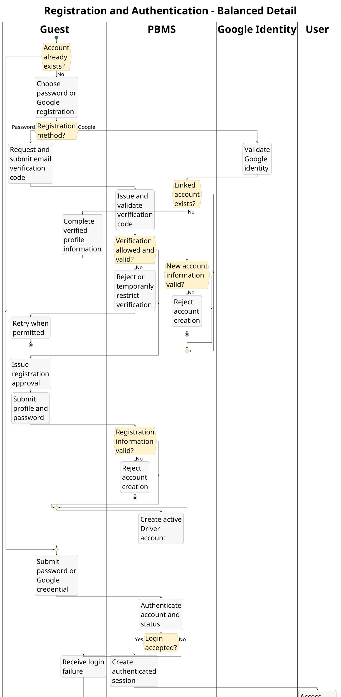
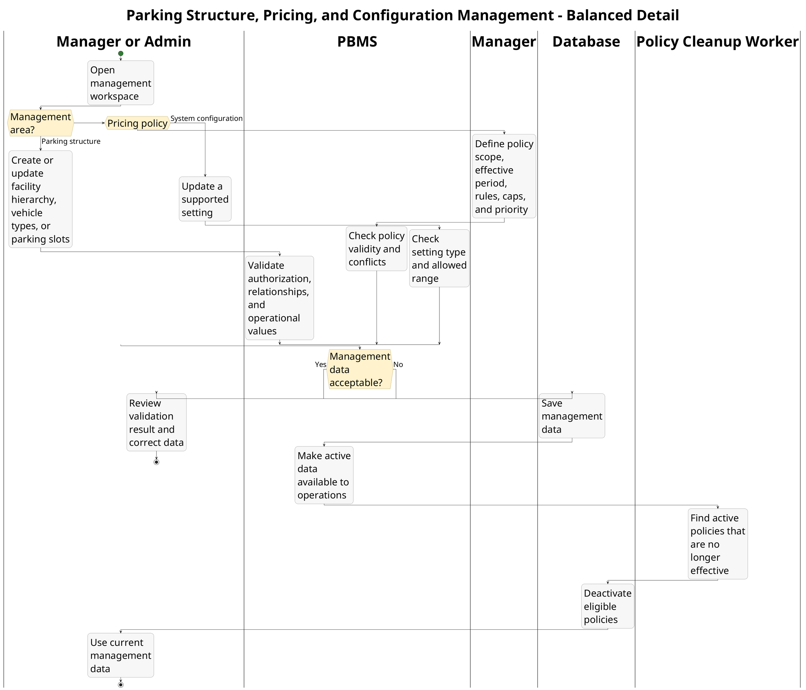
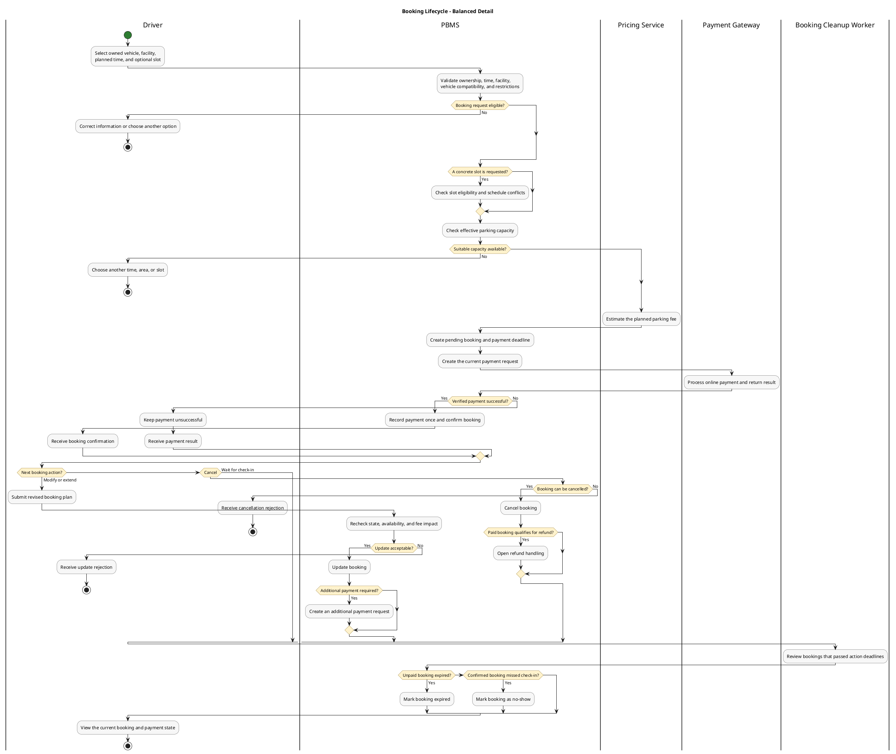
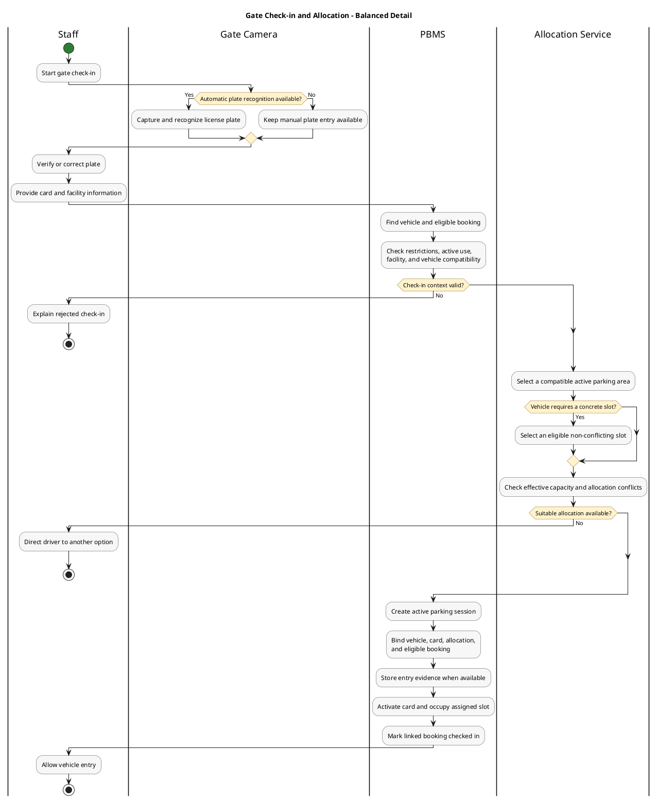
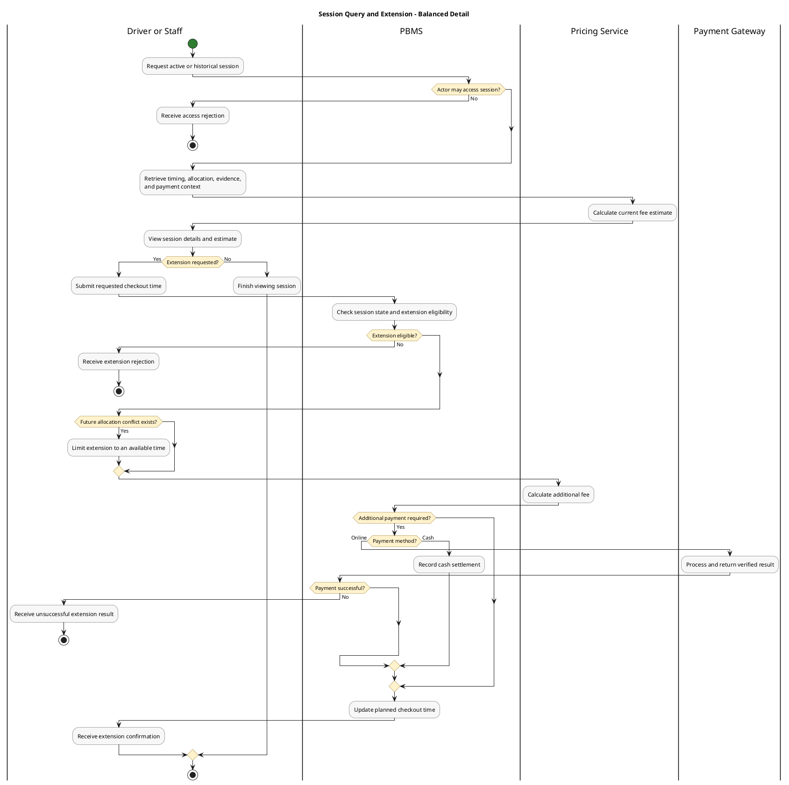
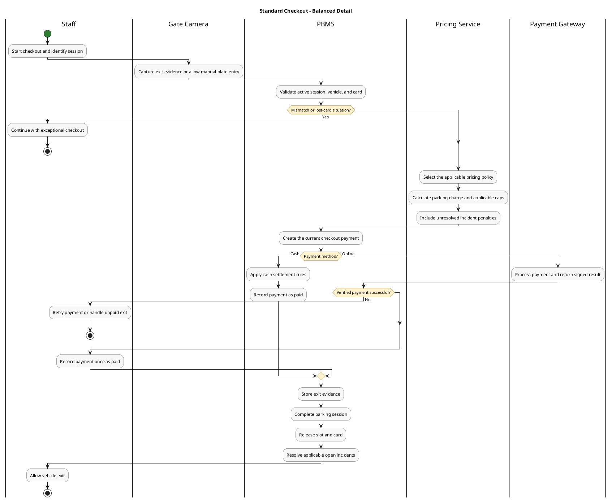
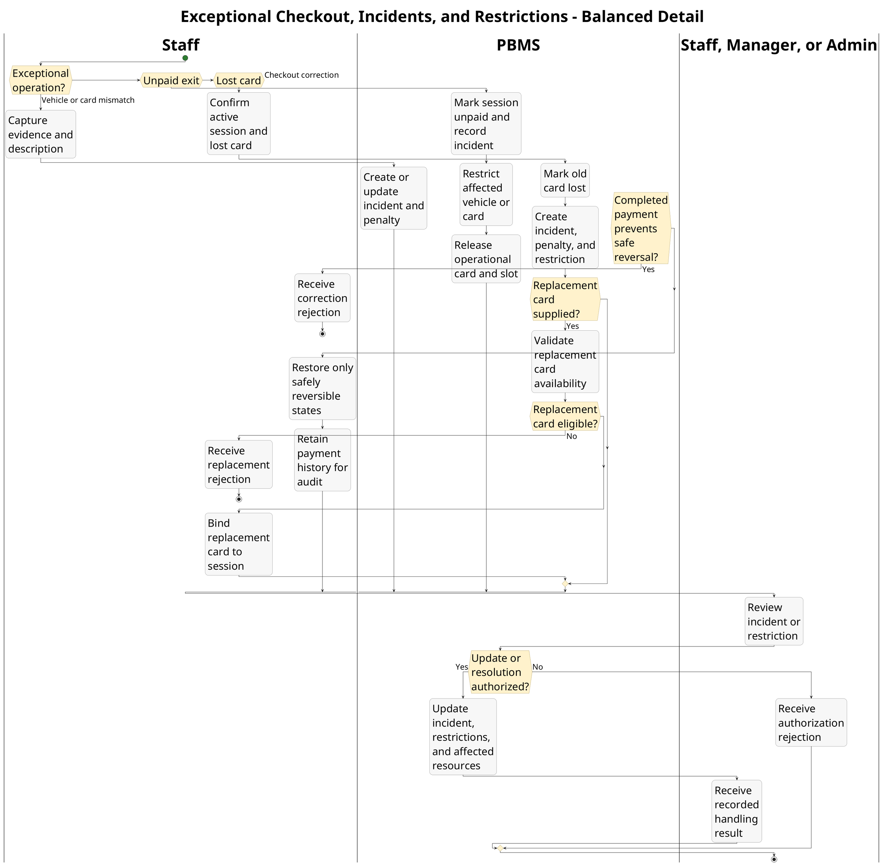
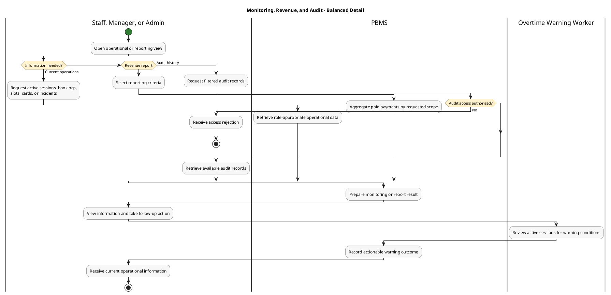

# PBMS Business Process Swimlanes - Balanced Detail

## Purpose

This document presents review-friendly swimlane diagrams for the main PBMS business processes. It preserves the principal actors, decisions, state changes, exception paths, and background processing while omitting exact thresholds, formulas, configuration values, and low-level implementation details. For normative rules and precise values, refer to `PBMS_Business_Analysis.md` and `../PBMS_SRS_Document.md`.

## Conventions

- Decision labels describe the business question without embedding detailed parameters.
- Rejected or unsuccessful paths stop without changing a successful business state unless explicitly shown.
- Payment, notification, recognition, and background services are shown only where they materially affect the process outcome.

## 1. Registration and Authentication

**Traceability:** UC-DRV-001; FR-ACC-001 to FR-ACC-003; BR-ACC-001 to BR-ACC-004.

## 2. Parking Structure, Pricing, and Configuration Management

**Traceability:** UC-STR-001; UC-PRICE-001; FR-STR-001 to FR-STR-003; FR-PRICE-001; FR-CFG-001.

## 3. Booking Lifecycle

**Traceability:** UC-BOOK-001; UC-PAY-001; FR-BOOK-001 to FR-BOOK-006; BR-BOOK-001 to BR-BOOK-011; BR-PAY-001 to BR-PAY-003.

## 4. Gate Check-in and Allocation

**Traceability:** UC-OPS-001; UC-ALLOC-001; FR-OPS-001 to FR-OPS-003; FR-ALLOC-001; BR-ALLOC-001 to BR-ALLOC-003.

## 5. Session Query and Extension

**Traceability:** UC-SESSION-001; UC-PRICE-002; UC-PAY-001; FR-SESSION-001; FR-SESSION-002; FR-PRICE-002; FR-PRICE-003.

## 6. Standard Checkout

**Traceability:** UC-OPS-002; UC-PRICE-002; UC-PAY-001; FR-OPS-004; FR-PRICE-002 to FR-PRICE-003; FR-PAY-001 to FR-PAY-002; BR-FEE-001 to BR-FEE-005; BR-PAY-001 to BR-PAY-002.

## 7. Exceptional Checkout, Incidents, and Restrictions

**Traceability:** UC-OPS-002; UC-INC-002; FR-OPS-005; FR-INC-001; FR-CARD-001; FR-BLK-001.

## 8. Monitoring, Revenue, and Audit

**Traceability:** UC-MON-001; FR-RPT-001; FR-AUD-001; NFR-OBS-001; BR-PAY-004.

---

For exact timing, percentages, formulas, configuration keys, state-transition constraints, and unresolved gaps, refer to the detailed business analysis and the SRS.
