# PBMS Business Process Swimlanes - Balanced Detail

## Purpose

This document presents review-friendly swimlane diagrams for the decided PBMS release baseline. Current code is implementation evidence; CR-GEN-003 defines the target where code must be remediated, hidden, or removed. Exact rules, migration impacts, and data relationships are recorded in `PBMS_Business_Analysis.md` and `../PBMS_Remediation_Decision_Report.md`.

| Item | Reviewed baseline |
|---|---|
| Behavioral source of truth | Current API and web implementation |
| API | `parking-system-api` `develop@daf8dfb` |
| Web | `parking-system-web` `main@8e10c2a` |
| Requirements reference | `../PBMS_SRS_Document.md`, version 1.4 - CR-GEN-003 target baseline |
| Review date | 2026-07-20 |
| Status | REVIEW - implemented, partial, and known-gap behavior |
| SVG export | 20 current diagrams regenerated on 2026-07-20 (15 PlantUML, 5 Mermaid) |

## Conventions

- Decision labels describe the business question without embedding detailed parameters.
- Rejected or unsuccessful paths stop without changing a successful business state unless explicitly shown.
- Payment, recognition, and approved background services are shown only where they materially affect the process outcome.
- A section numbered `x.0` is the overview; `x.1`, `x.2`, and later sections are smaller diagrams for independent subflows.
- `PARTIAL` or `GAP` means a visible surface exists but the end-to-end behavior is not currently complete.
- When code and SRS differ, the diagram follows code and explicitly records the mismatch.
- `System` identifies non-human background workers; `PBMS` identifies synchronous application processing.

## 0. Business Process Landscape

### 0.0 End-to-End Overview

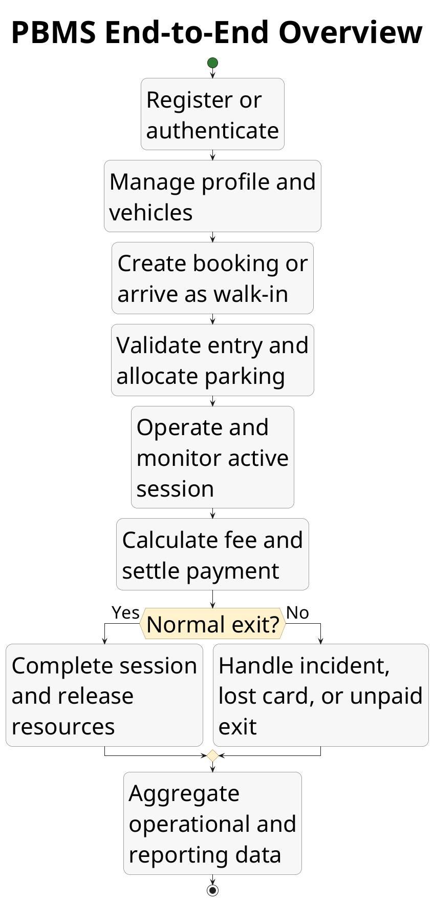
```plantuml
@startuml
title PBMS End-to-End Overview
skinparam WrapWidth 420
skinparam DefaultFontSize 44
skinparam TitleFontSize 60
skinparam TitleFontStyle bold
skinparam ArrowFontSize 34
skinparam Nodesep 180
skinparam Ranksep 200
skinparam shadowing false
skinparam activity {
  BackgroundColor #F7F7F7
  BorderColor #454545
  DiamondBackgroundColor #FFF2CC
  DiamondBorderColor #8A6D1D
  StartColor #2E7D32
  EndColor #2E7D32
  Padding 16
  Margin 12
}

start
:Register or authenticate;
:Manage profile and vehicles;
:Create booking or arrive as walk-in;
:Validate entry and allocate parking;
:Operate and monitor active session;
:Calculate fee and settle payment;
if (Normal exit?) then (Yes)
  :Complete session and release resources;
else (No)
  :Handle incident, lost card, or unpaid exit;
endif
:Aggregate operational and reporting data;
stop
@enduml
```

### 0.1 Guest and Driver Journey

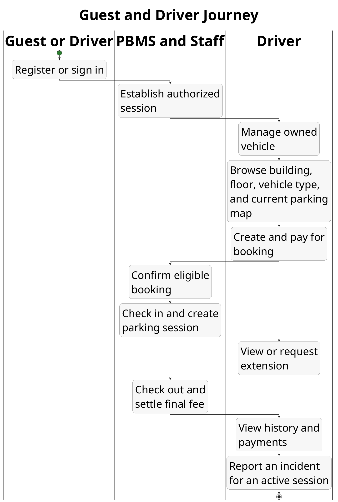
```plantuml
@startuml
title Guest and Driver Journey
skinparam WrapWidth 420
skinparam DefaultFontSize 44
skinparam TitleFontSize 60
skinparam TitleFontStyle bold
skinparam SwimlaneTitleFontSize 60
skinparam SwimlaneTitleFontStyle bold
skinparam ArrowFontSize 34
skinparam Nodesep 180
skinparam Ranksep 200
skinparam shadowing false
skinparam activity {
  BackgroundColor #F7F7F7
  BorderColor #454545
  DiamondBackgroundColor #FFF2CC
  DiamondBorderColor #8A6D1D
  StartColor #2E7D32
  EndColor #2E7D32
  Padding 16
  Margin 12
}

|Guest or Driver|
start
:Register or sign in;
|PBMS and Staff|
:Establish authorized session;
|Driver|
:Manage owned vehicle;
:Browse building, floor, vehicle type,\nand current parking map;
:Create and pay for booking;
|PBMS and Staff|
:Confirm eligible booking;
:Check in and create parking session;
|Driver|
:View or request extension;
|PBMS and Staff|
:Check out and settle final fee;
|Driver|
:View history and payments;
:Report an incident for an active session;
stop
@enduml
```

### 0.2 Staff Gate Operations

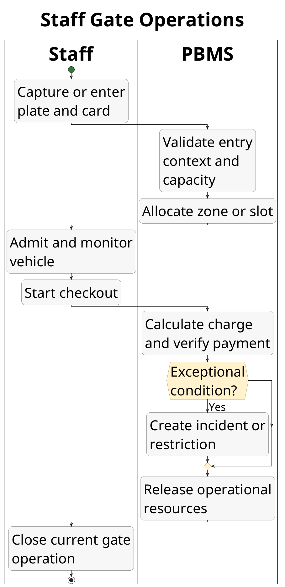
```plantuml
@startuml
title Staff Gate Operations
skinparam WrapWidth 420
skinparam DefaultFontSize 44
skinparam TitleFontSize 60
skinparam TitleFontStyle bold
skinparam SwimlaneTitleFontSize 60
skinparam SwimlaneTitleFontStyle bold
skinparam ArrowFontSize 34
skinparam Nodesep 180
skinparam Ranksep 200
skinparam shadowing false
skinparam activity {
  BackgroundColor #F7F7F7
  BorderColor #454545
  DiamondBackgroundColor #FFF2CC
  DiamondBorderColor #8A6D1D
  StartColor #2E7D32
  EndColor #2E7D32
  Padding 16
  Margin 12
}

|Staff|
start
:Capture or enter plate and card;
|PBMS|
:Validate entry context and capacity;
:Allocate zone or slot;
|Staff|
:Admit and monitor vehicle;
:Start checkout;
|PBMS|
:Calculate charge and verify payment;
if (Exceptional condition?) then (Yes)
  :Create incident or restriction;
endif
:Release operational resources;
|Staff|
:Close current gate operation;
stop
@enduml
```

### 0.3 Management and Background Control

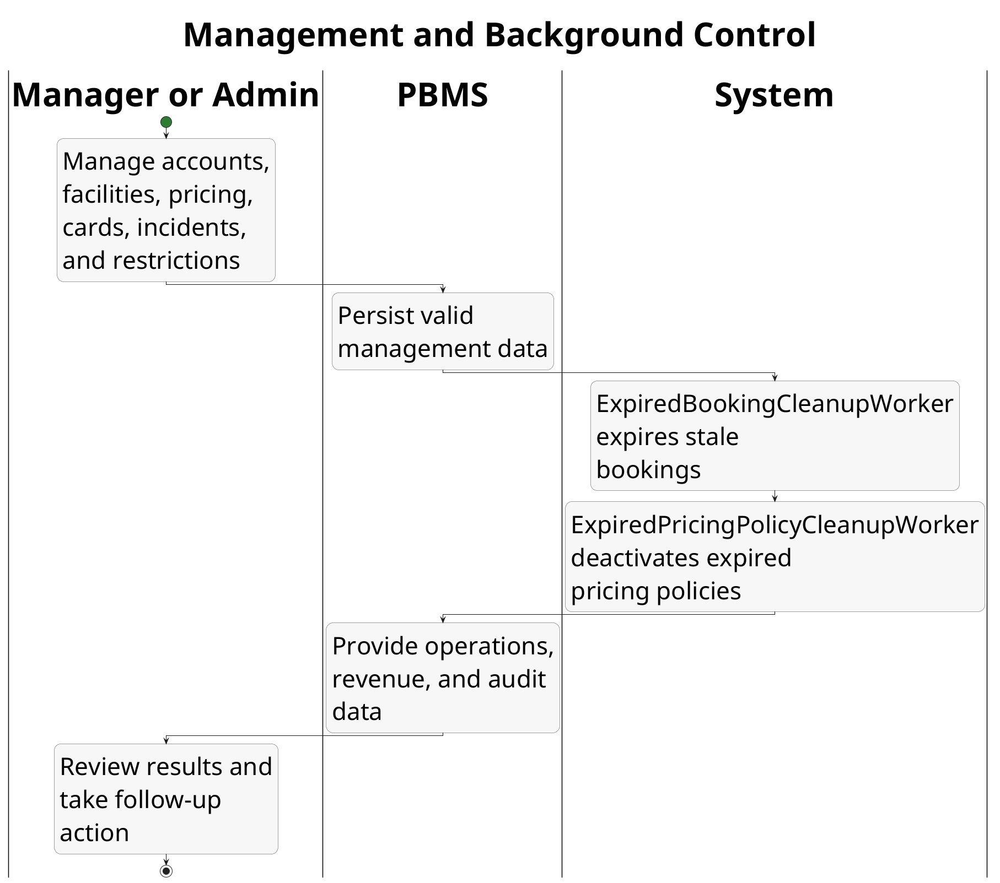
```plantuml
@startuml
title Management and Background Control
skinparam WrapWidth 420
skinparam DefaultFontSize 44
skinparam TitleFontSize 60
skinparam TitleFontStyle bold
skinparam SwimlaneTitleFontSize 60
skinparam SwimlaneTitleFontStyle bold
skinparam ArrowFontSize 34
skinparam Nodesep 180
skinparam Ranksep 200
skinparam shadowing false
skinparam activity {
  BackgroundColor #F7F7F7
  BorderColor #454545
  DiamondBackgroundColor #FFF2CC
  DiamondBorderColor #8A6D1D
  StartColor #2E7D32
  EndColor #2E7D32
  Padding 16
  Margin 12
}

|Manager or Admin|
start
:Manage accounts, facilities, pricing, cards, incidents, and restrictions;
|PBMS|
:Persist valid management data;
|System|
:ExpiredBookingCleanupWorker expires stale bookings;
:ExpiredPricingPolicyCleanupWorker deactivates expired pricing policies;
|PBMS|
:Provide operations, revenue, and audit data;
|Manager or Admin|
:Review results and take follow-up action;
stop
@enduml
```

### 0.4 Six-Commit Web Impact

Reviewed range: `1b67150..8e10c2a`.

| Area | Current behavior | Impact class |
|---|---|---|
| Driver parking map | Select building, active compatible floor, vehicle type, and available slot before opening Parking & Booking. | Process/UI |
| Motorbike booking | Continue with the general Motorbike Zone and no concrete slot. | Existing booking rule exposed in UI |
| Driver incident report | Offer all `IncidentType` records returned by PBMS for a selected active owned-vehicle session. | Process/UI |
| Navigation and text | Rename `Parking Utils` to `Parking & Booking`; update layout and English labels. | Presentation only |
| API and data model | No API, entity, EF configuration, migration, or relationship changed. | No backend/ERD change |

## 1. Registration and Authentication

### 1.0 Registration and Authentication Overview

**Traceability:** UC-ACC-001, UC-ACC-002; FR-ACC-001 to FR-ACC-004; BR-ACC-001 to BR-ACC-005.

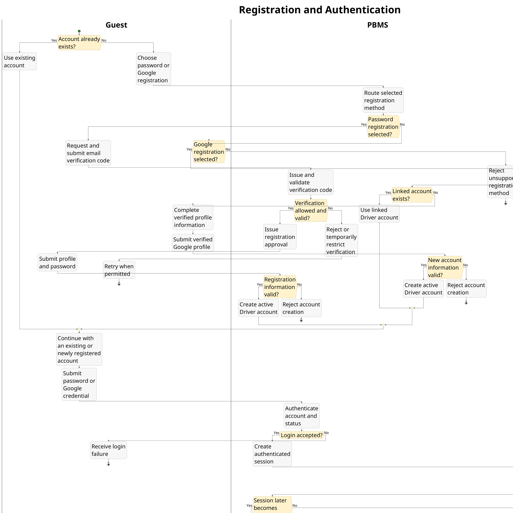
```plantuml
@startuml
title Registration and Authentication
skinparam WrapWidth 350
skinparam DefaultFontSize 44
skinparam TitleFontSize 80
skinparam TitleFontStyle bold
skinparam SwimlaneTitleFontSize 60
skinparam SwimlaneTitleFontStyle bold
skinparam ArrowFontSize 28
skinparam Nodesep 220
skinparam Ranksep 240
skinparam shadowing false
skinparam activity {
  BackgroundColor #F7F7F7
  BorderColor #454545
  DiamondBackgroundColor #FFF2CC
  DiamondBorderColor #8A6D1D
  StartColor #2E7D32
  EndColor #2E7D32
  Padding 16
  Margin 12
}

|Guest|
|PBMS|
|Google Identity|
|User|
|Guest|
start
if (Account already exists?) then (Yes)
  :Use existing account;
else (No)
  :Choose password or Google registration;
  |PBMS|
  :Route selected registration method;
  if (Password registration selected?) then (Yes)
    |Guest|
    :Request and submit email verification code;
    |PBMS|
    :Issue and validate verification code;
    if (Verification allowed and valid?) then (Yes)
      :Issue registration approval;
      |Guest|
      :Submit profile and password;
      |PBMS|
      if (Registration information valid?) then (Yes)
        :Create active Driver account;
      else (No)
        :Reject account creation;
        stop
      endif
    else (No)
      :Reject or temporarily restrict verification;
      |Guest|
      :Retry when permitted;
      stop
    endif
  else (No)
    if (Google registration selected?) then (Yes)
      |Google Identity|
      :Validate Google identity;
      |PBMS|
      if (Linked account exists?) then (Yes)
        :Use linked Driver account;
      else (No)
        |Guest|
        :Complete verified profile information;
        :Submit verified Google profile;
        |PBMS|
        if (New account information valid?) then (Yes)
          :Create active Driver account;
        else (No)
          :Reject account creation;
          stop
        endif
      endif
    else (No)
      :Reject unsupported registration method;
        stop
    endif
  endif
endif

|Guest|
:Continue with an existing or newly registered account;
:Submit password or Google credential;
|PBMS|
:Authenticate account and status;
if (Login accepted?) then (Yes)
  :Create authenticated session;
  |User|
  :Access authorized features;
  |PBMS|
  if (Session later becomes unauthorized?) then (Yes)
    :End local authenticated session;
    stop
  else (No)
    |User|
    :Continue authorized session;
    stop
  endif
else (No)
  |Guest|
  :Receive login failure;
  stop
endif
@enduml
```

### 1.1 Password Recovery - Remediation Target

Current code cannot complete recovery. The decided target uses recovery-specific OTP/token purpose and must not reuse registration OTP.

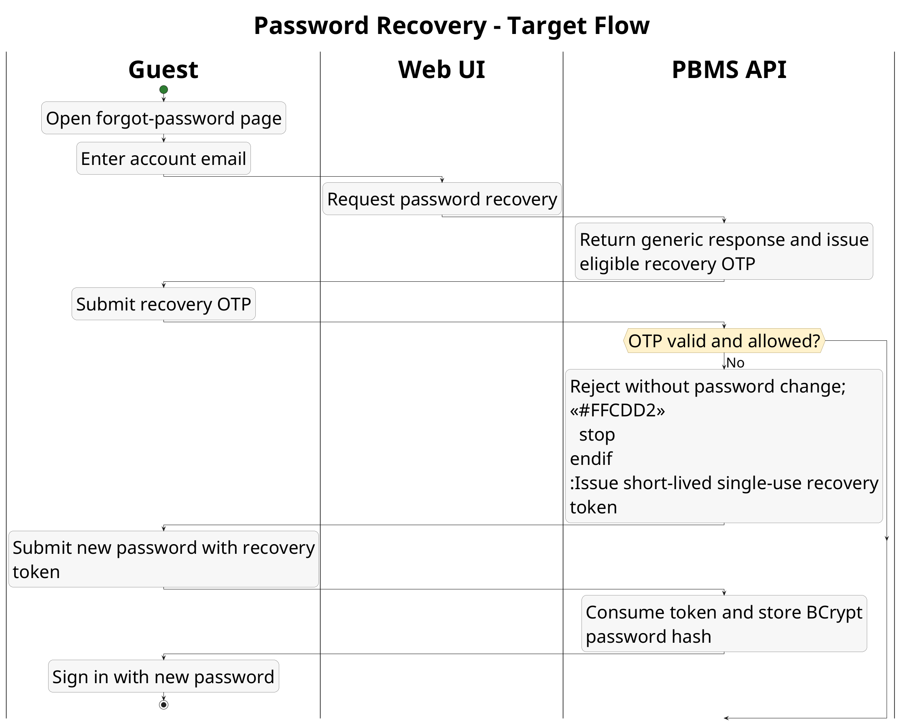
```plantuml
@startuml
title Password Recovery - Target Flow
skinparam WrapWidth 800
skinparam DefaultFontSize 44
skinparam TitleFontSize 60
skinparam TitleFontStyle bold
skinparam SwimlaneTitleFontSize 60
skinparam SwimlaneTitleFontStyle bold
skinparam ArrowFontSize 34
skinparam Nodesep 180
skinparam Ranksep 200
skinparam shadowing false
skinparam activity {
  BackgroundColor #F7F7F7
  BorderColor #454545
  DiamondBackgroundColor #FFF2CC
  DiamondBorderColor #8A6D1D
  StartColor #2E7D32
  EndColor #C62828
  Padding 16
  Margin 12
}

|Guest|
start
:Open forgot-password page;
:Enter account email;
|Web UI|
:Request password recovery;
|PBMS API|
:Return generic response and issue eligible recovery OTP;
|Guest|
:Submit recovery OTP;
|PBMS API|
if (OTP valid and allowed?) then (No)
  :Reject without password change; <<#FFCDD2>>
  stop
endif
:Issue short-lived single-use recovery token;
|Guest|
:Submit new password with recovery token;
|PBMS API|
:Consume token and store BCrypt password hash;
|Guest|
:Sign in with new password;
stop
@enduml
```

## 2. Parking Structure, Pricing, and Configuration Management

### 2.0 Management Overview

**Traceability:** UC-STR-001; UC-PRICE-001; FR-STR-001 to FR-STR-003; FR-PRICE-001; FR-CFG-001.

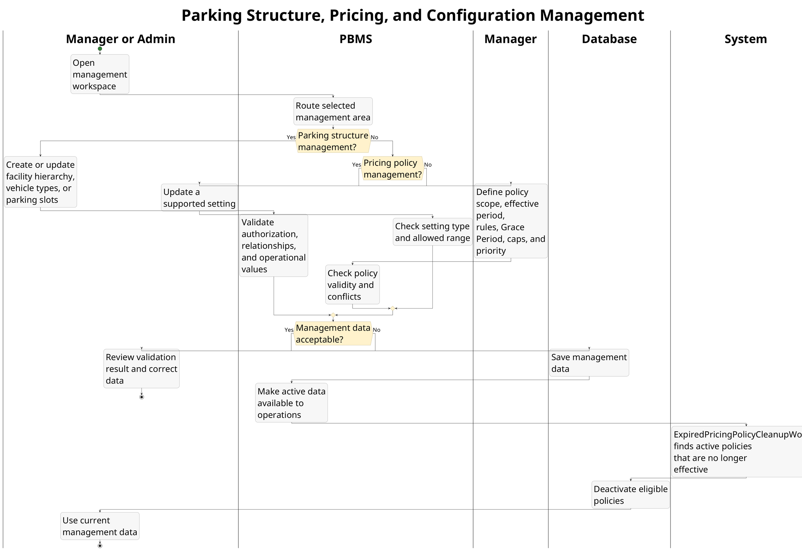
```plantuml
@startuml
title Parking Structure, Pricing, and Configuration Management
skinparam WrapWidth 400
skinparam DefaultFontSize 44
skinparam TitleFontSize 80
skinparam TitleFontStyle bold
skinparam SwimlaneTitleFontSize 60
skinparam SwimlaneTitleFontStyle bold
skinparam ArrowFontSize 28
skinparam Nodesep 200
skinparam Ranksep 220
skinparam shadowing false
skinparam activity {
  BackgroundColor #F7F7F7
  BorderColor #454545
  DiamondBackgroundColor #FFF2CC
  DiamondBorderColor #8A6D1D
  StartColor #2E7D32
  EndColor #2E7D32
  Padding 16
  Margin 12
}

|Manager or Admin|
start
:Open management workspace;
|PBMS|
:Route selected management area;
if (Parking structure management?) then (Yes)
  |Manager or Admin|
  :Create or update facility hierarchy,\nvehicle types, or parking slots;
  |PBMS|
  :Validate authorization, relationships,\nand operational values;
else (No)
  if (Pricing policy management?) then (Yes)
    |Manager|
    :Define policy scope, effective period,\nrules, Grace Period, caps, and priority;
    |PBMS|
    :Check policy validity and conflicts;
  else (No)
    |Manager or Admin|
    :Update a supported setting;
    |PBMS|
    :Check setting type and allowed range;
  endif
endif

if (Management data acceptable?) then (Yes)
  |Database|
  :Save management data;
  |PBMS|
  :Make active data available to operations;
else (No)
  |Manager or Admin|
  :Review validation result and correct data;
  stop
endif

|System|
:ExpiredPricingPolicyCleanupWorker finds active policies that are no longer effective;
|Database|
:Deactivate eligible policies;
|Manager or Admin|
:Use current management data;
stop
@enduml
```

**Actor clarification:** Manager or Admin manages and activates pricing policies. System runs `ExpiredPricingPolicyCleanupWorker` automatically every 12 hours. Staff does not execute policy cleanup.

## 3. Booking Lifecycle

### 3.0 Booking Overview

**Traceability:** UC-BOOK-001; UC-PAY-001; FR-BOOK-001 to FR-BOOK-006; FR-PRICE-004; BR-BOOK-001 to BR-BOOK-011; BR-PAY-001 to BR-PAY-002.

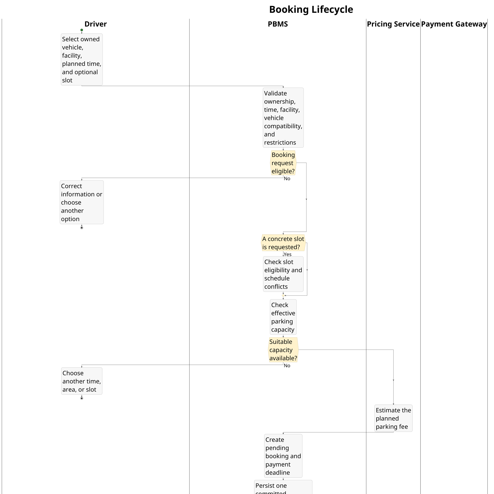
```plantuml
@startuml
title Booking Lifecycle
skinparam WrapWidth 350
skinparam DefaultFontSize 50
skinparam TitleFontSize 80
skinparam TitleFontStyle bold
skinparam SwimlaneTitleFontSize 60
skinparam SwimlaneTitleFontStyle bold
skinparam ArrowFontSize 40
skinparam Nodesep 200
skinparam Ranksep 220
skinparam shadowing false
skinparam activity {
  BackgroundColor #F7F7F7
  BorderColor #454545
  DiamondBackgroundColor #FFF2CC
  DiamondBorderColor #8A6D1D
  StartColor #2E7D32
  EndColor #2E7D32
  Padding 16
  Margin 12
}

|Driver|
start
:Select owned vehicle, facility,\nplanned time, and optional slot;
|PBMS|
:Validate ownership, time, facility,\nvehicle compatibility, and restrictions;
if (Booking request eligible?) then (No)
  |Driver|
  :Correct information or choose another option;
  stop
endif

|PBMS|
if (A concrete slot is requested?) then (Yes)
  :Check slot eligibility and schedule conflicts;
endif
:Check effective parking capacity;
if (Suitable capacity available?) then (No)
  |Driver|
  :Choose another time, area, or slot;
  stop
endif

|Pricing Service|
:Estimate the planned parking fee;
|PBMS|
:Create pending booking and payment deadline;
:Persist one committed BOOKING_DEPOSIT calculation log;
:Create the current payment request;
|Payment Gateway|
:Process online payment and return result;
|PBMS|
if (Verified payment successful?) then (Yes)
  :Record payment once and confirm booking;
  |Driver|
  :Receive booking confirmation;
else (No)
  :Keep payment unsuccessful;
  |Driver|
  :Receive payment result;
endif

|Driver|
:Choose next booking action;
|PBMS|
:Route selected booking action;
if (Modify or extend requested?) then (Yes)
  |Driver|
  :Submit revised booking plan;
  |PBMS|
  :Recheck state, availability, and fee impact;
  if (Update acceptable?) then (Yes)
    :Update booking;
    if (Additional payment required?) then (Yes)
      :Create an additional payment request;
    endif
  else (No)
    |Driver|
    :Receive update rejection;
    stop
  endif
else (No)
  |PBMS|
  if (Cancellation requested?) then (Yes)
    if (Booking can be cancelled?) then (Yes)
      :Cancel booking;
      :Do not initiate or record a refund;
    else (No)
      |Driver|
      :Receive cancellation rejection;
      stop
    endif
  else (No)
    :Keep booking unchanged while waiting for check-in;
  endif
endif

|System|
:ExpiredBookingCleanupWorker reviews bookings that passed action deadlines;
if (Unpaid booking expired?) then (Yes)
  :Mark booking expired;
else (No)
  if (Confirmed booking missed check-in?) then (Yes)
    :Mark booking as no-show;
  else (No)
    :Keep booking state unchanged;
  endif
endif
|Driver|
:View the current booking and payment state;
stop
@enduml
```

### 3.1 Driver Map-to-Booking Selection

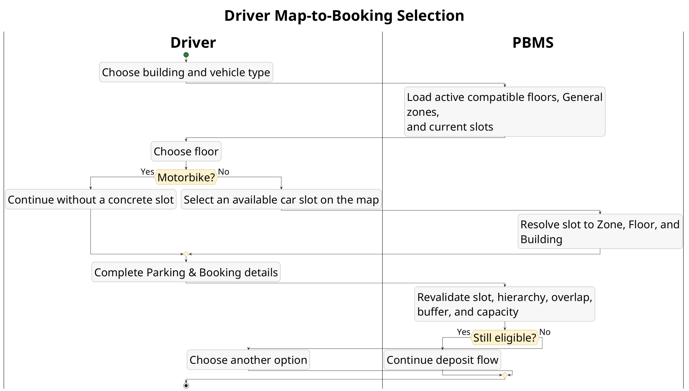
```plantuml
@startuml
title Driver Map-to-Booking Selection
skinparam WrapWidth 800
skinparam DefaultFontSize 44
skinparam TitleFontSize 60
skinparam TitleFontStyle bold
skinparam SwimlaneTitleFontSize 60
skinparam SwimlaneTitleFontStyle bold
skinparam ArrowFontSize 34
skinparam Nodesep 180
skinparam Ranksep 200
skinparam shadowing false
skinparam activity {
  BackgroundColor #F7F7F7
  BorderColor #454545
  DiamondBackgroundColor #FFF2CC
  DiamondBorderColor #8A6D1D
  StartColor #2E7D32
  EndColor #2E7D32
  Padding 16
  Margin 12
}

|Driver|
start
:Choose building and vehicle type;
|PBMS|
:Load active compatible floors, General zones,\nand current slots;
|Driver|
:Choose floor;
if (Motorbike?) then (Yes)
  :Continue without a concrete slot;
else (No)
  :Select an available car slot on the map;
  |PBMS|
  :Resolve slot to Zone, Floor, and Building;
endif
|Driver|
:Complete Parking & Booking details;
|PBMS|
:Revalidate slot, hierarchy, overlap,\nbuffer, and capacity;
if (Still eligible?) then (Yes)
  :Continue deposit flow;
else (No)
  |Driver|
  :Choose another option;
endif
stop
@enduml
```

The dashboard map is a preselection surface. PBMS API remains authoritative when the booking is submitted.

## 4. Gate Check-in and Allocation

### 4.0 Check-in and Allocation Overview

**Traceability:** UC-OPS-001; FR-OPS-001 to FR-OPS-003; FR-ALLOC-001; BR-ALLOC-001 to BR-ALLOC-003.

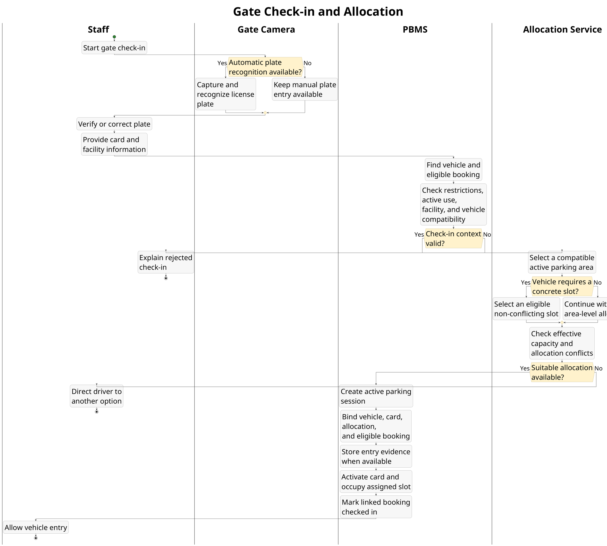
```plantuml
@startuml
title Gate Check-in and Allocation
skinparam WrapWidth 500
skinparam DefaultFontSize 48
skinparam TitleFontSize 80
skinparam TitleFontStyle bold
skinparam SwimlaneTitleFontSize 60
skinparam SwimlaneTitleFontStyle bold
skinparam ArrowFontSize 40
skinparam Nodesep 220
skinparam Ranksep 240
skinparam shadowing false
skinparam activity {
  BackgroundColor #F7F7F7
  BorderColor #454545
  DiamondBackgroundColor #FFF2CC
  DiamondBorderColor #8A6D1D
  StartColor #2E7D32
  EndColor #2E7D32
  Padding 16
  Margin 12
}

|Staff|
start
:Start gate check-in;
|Gate Camera|
if (Automatic plate recognition available?) then (Yes)
  :Capture and recognize license plate;
else (No)
  :Keep manual plate entry available;
endif
|Staff|
:Verify or correct plate;
:Provide card and facility information;

|PBMS|
:Find vehicle and eligible booking;
:Check restrictions, active use,\nfacility, and vehicle compatibility;
if (Check-in context valid?) then (Yes)
  |Allocation Service|
  :Select a compatible active parking area;
  if (Vehicle requires a concrete slot?) then (Yes)
    :Select an eligible non-conflicting slot;
  else (No)
    :Continue with area-level allocation;
  endif
  :Check effective capacity and allocation conflicts;
  if (Suitable allocation available?) then (Yes)
    |PBMS|
    :Create active parking session;
    :Bind vehicle, card, allocation,\nand eligible booking;
    :Store entry evidence when available;
    :Activate card and occupy assigned slot;
    :Mark linked booking checked in;
    |Staff|
    :Allow vehicle entry;
    stop
  else (No)
    |Staff|
    :Direct driver to another option;
    stop
  endif
else (No)
  |Staff|
  :Explain rejected check-in;
  stop
endif
@enduml
```

## 5. Session Query and Extension

### 5.0 Session Overview

**Traceability:** UC-SESSION-001; UC-PRICE-002; UC-PAY-001; FR-SESSION-001; FR-SESSION-002; FR-PRICE-002; FR-PRICE-003.

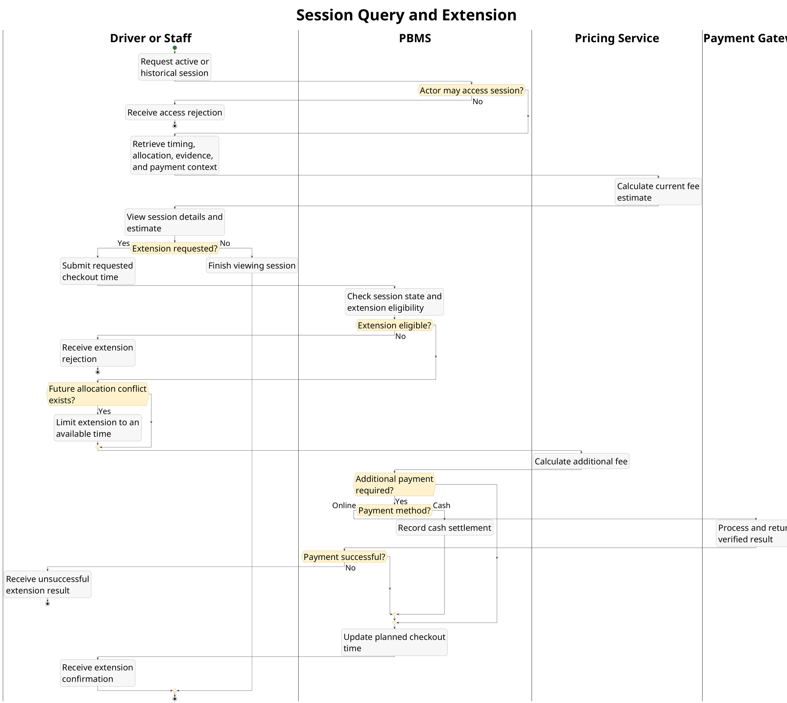
```plantuml
@startuml
title Session Query and Extension
skinparam WrapWidth 550
skinparam DefaultFontSize 44
skinparam TitleFontSize 80
skinparam TitleFontStyle bold
skinparam SwimlaneTitleFontSize 60
skinparam SwimlaneTitleFontStyle bold
skinparam ArrowFontSize 40
skinparam Nodesep 160
skinparam Ranksep 180
skinparam shadowing false
skinparam activity {
  BackgroundColor #F7F7F7
  BorderColor #454545
  DiamondBackgroundColor #FFF2CC
  DiamondBorderColor #8A6D1D
  StartColor #2E7D32
  EndColor #2E7D32
  Padding 16
  Margin 12
}

|Driver or Staff|
start
:Request active or historical session;
|PBMS|
if (Actor may access session?) then (No)
  |Driver or Staff|
  :Receive access rejection;
  stop
endif
:Retrieve timing, allocation, evidence,\nand payment context;
|Pricing Service|
:Calculate current fee estimate;
|Driver or Staff|
:View session details and estimate;

if (Extension requested?) then (Yes)
  :Submit requested checkout time;
  |PBMS|
  :Check session state and extension eligibility;
  if (Extension eligible?) then (No)
    |Driver or Staff|
    :Receive extension rejection;
    stop
  endif
  if (Future allocation conflict exists?) then (Yes)
    :Limit extension to an available time;
  endif
  |Pricing Service|
  :Calculate additional fee;
  |PBMS|
  if (Additional payment required?) then (Yes)
    if (Payment method?) then (Online)
      |Payment Gateway|
      :Process and return verified result;
      |PBMS|
      if (Payment successful?) then (No)
        |Driver or Staff|
        :Receive unsuccessful extension result;
        stop
      endif
    else (Cash)
      |PBMS|
      :Record cash settlement;
    endif
  endif
  :Update planned checkout time;
  |Driver or Staff|
  :Receive extension confirmation;
else (No)
  :Finish viewing session;
endif
stop
@enduml
```

## 6. Standard Checkout

### 6.0 Standard Checkout Overview

**Traceability:** UC-OPS-002; UC-PRICE-002; UC-PAY-001; FR-OPS-004; FR-PRICE-002 to FR-PRICE-003; FR-PAY-001 to FR-PAY-002; BR-FEE-001 to BR-FEE-005; BR-PAY-001 to BR-PAY-002.

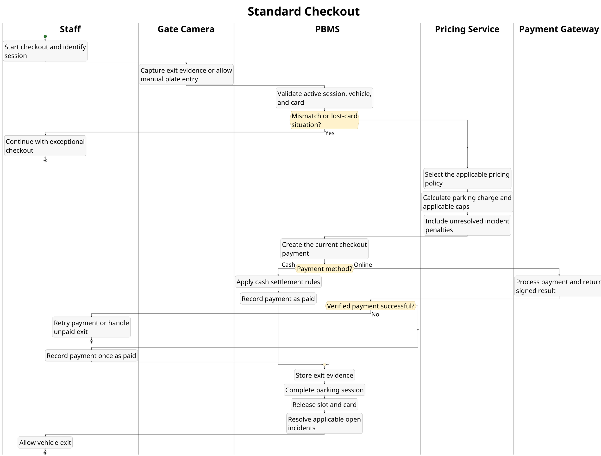
```plantuml
@startuml
title Standard Checkout
skinparam WrapWidth 650
skinparam DefaultFontSize 44
skinparam TitleFontSize 80
skinparam TitleFontStyle bold
skinparam SwimlaneTitleFontSize 60
skinparam SwimlaneTitleFontStyle bold
skinparam ArrowFontSize 40
skinparam Nodesep 160
skinparam Ranksep 180
skinparam shadowing false
skinparam activity {
  BackgroundColor #F7F7F7
  BorderColor #454545
  DiamondBackgroundColor #FFF2CC
  DiamondBorderColor #8A6D1D
  StartColor #2E7D32
  EndColor #2E7D32
  Padding 16
  Margin 12
}

|Staff|
start
:Start checkout and identify session;
|Gate Camera|
:Capture exit evidence or allow manual plate entry;
|PBMS|
:Validate active session, vehicle, and card;
if (Mismatch or lost-card situation?) then (Yes)
  |Staff|
  :Continue with exceptional checkout;
  stop
endif

|Pricing Service|
:Select the applicable pricing policy;
:Calculate parking charge and applicable caps;
:Include unresolved incident penalties;
|PBMS|
:Create the current checkout payment;
if (Payment method?) then (Cash)
  :Apply cash settlement rules;
  :Record payment as paid;
else (Online)
  |Payment Gateway|
  :Process payment and return signed result;
  |PBMS|
  if (Verified payment successful?) then (No)
    |Staff|
    :Retry payment or handle unpaid exit;
    stop
  endif
  :Record payment once as paid;
endif

|PBMS|
:Store exit evidence;
:Complete parking session;
:Release slot and card;
:Resolve applicable open incidents;
|Staff|
:Allow vehicle exit;
stop
@enduml
```

## 7. Exceptional Checkout, Incidents, and Restrictions

### 7.0 Exceptional Operations Overview

**Traceability:** UC-OPS-002; UC-INC-001; FR-OPS-005; FR-INC-001; FR-CARD-001; FR-BLK-001.

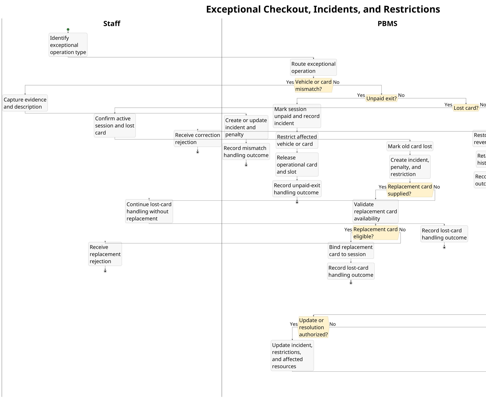
```plantuml
@startuml
title Exceptional Checkout, Incidents, and Restrictions
skinparam WrapWidth 400
skinparam DefaultFontSize 44
skinparam TitleFontSize 80
skinparam TitleFontStyle bold
skinparam SwimlaneTitleFontSize 60
skinparam SwimlaneTitleFontStyle bold
skinparam ArrowFontSize 40
skinparam Nodesep 200
skinparam Ranksep 220
skinparam shadowing false
skinparam activity {
  BackgroundColor #F7F7F7
  BorderColor #454545
  DiamondBackgroundColor #FFF2CC
  DiamondBorderColor #8A6D1D
  StartColor #2E7D32
  EndColor #2E7D32
  Padding 16
  Margin 12
}

|Staff|
start
:Identify exceptional operation type;
|PBMS|
:Route exceptional operation;
if (Vehicle or card mismatch?) then (Yes)
  |Staff|
  :Capture evidence and description;
  |PBMS|
  :Create or update incident and penalty;
  :Record mismatch handling outcome;
  stop
else (No)
  if (Unpaid exit?) then (Yes)
    :Mark session unpaid and record incident;
    :Restrict affected vehicle or card;
    :Release operational card and slot;
    :Record unpaid-exit handling outcome;
    stop
  else (No)
    if (Lost card?) then (Yes)
      |Staff|
      :Confirm active session and lost card;
      |PBMS|
      :Mark old card lost;
      :Create incident, penalty, and restriction;
      if (Replacement card supplied?) then (Yes)
        :Validate replacement card availability;
        if (Replacement card eligible?) then (Yes)
          :Bind replacement card to session;
          :Record lost-card handling outcome;
          stop
        else (No)
          |Staff|
          :Receive replacement rejection;
          stop
        endif
      else (No)
        :Continue lost-card handling without replacement;
        |PBMS|
        :Record lost-card handling outcome;
        stop
      endif
    else (No)
      |PBMS|
      if (Safe correction reversal available?) then (Yes)
        :Restore only safely reversible states;
        :Retain payment history for audit;
        :Record correction outcome;
        stop
      else (No)
        |Staff|
        :Receive correction rejection;
        stop
      endif
    endif
  endif
endif

|Staff, Manager, or Admin|
start
:Open incident or restriction for review;
|PBMS|
if (Update or resolution authorized?) then (Yes)
  :Update incident, restrictions,\nand affected resources;
  |Staff, Manager, or Admin|
  :Receive recorded handling result;
  stop
else (No)
  |Staff, Manager, or Admin|
  :Receive authorization rejection;
  stop
endif
@enduml
```

### 7.1 Driver Incident Reporting

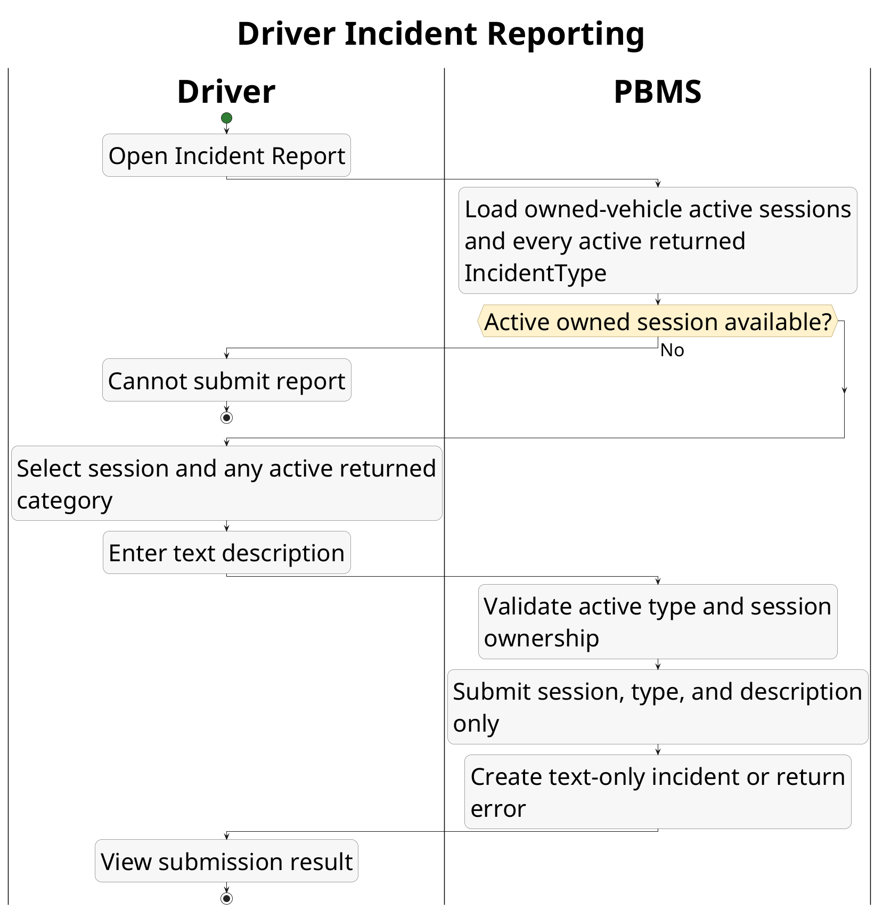
```plantuml
@startuml
title Driver Incident Reporting
skinparam WrapWidth 800
skinparam DefaultFontSize 44
skinparam TitleFontSize 60
skinparam TitleFontStyle bold
skinparam SwimlaneTitleFontSize 60
skinparam SwimlaneTitleFontStyle bold
skinparam ArrowFontSize 34
skinparam Nodesep 180
skinparam Ranksep 200
skinparam shadowing false
skinparam activity {
  BackgroundColor #F7F7F7
  BorderColor #454545
  DiamondBackgroundColor #FFF2CC
  DiamondBorderColor #8A6D1D
  StartColor #2E7D32
  EndColor #2E7D32
  Padding 16
  Margin 12
}

|Driver|
start
:Open Incident Report;
|PBMS|
:Load owned-vehicle active sessions\nand every active returned IncidentType;
if (Active owned session available?) then (No)
  |Driver|
  :Cannot submit report;
  stop
endif
|Driver|
:Select session and any active returned category;
:Enter text description;
|PBMS|
:Validate active type and session ownership;
:Submit session, type, and description only;
:Create text-only incident or return error;
|Driver|
:View submission result;
stop
@enduml
```

Remove the current file control and every evidence-upload claim. All active types remain visible; PBMS must enforce active type and owned active session on the server.

## 8. Monitoring, Revenue, and Audit

### 8.0 Monitoring, Revenue, and Audit Overview

**Traceability:** UC-RPT-001; FR-RPT-001, FR-AUD-001; NFR-OBS-001; BR-PAY-004.

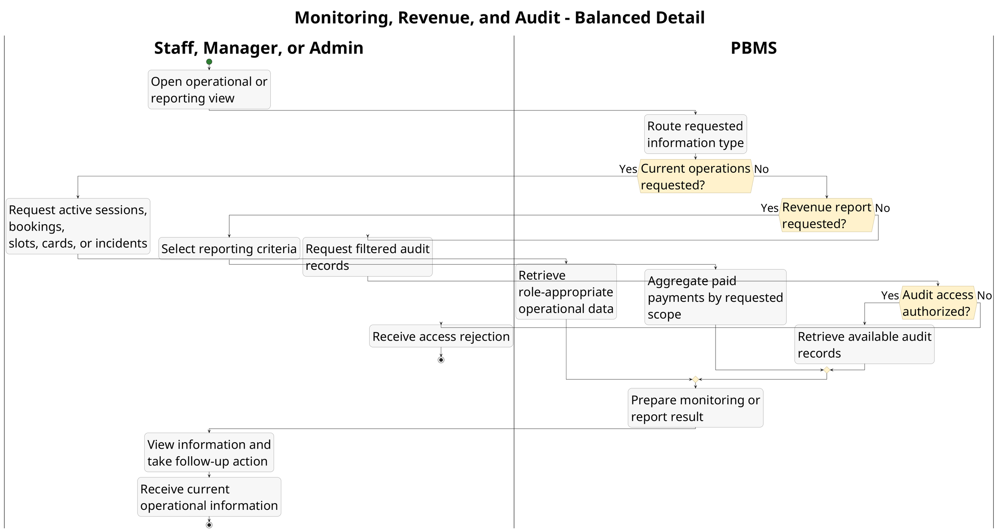
```plantuml
@startuml
title Monitoring, Revenue, and Audit - Balanced Detail
skinparam WrapWidth 500
skinparam DefaultFontSize 44
skinparam TitleFontSize 60
skinparam TitleFontStyle bold
skinparam SwimlaneTitleFontSize 60
skinparam SwimlaneTitleFontStyle bold
skinparam ArrowFontSize 40
skinparam Nodesep 200
skinparam Ranksep 220
skinparam shadowing false
skinparam activity {
  BackgroundColor #F7F7F7
  BorderColor #454545
  DiamondBackgroundColor #FFF2CC
  DiamondBorderColor #8A6D1D
  StartColor #2E7D32
  EndColor #2E7D32
  Padding 16
  Margin 12
}

|Staff, Manager, or Admin|
start
:Open operational or reporting view;
|PBMS|
:Route requested information type;
if (Current operations requested?) then (Yes)
  |Staff, Manager, or Admin|
  :Request active sessions, bookings,\nslots, cards, or incidents;
  |PBMS|
  :Retrieve role-appropriate operational data;
else (No)
  if (Revenue report requested?) then (Yes)
    |Staff, Manager, or Admin|
    :Select reporting criteria;
    |PBMS|
    :Aggregate paid payments by requested scope;
  else (No)
    |Staff, Manager, or Admin|
    :Request filtered audit records;
    |PBMS|
    if (Audit access authorized?) then (Yes)
      :Retrieve available audit records;
    else (No)
      |Staff, Manager, or Admin|
      :Receive access rejection;
      stop
    endif
  endif
endif

|PBMS|
:Prepare monitoring or report result;
|Staff, Manager, or Admin|
:View information and take follow-up action;

|Staff, Manager, or Admin|
:Receive current operational information;
stop
@enduml
```

> **Release exclusion:** User Notification and Shift Report/shift handover are not current processes. Retained backend code must be non-exposed and non-running.

## 9. Logical Entity-Relationship Diagrams

### 9.0 Active Model Overview

This overview intentionally omits attributes. Detailed PK/FK views follow it.

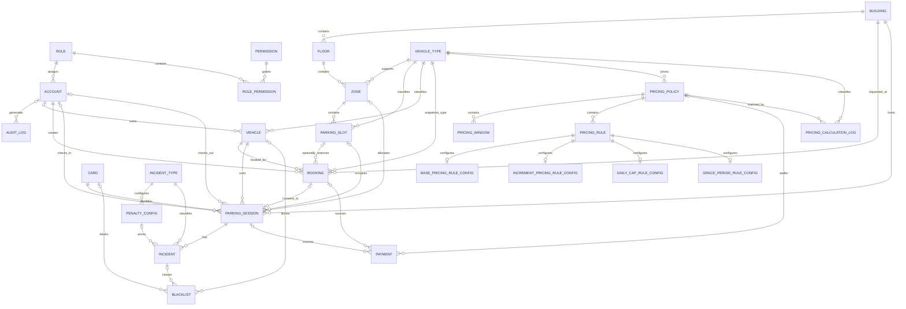
```mermaid
erDiagram
    ROLE ||--o{ ACCOUNT : assigns
    ROLE ||--o{ ROLE_PERMISSION : contains
    PERMISSION ||--o{ ROLE_PERMISSION : grants
    ACCOUNT o|--o{ AUDIT_LOG : generates
    ACCOUNT o|--o{ VEHICLE : owns
    ACCOUNT ||--o{ BOOKING : creates
    ACCOUNT o|--o{ PARKING_SESSION : checks_in
    ACCOUNT o|--o{ PARKING_SESSION : checks_out
    BUILDING ||--o{ FLOOR : contains
    FLOOR ||--o{ ZONE : contains
    VEHICLE_TYPE ||--o{ ZONE : supports
    ZONE ||--o{ PARKING_SLOT : contains
    VEHICLE_TYPE ||--o{ PARKING_SLOT : classifies
    VEHICLE_TYPE ||--o{ VEHICLE : classifies

    VEHICLE ||--o{ BOOKING : booked_for
    VEHICLE_TYPE ||--o{ BOOKING : snapshots_type
    BUILDING ||--o{ BOOKING : requested_at
    PARKING_SLOT o|--o{ BOOKING : optionally_reserves
    BOOKING o|--o| PARKING_SESSION : converts_to

    VEHICLE ||--o{ PARKING_SESSION : uses
    BUILDING ||--o{ PARKING_SESSION : hosts
    CARD ||--o{ PARKING_SESSION : identifies
    ZONE o|--o{ PARKING_SESSION : allocates
    PARKING_SLOT o|--o{ PARKING_SESSION : occupies

    INCIDENT_TYPE ||--o{ PENALTY_CONFIG : configures
    PARKING_SESSION ||--o{ INCIDENT : has
    INCIDENT_TYPE ||--o{ INCIDENT : classifies
    PENALTY_CONFIG o|--o{ INCIDENT : prices
    INCIDENT o|--o{ BLACKLIST : causes
    VEHICLE o|--o{ BLACKLIST : blocks
    CARD o|--o{ BLACKLIST : blocks

    VEHICLE_TYPE ||--o{ PRICING_POLICY : prices
    PRICING_POLICY ||--o{ PRICING_WINDOW : contains
    PRICING_POLICY ||--o{ PRICING_RULE : contains
    PRICING_RULE ||--o| BASE_PRICING_RULE_CONFIG : configures
    PRICING_RULE ||--o| INCREMENT_PRICING_RULE_CONFIG : configures
    PRICING_RULE ||--o| DAILY_CAP_RULE_CONFIG : configures
    PRICING_RULE ||--o| GRACE_PERIOD_RULE_CONFIG : configures
    BOOKING o|--o{ PAYMENT : sources
    PARKING_SESSION o|--o{ PAYMENT : sources
    PRICING_POLICY o|--o{ PAYMENT : audits
    VEHICLE_TYPE ||--o{ PRICING_CALCULATION_LOG : classifies
    PRICING_POLICY ||--o{ PRICING_CALCULATION_LOG : matched_by
```

### 9.1 Identity and Access

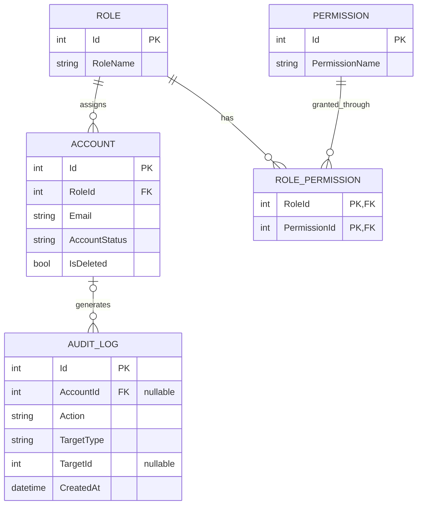
```mermaid
erDiagram
    ROLE {
        int Id PK
        string RoleName
    }
    PERMISSION {
        int Id PK
        string PermissionName
    }
    ROLE_PERMISSION {
        int RoleId PK,FK
        int PermissionId PK,FK
    }
    ACCOUNT {
        int Id PK
        int RoleId FK
        string Email
        string AccountStatus
        bool IsDeleted
    }
    AUDIT_LOG {
        int Id PK
        int AccountId FK "nullable"
        string Action
        string TargetType
        int TargetId "nullable"
        datetime CreatedAt
    }

    ROLE ||--o{ ACCOUNT : assigns
    ROLE ||--o{ ROLE_PERMISSION : has
    PERMISSION ||--o{ ROLE_PERMISSION : granted_through
    ACCOUNT o|--o{ AUDIT_LOG : generates
```

`Role`, `Permission`, and `RolePermission` remain active. Every non-public endpoint maps to a stable Permission code enforced by PBMS; Admin alone changes mappings, and resource ownership is checked separately.

### 9.2 Structure, Booking, and Operations

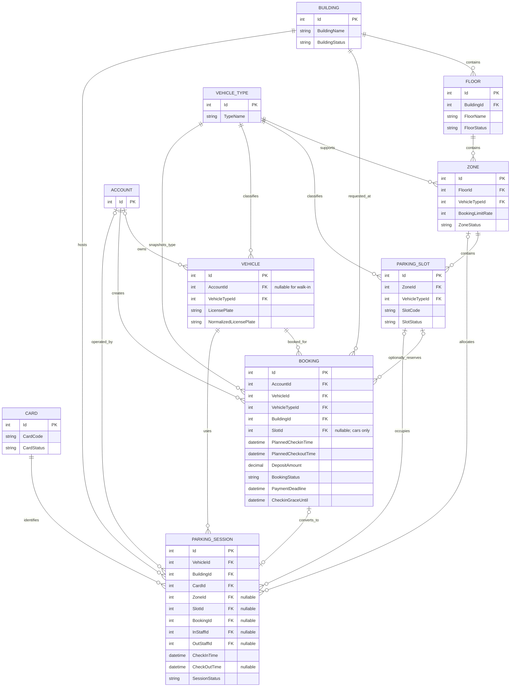
```mermaid
erDiagram
    BUILDING {
        int Id PK
        string BuildingName
        string BuildingStatus
    }
    FLOOR {
        int Id PK
        int BuildingId FK
        string FloorName
        string FloorStatus
    }
    ZONE {
        int Id PK
        int FloorId FK
        int VehicleTypeId FK
        int BookingLimitRate
        string ZoneStatus
    }
    PARKING_SLOT {
        int Id PK
        int ZoneId FK
        int VehicleTypeId FK
        string SlotCode
        string SlotStatus
    }
    VEHICLE_TYPE {
        int Id PK
        string TypeName
    }
    VEHICLE {
        int Id PK
        int AccountId FK "nullable for walk-in"
        int VehicleTypeId FK
        string LicensePlate
        string NormalizedLicensePlate
    }
    CARD {
        int Id PK
        string CardCode
        string CardStatus
    }
    BOOKING {
        int Id PK
        int AccountId FK
        int VehicleId FK
        int VehicleTypeId FK
        int BuildingId FK
        int SlotId FK "nullable; cars only"
        datetime PlannedCheckinTime
        datetime PlannedCheckoutTime
        decimal DepositAmount
        string BookingStatus
        datetime PaymentDeadline
        datetime CheckinGraceUntil
    }
    PARKING_SESSION {
        int Id PK
        int VehicleId FK
        int BuildingId FK
        int CardId FK
        int ZoneId FK "nullable"
        int SlotId FK "nullable"
        int BookingId FK "nullable"
        int InStaffId FK "nullable"
        int OutStaffId FK "nullable"
        datetime CheckInTime
        datetime CheckOutTime "nullable"
        string SessionStatus
    }
    ACCOUNT {
        int Id PK
    }

    BUILDING ||--o{ FLOOR : contains
    FLOOR ||--o{ ZONE : contains
    VEHICLE_TYPE ||--o{ ZONE : supports
    ZONE ||--o{ PARKING_SLOT : contains
    VEHICLE_TYPE ||--o{ PARKING_SLOT : classifies
    ACCOUNT o|--o{ VEHICLE : owns
    VEHICLE_TYPE ||--o{ VEHICLE : classifies
    ACCOUNT ||--o{ BOOKING : creates
    VEHICLE ||--o{ BOOKING : booked_for
    VEHICLE_TYPE ||--o{ BOOKING : snapshots_type
    BUILDING ||--o{ BOOKING : requested_at
    PARKING_SLOT o|--o{ BOOKING : optionally_reserves
    VEHICLE ||--o{ PARKING_SESSION : uses
    BUILDING ||--o{ PARKING_SESSION : hosts
    CARD ||--o{ PARKING_SESSION : identifies
    ZONE o|--o{ PARKING_SESSION : allocates
    PARKING_SLOT o|--o{ PARKING_SESSION : occupies
    BOOKING o|--o| PARKING_SESSION : converts_to
    ACCOUNT o|--o{ PARKING_SESSION : operated_by
```

**Key integrity constraints**

- `NormalizedLicensePlate` is the normalized vehicle identity.
- A vehicle, card, or concrete slot cannot participate in two active sessions at once.
- PostgreSQL prevents overlapping Pending or Confirmed bookings for the same non-null `SlotId` over half-open planned intervals.
- Service validation additionally applies the configurable slot buffer and capacity rules.

### 9.3 Incidents and Restrictions

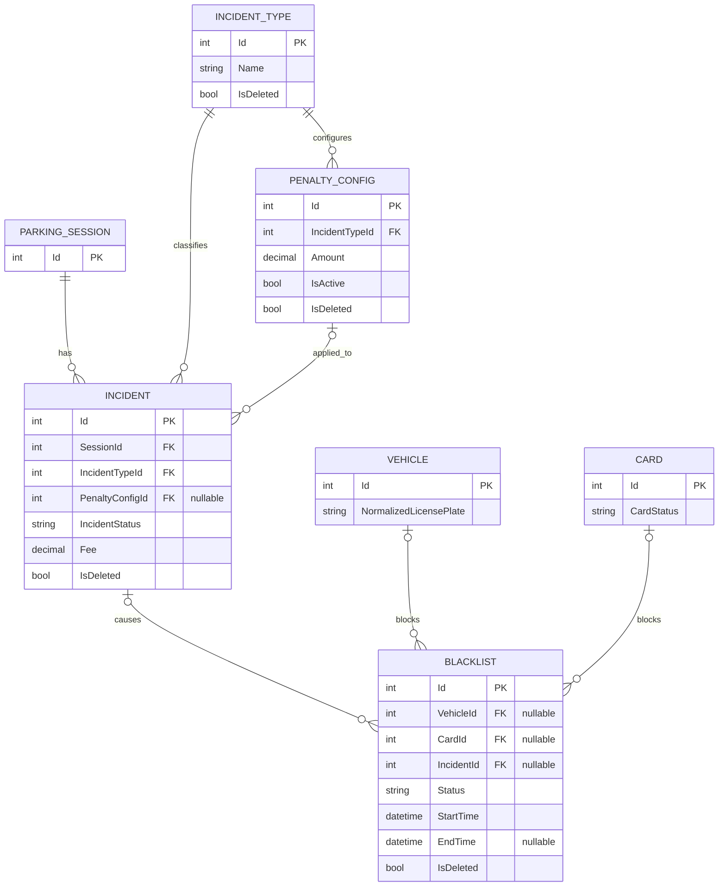
```mermaid
erDiagram
    INCIDENT_TYPE {
        int Id PK
        string Name
        bool IsDeleted
    }
    PENALTY_CONFIG {
        int Id PK
        int IncidentTypeId FK
        decimal Amount
        bool IsActive
        bool IsDeleted
    }
    INCIDENT {
        int Id PK
        int SessionId FK
        int IncidentTypeId FK
        int PenaltyConfigId FK "nullable"
        string IncidentStatus
        decimal Fee
        bool IsDeleted
    }
    BLACKLIST {
        int Id PK
        int VehicleId FK "nullable"
        int CardId FK "nullable"
        int IncidentId FK "nullable"
        string Status
        datetime StartTime
        datetime EndTime "nullable"
        bool IsDeleted
    }
    PARKING_SESSION {
        int Id PK
    }
    VEHICLE {
        int Id PK
        string NormalizedLicensePlate
    }
    CARD {
        int Id PK
        string CardStatus
    }

    INCIDENT_TYPE ||--o{ PENALTY_CONFIG : configures
    PARKING_SESSION ||--o{ INCIDENT : has
    INCIDENT_TYPE ||--o{ INCIDENT : classifies
    PENALTY_CONFIG o|--o{ INCIDENT : applied_to
    INCIDENT o|--o{ BLACKLIST : causes
    VEHICLE o|--o{ BLACKLIST : blocks
    CARD o|--o{ BLACKLIST : blocks
```

An active `Blacklist` row must identify a blocked vehicle, card, or both. Booking and check-in use normalized plate comparison when evaluating vehicle controls.

### 9.4 Pricing, Payment, and Configuration

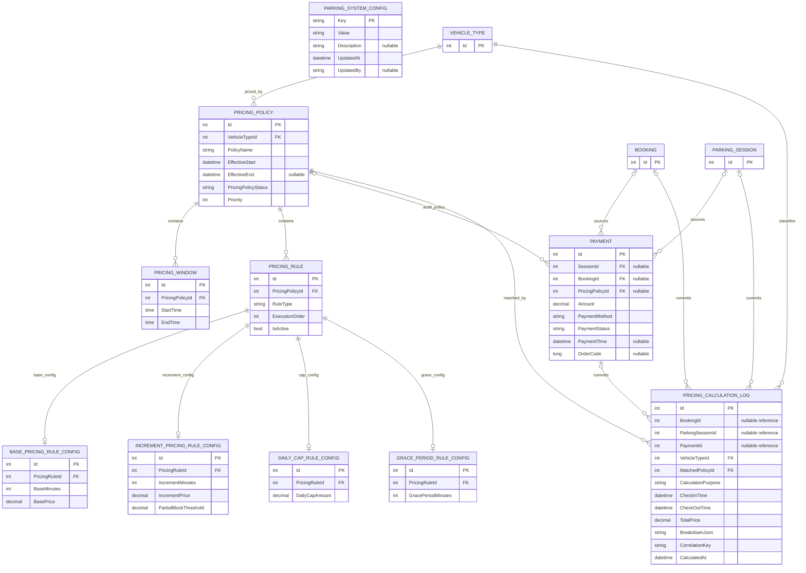
```mermaid
erDiagram
    PRICING_POLICY {
        int Id PK
        int VehicleTypeId FK
        string PolicyName
        datetime EffectiveStart
        datetime EffectiveEnd "nullable"
        string PricingPolicyStatus
        int Priority
    }
    PRICING_WINDOW {
        int Id PK
        int PricingPolicyId FK
        time StartTime
        time EndTime
    }
    PRICING_RULE {
        int Id PK
        int PricingPolicyId FK
        string RuleType
        int ExecutionOrder
        bool IsActive
    }
    GRACE_PERIOD_RULE_CONFIG {
        int Id PK
        int PricingRuleId FK
        int GracePeriodMinutes
    }
    BASE_PRICING_RULE_CONFIG {
        int Id PK
        int PricingRuleId FK
        int BaseMinutes
        decimal BasePrice
    }
    INCREMENT_PRICING_RULE_CONFIG {
        int Id PK
        int PricingRuleId FK
        int IncrementMinutes
        decimal IncrementPrice
        decimal PartialBlockThreshold
    }
    DAILY_CAP_RULE_CONFIG {
        int Id PK
        int PricingRuleId FK
        decimal DailyCapAmount
    }
    PAYMENT {
        int Id PK
        int SessionId FK "nullable"
        int BookingId FK "nullable"
        int PricingPolicyId FK "nullable"
        decimal Amount
        string PaymentMethod
        string PaymentStatus
        datetime PaymentTime "nullable"
        long OrderCode "nullable"
    }
    PRICING_CALCULATION_LOG {
        int Id PK
        int BookingId "nullable reference"
        int ParkingSessionId "nullable reference"
        int PaymentId "nullable reference"
        int VehicleTypeId FK
        int MatchedPolicyId FK
        string CalculationPurpose
        datetime CheckInTime
        datetime CheckOutTime
        decimal TotalPrice
        string BreakdownJson
        string CorrelationKey
        datetime CalculatedAt
    }
    PARKING_SYSTEM_CONFIG {
        string Key PK
        string Value
        string Description "nullable"
        datetime UpdatedAt
        string UpdatedBy "nullable"
    }
    VEHICLE_TYPE {
        int Id PK
    }
    BOOKING {
        int Id PK
    }
    PARKING_SESSION {
        int Id PK
    }

    VEHICLE_TYPE ||--o{ PRICING_POLICY : priced_by
    PRICING_POLICY ||--o{ PRICING_WINDOW : contains
    PRICING_POLICY ||--o{ PRICING_RULE : contains
    PRICING_RULE ||--o| BASE_PRICING_RULE_CONFIG : base_config
    PRICING_RULE ||--o| INCREMENT_PRICING_RULE_CONFIG : increment_config
    PRICING_RULE ||--o| DAILY_CAP_RULE_CONFIG : cap_config
    PRICING_RULE ||--o| GRACE_PERIOD_RULE_CONFIG : grace_config
    BOOKING o|--o{ PAYMENT : sources
    PARKING_SESSION o|--o{ PAYMENT : sources
    PRICING_POLICY o|--o{ PAYMENT : audit_policy
    VEHICLE_TYPE ||--o{ PRICING_CALCULATION_LOG : classifies
    PRICING_POLICY ||--o{ PRICING_CALCULATION_LOG : matched_by
    BOOKING o|--o{ PRICING_CALCULATION_LOG : commits
    PARKING_SESSION o|--o{ PRICING_CALCULATION_LOG : commits
    PAYMENT o|--o{ PRICING_CALCULATION_LOG : commits
```

Active payments must have a Booking or ParkingSession source. Refund and Monthly Subscription columns are removal targets and are omitted. A new payment changes older Pending payments for the same active source to Failed.

`ParkingSystemConfig` is a standalone key-value entity. Important active keys include `BUFFER_TIME_MINUTES`, `WALKIN_STAY_THRESHOLD_HOURS`, and `APPLY_SEGMENTED_PRICING`.

### 9.5 Excluded Future Backend Objects

`ShiftReport` and `Notification` are excluded from the active ERD, processes, rules, states, and acceptance scope. If backend code or tables are retained for future work, they must remain non-exposed and non-running in the current release.

### 9.6 Dormant and Compatibility Objects

| Object | Treatment in this document | Reason |
|---|---|---|
| MonthlySubscription, SubscriptionPriceConfig, and subscription FKs | Remove from project | Product decision rejects legacy compatibility; use a reviewed dependency-ordered migration. |
| RevenueStatistic and RevenueStatisticPayment | Excluded | Current reports calculate revenue dynamically from PAID payments. |
| Refund-only payment states and operations | Remove from project | Cancellation does not initiate or record a refund. |

## 10. Business Rules

The values and outcomes below were rechecked against the reviewed services, domain engine, DTO validation, workers, and configuration fallbacks.

### 10.1 Quick Reference

| Parameter | Active value | Rule or requirement |
|---|---:|---|
| Registration OTP length/lifetime | 6 digits / 5 minutes | BR-ACC-001 |
| OTP resend cooldown | 60 seconds | BR-ACC-002 |
| OTP failure lockout | 5 failures / 15 minutes | BR-ACC-003 |
| Registration token lifetime | 10 minutes | BR-ACC-004 |
| Minimum booking lead/duration | 15 minutes / 4 hours | BR-BOOK-001, BR-BOOK-002 |
| Booking payment deadline | 15 minutes after creation | BR-BOOK-003 |
| Confirmed booking check-in grace | 30 minutes | BR-BOOK-004 |
| Default slot buffer / walk-in threshold | 30 minutes / 2 hours | BR-BOOK-006, BR-BOOK-007 |
| Default zone booking limit | 80%, valid range 1..100 | BR-BOOK-008 |
| Booking cancellation refund behavior | No refund state or operation | BR-BOOK-011 |
| Pricing Grace Period | Configured non-negative minutes per applicable rule/window | BR-FEE-007 |
| Revenue business timezone | UTC+7 | BR-FEE-004, BR-PAY-004 |

### 10.2 Account Verification Rules

| Rule ID | When or condition | Mandatory outcome | Traceability | Status |
|---|---|---|---|---|
| BR-ACC-001 | A registration OTP is issued. | It contains six digits and expires after five minutes. | UC-ACC-001; FR-ACC-001 | REVIEW |
| BR-ACC-002 | The guest requests another OTP. | A resend within sixty seconds is rejected. | UC-ACC-001; FR-ACC-001 | REVIEW |
| BR-ACC-003 | OTP verification fails five times. | Verification is locked for fifteen minutes. | UC-ACC-001; FR-ACC-001 | REVIEW |
| BR-ACC-004 | OTP verification succeeds. | The registration token expires after ten minutes. | UC-ACC-001; FR-ACC-001 | REVIEW |
| BR-ACC-005 | Password recovery is requested or verified. | Use a distinct purpose, generic response, short lifetime, lockout, and single-use token. | UC-ACC-002; FR-ACC-004 | REVIEW |

### 10.3 Booking and Capacity Rules

| Rule ID | When or condition | Mandatory outcome | Traceability | Status |
|---|---|---|---|---|
| BR-BOOK-001 | A booking is created. | Planned check-in is at least fifteen minutes in the future. | UC-BOOK-001; FR-BOOK-001 | REVIEW |
| BR-BOOK-002 | A booking interval is submitted. | Its duration is at least four hours. | UC-BOOK-001; FR-BOOK-001 | REVIEW |
| BR-BOOK-003 | A valid booking is created. | Its payment deadline is creation time plus fifteen minutes. | UC-BOOK-001; FR-BOOK-001, FR-BOOK-006 | REVIEW |
| BR-BOOK-004 | A Confirmed booking awaits check-in. | The grace endpoint is thirty minutes after planned check-in. | UC-BOOK-001; FR-BOOK-001, FR-BOOK-006 | REVIEW |
| BR-BOOK-005 | A booking requests a concrete slot. | Only a car booking may select one. | UC-BOOK-001; FR-BOOK-002 | REVIEW |
| BR-BOOK-006 | Booking or extension availability is evaluated. | The default separation buffer is thirty minutes. | UC-BOOK-001, UC-SESSION-001; FR-BOOK-002, FR-SESSION-002 | REVIEW |
| BR-BOOK-007 | Capacity is checked for a near-term booking. | The default walk-in threshold is two hours. | UC-BOOK-001; FR-BOOK-003 | REVIEW |
| BR-BOOK-008 | A zone booking limit is configured or enforced. | Default is 80%; accepted values are 1 through 100. | UC-STR-001, UC-BOOK-001; FR-STR-002, FR-BOOK-003 | REVIEW |
| BR-BOOK-009 | General capacity is calculated. | Subtract the ceiling of the vehicle-type buffer ratio. | UC-BOOK-001; FR-BOOK-003 | REVIEW |
| BR-BOOK-010 | A booking deposit is calculated. | It equals the estimate for the complete planned interval. | UC-BOOK-001; FR-BOOK-004 | REVIEW |
| BR-BOOK-011 | An eligible Pending or Confirmed Booking is cancelled. | Set Booking to Cancelled without initiating or recording a refund. | UC-BOOK-001; FR-BOOK-005 | REVIEW |

#### Booking Cancellation Decision Table

| Booking state | Deposit state | Cancellation time | Booking result | Payment result |
|---|---|---|---|---|
| Pending | Pending/non-paid | Any eligible time | Cancelled | No refund transition |
| Confirmed | Paid | Any eligible time | Cancelled | Unchanged; no refund behavior |
| CheckedIn/NoShow/Expired | Any | Cancellation requested | Reject unless another explicit workflow permits it | Unchanged |

### 10.4 Allocation Rules

| Rule ID | When or condition | Mandatory outcome | Traceability | Status |
|---|---|---|---|---|
| BR-ALLOC-001 | A check-in or allocation is attempted. | The same vehicle cannot have two active sessions. | UC-OPS-001; FR-OPS-002 | REVIEW |
| BR-ALLOC-002 | A card is assigned. | The same card cannot serve two active sessions. | UC-OPS-001; FR-OPS-002, FR-CARD-001 | REVIEW |
| BR-ALLOC-003 | A concrete slot is assigned or reserved. | It cannot serve overlapping active use. | UC-OPS-001; FR-ALLOC-001, FR-BOOK-002 | REVIEW |

### 10.5 Pricing and Fee Rules

| Rule ID | When or condition | Mandatory outcome | Traceability | Status |
|---|---|---|---|---|
| BR-FEE-001 | `APPLY_SEGMENTED_PRICING` is absent or false. | Use non-segmented pricing. | UC-PRICE-002; FR-PRICE-002 | REVIEW |
| BR-FEE-002 | Segmented pricing selects a candidate policy. | Order by Priority, EffectiveStart, then identifier. | UC-PRICE-002; FR-PRICE-002 | REVIEW |
| BR-FEE-003 | A partial increment remains. | Charge it only when its percentage reaches the configured threshold. | UC-PRICE-002; FR-PRICE-003 | REVIEW |
| BR-FEE-004 | A daily cap boundary is calculated. | Use UTC+7 calendar boundaries. | UC-PRICE-002; FR-PRICE-003 | REVIEW |
| BR-FEE-005 | Current pricing is calculated. | Include penalties from Open or Processing incidents. | UC-PRICE-002, UC-INC-001; FR-PRICE-003, FR-INC-001 | REVIEW |
| BR-FEE-006 | A policy date overlap is validated. | Compare overlap against policies of the same Priority. | UC-PRICE-001; FR-PRICE-001 | REVIEW |
| BR-FEE-007 | Excess duration reaches an increment boundary. | Do not add the next increment charge while excess is less than or equal to Grace Period; charge only excess after Grace Period. | UC-PRICE-002; FR-PRICE-003 | REVIEW |

#### Pricing Mode Decision Table

| `APPLY_SEGMENTED_PRICING` | Selection behavior | Tie-breaking / cap behavior |
|---|---|---|
| False | One active policy at check-in governs selection. | Checkout-selected policy supplies the daily cap. |
| True | Each segment selects the policy applicable at the segment boundary. | Highest Priority, latest EffectiveStart, then identifier; checkout-selected policy supplies the daily cap. |

### 10.6 Payment Rules

| Rule ID | When or condition | Mandatory outcome | Traceability | Status |
|---|---|---|---|---|
| BR-PAY-001 | A new payment is created for a booking or session. | Older Pending payments for the same source become Failed. | UC-PAY-001; FR-PAY-001 | REVIEW |
| BR-PAY-002 | A payment method is selected. | CASH settles synchronously; ONLINE_BANKING settles only through verified VNPay. | UC-PAY-001; FR-PAY-001, FR-PAY-002 | REVIEW |
| BR-PAY-003 | Refund behavior. | [DEPRECATED] No refund operation or state is permitted in the current project. | FR-PAY-003 | DEPRECATED |
| BR-PAY-004 | Revenue is calculated. | Include only PAID payments. | UC-RPT-001; FR-RPT-001 | REVIEW |

#### Payment Transition Decision Table

| Current state | Event | Allowed result | Important condition |
|---|---|---|---|
| Pending | Cash completion | Paid | Apply configured cash rounding. |
| Pending | Verified VNPay success | Paid | Signature/result/window valid; apply idempotently. |
| Pending | Replaced, rejected, failed, or expired | Failed | Must not trigger booking/extension success. |
| Paid | Booking cancellation | Paid remains recorded | Refund is outside the project. |

### 10.7 Committed Pricing Log Rules

| Rule ID | When or condition | Mandatory outcome | Traceability | Status |
|---|---|---|---|---|
| BR-LOG-001 | A price calculation only previews an amount. | Return breakdown without persisting PricingCalculationLog. | FR-PRICE-004 | REVIEW |
| BR-LOG-002 | A calculation persists or changes a payable Booking, Session, or Payment amount. | Persist exactly one correlated PricingCalculationLog in the same successful operation. | FR-PRICE-004 | REVIEW |
| BR-LOG-003 | A committed financial operation is replayed idempotently. | Do not create a duplicate committed calculation log. | FR-PRICE-004 | REVIEW |

### 10.8 Deprecated Rule Family

`BR-MONTH-001` through `BR-MONTH-024`, `BR-SHIFT-001` through `BR-SHIFT-005`, and `BR-PAY-003` are reserved and DEPRECATED under CR-GEN-003. They are not current acceptance rules and must not be reused.

### 10.9 Six-Commit Business-Rule Impact

The six web commits introduce no backend `BR-*` rule and change no existing rule value.

| UI behavior | Existing governing rule or requirement | Classification |
|---|---|---|
| Only an available mapped car slot is actionable. | BR-BOOK-005, BR-BOOK-006, BR-ALLOC-003; FR-BOOK-002 | UI preselection; API must revalidate. |
| Motorbike continues without a concrete slot. | BR-BOOK-005; FR-BOOK-002 | Existing rule made explicit in the map. |
| Active compatible floors/slots are shown by vehicle type. | FR-STR-003, FR-BOOK-002 | Query/filter behavior, not a new domain rule. |
| All active API-returned incident types are offered to Driver. | FR-INC-001 | Approved current behavior; API enforces active type and owned active session. |
| `.npmrc`, lockfile, labels, translations, and layout changed. | None | No business-rule impact. |

## 11. Open Questions and Known Gaps

| ID | Unresolved decision | Diagram/data impact |
|---|---|---|
| RISK-AUTH-001 | Login-OTP UI/error handling may remain after direct-JWT scope decision. | Diagram 1.0 defines direct JWT; remove visible login-OTP behavior. |
| RISK-AUTH-002 | Current forgot-password UI and API contract are incompatible. | Diagram 1.1 defines the recovery-specific remediation target. |
| OQ-DATA-001 | Retention/deletion periods for images, plates, incidents, audit logs, and payment metadata. | ERD identifies stored data but does not invent retention rules. |
| RISK-PRICE-001 | Active PricingEngine does not yet apply configured Grace Period. | ERD and rules include Grace Period as the remediation target. |
| RISK-PRICE-002 | Booking committed amounts may not produce a calculation log. | BR-LOG-001..003 define preview versus committed logging. |
| RISK-SEC-001 | Incomplete server-side authorization on operational controllers. | Actor lanes express intended access, not proof of enforcement. |
| RISK-EXCL-001 | Refund, Monthly Subscription, Notification, automatic retry, or Shift Report code may remain visible/running. | Current diagrams exclude these capabilities; remediation report defines removal/non-exposure checks. |
| RISK-INC-001 | Driver active-type and owned-session validation may be missing server-side. | Diagram 7.1 allows all active types but requires both validations. |
| RISK-INC-002 | Incident file control still implies unsupported upload. | Diagram 7.1 is text-only; remove the file control. |

## 12. Traceability Matrix

| Diagram | Use cases | Principal functional requirements | Business rules | Core entities |
|---|---|---|---|---|
| 1 Registration and Authentication | UC-ACC-001, UC-ACC-002 | FR-ACC-001 to FR-ACC-004; recovery remediation required | BR-ACC-001 to BR-ACC-005 | Account, Role |
| 2 Structure and Pricing Management | UC-STR-001, UC-PRICE-001 | FR-STR-001 to FR-STR-003, FR-PRICE-001, FR-CFG-001 | BR-BOOK-008 | Building, Floor, Zone, ParkingSlot, VehicleType, PricingPolicy, ParkingSystemConfig |
| 3 Booking Lifecycle | UC-BOOK-001, UC-PAY-001 | FR-BOOK-001 to FR-BOOK-006, FR-PRICE-004, FR-PAY-001 to FR-PAY-002 | BR-BOOK-001 to BR-BOOK-011, BR-PAY-001 to BR-PAY-002, BR-LOG-001 to BR-LOG-003 | Account, Vehicle, VehicleType, Building, Floor, Zone, ParkingSlot, Booking, Payment, PricingCalculationLog |
| 4 Check-in and Allocation | UC-OPS-001 | FR-OPS-001 to FR-OPS-003, FR-ALLOC-001 | BR-ALLOC-001 to BR-ALLOC-003 | Vehicle, Card, Booking, ParkingSession, Zone, ParkingSlot, Blacklist |
| 5 Session Extension | UC-SESSION-001, UC-PRICE-002, UC-PAY-001 | FR-SESSION-001 to FR-SESSION-002, FR-PRICE-002 to FR-PRICE-004, FR-PAY-001 | BR-FEE-001 to BR-FEE-007, BR-PAY-001 to BR-PAY-002, BR-LOG-001 to BR-LOG-003 | ParkingSession, Booking, ParkingSlot, PricingPolicy, Payment, PricingCalculationLog |
| 6 Standard Checkout | UC-OPS-002, UC-PRICE-002, UC-PAY-001 | FR-OPS-004, FR-PRICE-002 to FR-PRICE-004, FR-PAY-001 to FR-PAY-002 | BR-FEE-001 to BR-FEE-007, BR-PAY-001 to BR-PAY-002, BR-LOG-001 to BR-LOG-003 | ParkingSession, Card, ParkingSlot, Incident, PricingPolicy, Payment, PricingCalculationLog |
| 7 Exceptional Checkout and Driver Incidents | UC-OPS-002, UC-INC-001 | FR-OPS-005, FR-INC-001, FR-CARD-001, FR-BLK-001 | BR-ALLOC-002, BR-FEE-005 | ParkingSession, IncidentType, PenaltyConfig, Incident, Card, Blacklist |
| 8 Monitoring and Reporting | UC-RPT-001 | FR-RPT-001, FR-AUD-001 | BR-PAY-004 | ParkingSession, Payment, AuditLog |
| Access control | UC-SEC-001 | FR-SEC-001, NFR-SEC-002 | Stable endpoint Permission plus separate ownership check | Role, Permission, RolePermission, Account |

## 13. Review Checklist

- [x] Regenerated all 20 Simplified SVG files after CR-GEN-003 updates.
- [x] Every current-release use case is represented by at least one activity diagram.
- [x] Current rules and remediation rules are listed once in the rule catalogue.
- [x] Refund and Monthly Subscription are excluded from active processes and ERDs as removal targets.
- [x] Notification and Shift Report are excluded from current processes and active ERDs.
- [x] Dynamic revenue uses PAID payments, not legacy RevenueStatistic tables.
- [x] Known authorization, authentication, pricing, removal, and retention gaps are disclosed.
- [ ] Product owner confirms the unresolved open questions.
- [ ] Security owner confirms actor authorization boundaries.

---

End of PBMS Business Process Swimlanes companion for SRS version 1.4.
