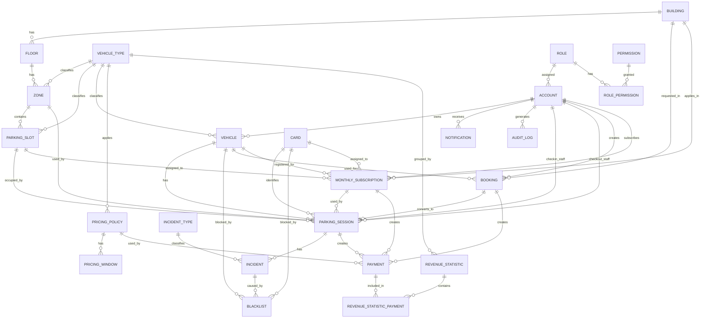
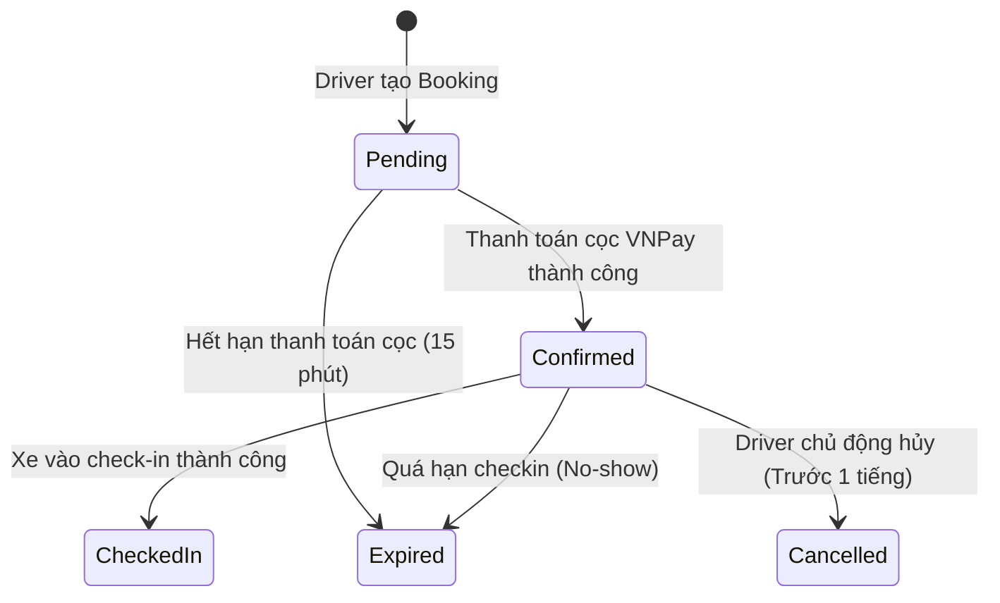

# Software Requirements Specification

## Table Of Contents

- [0. Document Control](#0-document-control)
  - [0.1 Document Information](#01-document-information)
  - [0.2 Revision History](#02-revision-history)
  - [0.3 Review And Approval](#03-review-and-approval)
- [1. Introduction](#1-introduction)
  - [1.1 Purpose](#11-purpose)
  - [1.2 Scope](#12-scope)
  - [1.3 Intended Audience](#13-intended-audience)
  - [1.4 Definitions, Acronyms And Abbreviations](#14-definitions-acronyms-and-abbreviations)
  - [1.5 References](#15-references)
  - [1.6 Document Overview](#16-document-overview)
- [2. Overall Description](#2-overall-description)
  - [2.1 Product Perspective](#21-product-perspective)
  - [2.2 Product Functions](#22-product-functions)
  - [2.3 User Classes And Characteristics](#23-user-classes-and-characteristics)
  - [2.4 Operating Environment](#24-operating-environment)
  - [2.5 Design And Implementation Constraints](#25-design-and-implementation-constraints)
  - [2.6 Assumptions And Dependencies](#26-assumptions-and-dependencies)
- [3. Stakeholders, Actors And External Systems](#3-stakeholders-actors-and-external-systems)
  - [3.1 Stakeholders](#31-stakeholders)
  - [3.2 Actors](#32-actors)
  - [3.3 Actor Permission Overview](#33-actor-permission-overview)
  - [3.4 External Systems](#34-external-systems)
- [4. Business Context](#4-business-context)
  - [4.1 Problem Statement](#41-problem-statement)
  - [4.2 Business Goals](#42-business-goals)
  - [4.3 Success Criteria](#43-success-criteria)
  - [4.4 Current Workflow](#44-current-workflow)
  - [4.5 Target Workflow](#45-target-workflow)
- [5. Product Features](#5-product-features)
  - [5.1 Feature List](#51-feature-list)
  - [5.2 Feature Details](#52-feature-details)
- [6. Use Case Specifications](#6-use-case-specifications)
  - [6.1 Use Case Overview](#61-use-case-overview)
  - [6.2 Use Case Details](#62-use-case-details)
- [7. Business Rules](#7-business-rules)
  - [7.1 Business Rule Catalogue](#71-business-rule-catalogue)
  - [7.2 Business Rule Details](#72-business-rule-details)
- [8. Functional Requirements](#8-functional-requirements)
  - [8.1 Functional Requirement Catalogue](#81-functional-requirement-catalogue)
  - [8.2 Functional Requirement Details](#82-functional-requirement-details)
- [9. Data Requirements And Data Model](#9-data-requirements-and-data-model)
  - [9.1 Modeling Scope](#91-modeling-scope)
  - [9.2 Conceptual Data Model](#92-conceptual-data-model)
  - [9.3 Logical And Physical Model](#93-logical-and-physical-model)
  - [9.4 Entity Attributes](#94-entity-attributes)
  - [9.5 Data Dictionary](#95-data-dictionary)
  - [9.6 Data Constraints And Validation Rules](#96-data-constraints-and-validation-rules)
- [10. External Interface Requirements](#10-external-interface-requirements)
  - [10.1 User Interface Requirements](#101-user-interface-requirements)
  - [10.2 Software Interface Requirements](#102-software-interface-requirements)
  - [10.3 Hardware Interface Requirements](#103-hardware-interface-requirements)
  - [10.4 Communication Interface Requirements](#104-communication-interface-requirements)
- [11. Non-Functional Requirements](#11-non-functional-requirements)
  - [11.1 Non-Functional Requirement Catalogue](#111-non-functional-requirement-catalogue)
  - [11.2 Non-Functional Requirement Details](#112-non-functional-requirement-details)
- [12. Access Control Requirements](#12-access-control-requirements)
  - [12.1 Authentication Requirements](#121-authentication-requirements)
  - [12.2 Authorization Requirements](#122-authorization-requirements)
  - [12.3 Access Control Matrix](#123-access-control-matrix)
- [13. State Models](#13-state-models)
  - [13.1 State Definitions](#131-state-definitions)
  - [13.2 State Transitions](#132-state-transitions)
- [14. Error Handling And Edge Cases](#14-error-handling-and-edge-cases)
  - [14.1 Error Catalogue](#141-error-catalogue)
  - [14.2 Edge Cases](#142-edge-cases)
- [15. Acceptance Criteria And Verification](#15-acceptance-criteria-and-verification)
  - [15.1 Acceptance Criteria Catalogue](#151-acceptance-criteria-catalogue)
  - [15.2 Verification Methods](#152-verification-methods)
- [16. Requirements Traceability](#16-requirements-traceability)
  - [16.1 Requirements Traceability Matrix](#161-requirements-traceability-matrix)
- [17. Open Questions, Decisions And Risks](#17-open-questions-decisions-and-risks)
  - [17.1 Open Questions](#171-open-questions)
  - [17.2 Decisions](#172-decisions)
  - [17.3 Requirement-Related Risks](#173-requirement-related-risks)
- [18. Appendices](#18-appendices)
  - [18.1 Glossary](#181-glossary)
- [19. Requirement Identification Convention](#19-requirement-identification-convention)
- [20. Requirement Status Convention](#20-requirement-status-convention)
- [21. SRS Review Checklist](#21-srs-review-checklist)
- [22. Approval](#22-approval)

---

## 0. Document Control

**Last Updated**: 2026-07-12  
**Status**: REVIEW  
**Author**: Collaborative  

### 0.1 Document Information

| Tiêu chí | Nội dung |
|---|---|
| Tên dự án | Parking Building Management System (PBMS) / NexPark |
| Loại tài liệu | Software Requirements Specification (SRS) |
| Phiên bản | 1.1 |
| Trạng thái | REVIEW |

### 0.2 Revision History

| Phiên bản | Ngày | Tác giả | Mô tả thay đổi |
|---|---|---|---|
| 1.0 | 2026-06-18 | BA Team | Bản thảo SRS đầu tiên đầy đủ nghiệp vụ bãi xe. |
| 1.1 | 2026-07-12 | Collaborative | Nâng cấp SRS khớp codebase: Tích hợp Camera/LPR Base64, API check capacity theo thời gian thực, cơ chế bảo vệ slot check-in, cập nhật Pricing Engine và Background Worker dọn dẹp chính sách giá hết hạn. |

### 0.3 Review And Approval

| Vai trò | Tên | Chức vụ | Ngày | Chữ ký / T
## 1. Introduction

Introduction

## 1.1 Purpose

Tài liệu này mô tả yêu cầu nghiệp vụ và yêu cầu chức năng của hệ thống quản lý tòa nhà gửi xe.

Mục tiêu của tài liệu là giúp team hiểu rõ:

- Hệ thống phục vụ ai.
- Hệ thống giải quyết vấn đề gì.
- Hệ thống có những chức năng nào.
- Luồng xử lý xe máy, ô tô, booking, thẻ tháng và thanh toán diễn ra như thế nào.
- Các business rule chính cần tuân theo khi triển khai.

Tài liệu này có thể dùng làm cơ sở cho BA, developer, tester, PM và stakeholder khi phân tích, phát triển, kiểm thử và
nghiệm thu hệ thống.

---

## 1.2 Scope

### In Scope

| Nhóm phạm vi                      | Nội dung                                                                                                                                                                                                                                                                         |
|-----------------------------------|----------------------------------------------------------------------------------------------------------------------------------------------------------------------------------------------------------------------------------------------------------------------------------|
| Hardware Simulation               | Không có camera, thẻ vật lý, barrier, cảm biến slot. Tất cả thao tác được nhập hoặc xác nhận thủ công trên web.                                                                                                                                                                  |
| Vehicle Support                   | Hệ thống cho phép cấu hình loại phương tiện ở mức dữ liệu nghiệp vụ. Trong phiên bản hiện tại, hệ thống chỉ kích hoạt và kiểm thử chính cho xe máy và ô tô.<br/>Các loại phương tiện khác như xe đạp, xe điện có thể được bổ sung sau thông qua cấu hình hoặc mở rộng nghiệp vụ. |
| Motorcycle Parking                | Khi check-in, hệ thống hiện gợi ý Zone/Area còn chỗ, không quản lý tới từng slot cụ thể.                                                                                            |
| Car Parking                       | Khi check-in, ô tô Walk-in/Booking chỉ được gợi ý Zone thuộc nhóm `GENERAL`; Slot thực tế được ghi nhận vào Parking Session sau khi xe đã đậu. Ô tô thẻ tháng dùng Slot riêng trong Zone `MONTHLY`. |
| Booking                           | Người dùng có thể đặt trước chỗ gửi xe, bắt buộc nhập biển số và đặt cọc phí booking theo Booking Policy tại thời điểm Booking được tạo.                                                                                                                                                                                            |
| Motorcycle Booking                | Xe máy booking không chọn Zone/Slot cụ thể. Hệ thống đảm bảo có chỗ khi khách đến đúng thời gian hợp lệ.                                                                                                                                                                         |
| Car Booking                       | Ô tô booking chỉ chọn Building và Vehicle/biển số; hệ thống giữ general capacity ở Building, không giữ Zone hoặc Slot cụ thể trước khi check-in. |
| Monthly Subscription              | Hồ sơ đăng ký/thẻ tháng gắn với Vehicle, Building và Card `MONTHLY`; xe máy giữ capacity động, ô tô giữ Slot riêng bằng `monthly_subscription.assigned_slot_id`. |
| Payment                           | Hỗ trợ thanh toán tiền mặt và thanh toán online thật qua ngân hàng. Không hỗ trợ thanh toán bằng thẻ.                                                                                                                                                                            |
| Fee Calculation                   | Giá gửi xe được tính theo mô hình Time Window, Base Price, Increment/Block Pricing và Window Cap. Nếu phiên gửi xe đi qua nhiều khung giờ, hệ thống tách phiên theo từng khung giờ và áp dụng bảng giá riêng cho từng khung.                                                     |
| Pricing Policy Configuration      | Manager có thể cấu hình bảng giá theo Vehicle Type, khung giờ, thời lượng cơ bản, giá cơ bản, block tính thêm, giá block phát sinh, cap theo khung giờ và các biến cấu hình liên quan. Trong phiên bản hiện tại, Pricing Policy dùng chung toàn hệ thống theo Vehicle Type, không cấu hình riêng theo Building, không overlap theo timeline và bị khóa cấu hình giá sau khi `ACTIVE` hoặc đã được sử dụng. |
| Rounding Policy                   | Hệ thống hỗ trợ rule làm tròn thời gian phát sinh theo grace period và làm tròn tiền mặt theo đơn vị làm tròn cấu hình. Thanh toán online giữ nguyên giá trị chính xác.                                                                                                          |
| System State Management           | Hệ thống quản lý trạng thái Building, Floor, Zone, Slot, Vehicle, Card, Parking Session, Booking, Incident, Monthly Subscription và Pricing Policy theo các trạng thái nghiệp vụ đã định nghĩa.                                                                                          |
| Driver Account & Vehicle          | Tài khoản Driver có thể được tạo trước khi có xe. Một tài khoản có thể thêm nhiều xe sau này.                                                                                                                                                                                    |
| Scalability in Business Structure | Có thể mở rộng Building, Floor, Zone, Slot ở mức cấu hình nghiệp vụ.                                                                                                                                                                                                             |
| Parking Session Tracking          | Ghi nhận xe vào, trạng thái đang gửi, khu vực/slot được phân bổ, phí tạm tính.                                                                                                                                                                                                   |
| Concept / Entity / Physical Model | Tài liệu bao gồm phần tổng quan concept relationship, entity summary và physical table model để đồng bộ nghiệp vụ với database model.                                                                                                                                             |
| Vehicle Check-out                 | Staff tìm lượt gửi xe, xác nhận xe ra, tính phí, thu tiền.                                                                                                                                                                                                                       |
| Exception Handling                | Mất mã gửi xe/thẻ mô phỏng, sai biển số, quá hạn, gửi sai khu vực, chưa thanh toán.                                                                                                                                                                                              |
| Operation Monitoring              | Manager theo dõi slot/zone, bảng giá, lượt xe, doanh thu, tỷ lệ lấp đầy.                                                                                                                                                                                                         |

### Out of Scope

| Nội dung                      | Lý do                                                              |
|-------------------------------|--------------------------------------------------------------------|
| Camera nhận diện biển số thật | Không có hardware thực tế.                                         |
| Thẻ xe vật lý thật            | Mã thẻ/mã gửi xe chỉ là mô phỏng trên web.                         |
| Barrier tự động               | Không tích hợp thiết bị cổng thật.                                 |
| Cảm biến slot thật            | Trạng thái chỗ đỗ được cập nhật bằng thao tác hệ thống/người dùng. |
| Thanh toán bằng thẻ ngân hàng | Chỉ hỗ trợ thanh toán online qua ngân hàng, không thanh toán thẻ.  |
| NFR chi tiết                  | Không phân tích trong phạm vi tài liệu này.                        |
| AI allocation nâng cao        | Có thể để optional/RBL, chưa đưa vào core scope.                   |

---

## 1.3 Definitions, Acronyms, Abbreviations

| Thuật ngữ               | Ý nghĩa trong hệ thống này                                                                                                                            |
|-------------------------|-------------------------------------------------------------------------------------------------------------------------------------------------------|
| Building                | Một tòa nhà gửi xe.                                                                                                                                   |
| Floor                   | Một tầng trong tòa nhà.                                                                                                                               |
| Zone/Area               | Khu vực đỗ xe, dùng chính cho xe máy.                                                                                                                 |
| Slot                    | Vị trí đỗ cụ thể, dùng chính cho ô tô.                                                                                                                |
| Parking Session         | Một lượt gửi xe từ lúc check-in đến check-out.                                                                                                        |
| Booking                 | Đặt chỗ trước cho một khoảng thời gian.                                                                                                               |
| Monthly Subscription    | Hồ sơ đăng ký và quyền lợi gửi xe định kỳ gắn với một Vehicle; tên nghiệp vụ tiếng Việt có thể là thẻ tháng/vé tháng. |
| Card                    | Card vận hành do bãi xe quản lý, dùng để nhận diện một Parking Session bằng `card_code` hiện tại hoặc `nfc_uid` trong tương lai. |
| Manual Input            | Người dùng nhập dữ liệu bằng tay trên web, thay cho camera/thẻ/hardware thật.                                                                         |
| Pricing Window          | Khung thời gian áp dụng một bảng giá cụ thể, ví dụ khung ngày hoặc khung đêm.                                                                         |
| Pricing Policy          | Chính sách giá theo Vehicle Type, dùng chung cho toàn bộ Building trong phiên bản hiện tại; Policy áp dụng cho Parking Session được xác định bằng Vehicle Type và `check_in_time`, không bắt buộc lưu trên Parking Session. |
| Base Duration           | Thời lượng cơ bản được tính theo giá cơ bản.                                                                                                          |
| Base Price              | Giá cơ bản áp dụng cho Base Duration.                                                                                                                 |
| Increment Block         | Đơn vị thời gian tính thêm sau khi vượt Base Duration.                                                                                                |
| Increment Price         | Giá phát sinh cho mỗi Increment Block.                                                                                                                |
| Window Cap              | Mức phí tối đa trong một khung giờ riêng biệt. Không áp dụng cho toàn bộ phiên gửi xe.                                                                |
| Grace Period            | Khoảng thời gian ân hạn. Nếu thời gian phát sinh nhỏ hơn hoặc bằng grace period thì không tính thêm block mới.                                        |
| Deposit Fee             | Khoản phí khách phải thanh toán trước khi booking được xác nhận; bằng Base Price của block đầu tiên theo Booking Policy tại thời điểm Booking được tạo và thanh toán. |
| Payment Timeout         | Thời gian tối đa cho phép chờ thanh toán Booking Payment hoặc Monthly Subscription Payment theo cấu hình riêng; Checkout Payment không có automatic timeout. |
| Check-in Grace Time     | Thời gian ân hạn cho phép khách check-in sau giờ booking đã xác nhận.                                                                                 |
| Downgrade               | Việc chuyển vé tháng hết hạn sang trạng thái tính phí như khách vãng lai nếu xe vẫn còn trong bãi.                                                    |
| Cash Rounding           | Quy tắc làm tròn số tiền khi thanh toán tiền mặt.                                                                                                     |
| Online Payment Rounding | Thanh toán online không làm tròn, giữ nguyên giá trị chính xác.                                                                                       |
| Card Code               | Mã nghiệp vụ của Card để Staff nhập thủ công khi check-in/check-out, ví dụ `CARD-000001`. |
| NFC UID                 | UID kỹ thuật của chip NFC, chỉ dùng khi hệ thống tích hợp Card NFC trong tương lai. |
| Available               | Còn trống.                                                                                                                                            |
| Occupied                | Đang có xe sử dụng.                                                                                                                                   |
| Assigned                | Đã được gán cho session hoặc subscription theo quan hệ nghiệp vụ tương ứng. |
| Maintenance/Locked      | Tạm khóa, không được phân bổ.                                                                                                                         |

---

## 1.4 Document Overview

- Chương 1 mô tả mục đích, phạm vi, thuật ngữ và tài liệu tham chiếu.
- Chương 2 mô tả tổng quan hệ thống.
- Chương 3 mô tả stakeholders, actors và quyền tổng quan.
- Chương 4 mô tả business context, workflow và success criteria.
- Chương 5 mô tả functional requirements.
- Chương 6 mô tả business rules.
- Chương 7 mô tả các điểm chính sách đã chốt.
- Chương 8 mô tả Concept, Entity và Physical Model đã đồng bộ với SRS.

---


---

## 2. Overall Description

Overall Description

## 2.1 Product Perspective

Hệ thống là một web app quản lý tòa nhà gửi xe, hoạt động như một hệ thống mô phỏng quy trình vận hành bãi xe. Thay vì
tích hợp camera, thẻ vật lý, barrier hoặc cảm biến, toàn bộ dữ liệu như biển số, loại xe, mã thẻ, thao tác vào/ra, thanh
toán sẽ được nhập hoặc xác nhận thủ công trên web.

Hệ thống thay thế một phần quy trình thủ công hiện tại bằng quy trình số hóa: ghi nhận xe vào/ra, kiểm tra chỗ trống,
phân bổ chỗ đỗ, tính phí, thanh toán và theo dõi trạng thái bãi xe.

---

## 2.2 Product Functions

| Function Group                      | Mô tả                                                                                                                                                                |
|-------------------------------------|----------------------------------------------------------------------------------------------------------------------------------------------------------------------|
| Parking Structure Management        | Quản lý Building, Floor, Zone, Slot ở mức cấu hình.                                                                                                                  |
| Driver Account & Vehicle Management | Cho phép tạo tài khoản Driver không cần có xe ban đầu; một tài khoản có thể thêm nhiều xe.                                                                           |
| Vehicle Check-in                    | Tiếp nhận xe vào bãi bằng nhập liệu thủ công.                                                                                                                        |
| Parking Allocation                  | Khi check-in, xe máy được hệ thống gợi ý Zone còn capacity; ô tô Walk-in/Booking được gợi ý Zone `GENERAL` trước và ghi nhận Slot thực tế sau khi đậu; ô tô thẻ tháng dùng Slot đã cấp trong Zone `MONTHLY`. |
| Booking Management                  | Booking yêu cầu chọn Building trước, nhập biển số/Vehicle, thanh toán Deposit Fee bằng Base Price của block đầu tiên theo Booking Policy tại thời điểm Booking được tạo, thời gian đặt trước tối thiểu 1 tiếng và tối đa 8 tiếng; Driver không chọn Zone/Slot. |
| Monthly Subscription Management     | Đăng ký/gia hạn quyền lợi gửi xe tháng gắn với Vehicle, Building, Card `MONTHLY`; xe máy giữ một đơn vị capacity động, ô tô được cấp Slot riêng trong Zone `MONTHLY`. |
| Parking Session Tracking            | Theo dõi lượt gửi xe từ check-in đến check-out.                                                                                                                      |
| Vehicle Check-out                   | Tính phí, xác nhận thanh toán và kết thúc lượt gửi xe.                                                                                                               |
| Payment Management                  | Hỗ trợ tiền mặt và thanh toán online thật qua ngân hàng; không hỗ trợ thanh toán thẻ.                                                                                |
| Fee Calculation                     | Tính phí theo thời gian thực tế sử dụng, loại xe, từng pricing window, base duration, base price, block phát sinh và window cap.                                     |
| Pricing Policy Management           | Cho phép Manager cấu hình bảng giá dùng chung toàn hệ thống theo Vehicle Type; không cấu hình giá riêng theo Building trong phiên bản hiện tại. |
| System State Management             | Quản lý trạng thái Building, Floor, Zone, Slot, Vehicle, Card, Parking Session, Booking, Incident, Monthly Subscription và Pricing Policy theo các trạng thái nghiệp vụ đã định nghĩa. |
| Exception Handling                  | Xử lý mất mã, sai biển số, quá hạn, sai khu vực, chưa thanh toán.                                                                                                    |
| Operation Monitoring                | Manager xem trạng thái bãi, doanh thu, lượt xe, tỷ lệ lấp đầy.                                                                                                       |

---

## 2.3 User Classes and Characteristics

| User Class            | Mục tiêu sử dụng                                                              | Đặc điểm                                      |
|-----------------------|-------------------------------------------------------------------------------|-----------------------------------------------|
| Parking Manager       | Quản lý cấu trúc bãi xe, bảng giá, tình trạng vận hành, báo cáo.              | Dùng để giám sát và cấu hình.                 |
| Parking Staff         | Check-in, check-out, thu phí, xử lý ngoại lệ.                                 | Dùng thường xuyên trong vận hành hằng ngày.   |
| Parking User / Driver | Xem thông tin bãi, booking, đăng ký thẻ tháng, theo dõi lượt gửi, thanh toán. | Có thể dùng self-service nếu hệ thống hỗ trợ. |
| System Administrator  | Quản lý tài khoản, phân quyền, cấu hình hệ thống.                             | Dùng để quản trị hệ thống.                    |

---

## 2.4 Operating Environment

Hệ thống chạy trên web browser. Người dùng thao tác qua giao diện web.

Không yêu cầu:

- Camera thật.
- Thẻ vật lý thật.
- Máy quét thẻ.
- Cảm biến slot.
- Barrier tự động.
- Thiết bị IoT.

Có thể triển khai theo hướng:

- Web app nội bộ.
- Web app demo/mô phỏng.
- Web app có thể mở rộng tích hợp hardware trong tương lai, nhưng không thuộc scope hiện tại.

---

## 2.5 Constraints

| Constraint                       | Mô tả                                                                                                                                                                                   |
|----------------------------------|-----------------------------------------------------------------------------------------------------------------------------------------------------------------------------------------|
| No real hardware                 | Tất cả dữ liệu được nhập thủ công hoặc mô phỏng.                                                                                                                                        |
| Manual operation                 | Staff phải nhập/xác nhận biển số, mã thẻ, check-in, check-out.                                                                                                                          |
| Vehicle type limitation          | Phiên bản hiện tại chỉ kích hoạt nghiệp vụ cho xe máy và ô tô.<br/>Hệ thống không hard-code loại xe, nhưng các loại xe khác chưa được phân tích nghiệp vụ chi tiết trong phiên bản này. |
| Motorcycle allocation level      | Xe máy chỉ được phân bổ tới Zone/Area, không phân bổ slot cụ thể.                                                                                                                       |
| Check-in allocation level        | Khi check-in, xe máy lưu Zone; ô tô Walk-in/Booking được gợi ý Zone `GENERAL` trước, Slot thực tế chỉ được lưu sau khi xe đã đậu và vị trí được xác nhận. |
| Motorcycle booking level         | Xe máy booking chỉ chọn Building và Vehicle/biển số; hệ thống giữ một đơn vị general capacity tại Building và chọn Zone khi check-in. |
| Car booking level                | Ô tô booking chỉ chọn Building và Vehicle/biển số; hệ thống chỉ giữ general capacity tại Building, không giữ Zone hoặc Slot cụ thể. |
| Monthly subscription guarantee           | Quyền lợi tháng xe máy giữ capacity động nhưng không giữ Zone/Slot cụ thể; quyền lợi tháng ô tô giữ Slot riêng bằng `monthly_subscription.assigned_slot_id`. |
| Monthly subscription capacity protection | Mỗi Monthly Subscription xe máy `ACTIVE` làm giảm capacity Walk-in/Booking một đơn vị; ô tô Walk-in/Booking chỉ dùng Zone `GENERAL`, ô tô tháng chỉ dùng Zone `MONTHLY`. |
| Pricing model                    | Hệ thống áp dụng mô hình Time Window, Base Price, Increment/Block Pricing và Window Cap.                                                                                                |
| Pricing policy scope             | Trong phiên bản hiện tại, Pricing Policy có phạm vi toàn hệ thống theo Vehicle Type. Hệ thống chưa hỗ trợ một Vehicle Type có giá khác nhau giữa các Building. |
| Pricing policy lookup            | Pricing Policy của Parking Session được xác định bằng Vehicle Type và `check_in_time`; không bắt buộc lưu `pricing_policy_id` trên Parking Session và không xác định lại theo thời điểm check-out. |
| Window cap limitation            | Window Cap chỉ áp dụng cho từng khung giờ riêng biệt, không áp dụng cho toàn bộ phiên gửi xe.                                                                                           |
| 24/7 operation                   | Hệ thống vận hành 24/7 và không reset parking session khi qua ngày mới.                                                                                                                 |
| Dynamic configuration            | Các biến giá, khung giờ, block, grace period, timeout, penalty và rounding phải được cấu hình động, không hardcode vào source code.                                                     |
| Cash rounding                    | Thanh toán tiền mặt có thể làm tròn theo đơn vị cấu hình.                                                                                                                               |
| Online payment rounding          | Thanh toán online không làm tròn, giữ nguyên giá trị chính xác.                                                                                                                         |
| Booking time limit               | Booking chỉ được tạo nếu thời gian đặt trước tối thiểu 1 tiếng và tối đa 8 tiếng so với thời điểm thanh toán cọc thành công.                                                            |
| Booking deposit policy           | Booking tạo Payment cho Deposit Fee trong Main Flow; Booking chỉ `CONFIRMED` sau khi Deposit Fee được thanh toán thành công. Deposit Fee bằng Base Price của block đầu tiên theo Booking Policy tại thời điểm Booking được tạo và không tính lại khi check-in. |
| Booking cancellation policy      | Nếu khách hủy trước thời điểm booking ít nhất 1 tiếng, hệ thống hoàn cọc.                                                                                                               |
| Booking no-show policy           | Nếu khách không check-in trước `scheduled_check_in_time + checkin_grace_minutes`, booking chuyển sang `EXPIRED` và khách mất cọc. |
| Payment method limitation        | Hỗ trợ thanh toán tiền mặt và thanh toán online thật qua ngân hàng; không hỗ trợ thanh toán bằng thẻ.                                                                                   |
| Expandable structure             | Hệ thống phải cho phép mở rộng Building, Floor, Zone, Slot ở mức quản lý dữ liệu nghiệp vụ.                                                                                             |

---

## 2.6 Assumptions and Dependencies

| ID    | Assumption                                                                                                                                          |
|-------|-----------------------------------------------------------------------------------------------------------------------------------------------------|
| A-001 | Staff là người thao tác chính trong check-in/check-out nếu người dùng không tự thực hiện được.                                                      |
| A-002 | Biển số xe được nhập thủ công, nên hệ thống cần kiểm tra trùng, sai hoặc thiếu biển số.                                                             |
| A-003 | Staff nhập `card_code` của Card vận hành khi check-in/check-out; Card hiện tại là dữ liệu vận hành trên web và có thể mở rộng bằng `nfc_uid` khi tích hợp NFC sau này. |
| A-004 | Xe máy được quản lý theo sức chứa Zone/Area, không theo slot cụ thể.                                                                                |
| A-005 | Ô tô khi gửi thực tế cần được gán slot cụ thể để tránh xung đột vị trí.                                                                             |
| A-006 | Khi check-in, xe máy và ô tô đều được hệ thống gợi ý theo Zone còn chỗ.                                                                             |
| A-007 | Xe máy booking phải chọn Building trước; Driver không chọn Zone/Slot, hệ thống chọn Zone phù hợp khi check-in. |
| A-008 | Ô tô booking phải chọn Building trước; Driver không chọn Zone/Slot; hệ thống chỉ gợi ý Zone `GENERAL` khi check-in và ghi nhận Slot thực tế sau khi xe đã đậu. |
| A-009 | Booking chỉ hợp lệ sau khi thanh toán cọc thành công.                                                                                               |
| A-010 | Booking phải được đặt trước tối thiểu 1 tiếng và tối đa 8 tiếng tính từ thời điểm thanh toán cọc thành công.                                        |
| A-011 | Booking phải có thời gian dự kiến gửi xe để hệ thống tính tiền cọc.                                                                                 |
| A-012 | Tiền cọc booking bằng Base Price của block đầu tiên theo Booking Policy áp dụng tại thời điểm Booking được tạo và thanh toán.                                                                               |
| A-013 | Nếu khách hủy booking trước giờ booking ít nhất 1 tiếng, hệ thống hoàn cọc.                                                                         |
| A-014 | Nếu khách không check-in trước `scheduled_check_in_time + checkin_grace_minutes`, booking chuyển sang `EXPIRED` và khách mất cọc. |
| A-015 | Nếu khách đến sớm hơn giờ booking, hệ thống cho phép check-in sớm nếu còn chỗ phù hợp. Thời gian gửi xe bắt đầu tính từ lúc khách thực tế check-in. |
| A-016 | Khi check-out booking, Tổng phí thực tế bằng phí gửi xe cộng phụ phí/phí phạt; số tiền còn phải trả bằng `max(0, total_actual_fee - paid_deposit_fee)`. Nếu Deposit Fee lớn hơn Tổng phí thực tế, Driver không phải thanh toán thêm và hệ thống không hoàn, lưu hoặc xử lý riêng phần chênh lệch. |
| A-017 | Nếu khách gửi vượt quá thời gian đã đặt, phần vượt được tính phí theo chính sách gửi xe thông thường.                                               |
| A-018 | Thẻ tháng xe máy đảm bảo có chỗ bằng capacity động: mỗi Monthly Subscription `ACTIVE` giảm capacity Walk-in/Booking một đơn vị, không phân Zone/Slot cụ thể. |
| A-019 | Thẻ tháng ô tô được cấp Slot riêng trong Zone `MONTHLY`; quyền giữ Slot nằm ở `monthly_subscription.assigned_slot_id`, không nằm trong `slot_status`. |
| A-020 | Thẻ tháng không giới hạn số lượt vào/ra mỗi ngày trong thời gian còn hiệu lực.                                                                      |
| A-021 | Một Driver Account có thể tồn tại mà chưa có xe. Xe có thể được thêm sau.                                                                           |
| A-022 | Một Driver Account có thể quản lý nhiều xe.                                                                                                         |
| A-023 | Online payment là thanh toán thật qua ngân hàng, không phải mô phỏng và không phải thanh toán thẻ.                                                  |
| A-024 | Phí gửi xe có thể thay đổi theo loại xe, số giờ, khung giờ sáng/tối, qua đêm và nhiều ngày.                                                         |
| A-025 | Hệ thống tính phí theo thời gian thực tế sử dụng.                                                                                                   |
| A-026 | Nếu phiên gửi xe đi qua nhiều pricing window, hệ thống tách phiên theo từng khung giờ trong Pricing Policy áp dụng cho Vehicle Type tại `check_in_time` và áp dụng bảng giá riêng cho từng khung. |
| A-027 | Window Cap chỉ giới hạn phí trong từng pricing window, không giới hạn toàn bộ session.                                                              |
| A-028 | Hệ thống vận hành 24/7 và không reset session khi qua ngày mới.                                                                                     |
| A-029 | Nếu vé tháng hết hạn lúc xe vẫn còn trong bãi, hệ thống downgrade quyền lợi vé tháng và bắt đầu tính phí vãng lai từ thời điểm hết hạn.             |
| A-030 | Booking chưa thanh toán trong thời gian timeout sẽ hết hiệu lực hoặc bị hủy theo status model; general capacity đã tạm giữ tại Building được giải phóng và không cập nhật `slot_status`. |
| A-031 | Nếu khách booking không check-in trước `scheduled_check_in_time + checkin_grace_minutes`, booking chuyển sang `EXPIRED` và Deposit Fee không được hoàn trả. |
| A-032 | Nếu khách check-out trễ hơn thời gian booking, phần phát sinh được tính theo block pricing của bảng giá vãng lai.                                   |
| A-033 | Nếu thời gian phát sinh nhỏ hơn hoặc bằng grace period, hệ thống không tính block mới. Nếu vượt grace period, hệ thống tính thành block mới.        |
| A-034 | Thanh toán tiền mặt áp dụng cash rounding cho số tiền cuối cùng sau phí gửi xe, phụ phí/phí phạt và Booking Deposit hợp lệ.                                                                          |
| A-035 | Thanh toán online không làm tròn số tiền.                                                                                                           |
| A-036 | Pricing Policy được xác định bằng Vehicle Type và `check_in_time` rồi dùng cho toàn bộ Parking Session, kể cả khi policy đó hết hạn hoặc policy mới được kích hoạt trước check-out. |
| A-037 | Pricing Policy dùng chung toàn hệ thống theo Vehicle Type; phiên bản hiện tại không hỗ trợ giá khác nhau giữa các Building cho cùng Vehicle Type. |
| A-038 | Thời điểm check-out được ghi nhận khi bắt đầu check-out và dùng làm mốc kết thúc tính phí; thời gian thanh toán trong cùng quá trình không làm phí tăng thêm. |

---


---

## 3. Stakeholders, Actors And External Systems

Stakeholders & Actors

## 3.1 Stakeholders

| Stakeholder            | Vai trò                                                     |
|------------------------|-------------------------------------------------------------|
| Chủ bãi xe / Chủ dự án | Muốn hệ thống giúp quản lý vận hành và doanh thu.           |
| Parking Manager        | Theo dõi hoạt động bãi xe, cấu hình bãi, bảng giá, báo cáo. |
| Parking Staff          | Thực hiện nghiệp vụ xe vào/ra hằng ngày.                    |
| Parking User / Driver  | Người gửi xe, booking, thanh toán, đăng ký thẻ tháng.       |
| System Administrator   | Quản lý tài khoản, phân quyền, cấu hình hệ thống.           |
| Development Team       | Phân tích, thiết kế, triển khai hệ thống.                   |
| Testing Team           | Kiểm thử chức năng và luồng nghiệp vụ.                      |

---

## 3.2 Actors

| Actor                | Mô tả                                                                          |
|----------------------|--------------------------------------------------------------------------------|
| Parking Manager      | Người quản lý vận hành bãi xe.                                                 |
| Parking Staff        | Nhân viên thao tác nghiệp vụ tại cổng hoặc quầy.                               |
| Driver               | Người gửi xe, đặt chỗ, đăng ký thẻ tháng, thanh toán.                          |
| System Administrator | Người quản trị hệ thống.                                                       |
| Bank Payment Gateway | Hệ thống thanh toán online qua ngân hàng.                                      |
| System               | Tự động kiểm tra chỗ trống, trạng thái booking, tính phí, cập nhật trạng thái. |

---

## 3.3 Actor Permission Overview

| Actor                | Main Permissions                                                         |
|----------------------|--------------------------------------------------------------------------|
| Parking Manager      | Quản lý cấu trúc bãi xe, bảng giá, xem tình trạng vận hành, xem báo cáo. |
| Parking Staff        | Check-in, check-out, nhập biển số, tạo session, thu phí, xử lý ngoại lệ. |
| Driver               | Xem thông tin bãi, booking, đăng ký thẻ tháng, xem lượt gửi, thanh toán. |
| System Administrator | Quản lý tài khoản, phân quyền, cấu hình chung.                           |
| Bank Payment Gateway | Xác nhận kết quả thanh toán online.                                      |

---

### 3.4 External Systems

- **EXT-PAY-001 (VNPay)**: Hệ thống xử lý thanh toán trực tuyến.
- **EXT-OCR-001 (Plate Recognizer)**: Dịch vụ đám mây API bên ngoài phục vụ nhận diện biển số xe (LPR).


---

## 4. Business Context

Business Context

## 4.1 Problem Statement

Hiện tại, nghiệp vụ gửi xe trong tòa nhà nhiều tầng có nhiều điểm dễ sai sót: xe ra/vào liên tục, cần kiểm soát chỗ
trống, cần tính phí, cần xử lý mất vé/mã gửi xe, quá hạn, sai thông tin xe, xe gửi sai khu vực và xe chưa thanh toán.
Nếu quản lý thủ công, bãi xe dễ bị ùn ứ, sai lệch dữ liệu, khó kiểm soát sức chứa và khó đối soát doanh thu.

Trong phiên bản này, vì không có hardware thật, hệ thống cần mô phỏng nghiệp vụ bằng web app nhưng vẫn phải giữ đúng
logic vận hành: xe vào phải có session, xe phải được phân bổ đúng khu vực/slot, booking và thẻ tháng không được làm vượt
sức chứa, xe ra phải được thanh toán và cập nhật trạng thái.

---

## 4.2 Business Goals

| Goal ID | Business Goal                                                                         |
|---------|---------------------------------------------------------------------------------------|
| BG-001  | Chuẩn hóa quy trình xe vào/ra bằng web app.                                           |
| BG-002  | Giảm sai sót khi ghi nhận biển số, mã gửi xe, giờ vào/ra, phí gửi xe.                 |
| BG-003  | Kiểm soát được chỗ trống theo Zone cho xe máy và Slot cho ô tô.                       |
| BG-004  | Hỗ trợ đặt chỗ trước để người dùng chủ động kế hoạch gửi xe.                          |
| BG-005  | Hỗ trợ thẻ tháng nhưng không vượt quá khả năng phục vụ của bãi.                       |
| BG-006  | Hỗ trợ thanh toán tiền mặt và online qua ngân hàng; không hỗ trợ thanh toán bằng thẻ. |
| BG-007  | Cho phép mở rộng mô hình bãi xe khi có thêm Building, Floor, Zone, Slot.              |
| BG-008  | Giúp Manager theo dõi vận hành, doanh thu, lượt xe, tỷ lệ lấp đầy.                    |

---

## 4.3 Success Criteria

| Criteria ID | Success Criteria                                                                                       |
|-------------|--------------------------------------------------------------------------------------------------------|
| SC-001      | Driver có thể tạo tài khoản mà chưa cần thêm xe.                                                       |
| SC-002      | Một Driver Account có thể thêm nhiều xe.                                                               |
| SC-003      | Booking bắt buộc nhập biển số.                                                                         |
| SC-004      | Booking chỉ confirmed sau khi thanh toán cọc thành công.                                               |
| SC-005      | Booking phải được đặt trước tối thiểu 1 tiếng và tối đa 8 tiếng tính từ lúc thanh toán cọc thành công. |
| SC-006      | Xe máy booking phải chọn Building trước; người dùng không chọn Zone/Slot, hệ thống chọn Zone khi check-in. |
| SC-007      | Ô tô booking phải chọn Building trước; người dùng không chọn Zone/Slot, hệ thống chỉ gợi ý Zone `GENERAL` khi check-in và ghi nhận Slot thực tế sau khi xe đã đậu. |
| SC-008      | Booking yêu cầu thanh toán Deposit Fee bằng Base Price của block đầu tiên theo Booking Policy tại thời điểm Booking được tạo.            |
| SC-009      | Booking được hoàn cọc nếu khách hủy trước giờ booking ít nhất 1 tiếng.                                 |
| SC-010      | Booking no-show chuyển sang `EXPIRED` và mất cọc nếu khách không check-in trước `scheduled_check_in_time + checkin_grace_minutes`. |
| SC-011      | Thẻ tháng xe máy đảm bảo có chỗ bằng capacity động: mỗi subscription `ACTIVE` giảm capacity Walk-in/Booking một đơn vị. |
| SC-012      | Thẻ tháng ô tô được cấp Slot riêng trong Zone `MONTHLY`; Slot được giữ bằng `monthly_subscription.assigned_slot_id`. |
| SC-013      | Thẻ tháng không giới hạn số lượt vào/ra mỗi ngày.                                                      |
| SC-014      | Hệ thống không cho cấp thêm thẻ tháng nếu vượt khả năng đảm bảo chỗ.                                   |
| SC-015      | Hệ thống hỗ trợ thanh toán tiền mặt và online qua ngân hàng.                                           |
| SC-016      | Hệ thống không hiển thị thanh toán bằng thẻ.                                                           |
| SC-017      | Phí gửi xe được tính theo giờ, loại xe, khung giờ sáng/tối, qua đêm và nhiều ngày.                     |
| SC-018      | Hệ thống không cấp hết chỗ cho walk-in/booking nếu phần còn lại cần giữ cho khách thẻ tháng.           |
| SC-019      | Staff có thể tạo lượt gửi xe bằng nhập thủ công biển số, loại xe, mã gửi xe.                           |
| SC-020      | Xe máy được hệ thống gợi ý Zone/Area còn trống.                                                        |
| SC-021      | Ô tô Walk-in/Booking chỉ được hệ thống gợi ý Zone `GENERAL` trước; Slot thực tế được ghi nhận sau khi xe đậu. Ô tô thẻ tháng dùng Slot đã cấp trong Zone `MONTHLY`. |
| SC-022      | Khi check-out, hệ thống tính được phí và ghi nhận thanh toán tiền mặt hoặc online.                     |
| SC-023      | Sau khi xe ra, Zone/Slot được cập nhật lại trạng thái còn trống.                                       |
| SC-024      | Manager có thể xem tình trạng chỗ đỗ, lượt xe và doanh thu.                                            |
| SC-025      | Có thể thêm Building/Floor/Zone/Slot mới mà không làm thay đổi luồng nghiệp vụ chính.                  |
| SC-026 | Hệ thống tính phí theo Time Window, Base Price, Increment/Block Pricing và Window Cap. |
| SC-027 | Nếu session đi qua nhiều khung giờ, hệ thống tách session và tính phí riêng cho từng khung. |
| SC-028 | Window Cap chỉ áp dụng trong từng khung giờ riêng biệt. |
| SC-029 | Session không bị reset khi qua ngày mới. |
| SC-030 | Hệ thống tự động downgrade vé tháng hết hạn nếu xe vẫn còn trong bãi và tính phí vãng lai từ thời điểm hết hạn. |
| SC-031 | Booking chưa thanh toán sau booking payment timeout sẽ hết hiệu lực hoặc bị hủy theo status model; general capacity được giải phóng và không cập nhật `slot_status`. |
| SC-032 | Booking no-show sau check-in grace time chuyển sang `EXPIRED` và không hoàn deposit fee. |
| SC-033 | Thời gian phát sinh nhỏ hơn hoặc bằng grace period không bị tính block mới. |
| SC-034 | Thanh toán tiền mặt được làm tròn theo cash rounding rule. |
| SC-035 | Thanh toán online giữ nguyên giá trị chính xác, không làm tròn. |
| SC-036 | Thời điểm check-out được ghi nhận ngay khi Driver/Staff bắt đầu check-out và được dùng làm mốc kết thúc tính phí. |
| SC-037 | Payment `PENDING` trong cùng quá trình check-out không làm phí tiếp tục tăng và không giải phóng Zone/Slot. |
| SC-038 | Pricing Policy của Parking Session được xác định bằng Vehicle Type và `check_in_time`, dùng cho toàn bộ session và không chọn lại theo `check_out_time`. |
| SC-039 | Pricing Policy dùng chung toàn hệ thống theo Vehicle Type, không cấu hình riêng theo Building. |
| SC-040 | Check-in bị từ chối nếu không có đúng một Pricing Policy hợp lệ cho Vehicle Type tại `check_in_time`. |
| SC-041 | Pricing Policy đã `ACTIVE` hoặc đã được sử dụng không được sửa cấu hình giá hoặc Pricing Window. |
| SC-042 | Checkout Payment không tự động timeout; Payment retry tạo Payment mới và giữ Payment `FAILED` để audit. |
| SC-043 | Quyền lợi Monthly Subscription khi checkout được đánh giá tại `check_out_time`, không đánh giá lại theo thời điểm Payment hoàn tất. |

---

## 4.4 Current Workflow

### Trước khi có hệ thống

1. Nhân viên tiếp nhận xe.
2. Nhân viên ghi nhận biển số, loại xe, giờ vào bằng cách thủ công.
3. Nhân viên tự kiểm tra hoặc ước lượng còn chỗ hay không.
4. Người gửi xe tự tìm khu vực/slot.
5. Khi xe ra, nhân viên tìm lại thông tin gửi xe.
6. Nhân viên tính phí.
7. Người gửi xe thanh toán.
8. Nhân viên ghi nhận xe đã rời bãi.
9. Manager tổng hợp doanh thu/lượt xe thủ công hoặc bán thủ công.

### Pain Points

| Pain Point                                 | Ảnh hưởng                                     |
|--------------------------------------------|-----------------------------------------------|
| Khó biết còn chỗ chính xác                 | Dễ nhận xe vượt sức chứa.                     |
| Xe máy và ô tô cần logic phân bổ khác nhau | Dễ gửi sai khu vực.                           |
| Không có trạng thái booking rõ ràng        | Có thể trùng chỗ.                             |
| Thẻ tháng nếu cấp quá nhiều                | Không đảm bảo còn chỗ.                        |
| Ghi nhận thủ công                          | Dễ sai biển số, giờ vào, phí.                 |
| Thanh toán khó đối soát                    | Dễ lệch doanh thu.                            |
| Không có hardware thật                     | Cần cơ chế mô phỏng nhưng vẫn đúng nghiệp vụ. |

---

## 4.5 Target Workflow

### Luồng tổng quát sau khi có hệ thống

1. Staff hoặc Driver mở chức năng tương ứng trên web.
2. Hệ thống hiển thị thông tin bãi xe, chỗ trống, giá và quy định.
3. Người dùng nhập dữ liệu: biển số, loại xe, mã thẻ/mã gửi xe, thời gian booking hoặc thông tin thẻ tháng.
4. Hệ thống kiểm tra điều kiện hợp lệ.
5. Hệ thống phân bổ:
    - Xe máy → Zone/Area còn trống.
    - Ô tô Walk-in/Booking → Zone thuộc nhóm `GENERAL`.
    - Ô tô thẻ tháng → Slot riêng trong Zone `MONTHLY` đã được cấp qua `monthly_subscription.assigned_slot_id`.
6. Hệ thống tạo booking, monthly registration hoặc parking session.
7. Khi xe ra, Staff tìm session.
8. Hệ thống tính phí.
9. Người dùng thanh toán tiền mặt hoặc online.
10. Hệ thống cập nhật trạng thái session, Zone/Slot thực tế và giao dịch.
11. Manager theo dõi trạng thái vận hành qua màn hình quản lý.

### 4.5.1 Booking Workflow

#### Main Flow

1. Driver đăng nhập, tạo booking.
2. Driver chọn Building muốn gửi xe.
3. Driver chọn loại xe: xe máy hoặc ô tô.
4. Driver nhập/chọn biển số xe.
5. Driver nhập thời gian dự kiến vào bãi.
6. Driver nhập thời lượng gửi xe hoặc thời gian dự kiến rời bãi.
7. Hệ thống kiểm tra thời gian booking:
    - Tối thiểu trước 1 tiếng so với thời điểm thanh toán cọc thành công.
    - Tối đa trước 8 tiếng so với thời điểm thanh toán cọc thành công.
8. Hệ thống xác định Booking Policy theo loại xe và thời điểm Booking được tạo.
9. Hệ thống tính Deposit Fee bằng Base Price của block đầu tiên theo Booking Policy.
10. Hệ thống kiểm tra chỗ khả dụng trong Building đã chọn:
    - Xe máy: Driver không chọn Zone/Slot; hệ thống kiểm tra general capacity của Building sau khi trừ Monthly Subscription xe máy active.
    - Ô tô: Driver không chọn Zone/Slot; hệ thống kiểm tra general car capacity của Building, chỉ tính phần capacity dành cho Zone `GENERAL`.
11. Hệ thống tạo Booking ở trạng thái `PENDING` và tạm giữ general capacity tại Building.
12. Hệ thống tạo Payment cho Booking Deposit với đúng số tiền Deposit đã yêu cầu qua QR, `pricing_policy_id` của Booking Policy và `booking_id` là nguồn duy nhất.
13. Driver thanh toán cọc qua ngân hàng.
14. Nếu Payment thành công, Payment chuyển `PAID`, hệ thống xác nhận booking và chuyển trạng thái booking sang `CONFIRMED`.
15. Booking chỉ giữ capacity ở mức Building; vị trí thực tế được xác định trong quá trình check-in/đỗ xe và lưu ở Parking Session.
16. Khi Driver đến đúng thời gian hợp lệ, booking được chuyển thành parking session.

#### Exception Flow

| Trường hợp                                            | Xử lý                                                           |
|-------------------------------------------------------|-----------------------------------------------------------------|
| Thiếu Building                                        | Không cho tạo booking.                                          |
| Thiếu biển số                                         | Không cho tạo booking.                                          |
| Không nhập thời lượng gửi xe hoặc giờ rời bãi dự kiến | Không cho tạo booking vì hệ thống không đủ dữ liệu để tính cọc. |
| Thời gian booking nhỏ hơn 1 tiếng từ lúc thanh toán   | Từ chối booking.                                                |
| Thời gian booking lớn hơn 8 tiếng từ lúc thanh toán   | Từ chối booking.                                                |
| Thanh toán cọc chưa hoàn tất trong timeout             | Booking hết hiệu lực hoặc bị hủy theo status model, general capacity đã tạm giữ được giải phóng, không cập nhật `slot_status`. |
| Xe máy không còn capacity đảm bảo                     | Từ chối booking.                                                |
| Ô tô không còn general capacity phù hợp                | Từ chối booking.                                                |
| Khách hủy trước giờ booking ít nhất 1 tiếng           | Hủy booking và hoàn cọc.                                        |
| Khách hủy trễ hơn thời hạn được hoàn cọc              | Hủy booking và không hoàn cọc.                                  |
| Khách không check-in trước `scheduled_check_in_time + checkin_grace_minutes` | Booking chuyển `EXPIRED`, mất cọc, giải phóng general capacity và không cập nhật `slot_status`. |
| Biển số đã có booking active trùng thời gian          | Cảnh báo hoặc từ chối tạo booking mới.                          |
| Quá thời gian thanh toán booking | Booking hết hiệu lực hoặc bị hủy theo status model; general capacity đã tạm giữ ở Building được giải phóng, không cập nhật `slot_status`. |
| Khách không check-in trong thời gian ân hạn | Booking chuyển `EXPIRED`, Deposit Fee không được hoàn trả. |

### 4.5.2 Monthly Subscription Workflow

#### Main Flow

1. Driver mở chức năng đăng ký Monthly Subscription/thẻ tháng.
2. Driver chọn hoặc thêm xe vào tài khoản.
3. Hệ thống kiểm tra biển số xe và loại xe.
4. Hệ thống kiểm tra thẻ tháng hiện tại của xe.
5. Hệ thống kiểm tra khả năng đảm bảo chỗ theo loại xe:
    - Xe máy: kiểm tra capacity động; mỗi Monthly Subscription xe máy `ACTIVE` giữ một đơn vị và làm giảm capacity Walk-in/Booking.
    - Ô tô: kiểm tra Slot còn có thể cấp riêng trong Zone `MONTHLY` của Building đã chọn.
6. Nếu còn khả năng đảm bảo chỗ, hệ thống tạo hồ sơ `monthly_subscription` ở trạng thái `PENDING` và tạo yêu cầu thanh toán.
7. Driver thanh toán phí thẻ tháng.
8. Khi thanh toán thành công, hệ thống kích hoạt Monthly Subscription, thiết lập thời gian hiệu lực, gán Card `MONTHLY`, và giữ capacity/slot tương ứng.
9. Khi xe máy có Monthly Subscription vào bãi, Driver dùng Card `MONTHLY`; hệ thống kiểm tra subscription hợp lệ, dùng capacity tháng đã giữ và gợi ý Zone còn chỗ.
10. Khi ô tô có Monthly Subscription vào bãi, Driver dùng Card `MONTHLY`; hệ thống dùng Slot riêng trong Zone `MONTHLY` đã được cấp cho xe đó.
11. Driver có thể ra/vào nhiều lượt trong ngày nếu thẻ còn hiệu lực và không có session đang mở cùng lúc.
12. Hệ thống lưu quyền lợi tháng theo Vehicle, Building, Card `MONTHLY` và Slot nếu là ô tô; Card type không tự cấp quyền lợi nếu không có Monthly Subscription hợp lệ.
13. Hệ thống ghi nhận chu kỳ hiệu lực của vé tháng theo valid duration.
14. Nếu vé tháng được gia hạn thành công trước hoặc sau khi hết hạn, quyền lợi vé tháng được kích hoạt lại ngay sau khi thanh toán thành công.

#### Downgrade Flow

1. Hệ thống quét trạng thái vé tháng vào 00:00 mỗi ngày.
2. Nếu vé tháng đã hết hạn và xe vẫn còn trong bãi, hệ thống chuyển quyền lợi vé tháng sang trạng thái downgraded/transient.
3. Từ thời điểm hết hạn, hệ thống bắt đầu tính phí theo bảng giá vãng lai.
4. Khi xe check-out, khách thanh toán phần phí phát sinh theo bảng giá vãng lai.

#### Exception Flow

| Trường hợp                                | Xử lý                                           |
|-------------------------------------------|-------------------------------------------------|
| Xe chưa được thêm vào tài khoản           | Yêu cầu thêm xe hoặc nhập biển số.              |
| Xe đã có thẻ tháng còn hiệu lực           | Không cho tạo thẻ tháng trùng thời gian.        |
| Hết capacity đảm bảo cho xe máy thẻ tháng | Từ chối đăng ký thẻ tháng xe máy.               |
| Không còn Slot để cấp cho ô tô thẻ tháng  | Từ chối đăng ký thẻ tháng ô tô.                 |
| Thanh toán thất bại                       | Thẻ tháng không được kích hoạt.                 |
| Thẻ tháng hết hạn                         | Không áp dụng quyền lợi thẻ tháng khi check-in. |
| Vé tháng hết hạn khi xe vẫn còn trong bãi | Hệ thống downgrade vé tháng và tính phí vãng lai từ thời điểm hết hạn. |
| Muốn dùng cùng một vé tháng cho xe khác | Hệ thống từ chối vì mỗi vé tháng chỉ áp dụng cho một xe đã đăng ký. |

### 4.5.3 Check-in Workflow

#### Main Flow

1. Staff mở màn hình Check-in.
2. Staff nhập biển số hoặc mã booking, sau đó nhập `card_code` của Card vận hành được cấp cho lượt gửi hiện tại.
3. Hệ thống xác định loại xe và trạng thái liên quan:
    - Khách vãng lai.
    - Khách có booking.
    - Khách có thẻ tháng.
4. Hệ thống kiểm tra xe có session đang mở hay không.
5. Hệ thống kiểm tra tại thời điểm check-in có đúng một Pricing Policy hợp lệ cho Vehicle Type, Policy đã đến thời gian áp dụng, chưa kết thúc và Pricing Window không overlap, phủ đủ 24 giờ.
6. Hệ thống kiểm tra điều kiện chỗ đỗ:
    - Xe máy vãng lai: tìm Zone/Area còn sức chứa.
    - Ô tô vãng lai: kiểm tra general capacity và Zone `GENERAL` còn phù hợp.
    - Xe máy thẻ tháng: đảm bảo có chỗ, không phân theo Zone/Slot cố định.
    - Ô tô thẻ tháng: kiểm tra Slot riêng trong Zone `MONTHLY` đã được cấp cho xe.
    - Xe máy booking: kiểm tra booking còn hiệu lực và còn trong thời gian cho phép.
    - Ô tô booking: kiểm tra booking còn hiệu lực và general capacity đã giữ ở Building.
7. Hệ thống gợi ý chỗ đỗ:
    - Xe máy: gợi ý Zone/Area.
    - Ô tô Walk-in/Booking: gợi ý Zone thuộc nhóm `GENERAL`; Slot thực tế được ghi nhận sau khi xe đã đậu.
    - Ô tô thẻ tháng: hiển thị Slot riêng trong Zone `MONTHLY`.
8. Staff xác nhận check-in.
9. Hệ thống tạo parking session có `card_id`; nếu áp dụng quyền lợi tháng thì lưu thêm `monthly_subscription_id`, nếu từ booking thì lưu `booking_id`. Check-in không tính phí và không bắt buộc lưu `pricing_policy_id` trên Parking Session.
10. Với ô tô Walk-in/Booking, sau khi xe thực tế đậu, Staff hoặc hệ thống ghi nhận Slot vào `parking_session.slot_id`; Slot phải thuộc Zone `GENERAL` đã gợi ý, phù hợp loại xe, không bị khóa/bảo trì và chưa bị xe khác chiếm dụng.
11. Khi Slot thực tế được xác nhận, hệ thống cập nhật Slot thành `OCCUPIED`. Với Card `NORMAL`, hệ thống chuyển Card sang `ASSIGNED`; với Card `MONTHLY`, Card giữ trạng thái `ASSIGNED`.

#### Exception Flow

| Trường hợp                           | Xử lý                                                                                             |
|--------------------------------------|---------------------------------------------------------------------------------------------------|
| Biển số trống                        | Yêu cầu nhập biển số.                                                                             |
| Xe đã có session đang mở             | Không cho tạo session mới.                                                                        |
| Booking chưa thanh toán cọc          | Không cho check-in theo booking.                                                                  |
| Booking đã `EXPIRED` do no-show | Không áp dụng booking, khách mất cọc và chỉ được xử lý như khách mới nếu còn chỗ. |
| Khách đến sớm hơn giờ booking        | Cho phép check-in sớm nếu còn chỗ phù hợp; thời gian gửi xe bắt đầu tính từ lúc check-in thực tế. |
| Hết chỗ phù hợp                      | Từ chối check-in.                                                                                 |
| Zone/Slot bị khóa hoặc bảo trì       | Không phân bổ.                                                                                    |
| Không có đúng một Pricing Policy hợp lệ tại `check_in_time` | Từ chối check-in và không tạo Parking Session. |

### 4.5.4 Check-out & Payment Workflow

#### Main Flow

1. Driver tap Card hoặc Staff tiếp nhận yêu cầu check-out.
2. Staff nhập `card_code` hoặc thông tin thay thế khi xử lý ngoại lệ.
3. Hệ thống tìm Card và Parking Session đang mở theo `card_id`.
4. Hệ thống xác minh Card/biển số, Vehicle, Building, Zone/Slot, Booking hoặc Monthly Subscription nếu có, và các Incident/phụ phí chưa xử lý.
5. Hệ thống ghi nhận ngay thời điểm check-out hiện tại và dùng thời điểm này làm mốc kết thúc tính phí.
6. Hệ thống xác định Pricing Policy áp dụng cho session bằng Vehicle Type và `check_in_time`; không chọn Policy theo `check_out_time`.
7. Hệ thống tính phí từ `check_in_time` đến `check_out_time` đã ghi nhận dựa trên:
   - Loại xe.
   - Pricing Window thuộc Pricing Policy áp dụng tại `check_in_time`.
   - Base Duration.
   - Base Price.
   - Increment Block.
   - Increment Price.
   - Window Cap của từng khung giờ.
   - Grace Period.
   - Chính sách vé tháng nếu có.
   - Deposit Fee đã thanh toán nếu session đi từ booking.
   - Phí phạt hoặc phụ phí nếu có.
8. Nếu session đi qua nhiều pricing window, hệ thống tách session thành nhiều đoạn thời gian và tính phí riêng cho từng đoạn.
9. Nếu session đi từ Booking, hệ thống tính Tổng phí thực tế = phí gửi xe + phụ phí/phí phạt, sau đó tính `amount_due = max(0, total_actual_fee - paid_deposit_fee)`.
10. Nếu Deposit Fee đã thanh toán lớn hơn Tổng phí thực tế, `amount_due = 0`; Driver không phải thanh toán thêm, check-out tiếp tục theo flow hiện tại, không hoàn phần chênh lệch, không lưu/xử lý riêng phần chênh lệch, không tạo credit/wallet/account balance, không tạo Payment âm và không thay đổi Deposit Payment đã tồn tại.
11. Nếu Monthly Subscription còn hiệu lực tại `check_out_time`, đúng Vehicle/biển số, đúng Building, không có phụ phí hoặc phí phạt, hệ thống đặt `actual_parking_fee = 0`, `amount_due = 0` và bỏ qua bước thu tiền. Nếu subscription hết hạn trước hoặc đúng `check_out_time`, phần từ `expired_at` đến `check_out_time` được tính theo giá Walk-in.
12. Nếu `amount_due > 0`, Driver thanh toán tiền mặt hoặc online.
13. Nếu Payment `PAID` hoặc `amount_due = 0`, hệ thống cập nhật session `COMPLETED`, giải phóng occupancy/capacity vật lý, cập nhật Zone/Slot, xử lý Card, ghi Audit Log và cho phép xe rời bãi.
14. Nếu Payment vẫn `PENDING`, hệ thống giữ `check_out_time` đã ghi nhận, không cộng thêm thời gian thanh toán vào phí, chưa chuyển session sang `COMPLETED` và chưa giải phóng Zone/Slot/Card.
15. Nếu một Payment cụ thể `FAILED` nhưng checkout vẫn tiếp tục, hệ thống giữ Payment cũ để audit, tạo Payment mới nếu cần và giữ nguyên `check_out_time`.
16. Nếu toàn bộ checkout `FAILED`/bị hủy, hệ thống rollback nghiệp vụ của lần check-out, hủy `check_out_time` đã ghi nhận, giữ session tiếp tục đang gửi và giữ Payment `FAILED` để audit.

#### Exception Flow

| Trường hợp                 | Xử lý                                      |
|----------------------------|--------------------------------------------|
| Không tìm thấy session     | Báo không có lượt gửi đang mở.             |
| Một lần thử thanh toán online bị từ chối | Cho thanh toán lại hoặc đổi sang tiền mặt nếu quy trình thanh toán vẫn còn hiệu lực. |
| Chưa thanh toán            | Không cho hoàn tất check-out.              |
| Check-out thất bại hoặc bị hủy | Hủy thời điểm check-out của lần thất bại; session tiếp tục đang gửi và lần check-out sau tính phí đến mốc mới. |
| Sai biển số                | Staff xử lý ngoại lệ trước khi check-out.  |
| Có phí phát sinh           | Cộng vào tổng phí trước khi thanh toán.    |

---


---

## 5. Product Features

### 5.1 Feature List

| Feature ID | Feature Name                        | Priority | Description                                                                                |
|------------|-------------------------------------|----------|--------------------------------------------------------------------------------------------|
| F-STR-001      | Parking Structure Management        | Must     | Quản lý Building, Floor, Zone, Slot để hệ thống có thể mở rộng.                            |
| F-DRV-001      | Driver Account & Vehicle Management | Must     | Cho phép tạo tài khoản Driver không cần có xe ban đầu; một tài khoản có thể thêm nhiều xe. |
| F-OPS-001      | Vehicle Check-in                    | Must     | Tạo lượt gửi xe bằng nhập liệu thủ công trên web.                                          |
| F-ALLOC-001      | Parking Allocation                  | Must     | Xe máy được gợi ý Zone/Area; ô tô Walk-in/Booking được gợi ý Zone `GENERAL` trước và ghi nhận Slot thực tế sau khi đậu; ô tô thẻ tháng dùng Slot đã cấp trong Zone `MONTHLY`. |
| F-BOOK-001      | Booking Management                  | Must     | Booking yêu cầu chọn Building trước, nhập biển số, thanh toán Deposit Fee bằng Base Price của block đầu tiên theo Booking Policy trong main flow và chỉ giữ general capacity ở Building. |
| F-MONTH-001      | Monthly Subscription Management     | Must     | Đăng ký/gia hạn quyền lợi gửi xe tháng gắn với Vehicle, đảm bảo luôn còn chỗ bằng capacity/slot riêng. |
| F-SESSION-001      | Parking Session Tracking            | Must     | Theo dõi lượt gửi xe từ check-in đến check-out.                                            |
| F-OPS-002      | Vehicle Check-out                   | Must     | Tính phí, xác nhận thanh toán và kết thúc lượt gửi xe.                                     |
| F-PAY-001      | Payment Management                  | Must     | Hỗ trợ tiền mặt và thanh toán online thật qua ngân hàng; không hỗ trợ thanh toán thẻ.      |
| F-PRICE-002      | Fee Calculation                     | Must     | Tính phí theo giờ, loại xe, khung giờ, qua đêm và nhiều ngày.                              |
| F-INC-002      | Exception Handling                  | Should   | Xử lý mất mã, sai biển số, quá hạn, gửi sai khu vực, chưa thanh toán.                      |
| F-MON-001      | Operation Monitoring                | Should   | Manager xem trạng thái bãi, doanh thu, lượt xe, tỷ lệ lấp đầy.                             |
| F-PRICE-001      | Pricing Policy Management           | Must     | Manager cấu hình Pricing Policy dùng chung toàn hệ thống theo Vehicle Type, không theo Building. |


### 5.2 Feature Details
*(Chi tiết các luồng xử lý và logic nghiệp vụ của từng Feature được đặc tả qua Use Case ở Chương 6 và Business Rules ở Chương 7).*


---

## 6. Use Case Specifications

### 6.1 Use Case Overview
*(Xem danh sách Use Case tương ứng với Feature List ở Chương 5).*

### 6.2 Use Case Details

### UC-STR-001 - Parking Structure Management

### Description

Hệ thống cho phép Manager cấu hình cấu trúc bãi xe để phục vụ vận hành và mở rộng sau này.

### Actors

- Parking Manager
- System Administrator

### Preconditions

- Actor đã đăng nhập.
- Actor có quyền quản lý cấu trúc bãi xe.

### Trigger

- Actor mở màn hình quản lý cấu trúc bãi xe.

### Main Flow

1. Actor chọn chức năng quản lý cấu trúc bãi xe.
2. Hệ thống hiển thị danh sách Building, Floor, Zone, Slot hiện có.
3. Actor thêm hoặc cập nhật cấu trúc.
4. Hệ thống kiểm tra dữ liệu hợp lệ.
5. Hệ thống lưu cấu hình.
6. Hệ thống cập nhật dữ liệu để phục vụ phân bổ chỗ đỗ.

### Alternative Flow

- Actor tạm khóa Zone/Slot để bảo trì.
- Actor mở lại Zone/Slot sau khi bảo trì.
- Actor thay đổi Zone dành cho loại xe cụ thể.

### Exception Flow

- Nếu Zone/Slot đang có xe hoặc booking, hệ thống không cho xóa trực tiếp.
- Nếu cấu hình làm vượt hoặc sai sức chứa, hệ thống báo lỗi.
- Nếu actor không có quyền, hệ thống từ chối thao tác.

### Business Rules

- BR-001
- BR-002
- BR-003
- BR-004
- BR-005
- BR-006

### Postconditions

- Hệ thống lưu cấu hình.
- Hệ thống cập nhật dữ liệu để phục vụ phân bổ chỗ đỗ.

### Acceptance Criteria

- Given Manager có quyền quản lý cấu trúc  
  When Manager thêm Building/Floor/Zone/Slot hợp lệ  
  Then hệ thống lưu cấu trúc và cho phép dùng trong phân bổ chỗ.

- Given Zone/Slot đang bảo trì  
  When Staff check-in hoặc Driver booking  
  Then hệ thống không phân bổ Zone/Slot đó.

---

### UC-DRV-001 - Driver Account & Vehicle Management

### Description

Hệ thống cho phép tạo tài khoản Driver trước, không bắt buộc phải có xe ngay lúc tạo tài khoản. Driver có thể thêm một
hoặc nhiều xe sau này.

### Actors

- Driver
- Parking Staff
- System

### Preconditions

- Driver hoặc Staff có quyền tạo/cập nhật thông tin tài khoản.
- Biển số xe được cung cấp khi thêm xe.

### Trigger

- Driver đăng ký tài khoản.
- Driver thêm xe vào tài khoản.
- Staff tạo hoặc cập nhật tài khoản hộ Driver.

### Main Flow

1. Actor mở màn hình quản lý tài khoản Driver.
2. Actor tạo tài khoản Driver với thông tin cơ bản.
3. Hệ thống cho phép lưu tài khoản dù chưa có xe.
4. Khi cần, Actor chọn Add Vehicle.
5. Actor nhập biển số, loại xe.
6. Hệ thống kiểm tra dữ liệu xe.
7. Hệ thống lưu xe vào tài khoản Driver.

### Alternative Flow

- Staff thêm xe hộ Driver.
- Driver thêm nhiều xe vào cùng một tài khoản.

### Exception Flow

| Trường hợp                                  | Xử lý                                          |
|---------------------------------------------|------------------------------------------------|
| Biển số trống khi thêm xe                   | Hệ thống yêu cầu nhập biển số.                 |
| Loại xe không được hỗ trợ                   | Hệ thống từ chối.                              |
| Biển số đã tồn tại theo rule kiểm tra trùng | Hệ thống cảnh báo hoặc từ chối tùy chính sách. |

### Business Rules

- BR-ACC-001
- BR-ACC-002
- BR-ACC-003
- BR-ACC-004

### Postconditions

- Driver Account được tạo.
- Xe được liên kết với Driver Account nếu Actor thêm xe.

### Acceptance Criteria

- Given Driver chưa có xe  
  When Driver tạo tài khoản  
  Then hệ thống vẫn cho tạo tài khoản thành công.

- Given Driver đã có tài khoản  
  When Driver thêm nhiều xe hợp lệ  
  Then hệ thống lưu các xe vào cùng tài khoản.

---

### UC-OPS-001 - Vehicle Check-in

### Description

Hệ thống cho phép Staff tạo lượt gửi xe khi xe vào bãi bằng cách nhập dữ liệu thủ công trên web.

### Actors

- Parking Staff
- System

### Preconditions

- Staff đã đăng nhập.
- Bãi xe đang hoạt động.
- Có general capacity hoặc Zone/Slot còn khả dụng theo loại xe và nhóm khách tương ứng.

### Trigger

- Xe đến bãi và cần check-in.

### Main Flow

1. Staff mở màn hình Check-in.
2. Staff nhập biển số, mã booking hoặc `card_code`; Walk-in/Booking dùng Card `NORMAL`, Monthly Subscription dùng Card `MONTHLY` đã gán với subscription.
3. Hệ thống xác định loại xe và trạng thái liên quan:
    - Khách vãng lai.
    - Khách có booking.
    - Khách có thẻ tháng.
4. Hệ thống kiểm tra xe có session đang mở hay không.
5. Hệ thống xác định Vehicle Type và kiểm tra tại thời điểm check-in có đúng một Pricing Policy hợp lệ cho Vehicle Type đó:
    - Policy thuộc đúng Vehicle Type.
    - `effective_start <= check_in_time`.
    - `effective_end > check_in_time`.
    - Pricing Window của Policy hợp lệ, không overlap và phủ đủ 24 giờ.
6. Hệ thống kiểm tra điều kiện chỗ đỗ:
    - Xe máy: tìm Zone/Area còn sức chứa.
    - Ô tô Walk-in/Booking: kiểm tra general capacity và gợi ý Zone thuộc nhóm `GENERAL`.
    - Xe máy thẻ tháng: dùng capacity tháng đã giữ tại Building.
    - Ô tô thẻ tháng: dùng Slot riêng trong Zone `MONTHLY`.
    - Khách booking: kiểm tra booking còn hiệu lực.
7. Hệ thống gợi ý Zone/Slot phù hợp; với ô tô Walk-in/Booking chỉ gợi ý Zone `GENERAL` ở bước này.
8. Staff xác nhận check-in.
9. Hệ thống tạo parking session có `card_id`; nếu áp dụng quyền lợi tháng thì lưu `monthly_subscription_id`. Với ô tô Walk-in/Booking, `parking_session.slot_id` có thể `NULL` cho đến khi Slot thực tế được xác nhận. Check-in không tính phí và không bắt buộc lưu `pricing_policy_id` trên Parking Session.
10. Sau khi ô tô Walk-in/Booking thực tế đậu, Staff hoặc hệ thống ghi nhận Slot vào `parking_session.slot_id`; Slot phải thuộc Zone `GENERAL` đã gợi ý, phù hợp loại xe, không bị khóa/bảo trì và chưa bị xe khác chiếm dụng.
11. Khi Slot thực tế được xác nhận, hệ thống chuyển Slot sang `OCCUPIED`; hệ thống chuyển Card `NORMAL` sang `ASSIGNED`, Card `MONTHLY` giữ trạng thái `ASSIGNED`.

### Alternative Flow

- Nếu xe có booking hợp lệ, hệ thống lấy thông tin booking để tạo session.
- Nếu xe có thẻ tháng hợp lệ, hệ thống áp dụng quyền lợi Monthly Subscription thông qua Card `MONTHLY` đã gán với subscription.
- Nếu Staff nhập sai thông tin trước khi xác nhận, Staff có thể sửa lại.

### Exception Flow

| Trường hợp                           | Xử lý                                                   |
|--------------------------------------|---------------------------------------------------------|
| Biển số trống                        | Yêu cầu nhập biển số.                                   |
| Xe đã có session đang mở             | Không cho tạo session mới.                              |
| Booking chưa thanh toán cọc          | Không cho check-in theo booking.                        |
| Booking đã `EXPIRED` do no-show | Không áp dụng booking, xử lý như khách mới nếu còn chỗ. |
| Hết chỗ phù hợp                      | Từ chối check-in.                                       |
| Card không khả dụng                  | Từ chối check-in.                                       |
| Zone/Slot bị khóa hoặc bảo trì       | Không phân bổ.                                          |
| Không xác định được Vehicle Type | Từ chối check-in và không tạo Parking Session. |
| Không có đúng một Pricing Policy hợp lệ tại `check_in_time` | Từ chối check-in và không tạo Parking Session. |
| Pricing Window của Policy không hợp lệ hoặc không phủ đủ 24 giờ | Từ chối check-in và không tạo Parking Session. |

### Business Rules

- BR-HW-001
- BR-HW-002
- BR-HW-003
- BR-ALLOC-001
- BR-ALLOC-002
- BR-ALLOC-003
- BR-ALLOC-004
- BR-ALLOC-005
- BR-BOOK-008
- BR-MONTH-001
- BR-MONTH-002
- BR-MONTH-003
- BR-028
- BR-030
- BR-FEE-024
- BR-FEE-025
- BR-FEE-027
- BR-FEE-028

### Postconditions

- Hệ thống tạo parking session.
- Parking session có `card_id` bắt buộc trong scope hiện tại.
- Hệ thống cập nhật trạng thái chỗ đỗ.

### Acceptance Criteria

- Given Staff nhập biển số và loại xe hợp lệ  
  When hệ thống còn chỗ phù hợp  
  Then hệ thống tạo parking session thành công.

- Given xe đang có session chưa hoàn tất  
  When Staff check-in cùng biển số  
  Then hệ thống báo xe đang ở trong bãi.

- Given không có Pricing Policy hợp lệ cho Vehicle Type  
  When Staff thực hiện check-in  
  Then hệ thống từ chối check-in  
  And không tạo Parking Session.

- Given có nhiều Pricing Policy cùng hợp lệ cho Vehicle Type tại thời điểm check-in  
  When Staff thực hiện check-in  
  Then hệ thống từ chối check-in  
  And yêu cầu Manager xử lý overlap Policy.

- Given Pricing Policy của Vehicle Type có Pricing Window overlap hoặc không phủ đủ 24 giờ  
  When Staff thực hiện check-in  
  Then hệ thống từ chối check-in  
  And không tạo Parking Session.

---

### UC-ALLOC-001 - Parking Allocation

### Description

Hệ thống phân bổ chỗ đỗ theo loại xe và theo trạng thái khách vãng lai, booking hoặc thẻ tháng.

### Actors

- Parking Staff
- Driver
- System

### Preconditions

- Cấu trúc Building/Floor/Zone/Slot đã được cấu hình.
- Zone/Slot có trạng thái hợp lệ.
- Loại xe đã được xác định.

### Trigger

- Check-in xe vãng lai.
- Check-in xe có booking.
- Check-in xe có thẻ tháng.

### Main Flow

1. Hệ thống nhận thông tin loại xe và trạng thái khách.
2. Hệ thống xác định nhóm phân bổ:
    - Walk-in.
    - Booking.
    - Monthly Subscription.
3. Hệ thống kiểm tra Zone/capacity/Slot khả dụng theo nhóm phân bổ.
4. Hệ thống loại bỏ Zone/Slot bảo trì, tạm khóa hoặc không phù hợp.
5. Nếu là xe máy, hệ thống gợi ý Zone/Area còn sức chứa.
6. Nếu là ô tô Walk-in/Booking, hệ thống kiểm tra general capacity và gợi ý Zone thuộc nhóm `GENERAL`; chưa gán Slot tại bước gợi ý.
7. Nếu là ô tô thẻ tháng, hệ thống dùng Slot riêng đã cấp trong Zone `MONTHLY`.
8. Nếu là xe máy thẻ tháng, hệ thống dùng capacity tháng đã giữ và gợi ý Zone còn chỗ khi check-in.
9. Walk-in/Booking không được dùng capacity xe máy đã giữ cho Monthly Subscription hoặc Slot trong Zone `MONTHLY`.
10. Staff xác nhận phân bổ.
11. Với ô tô Walk-in/Booking, sau khi xe thực tế đậu, Staff hoặc hệ thống ghi nhận Slot thực tế vào `parking_session.slot_id` và cập nhật Slot thành `OCCUPIED`.
12. Hệ thống cập nhật trạng thái.

### Alternative Flow

- Staff có thể điều chỉnh Zone gợi ý hoặc Slot thực tế nếu vẫn hợp lệ với nhóm sử dụng: ô tô Walk-in/Booking chỉ Zone `GENERAL`, ô tô thẻ tháng chỉ Slot đã gán trong `MONTHLY`.
- Hệ thống có thể gợi ý nhiều lựa chọn nếu có nhiều chỗ phù hợp.

### Exception Flow

| Trường hợp                              | Xử lý                          |
|-----------------------------------------|--------------------------------|
| Không còn Zone cho xe máy               | Từ chối check-in.              |
| Không còn Zone/Slot phù hợp cho ô tô    | Từ chối check-in.              |
| Phần chỗ còn lại phải giữ cho thẻ tháng | Không cấp cho walk-in/booking. |
| Zone/Slot bảo trì                       | Không phân bổ.                 |

### Business Rules

- BR-ALLOC-001
- BR-ALLOC-002
- BR-ALLOC-003
- BR-ALLOC-004
- BR-ALLOC-005

### Postconditions

- Xe được phân bổ Zone/capacity phù hợp; Slot chỉ được ghi nhận khi nghiệp vụ yêu cầu Slot thực tế.
- Capacity được cập nhật theo session/booking/subscription; Slot status chỉ phản ánh trạng thái vật lý hoặc vận hành của Slot.

### Acceptance Criteria

- Given xe máy check-in  
  When còn Zone phù hợp  
  Then hệ thống gợi ý Zone/Area còn sức chứa.

- Given ô tô Walk-in/Booking check-in  
  When còn general capacity phù hợp  
  Then hệ thống gợi ý Zone `GENERAL` và chưa bắt buộc gán Slot.

- Given ô tô Walk-in/Booking đã đậu thực tế  
  When Staff hoặc hệ thống xác nhận Slot hợp lệ trong Zone đã gợi ý  
  Then hệ thống ghi nhận Slot vào `parking_session.slot_id` và cập nhật Slot thành `OCCUPIED`.

- Given khách thẻ tháng check-in  
  When Monthly Subscription còn hiệu lực  
  Then xe máy dùng capacity tháng đã giữ, ô tô dùng Slot `MONTHLY` đã gán.

---

### UC-BOOK-001 - Booking Management

### Description

Hệ thống cho phép Driver đặt trước chỗ gửi xe.
Booking yêu cầu chọn Building trước, nhập biển số, thời gian gửi dự kiến và thanh toán Deposit Fee trong Main Flow.
Deposit Fee bằng Base Price của block đầu tiên theo Booking Policy áp dụng tại thời điểm Booking được tạo và thanh toán.
Booking phải được tạo tối thiểu 1 tiếng và tối đa 8 tiếng trước thời điểm vào bãi tính từ lúc thanh toán cọc thành công.
Driver không chọn Zone/Slot khi Booking. Booking chỉ giữ general capacity ở mức Building; actual Zone và Slot chỉ được xác định trong quá trình check-in/đỗ xe và lưu vào Parking Session.

### Actors

- Driver
- Parking Staff
- System
- Bank Payment Gateway

### Preconditions

- Driver có tài khoản hoặc được Staff tạo booking hộ.
- Driver chọn Building trước khi tạo booking.
- Driver cung cấp biển số xe.
- Driver cung cấp thời gian dự kiến vào bãi.
- Driver cung cấp thời lượng gửi xe hoặc thời gian dự kiến rời bãi.
- Có đúng một Pricing Policy hợp lệ cho Vehicle Type tại thời điểm Booking được tạo để tính Deposit Fee.
- Hệ thống còn chỗ phù hợp trong Building đã chọn:
    - Xe máy: còn general capacity sau khi trừ Monthly Subscription xe máy `ACTIVE`.
    - Ô tô: còn general car capacity dành cho nhóm `GENERAL`.

### Trigger

- Driver muốn đặt trước chỗ gửi xe.

### Main Flow

1. Driver mở chức năng Booking.
2. Driver chọn Building muốn gửi xe.
3. Driver chọn hoặc nhập biển số xe.
4. Driver chọn loại xe.
5. Driver nhập thời gian dự kiến vào bãi.
6. Driver nhập thời lượng gửi xe hoặc thời gian dự kiến rời bãi.
7. Hệ thống kiểm tra thời gian đặt trước:
    - Không nhỏ hơn 1 tiếng.
    - Không lớn hơn 8 tiếng.
8. Hệ thống xác định Booking Policy theo Vehicle Type và thời điểm Booking được tạo.
9. Hệ thống tính Deposit Fee bằng Base Price của block đầu tiên theo Booking Policy.
10. Hệ thống kiểm tra general capacity trong Building đã chọn:
    - Xe máy: tính capacity còn lại sau khi trừ active motorcycle Monthly Subscriptions, active general motorcycle sessions và confirmed motorcycle bookings.
    - Ô tô: tính general car capacity của Building dành cho Zone `GENERAL`, trừ active general car sessions và confirmed car bookings; không giữ Slot cụ thể.
11. Hệ thống tạo Booking ở trạng thái `PENDING`.
12. Hệ thống tạm giữ general capacity tại Building.
13. Hệ thống tạo Payment cho Booking Deposit với đúng số tiền Deposit đã yêu cầu qua QR, `pricing_policy_id` của Booking Policy và `booking_id` là nguồn duy nhất.
14. Driver thực hiện thanh toán.
15. Bank Payment Gateway trả kết quả thanh toán.
16. Nếu thanh toán thành công, hệ thống chuyển Payment sang `PAID`.
17. Hệ thống chuyển Booking sang `CONFIRMED`.
18. Booking confirmed giữ general capacity ở mức Building; không dùng `slot_status`, không giữ Zone và không giữ Slot cụ thể.
19. Khi Driver đến bãi trong thời gian hợp lệ, hệ thống chuyển booking thành parking session; actual Zone/Slot được xử lý trong luồng check-in và đỗ xe.

### Alternative Flow

- Staff tạo booking hộ Driver.
- Driver hủy booking trước thời gian quy định nếu chính sách cho phép.
- Driver đổi thời gian booking nếu còn general capacity phù hợp trong Building đã chọn.

### Exception Flow

| Trường hợp                                                     | Xử lý                                       |
|----------------------------------------------------------------|---------------------------------------------|
| Không chọn Building                                            | Không cho tạo booking.                      |
| Không nhập biển số                                             | Không cho tạo booking.                      |
| Không có Pricing Policy hợp lệ tại thời điểm Booking | Không cho tạo booking/payment deposit. |
| Thời gian booking không đủ tối thiểu 1 tiếng từ lúc thanh toán | Từ chối booking.                            |
| Thanh toán cọc chưa hoàn tất trong `booking_payment_timeout_minutes` | Booking hết hiệu lực hoặc bị hủy theo status model, general capacity đã tạm giữ được giải phóng, không cập nhật `slot_status`. |
| Không còn chỗ phù hợp                                          | Từ chối booking.                            |
| Không check-in trước `scheduled_check_in_time + checkin_grace_minutes` | Booking chuyển `EXPIRED`, general capacity đã giữ được giải phóng, Deposit Fee không được hoàn và không cập nhật `slot_status`. |
| Booking trùng biển số trong cùng thời gian                     | Cảnh báo hoặc từ chối.                      |

### Business Rules

- BR-BOOK-001
- BR-BOOK-002
- BR-BOOK-003
- BR-BOOK-004
- BR-BOOK-005
- BR-BOOK-006
- BR-BOOK-007
- BR-BOOK-008
- BR-BOOK-009
- BR-BOOK-010
- BR-BOOK-018
- BR-BOOK-019
- BR-BOOK-020
- BR-BOOK-021
- BR-BOOK-022
- BR-BOOK-023
- BR-FEE-009

### Postconditions

- Deposit Payment đã `PAID`.
- Booking đã `CONFIRMED`.
- General capacity của Building được giữ theo rule.
- Không có Zone hoặc Slot cụ thể được giữ cho Booking; actual Zone/Slot chỉ được lưu khi check-in/đỗ xe.
- Booking có thể chuyển thành Parking Session khi check-in hợp lệ.

### Acceptance Criteria

- Given Driver nhập biển số, thời gian vào bãi và thời lượng gửi xe hợp lệ  
  When Driver thanh toán Deposit Fee bằng Base Price của block đầu tiên theo Booking Policy thành công  
  Then hệ thống tạo booking confirmed.

- Given booking được xác nhận  
  When thanh toán Deposit Fee thành công  
  Then hệ thống giữ general capacity ở Building và không đổi `slot_status`.

- Given Driver chưa thanh toán booking sau booking payment timeout  
  When hệ thống kiểm tra trạng thái booking  
  Then booking hết hiệu lực hoặc bị hủy theo status model, general capacity đã tạm giữ được giải phóng và `slot_status` không đổi.

- Given Driver không check-in trong check-in grace time  
  When hệ thống kiểm tra booking  
  Then booking chuyển sang `EXPIRED`, general capacity đã giữ được giải phóng, Deposit Fee không được hoàn trả và `slot_status` không đổi.

- Given Driver đặt booking dưới 1 tiếng từ thời điểm thanh toán  
  When Driver xác nhận booking  
  Then hệ thống từ chối.

- Given Driver đặt booking quá 8 tiếng từ thời điểm thanh toán  
  When Driver xác nhận booking  
  Then hệ thống từ chối.

- Given Driver booking xe máy  
  When còn capacity phù hợp  
  Then hệ thống xác nhận booking nhưng không gán Zone/Slot cụ thể.

- Given Driver booking ô tô  
  When còn general car capacity phù hợp trong Building  
  Then hệ thống xác nhận booking ở mức Building và không giữ Zone/Slot cụ thể.

- Given Driver hủy booking trước giờ booking ít nhất 1 tiếng  
  When hệ thống xử lý hủy  
  Then booking bị hủy và cọc được hoàn.

- Given Driver không check-in trước `scheduled_check_in_time + checkin_grace_minutes`  
  When hệ thống kiểm tra booking  
  Then booking chuyển sang `EXPIRED` và cọc không hoàn lại.

- Given Driver đến sớm hơn giờ booking  
  When còn chỗ phù hợp  
  Then hệ thống cho check-in sớm và bắt đầu tính giờ từ thời điểm check-in thực tế.

- Given Booking được tạo khi Policy A áp dụng  
  And Deposit Payment đã `PAID` theo Policy A  
  And xe check-in sau khi Policy B bắt đầu  
  When hệ thống checkout session  
  Then phí Parking Session được tính theo Policy B tại `check_in_time`  
  And hệ thống chỉ trừ đúng Deposit đã trả theo Policy A.

- Given Booking Deposit lớn hơn Tổng phí thực tế  
  When hệ thống tính `amount_due`  
  Then `amount_due = 0`  
  And Driver không phải thanh toán thêm  
  And check-out tiếp tục theo flow hiện tại  
  And hệ thống không hoàn phần chênh lệch  
  And không lưu hoặc xử lý riêng phần chênh lệch  
  And không tạo credit, wallet hoặc account balance  
  And không tạo Payment âm  
  And không thay đổi Deposit Payment đã tồn tại.

---

### UC-MONTH-001 - Monthly Subscription Management

### Description

Hệ thống cho phép Driver đăng ký/gia hạn Monthly Subscription/thẻ tháng. Monthly Subscription là hồ sơ đăng ký và quyền lợi gửi xe định kỳ gắn với một Vehicle, một Building và một Card `MONTHLY`.
Xe máy được đảm bảo có chỗ bằng capacity động nhưng không phân theo Zone/Slot cụ thể; ô tô được cấp Slot riêng trong Zone `MONTHLY` trong thời hạn quyền lợi.
Quyền lợi tháng áp dụng cho Vehicle đăng ký cố định, được thanh toán trả trước theo chu kỳ, có thời hạn hiệu lực và được xác định bởi Monthly Subscription hợp lệ, không chỉ bởi `card_type`.

### Actors

- Driver
- Parking Staff
- Parking Manager
- System
- Bank Payment Gateway

### Preconditions

- Driver có tài khoản.
- Driver đã có hoặc nhập thông tin xe.
- Hệ thống còn capacity động cho xe máy tháng hoặc Slot trong Zone `MONTHLY` cho ô tô tháng.
- Thanh toán phí thẻ tháng thành công.

### Trigger

- Driver muốn đăng ký hoặc gia hạn thẻ tháng.

### Main Flow

1. Driver hoặc Staff mở chức năng Monthly Subscription.
2. Driver chọn hoặc thêm xe.
3. Hệ thống kiểm tra biển số và loại xe.
4. Hệ thống kiểm tra xe có thẻ tháng còn hiệu lực hay không.
5. Hệ thống kiểm tra khả năng đảm bảo chỗ:
    - Xe máy: kiểm tra capacity động còn lại tại Building.
    - Ô tô: kiểm tra Slot còn có thể cấp riêng trong Zone `MONTHLY`.
6. Nếu còn khả năng đảm bảo, hệ thống tạo `monthly_subscription` ở trạng thái `PENDING` và tạo yêu cầu thanh toán.
7. Driver thanh toán phí thẻ tháng trong thời gian `monthly_subscription_payment_timeout_minutes`.
8. Hệ thống nhận kết quả thanh toán.
9. Nếu thanh toán thành công, hệ thống kích hoạt Monthly Subscription, thiết lập `activated_at`, `expired_at`, gán Card `MONTHLY`, và gán `assigned_slot_id` nếu là ô tô.
10. Khi xe vào bãi:
- Xe máy thẻ tháng được gợi ý Zone còn chỗ.
- Ô tô thẻ tháng được điều hướng tới Slot riêng đã cấp.
11. Hệ thống lưu thời hạn hiệu lực của vé tháng.
12. Hệ thống xác nhận mỗi vé tháng chỉ liên kết với một xe đã đăng ký.
13. Hệ thống hỗ trợ gia hạn vé tháng; sau khi gia hạn thành công, quyền lợi vé tháng được kích hoạt lại ngay lập tức.
14. Hệ thống gán một Card `MONTHLY` cho Monthly Subscription; Card này được Driver giữ trong thời hạn quyền lợi.

### Alternative Flow

- Staff đăng ký thẻ tháng hộ Driver.
- Driver gia hạn thẻ tháng trước khi hết hạn.
- Manager điều chỉnh cấu hình Zone/capacity; hệ thống không dùng counter quota rời làm nguồn sự thật nếu có thể tính từ Zone, Slot, session, booking và subscription.
- Nếu vé tháng hết hạn và xe vẫn còn trong bãi, hệ thống downgrade quyền lợi vé tháng và tính phí vãng lai từ thời điểm hết hạn.

### Exception Flow

| Trường hợp                      | Xử lý                                 |
|---------------------------------|---------------------------------------|
| Xe chưa được thêm               | Yêu cầu thêm xe hoặc nhập biển số.    |
| Xe đã có thẻ tháng còn hiệu lực | Không cho tạo trùng.                  |
| Hết capacity xe máy tháng hoặc hết Slot `MONTHLY` cho ô tô tháng | Từ chối đăng ký/gia hạn. |
| Thanh toán thất bại             | Không kích hoạt thẻ tháng.            |
| Thanh toán không hoàn tất trong `monthly_subscription_payment_timeout_minutes` | Payment chuyển `FAILED`; Monthly Subscription không được kích hoạt hoặc gia hạn; nếu là gia hạn, quyền lợi hiện tại không thay đổi khi khoản thanh toán mới chưa thành công. |
| Thẻ tháng hết hạn               | Không áp dụng quyền lợi khi check-in. |

### Business Rules

- BR-MONTH-001
- BR-MONTH-002
- BR-MONTH-003
- BR-MONTH-004
- BR-MONTH-005
- BR-MONTH-006
- BR-MONTH-007
- BR-MONTH-008
- BR-MONTH-009
- BR-MONTH-010
- BR-MONTH-011
- BR-MONTH-012
- BR-MONTH-013
- BR-MONTH-014
- BR-MONTH-015
- BR-MONTH-016
- BR-MONTH-021
- BR-MONTH-022

### Postconditions

- Thẻ tháng được kích hoạt nếu thanh toán thành công.
- Capacity động xe máy hoặc Slot tháng ô tô được xác định từ Monthly Subscription active và `assigned_slot_id`.
- Mỗi thẻ tháng chỉ liên kết với một xe đã đăng ký.
- Driver có thể gửi xe nhiều lượt/ngày trong thời gian thẻ còn hiệu lực.

### Acceptance Criteria

- Given Driver đăng ký thẻ tháng xe máy  
  When còn capacity đảm bảo  
  Then thẻ tháng được kích hoạt sau khi thanh toán thành công.

- Given Driver đăng ký thẻ tháng ô tô  
  When còn Slot phù hợp  
  Then hệ thống cấp Slot riêng cho xe sau khi thanh toán thành công.

- Given không còn Slot dành cho ô tô thẻ tháng  
  When Driver đăng ký thẻ tháng ô tô  
  Then hệ thống từ chối và báo hết slot thẻ tháng ô tô.

- Given vé tháng hết hạn và xe vẫn còn trong bãi  
  When hệ thống quét trạng thái lúc 00:00  
  Then hệ thống downgrade vé tháng và bắt đầu tính phí vãng lai.

- Given khách gia hạn vé tháng thành công  
  When thanh toán gia hạn được xác nhận  
  Then quyền lợi vé tháng được kích hoạt lại ngay lập tức.

- Given Driver đã có Monthly Subscription còn hiệu lực cho một Vehicle  
  When Driver muốn dùng quyền lợi đó cho Vehicle khác  
  Then hệ thống từ chối vì mỗi Monthly Subscription chỉ áp dụng cho một Vehicle.

- Given Monthly Subscription Payment đang `PENDING`  
  When quá `monthly_subscription_payment_timeout_minutes` mà Payment chưa `PAID`  
  Then Payment chuyển sang `FAILED`  
  And Monthly Subscription không được kích hoạt hoặc gia hạn.

- Given Driver gia hạn Monthly Subscription  
  And Payment gia hạn chưa `PAID`  
  When hệ thống xử lý quyền lợi hiện tại  
  Then quyền lợi hiện tại không bị thay đổi bởi khoản gia hạn chưa thanh toán thành công.

---

### UC-SESSION-001 - Parking Session Tracking

### Description

Hệ thống theo dõi một lượt gửi xe từ lúc check-in đến lúc check-out.

### Actors

- Parking Staff
- Driver
- Parking Manager
- System

### Preconditions

- Parking session đã được tạo.

### Trigger

- Staff, Driver hoặc Manager cần xem trạng thái lượt gửi.

### Main Flow

1. Actor mở màn hình theo dõi lượt gửi.
2. Hệ thống hiển thị danh sách session.
3. Actor tìm theo biển số, mã gửi xe, mã booking hoặc trạng thái.
4. Hệ thống hiển thị thông tin:
    - Biển số.
    - Loại xe.
    - Giờ vào.
    - Zone/Slot.
    - Trạng thái.
    - Phí tạm tính nếu có.
5. Actor xem chi tiết session.

### Alternative Flow

- Driver chỉ xem session của chính mình.
- Manager xem toàn bộ session.
- Staff lọc session theo cổng/khu vực/trạng thái.

### Exception Flow

- Không tìm thấy session.
- Session đã check-out.
- Actor không có quyền xem session.

### Business Rules

- BR-028
- BR-029
- BR-030
- BR-031

### Postconditions

- Actor xem được thông tin session theo quyền.

### Acceptance Criteria

- Given xe đã check-in  
  When Staff tìm bằng biển số  
  Then hệ thống hiển thị session đang mở.

- Given Driver có session đang gửi  
  When Driver mở màn hình theo dõi  
  Then hệ thống hiển thị thông tin lượt gửi hiện tại.

---

### UC-OPS-002 - Vehicle Check-out

### Description

Hệ thống cho phép Staff xử lý xe ra bãi, tính phí, thanh toán và cập nhật trạng thái chỗ đỗ.

### Actors

- Parking Staff
- System
- Driver

### Preconditions

- Xe có parking session đang mở.
- Staff có quyền check-out.

### Trigger

- Driver muốn rời bãi.

### Main Flow

1. Driver tap Card hoặc Staff tiếp nhận yêu cầu check-out.
2. Hệ thống tìm Parking Session đang mở.
3. Hệ thống xác minh:
    - Card hoặc biển số.
    - Vehicle.
    - Building.
    - Zone/Slot.
    - Booking hoặc Monthly Subscription nếu có.
    - Các Incident/phụ phí chưa xử lý.
4. Hệ thống ghi nhận ngay thời điểm check-out hiện tại vào `check_out_time` tạm thời của lần check-out.
5. Hệ thống xác định Pricing Policy áp dụng cho Parking Session bằng Vehicle Type của xe và `check_in_time`; không chọn Policy theo thời điểm check-out và không yêu cầu Policy đó còn `ACTIVE` tại thời điểm check-out.
6. Hệ thống tính phí từ `check_in_time` đến `check_out_time` đã ghi nhận. Thời gian Driver thực hiện thanh toán sau mốc này không làm tăng phí nếu cùng một quá trình check-out vẫn đang tiếp tục.
7. Hệ thống:
    - Cộng phụ phí/phí phạt.
    - Trừ Booking Deposit hợp lệ.
    - Áp dụng quyền lợi Monthly Subscription.
    - Áp dụng cash rounding nếu chọn tiền mặt.
    - Không làm tròn nếu thanh toán online.
8. Nếu session đi từ Booking, hệ thống tính Tổng phí thực tế bằng phí gửi xe cộng phụ phí/phí phạt, sau đó tính `amount_due = max(0, total_actual_fee - paid_deposit_fee)`.
9. Nếu Deposit Fee đã thanh toán lớn hơn Tổng phí thực tế, `amount_due = 0`; hệ thống không hoàn phần chênh lệch, không lưu/xử lý riêng phần chênh lệch, không tạo credit/wallet/account balance, không tạo Payment âm và không thay đổi Deposit Payment đã tồn tại.
10. Nếu `amount_due = 0`, hệ thống bỏ qua bước thu tiền và hoàn tất check-out.
11. Nếu `amount_due > 0`, hệ thống tạo hoặc sử dụng Payment của lần check-out, lưu `pricing_policy_id` của Policy đã dùng để tính phí và Driver thực hiện thanh toán.
12. Nếu một Payment cụ thể `FAILED` nhưng Driver/Staff vẫn tiếp tục cùng lần checkout, hệ thống giữ Payment cũ để audit, tạo Payment mới nếu cần và giữ nguyên `check_out_time`.
13. Nếu Driver đổi phương thức thanh toán trong cùng lần checkout, hệ thống giữ nguyên `check_out_time`, không tính lại phí và không coi đây là lần check-out mới.
14. Nếu Payment `PAID`, hệ thống hoàn tất Parking Session, giải phóng Zone/Slot và hoàn tất check-out.
15. Nếu Payment vẫn `PENDING`, hệ thống giữ `check_out_time` đã ghi nhận, giữ nguyên occupancy, giữ Card và chờ Driver tiếp tục thanh toán. Parking Session chưa `COMPLETED`.
16. Nếu toàn bộ quá trình checkout chuyển sang `FAILED` hoặc bị hủy, hệ thống rollback nghiệp vụ của lần check-out, hủy `check_out_time` đã ghi nhận, giữ session ở trạng thái đang gửi và lần check-out sau phải ghi nhận `check_out_time` mới.

### Alternative Flow

- Nếu Driver có thẻ tháng hợp lệ và không có khoản phát sinh, hệ thống cho check-out thành công với `amount_due = 0`.
- Nếu Driver có thẻ tháng hợp lệ nhưng có phụ phí/phí phạt, `parking_fee = 0` và `amount_due = penalties + surcharges`; hệ thống phải tạo và hoàn tất Payment trước khi kết thúc check-out.
- Quyền lợi Monthly Subscription được đánh giá tại `check_out_time` đã ghi nhận. Nếu `check_out_time < expired_at`, quyền lợi tháng vẫn áp dụng cho lần checkout đó kể cả khi Payment hoàn tất sau `expired_at`.
- Nếu `expired_at <= check_out_time`, thời gian trước `expired_at` được quyền lợi tháng bao phủ; thời gian từ `expired_at` đến `check_out_time` được tính theo giá Walk-in. Thời gian Payment Pending sau `check_out_time` không tính thêm.
- Nếu Payment còn `PENDING`, xe vẫn được xem là còn trong bãi; Zone/Slot, Card và general capacity chưa được giải phóng.
- Nếu check-out `FAILED`, Payment thất bại vẫn được giữ trạng thái `FAILED` để audit, không xóa lịch sử giao dịch.
- Nếu có phí phát sinh, hệ thống cộng vào tổng phí.

### Exception Flow

| Trường hợp                 | Xử lý                                       |
|----------------------------|---------------------------------------------|
| Không tìm thấy session     | Báo không có lượt gửi đang mở.              |
| Một Payment checkout bị `FAILED` nhưng checkout vẫn tiếp tục | Giữ Payment cũ để audit, tạo Payment mới nếu cần và giữ nguyên `check_out_time`. |
| Đổi phương thức thanh toán trong cùng lần checkout | Giữ nguyên `check_out_time`, không tính lại phí và không tạo lần check-out mới. |
| Chưa thanh toán            | Không cho hoàn tất check-out.               |
| Check-out bị hủy hoặc thất bại | Rollback nghiệp vụ của lần check-out, hủy `check_out_time` đã ghi nhận và giữ session tiếp tục đang gửi. |
| Sai biển số                | Staff xử lý ngoại lệ trước khi check-out.   |
| Có phí phát sinh           | Cộng vào tổng phí trước khi thanh toán.     |
| Mất mã gửi xe              | Staff xác minh bằng biển số/thông tin khác. |

### Business Rules

- BR-032
- BR-033
- BR-034
- BR-035
- BR-036
- BR-037
- BR-038
- BR-039
- BR-040
- BR-041
- BR-PAY-006
- BR-PAY-018
- BR-PAY-019
- BR-PAY-020
- BR-PAY-021
- BR-PAY-022
- BR-PAY-023
- BR-PAY-024
- BR-MONTH-023
- BR-MONTH-024
- BR-FEE-001
- BR-FEE-002
- BR-FEE-003
- BR-FEE-004
- BR-FEE-005
- BR-FEE-007
- BR-FEE-017
- BR-FEE-018
- BR-FEE-019

### Postconditions

- Hệ thống kết thúc session.
- Hệ thống giải phóng Zone/Slot.
- Nếu `amount_due = 0`, bước thu tiền được bỏ qua nhưng các cập nhật check-out, Card, Slot/Zone, Audit Log và dữ liệu vận hành vẫn hoàn tất.
- Nếu Payment còn `PENDING`, Parking Session chưa `COMPLETED`, Zone/Slot chưa được giải phóng và phí vẫn được giữ theo `check_out_time` đã ghi nhận.
- Nếu check-out `FAILED`, `check_out_time` của lần thất bại bị hủy và lần check-out sau tính phí đến thời điểm mới.

### Acceptance Criteria

- Given xe có session đang mở  
  When Staff xác nhận check-out và thanh toán thành công  
  Then session kết thúc và chỗ đỗ được giải phóng.

- Given xe có Parking Session đang mở  
  When Driver bắt đầu check-out lúc 10:00  
  Then hệ thống dùng 10:00 làm thời điểm kết thúc để tính phí  
  And thời gian thanh toán sau đó không làm tăng phí.

- Given thời điểm check-out đã được ghi nhận  
  When Payment vẫn còn `PENDING`  
  Then Parking Session chưa `COMPLETED`  
  And Zone/Slot chưa được giải phóng  
  And phí vẫn được giữ theo thời điểm check-out đã ghi nhận.

- Given thời điểm check-out đã được ghi nhận  
  When toàn bộ quá trình check-out chuyển sang `FAILED`  
  Then thời điểm check-out của lần thất bại bị hủy  
  And Parking Session tiếp tục ở trạng thái đang gửi  
  And lần check-out sau tính phí đến thời điểm mới.

- Given xe Monthly Subscription còn hiệu lực và không có khoản phát sinh  
  When Staff xác nhận check-out  
  Then hệ thống hoàn tất check-out với `actual_parking_fee = 0`, `amount_due = 0` và không yêu cầu chọn payment method.

- Given Driver bắt đầu checkout lúc 10:00  
  When Driver đổi từ online sang tiền mặt trong cùng lần checkout  
  Then hệ thống giữ `check_out_time` là 10:00  
  And không tính lại phí theo thời điểm đổi phương thức.

- Given hệ thống tạo Online Payment trong lần checkout  
  And Online Payment chuyển `FAILED`  
  When Driver tiếp tục thanh toán bằng Cash trong cùng lần checkout  
  Then hệ thống giữ Payment online cũ để audit  
  And tạo Cash Payment mới  
  And giữ nguyên `check_out_time` ban đầu.

- Given Monthly Subscription còn hiệu lực tại `check_out_time`  
  And Subscription hết hạn trong lúc Payment đang `PENDING`  
  When checkout hoàn tất  
  Then hệ thống không tính thêm phí sau `check_out_time`.

- Given Monthly Subscription hết hạn trước hoặc đúng `check_out_time`  
  When hệ thống tính phí  
  Then hệ thống tính phí Walk-in từ `expired_at` đến `check_out_time`.

- Given checkout bị `FAILED` và rollback  
  When Driver checkout lại sau khi Monthly Subscription đã hết hạn  
  Then hệ thống ghi nhận `check_out_time` mới  
  And tính phí Walk-in từ `expired_at` đến `check_out_time` mới nếu áp dụng.

---

### UC-PAY-001 - Payment Management

### Description

Hệ thống hỗ trợ thanh toán tiền mặt và thanh toán online thật qua ngân hàng. Hệ thống không hỗ trợ thanh toán bằng thẻ.

### Actors

- Driver
- Parking Staff
- System
- Bank Payment Gateway

### Preconditions

- Có khoản phí cần thanh toán.
- Khoản phí thuộc một trong các nghiệp vụ: parking fee, booking deposit, monthly subscription fee hoặc phí phát sinh.
- Mỗi Payment thuộc đúng một nguồn nghiệp vụ chính: `session_id`, `booking_id` hoặc `monthly_subscription_id`.

### Trigger

- Driver thanh toán phí.

### Main Flow - Cash Payment

1. Staff chọn phương thức tiền mặt.
2. Hệ thống hiển thị số tiền cần thu.
3. Staff nhận tiền từ Driver.
4. Staff xác nhận đã thu tiền.
5. Hệ thống cập nhật trạng thái `PAID`.
6. Nếu số tiền cuối cùng sau phí gửi xe, phụ phí/phí phạt và Booking Deposit hợp lệ cần làm tròn khi thu tiền mặt, hệ thống áp dụng cash rounding rule.
7. Hệ thống hiển thị số tiền sau làm tròn để Staff thu tiền.

### Main Flow - Bank Online Payment

1. Driver chọn thanh toán online qua ngân hàng.
2. Hệ thống tạo yêu cầu thanh toán.
3. Driver thực hiện thanh toán.
4. Bank Payment Gateway trả kết quả.
5. Nếu ngân hàng xác nhận đã nhận tiền thành công, hệ thống cập nhật trạng thái Payment sang `PAID`.
6. Nếu một lần thử giao dịch bị ngân hàng từ chối nhưng payment session vẫn còn hiệu lực và Driver vẫn có thể thử lại, Payment vẫn là `PENDING`.
7. Nếu Driver hủy, Staff xác nhận quy trình không thể tiếp tục, hoặc hệ thống nhận kết quả cuối cùng không thể tiếp tục, Payment chuyển sang `FAILED`. Timeout chỉ áp dụng cho Booking Payment và Monthly Subscription Payment theo cấu hình riêng, không áp dụng cho Checkout Payment.

### Alternative Flow

- Cho thanh toán lại hoặc đổi sang tiền mặt trong cùng lần checkout bằng cách giữ Payment cũ để audit nếu đã `FAILED` và tạo Payment mới; không đổi Payment `FAILED` trở lại `PENDING`.
- Với checkout Payment còn `PENDING`, Parking Session chưa `COMPLETED`, Zone/Slot và Card chưa được giải phóng, nhưng phí không tiếp tục tăng vì `check_out_time` của cùng quá trình check-out đã được ghi nhận.
- Nếu một checkout Payment chuyển `FAILED` nhưng checkout vẫn tiếp tục bằng Payment mới, hệ thống không rollback `check_out_time`. Chỉ khi toàn bộ checkout bị kết thúc Failed mới rollback nghiệp vụ của lần check-out.
- Payment tạo cho Booking Deposit chỉ có `booking_id`; Payment tạo cho Monthly Subscription purchase/renewal chỉ có `monthly_subscription_id`; Payment tạo cho parking fee hoặc checkout penalty chỉ có `session_id`.

### Exception Flow

| Trường hợp                   | Xử lý                                                             |
|------------------------------|-------------------------------------------------------------------|
| Một lần thử online bị từ chối nhưng quy trình còn hiệu lực | Payment có thể vẫn `PENDING` nếu gateway chưa kết thúc giao dịch; nếu Payment đã `FAILED`, lần thử lại tạo Payment mới. |
| Quy trình thanh toán kết thúc không thành công | Payment chuyển `FAILED`. |
| Thanh toán chưa xác nhận     | Không hoàn tất check-out/booking/monthly subscription.            |
| Người dùng chọn card payment | Không hiển thị hoặc báo không hỗ trợ.                             |
| Staff xác nhận sai           | Cần xử lý điều chỉnh theo quyền quản lý.                          |
| Booking quá thời gian thanh toán | Payment chuyển `FAILED`; booking hết hiệu lực hoặc bị hủy theo status model, general capacity đã giữ được giải phóng và không cập nhật `slot_status`. |
| Monthly Subscription quá thời gian thanh toán | Payment chuyển `FAILED`; subscription không được kích hoạt/gia hạn và không giữ capacity/Slot như subscription `ACTIVE`. |
| Checkout Payment chờ lâu | Không tự động chuyển `FAILED`; Staff chịu trách nhiệm xử lý Payment Pending tại cổng hoặc quầy checkout. |
| Cần hoàn cọc booking | Hệ thống tạo trạng thái refund/refunded theo chính sách hoàn tiền. |

### Business Rules

- BR-PAY-001
- BR-PAY-002
- BR-PAY-003
- BR-PAY-004
- BR-PAY-005
- BR-PAY-006
- BR-PAY-007
- BR-PAY-009
- BR-PAY-012
- BR-PAY-014
- BR-PAY-015
- BR-PAY-016
- BR-PAY-017
- BR-PAY-018
- BR-PAY-019
- BR-PAY-020
- BR-PAY-021
- BR-PAY-022
- BR-PAY-023
- BR-PAY-024
- BR-MONTH-021
- BR-MONTH-022

### Postconditions

- Khoản phí được cập nhật trạng thái thanh toán.
- Nghiệp vụ liên quan chỉ tiếp tục khi payment hợp lệ.
- Mỗi Payment có đúng một trong ba nguồn `session_id`, `booking_id`, `monthly_subscription_id`.

### Acceptance Criteria

- Given Driver chọn online banking  
  When ngân hàng xác nhận thành công  
  Then hệ thống cập nhật payment là `PAID`.

- Given một lần thử online bị ngân hàng từ chối nhưng payment session chưa timeout và Driver có thể thử lại  
  When hệ thống nhận kết quả từ ngân hàng  
  Then Payment vẫn là `PENDING`.

- Given Driver hủy thanh toán hoặc Payment timeout áp dụng cho Booking/Monthly Subscription  
  When quy trình thanh toán kết thúc không thành công  
  Then Payment chuyển sang `FAILED`.

- Given Checkout Payment đang `PENDING`  
  When chưa có Staff hoặc Driver kết thúc quá trình  
  Then hệ thống không tự động chuyển Payment sang `FAILED` chỉ vì thời gian chờ.

- Given Payment cũ đã `FAILED`  
  When Driver thử thanh toán lại  
  Then hệ thống giữ Payment cũ để audit  
  And tạo Payment mới.

- Given Driver bắt đầu checkout lúc 10:00  
  When Driver đổi từ online sang tiền mặt trong cùng lần checkout  
  Then hệ thống giữ `check_out_time` là 10:00.

- Given check-out Payment vẫn còn `PENDING`  
  When Driver tiếp tục cùng quá trình thanh toán  
  Then phí không tiếp tục tăng theo thời gian thanh toán  
  And Zone/Slot chưa được giải phóng.

- Given Driver chọn thanh toán bằng thẻ  
  When hệ thống hiển thị phương thức thanh toán  
  Then card payment không xuất hiện.

- Given khách thanh toán tiền mặt và số tiền cần làm tròn  
  When hệ thống áp dụng cash rounding rule  
  Then số tiền thu được làm tròn theo cash_rounding_unit và rounding_threshold.

- Given khách thanh toán online  
  When hệ thống tạo giao dịch  
  Then số tiền thanh toán giữ nguyên giá trị chính xác, không làm tròn.

---

### UC-PRICE-002 - Fee Calculation

### Description

Hệ thống tính phí gửi xe dựa trên thời gian thực tế sử dụng, loại xe, pricing window, base duration, base price, increment block, increment price, window cap, grace period và các phụ phí/phí phạt nếu có.

### Actors

- Parking Staff
- Driver
- System

### Preconditions

- Parking session có thời gian check-in.
- Vehicle Type của Parking Session đã được xác định.
- Có đúng một Pricing Policy áp dụng cho Vehicle Type tại `check_in_time`.
- Có Pricing Window hợp lệ trong Policy áp dụng tại `check_in_time`.
- Các biến cấu hình tính phí đã được thiết lập.

### Trigger

- Staff thực hiện check-out.
- Driver xem phí tạm tính.
- Hệ thống cần tính tổng phí.

### Main Flow

1. Hệ thống lấy thông tin parking session.
2. Hệ thống xác định loại xe.
3. Hệ thống dùng `check_out_time` đã ghi nhận khi bắt đầu check-out làm mốc kết thúc tính phí.
4. Hệ thống tìm Pricing Policy áp dụng cho Vehicle Type tại `check_in_time`; không xác định lại Pricing Policy theo thời điểm check-out và không yêu cầu Policy đó còn `ACTIVE` tại thời điểm check-out.
5. Hệ thống xác định các Pricing Window trong Policy áp dụng tại `check_in_time` mà session đi qua.
6. Nếu session đi qua nhiều Pricing Window hoặc nhiều ngày, hệ thống tách session thành các đoạn thời gian tương ứng.
7. Với từng đoạn thời gian có thời lượng lớn hơn 0, hệ thống áp dụng:
   - Base Duration.
   - Base Price.
   - Increment Block.
   - Increment Price.
   - Grace Period.
   - Window Cap.
8. Nếu đoạn có thời lượng lớn hơn 0, đoạn đó được tính ít nhất Base Price của Pricing Window tương ứng. Grace Period chỉ áp dụng cho phần dư của thời gian phát sinh và không loại bỏ Base Price.
9. Phần vượt quá Base Duration được chia thành các Increment Block; mỗi block đầy đủ tính một Increment Price.
10. Nếu còn thời gian dư sau các block đầy đủ:
    - Nếu phần dư nhỏ hơn hoặc bằng `grace_period_minutes`, không tính thêm block.
    - Nếu phần dư lớn hơn `grace_period_minutes`, tính thêm một block.
11. Sau khi tính Base Price và Increment Price, hệ thống áp dụng `window_cap` nếu được cấu hình; phí của đoạn không vượt quá Window Cap.
12. Tổng phí session là tổng phí của tất cả các đoạn sau khi áp dụng `window_cap` cho từng đoạn/lần xuất hiện của Pricing Window tương ứng.
13. Nếu session có booking deposit, hệ thống chỉ khấu trừ Deposit Payment đã `PAID`, thuộc đúng Booking đã tạo Parking Session, chưa `REFUNDED` và chưa được dùng/khấu trừ lần khác.
14. Hệ thống tính Tổng phí thực tế:
    `total_actual_fee = actual_parking_fee + penalties + surcharges`.
15. Hệ thống tính số tiền còn phải trả:
    `amount_due = max(0, total_actual_fee - paid_deposit_fee)`.
16. Nếu Deposit Fee đã thanh toán lớn hơn Tổng phí thực tế, `amount_due = 0`, Driver không phải thanh toán thêm, không hoàn phần chênh lệch, không lưu/xử lý riêng phần chênh lệch, không tạo credit/wallet/account balance, không tạo Payment âm và không thay đổi Deposit Payment đã tồn tại.
17. Phần overtime của Booking không được tính hai lần; hệ thống có thể hiển thị overtime như một dòng breakdown riêng, nhưng tổng phí được tính một lần trên thời gian thực tế theo Pricing Window.
18. Nếu thanh toán tiền mặt, hệ thống áp dụng cash rounding rule.
19. Nếu thanh toán online, hệ thống giữ nguyên giá trị chính xác.
20. Hệ thống hiển thị tổng phí cần thanh toán.

### Alternative Flow

- Nếu xe có vé tháng hợp lệ và không có khoản phát sinh, hệ thống đặt `actual_parking_fee = 0` và `amount_due = 0`.
- Nếu vé tháng hết hạn trong lúc xe vẫn còn trong bãi, hệ thống tính phí vãng lai từ thời điểm hết hạn.
- Nếu Manager kích hoạt Pricing Policy mới sau khi xe check-in, Parking Session vẫn dùng Pricing Policy áp dụng tại `check_in_time`.
- Nếu xe check-out trễ hơn thời gian booking, phần phát sinh có thể hiển thị riêng trong breakdown nhưng không được cộng thêm lần thứ hai ngoài tổng phí thực tế theo Pricing Window.
- Nếu có lost card penalty hoặc wrong zone penalty, hệ thống cộng vào tổng phí.

### Pricing Window Example

Ví dụ minh họa dựa trên một cấu hình bảng giá giả định.

Xe đậu từ 20:00 ngày 14/02 đến 12:00 ngày 16/02.

Hệ thống chia thành:

1. Night Window: 20:00 ngày 14/02 → 06:00 ngày 15/02.
2. Day Window: 06:00 ngày 15/02 → 18:00 ngày 15/02.
3. Night Window: 18:00 ngày 15/02 → 06:00 ngày 16/02.
4. Day Window: 06:00 ngày 16/02 → 12:00 ngày 16/02.

Mỗi đoạn được tính theo rule của Pricing Window tương ứng và áp dụng `window_cap` của chính đoạn đó. Parking Session vẫn là một session duy nhất và không bị reset tại 00:00 hoặc khi chuyển sang ngày mới.

Nếu Parking Session đi qua một Pricing Window trong thời lượng lớn hơn 0, đoạn đó phải chịu ít nhất Base Price của Window tương ứng.

Ví dụ minh họa dựa trên một cấu hình bảng giá giả định:

- Day Window: 06:00–18:00.
- Night Window: 18:00–06:00.
- Xe gửi từ 17:59 đến 18:01.

Hệ thống chia thành:

1. Day Window: 17:59 → 18:00.
2. Night Window: 18:00 → 18:01.

Cả hai đoạn đều có thời lượng lớn hơn 0, nên mỗi đoạn được tính ít nhất Base Price của Window tương ứng.

Ranh giới Pricing Window được xử lý như sau: thời điểm bắt đầu Window thuộc Window đó; thời điểm kết thúc Window thuộc Window tiếp theo; một thời điểm không được ghi nhận đồng thời trong hai Pricing Window. Nếu đoạn có thời lượng bằng 0 thì không tính phí cho đoạn đó.

### Exception Flow

| Trường hợp | Xử lý |
|---|---|
| Thiếu bảng giá | Hệ thống báo không thể tính phí. |
| Thiếu pricing window | Hệ thống báo thiếu cấu hình khung giờ. |
| Thiếu base duration/base price/increment block/increment price | Hệ thống báo thiếu cấu hình bảng giá. |
| Thời gian check-out nhỏ hơn check-in | Hệ thống báo lỗi dữ liệu. |
| Không xác định được loại xe | Hệ thống yêu cầu cập nhật thông tin. |
| Thiếu cấu hình grace period hoặc rounding | Hệ thống báo thiếu cấu hình chính sách tính phí. |

### Business Rules

- BR-FEE-001
- BR-FEE-002
- BR-FEE-003
- BR-FEE-004
- BR-FEE-005
- BR-FEE-006
- BR-FEE-007
- BR-FEE-008
- BR-FEE-009
- BR-FEE-010
- BR-FEE-011
- BR-FEE-012
- BR-FEE-013
- BR-FEE-014
- BR-FEE-015
- BR-FEE-016
- BR-FEE-017
- BR-FEE-018
- BR-FEE-019
- BR-FEE-020
- BR-FEE-021
- BR-FEE-022
- BR-FEE-023
- BR-FEE-024
- BR-FEE-025
- BR-FEE-026
- BR-FEE-027
- BR-FEE-028
- BR-FEE-029
- BR-FEE-030

### Postconditions

- Tổng phí được tính và hiển thị.
- Payment record có thể được tạo dựa trên tổng phí.
- Nếu có rounding, hệ thống lưu cả số tiền gốc và số tiền sau làm tròn nếu cần đối soát.

### Acceptance Criteria

- Given xe có session hợp lệ  
  When Staff check-out  
  Then hệ thống tính phí theo loại xe và thời gian thực tế sử dụng.

- Given session đi qua nhiều pricing window  
  When hệ thống tính phí  
  Then hệ thống tách session theo từng pricing window và áp dụng bảng giá riêng cho từng window.

- Given xe check-in khi Policy A đang áp dụng  
  And Policy B được kích hoạt trước khi xe check-out  
  When hệ thống tính phí  
  Then toàn bộ Parking Session vẫn sử dụng Policy A.

- Given xe check-in khi Policy A áp dụng  
  And Policy A đã hết hạn trước lúc xe checkout  
  When hệ thống tính phí  
  Then hệ thống vẫn sử dụng Policy A cho toàn bộ session.

- Given phí trong một pricing window vượt window cap  
  When hệ thống tính phí window đó  
  Then phí của window đó không vượt quá window cap.

- Given session đi qua ngày mới  
  When hệ thống tính phí  
  Then session không bị reset và tiếp tục được tính theo pricing window tương ứng.

- Given session đi qua một Pricing Window trong thời lượng lớn hơn 0  
  When hệ thống tính phí đoạn đó  
  Then đoạn đó được tính ít nhất Base Price của Window tương ứng.

- Given Day Window kết thúc và Night Window bắt đầu lúc 18:00  
  When một thời điểm đúng bằng 18:00 được phân loại  
  Then thời điểm đó chỉ thuộc Night Window.

- Given thời gian phát sinh nhỏ hơn hoặc bằng grace period  
  When hệ thống tính block phát sinh  
  Then hệ thống không tính block mới.

- Given thời gian phát sinh lớn hơn grace period  
  When hệ thống tính block phát sinh  
  Then hệ thống tính thành block mới.

- Given khách thanh toán tiền mặt và số tiền cần làm tròn  
  When hệ thống tính tổng phí  
  Then hệ thống áp dụng cash rounding rule.

- Given khách thanh toán online  
  When hệ thống tính tổng phí  
  Then hệ thống giữ nguyên số tiền chính xác, không làm tròn.

---

### UC-INC-002 - Exception Handling

### Description

Hệ thống hỗ trợ Staff xử lý các tình huống ngoại lệ trong vận hành.

### Actors

- Parking Staff
- Parking Manager
- System

### Preconditions

- Có tình huống ngoại lệ phát sinh.
- Staff có quyền xử lý.

### Trigger

- Có tình huống ngoại lệ phát sinh.

### Supported Exceptions

| Exception                  | Mô tả                                        |
|----------------------------|----------------------------------------------|
| Lost Virtual Card Code | Driver mất mã gửi xe/mã thẻ mô phỏng. |
| Wrong Plate Number | Biển số nhập sai hoặc không khớp. |
| Overdue Parking | Xe gửi quá thời gian dự kiến/booking. |
| Wrong Zone Parking | Xe đỗ sai khu vực quy định hoặc quá thời gian cho phép ở khu vực đó. |
| Unpaid Session | Xe chưa thanh toán. |
| Slot Occupied Unexpectedly | Slot đã bị chiếm hoặc trạng thái không đúng. |
| Lost Card Penalty | Phí phạt áp dụng khi Staff chuyển trạng thái vé thành LOST. |
| Wrong Zone Penalty | Phí phạt áp dụng khi xe đỗ sai khu vực và được Staff xác nhận. |

### Main Flow

1. Staff mở session hoặc booking có vấn đề.
2. Staff chọn loại ngoại lệ.
3. Hệ thống hiển thị thông tin liên quan.
4. Staff nhập lý do xử lý.
5. Hệ thống yêu cầu xác nhận.
6. Hệ thống cập nhật trạng thái hoặc phí phát sinh nếu có.
7. Hệ thống lưu kết quả xử lý.
8. Nếu ngoại lệ phát sinh phí phạt, hệ thống cộng phí phạt vào tổng phí cần thanh toán.
9. Nếu là mất vé/mã gửi xe, hệ thống chỉ cho phép xe rời bãi sau khi khách thanh toán phí gửi xe hiện tại và lost card penalty.

### Alternative Flow

- Một số ngoại lệ cần Manager xác nhận.

### Exception Flow

- Xe chưa thanh toán không được hoàn tất check-out, trừ khi Manager xử lý đặc biệt.
- Sai biển số phải được chỉnh trước khi hoàn tất session.

### Business Rules

- BR-042
- BR-043
- BR-044
- BR-045
- BR-046

### Postconditions

- Hệ thống cập nhật trạng thái hoặc phí phát sinh nếu có.
- Hệ thống lưu kết quả xử lý.

### Acceptance Criteria

- Given session có lỗi sai biển số  
  When Staff cập nhật và xác nhận lý do  
  Then hệ thống lưu thông tin đã chỉnh sửa.

- Given xe chưa thanh toán  
  When Staff cố check-out  
  Then hệ thống chặn hoàn tất check-out.

- Given Staff chuyển trạng thái vé thành LOST  
  When hệ thống tính phí check-out  
  Then hệ thống cộng phí gửi xe hiện tại và lost card penalty vào tổng phí.

- Given xe bị xác nhận đỗ sai khu vực  
  When Staff xử lý ngoại lệ  
  Then hệ thống cộng wrong zone penalty nếu chính sách áp dụng.

---

### UC-MON-001 - Operation Monitoring

### Description

Hệ thống cho phép Manager theo dõi tình trạng vận hành của bãi xe.

### Actors

- Parking Manager
- System

### Preconditions

- Manager đã đăng nhập.
- Có dữ liệu vận hành.

### Trigger

- Manager mở dashboard vận hành.

### Main Flow

1. Manager mở dashboard vận hành.
2. Hệ thống hiển thị:
    - Tổng số Zone/Slot.
    - Số chỗ còn trống.
    - Số chỗ đang sử dụng.
    - Số chỗ đang được giữ capacity hoặc được cấp quyền tháng.
    - Số chỗ bảo trì/tạm khóa.
    - Lượt xe vào/ra.
    - Doanh thu.
    - Tỷ lệ lấp đầy.
3. Manager lọc theo Building, Floor, Zone, loại xe hoặc thời gian.
4. Hệ thống cập nhật kết quả hiển thị.

### Alternative Flow

- Manager lọc theo Building, Floor, Zone, loại xe hoặc thời gian.

### Exception Flow

- Không có dữ liệu vận hành.

### Business Rules

- BR-047
- BR-048
- BR-049
- BR-050
- BR-051

### Postconditions

- Hệ thống hiển thị tình trạng bãi xe và doanh thu tương ứng.

### Acceptance Criteria

- Given Manager mở dashboard  
  When hệ thống có dữ liệu session/payment  
  Then hệ thống hiển thị tình trạng bãi xe và doanh thu tương ứng.

---

### UC-PRICE-001 - Pricing Policy Management

### Description

Hệ thống cho phép Parking Manager cấu hình Pricing Policy theo Vehicle Type. Trong phiên bản hiện tại, Pricing Policy có phạm vi toàn hệ thống theo Vehicle Type; hệ thống chưa hỗ trợ một Vehicle Type có giá khác nhau giữa các Building.

Pricing Policy áp dụng cho Parking Session được xác định bằng Vehicle Type của xe và `check_in_time`. Không bắt buộc lưu `pricing_policy_id` trên Parking Session. Payment phát sinh từ Parking Session hoặc Booking Deposit phải lưu `pricing_policy_id` của Policy thực sự được dùng để audit.

### Actors

- Parking Manager
- System Administrator
- System

### Preconditions

- Actor đã đăng nhập.
- Actor có quyền quản lý Pricing Policy.
- Vehicle Type cần áp dụng đã tồn tại.

### Trigger

- Manager cần tạo, xem, kích hoạt, điều chỉnh thời gian hiệu lực hợp lệ hoặc xem lịch sử Pricing Policy.

### Main Flow

1. Manager mở màn hình Pricing Policy Management.
2. Manager chọn Vehicle Type.
3. Manager tạo Pricing Policy mới.
4. Manager nhập `effective_start` và `effective_end`.
5. Manager thêm một hoặc nhiều Pricing Window.
6. Manager cấu hình cho từng Pricing Window:
    - Base Duration.
    - Base Price.
    - Increment Block.
    - Increment Price.
    - Grace Period.
    - Window Cap.
7. Hệ thống kiểm tra:
    - Policy không overlap với Policy khác cùng Vehicle Type.
    - Pricing Window không overlap.
    - Pricing Window phủ đủ 24 giờ.
    - Các giá trị thời gian và tiền hợp lệ.
8. Policy được lưu ở trạng thái chưa áp dụng.
9. Manager kích hoạt Policy.
10. Sau khi Policy `ACTIVE`, cấu hình giá và Pricing Window bị khóa.
11. Manager muốn thay đổi giá hoặc cấu trúc Pricing Window phải tạo Pricing Policy mới.

### Alternative Flow

- System Administrator thực hiện cấu hình nếu có quyền tương ứng.
- Manager thay đổi `effective_start` của Policy tương lai nếu thời điểm mới vẫn nằm trong tương lai, không overlap với Policy trước/sau và Policy chưa được dùng bởi Parking Session.
- Manager thay đổi `effective_end` của Policy tương lai hoặc đang `ACTIVE` nếu `effective_end` mới nằm trong tương lai, không gây overlap, không làm mất hiệu lực hồi tố đối với session đã check-in và không thay đổi cấu hình giá/Pricing Window.
- Manager xem Policy đã `EXPIRED` để audit; Policy `EXPIRED` không được thay đổi `effective_end` và không được sửa cấu hình giá nếu đã từng được sử dụng.

### Exception Flow

| Trường hợp | Xử lý |
|---|---|
| Actor chọn Building khi tạo policy | Hệ thống không hỗ trợ vì Pricing Policy dùng chung toàn hệ thống theo Vehicle Type. |
| Thiếu Vehicle Type | Không cho lưu policy. |
| Thiếu Pricing Window | Không cho kích hoạt policy. |
| Thiếu Base Duration/Base Price/Increment Block/Increment Price | Không cho lưu hoặc kích hoạt policy. |
| Policy overlap với Policy khác cùng Vehicle Type | Từ chối lưu hoặc kích hoạt Policy mới. |
| Pricing Window overlap | Từ chối kích hoạt Policy. |
| Pricing Window không phủ đủ 24 giờ | Từ chối kích hoạt Policy. |
| Manager cố sửa Base Price hoặc Pricing Window của Policy `ACTIVE` | Từ chối thay đổi và yêu cầu tạo Policy mới. |
| Manager cố sửa cấu hình giá của Policy đã được sử dụng | Từ chối thay đổi. |
| Manager cố đổi `effective_start` của Policy `ACTIVE` | Từ chối thay đổi. |
| Manager cố đổi `effective_end` theo hướng hồi tố hoặc gây overlap | Từ chối thay đổi. |
| Manager cố xóa Policy đã được Parking Session hoặc Payment sử dụng | Từ chối xóa trực tiếp và giữ Policy lịch sử để audit. |

### Business Rules

- BR-FEE-003
- BR-FEE-004
- BR-FEE-005
- BR-FEE-007
- BR-FEE-011
- BR-FEE-012
- BR-FEE-019
- BR-FEE-020
- BR-FEE-021
- BR-FEE-022
- BR-FEE-023
- BR-FEE-024
- BR-FEE-025
- BR-FEE-026
- BR-FEE-027
- BR-FEE-028
- BR-FEE-029
- BR-FEE-030
- BR-FEE-031
- BR-FEE-032

### Postconditions

- Pricing Policy được lưu theo Vehicle Type.
- Pricing Policy không gắn trực tiếp với Building.
- Parking Session không bắt buộc lưu `pricing_policy_id`; Policy áp dụng được truy xuất bằng Vehicle Type và `check_in_time`.
- Payment dùng cho session hoặc booking deposit lưu `pricing_policy_id` của Policy thực sự dùng để tính/audit.

### Acceptance Criteria

- Given hai Building cùng phục vụ một Vehicle Type  
  When một Pricing Policy của Vehicle Type đó được kích hoạt  
  Then policy được sử dụng chung cho cả hai Building.

- Given Manager tạo Pricing Policy  
  When Manager cố chọn Building áp dụng  
  Then hệ thống không cho chọn Building vì policy dùng chung theo Vehicle Type.

- Given Parking Session đã check-in với Policy A  
  When Manager kích hoạt Policy B sau đó  
  Then session hiện tại vẫn sử dụng Policy A được xác định theo `check_in_time`.

- Given Pricing Policy đang `ACTIVE`  
  When Manager cố thay đổi Base Price hoặc Pricing Window  
  Then hệ thống từ chối thay đổi  
  And yêu cầu Manager tạo Policy mới.

- Given Pricing Policy đã được dùng bởi Parking Session  
  When Manager cố sửa cấu hình giá  
  Then hệ thống từ chối thay đổi.

- Given Vehicle Type đã có một Policy trong khoảng thời gian xác định  
  When Manager tạo Policy khác có khoảng hiệu lực overlap  
  Then hệ thống từ chối lưu hoặc kích hoạt Policy mới.

- Given các Pricing Window overlap hoặc không phủ đủ 24 giờ  
  When Manager kích hoạt Policy  
  Then hệ thống từ chối kích hoạt.

- Given Policy đang `ACTIVE`  
  When Manager thay đổi `effective_end` mới nằm trong tương lai, không gây overlap và không làm mất hiệu lực hồi tố  
  Then hệ thống cho phép cập nhật `effective_end`  
  And không cho thay đổi cấu hình giá hoặc Pricing Window trong thao tác đó.

---


---

## 7. Business Rules

### 7.1 Business Rule Catalogue
*(Xem chi tiết danh mục quy tắc nghiệp vụ bên dưới).*

### 7.2 Business Rule Details

Business Rules

## 6.1 Parking Structure Rules

| Rule ID | Rule                                                                |
|---------|---------------------------------------------------------------------|
| BR-001  | Building có thể có nhiều Floor.                                     |
| BR-002  | Floor có thể có nhiều Zone.                                         |
| BR-003  | Zone có thể dùng cho xe máy hoặc ô tô tùy cấu hình.                 |
| BR-004  | Xe máy được quản lý theo sức chứa của Zone.                         |
| BR-005  | Ô tô được quản lý theo từng Slot.                                   |
| BR-006  | Zone/Slot bị khóa hoặc bảo trì không được dùng để check-in/booking. |
| BR-007  | Zone ô tô phải phân loại `zone_access_type` là `GENERAL` hoặc `MONTHLY`. |
| BR-008  | Slot status chỉ phản ánh trạng thái vật lý/vận hành, không phản ánh quyền giữ Slot tháng. |

---

## 6.2 Hardware Simulation Rules

| Rule ID   | Rule                                  | Cách xử lý                                                                          |
|-----------|---------------------------------------|-------------------------------------------------------------------------------------|
| BR-HW-001 | Hệ thống không có camera thật.        | Biển số được nhập thủ công trên web.                                                |
| BR-HW-002 | Hệ thống không có thẻ vật lý thật.    | Dùng mã gửi xe/mã thẻ mô phỏng.                                                     |
| BR-HW-003 | Hệ thống không có cảm biến slot thật. | Trạng thái Zone/Slot được cập nhật qua thao tác check-in/check-out/booking/manager. |
| BR-HW-004 | Hệ thống không có barrier thật.       | Trạng thái cho phép ra/vào chỉ là trạng thái nghiệp vụ trong hệ thống.              |

---

## 6.3 Driver Account & Vehicle Rules

| Rule ID    | Rule                                                                        | Cách xử lý                                                         |
|------------|-----------------------------------------------------------------------------|--------------------------------------------------------------------|
| BR-ACC-001 | Tài khoản Driver có thể được tạo mà chưa cần đăng ký xe.                    | Cho phép account tồn tại với danh sách xe rỗng.                    |
| BR-ACC-002 | Một Driver Account có thể có nhiều xe.                                      | Driver được thêm nhiều biển số/xe vào tài khoản.                   |
| BR-ACC-003 | Xe có thể được thêm sau khi tài khoản đã được tạo.                          | Cung cấp chức năng Add Vehicle.                                    |
| BR-ACC-004 | Khi booking hoặc đăng ký thẻ tháng, hệ thống bắt buộc có thông tin biển số. | Nếu tài khoản chưa có xe, yêu cầu thêm xe hoặc nhập biển số trước. |

---

## 6.4 Parking Allocation Rules

| Rule ID      | Rule                                                                                                   | Cách xử lý                                                                     |
|--------------|--------------------------------------------------------------------------------------------------------|--------------------------------------------------------------------------------|
| BR-ALLOC-001 | Khi check-in, xe máy được gợi ý theo Zone/Area còn chỗ.                                                | Hệ thống tìm Zone còn capacity phù hợp.                                        |
| BR-ALLOC-002 | Khi check-in, ô tô Walk-in/Booking chỉ được gợi ý Zone thuộc nhóm `GENERAL`, chưa gán Slot tại thời điểm gợi ý. | Hệ thống kiểm tra general capacity và Zone `GENERAL` phù hợp. |
| BR-ALLOC-003 | Slot thực tế của ô tô Walk-in/Booking chỉ được ghi nhận sau khi xe đã đậu. | Staff hoặc hệ thống cập nhật `parking_session.slot_id`; Slot phải thuộc Zone `GENERAL` đã gợi ý, phù hợp loại xe, không bị khóa/bảo trì và chưa có xe khác chiếm dụng. |
| BR-ALLOC-004 | Ô tô thẻ tháng được gán theo Slot riêng đã cấp trong Zone `MONTHLY`. | Hệ thống dùng `monthly_subscription.assigned_slot_id`. |
| BR-ALLOC-005 | Zone/Slot đang bảo trì hoặc tạm khóa không được phân bổ.                                               | Hệ thống loại khỏi danh sách gợi ý.                                            |
| BR-ALLOC-006 | Walk-in/Booking không được dùng capacity hoặc Slot đã bảo vệ cho Monthly Subscription. | Xe máy trừ active motorcycle subscriptions khỏi general capacity; ô tô general chỉ dùng Zone `GENERAL`. |
| BR-ALLOC-007 | Hệ thống phải tránh trạng thái lấp đầy 100% nếu điều đó làm mất quyền đảm bảo chỗ của khách thẻ tháng. | Khi capacity chạm ngưỡng giới hạn, hệ thống từ chối nhận thêm walk-in/booking. |

---

## 6.5 Booking Rules

| Rule ID     | Rule                                                                                                  | Cách xử lý                                                                                 |
|-------------|-------------------------------------------------------------------------------------------------------|--------------------------------------------------------------------------------------------|
| BR-BOOK-001 | Booking bắt buộc nhập biển số xe.                                                                     | Nếu thiếu biển số, không cho tạo booking.                                                  |
| BR-BOOK-002 | Booking chỉ được xác nhận sau khi thanh toán Deposit Fee thành công. | Trạng thái ban đầu là `PENDING`; sau khi Payment `PAID` chuyển thành `CONFIRMED`. |
| BR-BOOK-003 | Booking phải được đặt trước tối thiểu 1 tiếng tính từ thời điểm thanh toán cọc thành công.            | Nếu thời gian dự kiến vào bãi nhỏ hơn 1 tiếng sau khi thanh toán, hệ thống từ chối booking. |
| BR-BOOK-004 | Booking chỉ được đặt trước tối đa 8 tiếng tính từ thời điểm thanh toán cọc thành công.                | Nếu thời gian dự kiến vào bãi lớn hơn 8 tiếng sau khi thanh toán, hệ thống từ chối booking. |
| BR-BOOK-005 | Booking phải có thời gian dự kiến check-in và check-out hoặc thời lượng gửi xe dự kiến. | Hệ thống dùng thông tin này để kiểm tra thời gian đặt trước và tính Deposit Fee. |
| BR-BOOK-006 | Deposit Fee bằng Base Price của block đầu tiên theo Booking Policy áp dụng tại thời điểm Booking được tạo và thanh toán. | Payment Booking Deposit lưu đúng số tiền deposit đã yêu cầu, `pricing_policy_id` của Booking Policy và `booking_id` là nguồn duy nhất. |
| BR-BOOK-007 | Booking phải chọn Building trước. | Hệ thống kiểm tra general capacity trong Building đã chọn. |
| BR-BOOK-008 | Xe máy booking không được cho Driver chọn Zone hoặc Slot. | Hệ thống giữ một general motorcycle capacity unit ở Building và gán Zone khi check-in. |
| BR-BOOK-009 | Ô tô booking không được cho Driver chọn Zone hoặc Slot. | Hệ thống giữ general car capacity ở Building; Zone `GENERAL` được gợi ý khi check-in và Slot thực tế được ghi nhận sau khi xe đậu. |
| BR-BOOK-010 | Booking không được dùng phần capacity/slot đã giữ cho nhóm thẻ tháng. | Hệ thống trừ active motorcycle subscriptions khỏi motorcycle general capacity và loại Zone `MONTHLY` khỏi car booking. |
| BR-BOOK-011 | Nếu khách hủy booking trước giờ booking ít nhất 1 tiếng, khách được hoàn cọc. | Hệ thống chuyển booking sang `CANCELLED` và ghi nhận `REFUNDED` cho khoản cọc đủ điều kiện. |
| BR-BOOK-012 | Nếu khách hủy booking trễ hơn thời hạn được hoàn cọc, khách mất cọc. | Hệ thống chuyển booking sang `CANCELLED` và giữ cọc. |
| BR-BOOK-013 | Nếu khách không check-in trước `scheduled_check_in_time + checkin_grace_minutes`, booking no-show chuyển sang `EXPIRED` và mất cọc. | Hệ thống giải phóng general capacity đã giữ ở Building và không cập nhật `slot_status`. |
| BR-BOOK-014 | Nếu khách đến đúng hạn hoặc trong thời gian trễ cho phép, booking được dùng để tạo parking session. | Hệ thống chuyển booking thành session khi check-in thành công. |
| BR-BOOK-015 | Nếu khách đến sớm hơn giờ booking, hệ thống cho phép check-in sớm nếu còn chỗ phù hợp. | Thời gian gửi xe bắt đầu tính từ thời điểm check-in thực tế. |
| BR-BOOK-016 | Khi check-out booking, số tiền còn phải trả được tính bằng Tổng phí thực tế trừ Deposit Fee đã thanh toán. | Tổng phí thực tế = phí gửi xe + phụ phí/phí phạt; `amount_due = max(0, total_actual_fee - paid_deposit_fee)`. |
| BR-BOOK-017 | Nếu khách gửi vượt quá thời gian đã đặt, phần overtime không được tính hai lần. | Có thể hiển thị overtime như breakdown riêng, nhưng tổng phí được tính một lần trên thời gian thực tế theo Pricing Window. |
| BR-BOOK-018 | Một biển số không nên có nhiều booking active trong cùng khoảng thời gian. | Hệ thống kiểm tra trùng lịch booking theo biển số. |
| BR-BOOK-019 | Booking chưa thanh toán trong `booking_payment_timeout_minutes` sẽ hết hiệu lực hoặc bị hủy theo status model. | Hệ thống giải phóng general capacity đã tạm giữ ở Building và không cập nhật `slot_status`. |
| BR-BOOK-020 | Sau khi thanh toán booking thành công, general capacity được giữ cho booking ở mức Building. | Không lưu Driver-selected Zone/Slot và không cập nhật `slot_status` cho Booking. |
| BR-BOOK-021 | Chỉ Deposit Payment đủ điều kiện mới được khấu trừ khi check-out. | Payment phải `PAID`, thuộc đúng Booking đã tạo Parking Session, chưa `REFUNDED` và chưa được dùng/khấu trừ hai lần. |
| BR-BOOK-022 | Booking Deposit không được tính lại khi Pricing Policy thay đổi trước check-in. | Session dùng Policy áp dụng tại `check_in_time`; khi check-out chỉ trừ đúng Deposit thực tế đã `PAID` theo Booking Policy. |
| BR-BOOK-023 | Nếu Deposit Fee lớn hơn Tổng phí thực tế khi check-out, `amount_due = 0` và Driver không phải thanh toán thêm. | Check-out tiếp tục theo flow hiện tại; không hoàn phần chênh lệch, không lưu/xử lý riêng phần chênh lệch, không tạo credit/wallet/account balance, không tạo Payment âm và không thay đổi Deposit Payment đã tồn tại. |

---

## 6.6 Monthly Subscription Rules

| Rule ID      | Rule                                                                              | Cách xử lý                                                                                 |
|--------------|-----------------------------------------------------------------------------------|--------------------------------------------------------------------------------------------|
| BR-MONTH-001 | Mỗi Monthly Subscription xe máy `ACTIVE` giữ một capacity unit tại Building đã đăng ký. | Hệ thống trừ số active motorcycle subscriptions khỏi capacity Walk-in/Booking xe máy. |
| BR-MONTH-002 | Thẻ tháng xe máy không phân theo Zone/Slot cụ thể. | Khi xe vào bãi, hệ thống gợi ý Zone còn chỗ và dùng capacity tháng đã giữ. |
| BR-MONTH-003 | Thẻ tháng ô tô được cấp Slot riêng trong Zone `MONTHLY`. | Hệ thống gắn xe ô tô thẻ tháng với `monthly_subscription.assigned_slot_id`. |
| BR-MONTH-004 | Thẻ tháng không giới hạn số lượt vào/ra mỗi ngày.                                 | Cho phép nhiều parking session trong ngày nếu thẻ còn hiệu lực và không có session đang mở. |
| BR-MONTH-005 | Một xe không được có nhiều thẻ tháng còn hiệu lực trùng thời gian.                | Hệ thống kiểm tra biển số trước khi đăng ký/gia hạn.                                       |
| BR-MONTH-006 | Thẻ tháng chỉ được kích hoạt sau khi thanh toán thành công.                       | Nếu chưa thanh toán, trạng thái là Pending.                                         |
| BR-MONTH-007 | Không được cấp thêm thẻ tháng xe máy nếu active motorcycle subscriptions đã dùng hết capacity usable. | Hệ thống từ chối đăng ký và báo hết capacity tháng xe máy. |
| BR-MONTH-008 | Không được cấp thêm thẻ tháng ô tô nếu không còn Slot usable trong Zone `MONTHLY`. | Hệ thống từ chối đăng ký và báo hết slot thẻ tháng ô tô. |
| BR-MONTH-009 | Capacity/Slot dành cho thẻ tháng phải được bảo vệ khỏi Walk-in và Booking. | Xe máy dùng công thức dynamic capacity; ô tô dùng Zone `GENERAL`/`MONTHLY` cố định. |
| BR-MONTH-010 | Vé tháng áp dụng cho biển số đăng ký cố định. | Hệ thống kiểm tra biển số khi check-in để xác định quyền lợi vé tháng. |
| BR-MONTH-011 | Vé tháng được thanh toán trả trước theo chu kỳ. | Vé chỉ active sau khi thanh toán thành công. |
| BR-MONTH-012 | Vé tháng có số ngày hiệu lực cấu hình. | Hệ thống xác định ngày bắt đầu và ngày hết hạn. |
| BR-MONTH-013 | Mỗi vé tháng chỉ áp dụng cho một xe đã đăng ký. | Không cho dùng cùng một vé tháng cho nhiều xe. |
| BR-MONTH-014 | Hệ thống quét vé tháng hết hạn lúc 00:00 mỗi ngày. | Nếu vé hết hạn và xe vẫn còn trong bãi, hệ thống downgrade. |
| BR-MONTH-015 | Khi vé tháng bị downgrade, xe bắt đầu bị tính phí vãng lai từ thời điểm hết hạn. | Áp dụng bảng giá vãng lai cho đến khi xe rời bãi. |
| BR-MONTH-016 | Sau khi gia hạn thành công, quyền lợi vé tháng được kích hoạt lại ngay lập tức. | Hệ thống cập nhật lại trạng thái active. |
| BR-MONTH-017 | Monthly Subscription phải gán với một Card `MONTHLY` khi quyền lợi được cấp. | `monthly_subscription.assigned_card_id` trỏ tới Card `MONTHLY`; Card này không trở về `AVAILABLE` sau mỗi check-out. |
| BR-MONTH-018 | Monthly Subscription `PENDING` có thể chưa có thời điểm kích hoạt/hết hạn. | `activated_at` và `expired_at` được phép `NULL` cho đến khi thanh toán thành công. |
| BR-MONTH-019 | Card type không tự cấp quyền lợi tháng. | Quyền lợi tháng chỉ áp dụng khi có Monthly Subscription hợp lệ cùng Vehicle và Building. |
| BR-MONTH-020 | Slot tháng ô tô không được biểu diễn bằng `slot_status`. | Quyền giữ Slot nằm ở `monthly_subscription.assigned_slot_id`; `slot_status` chỉ phản ánh AVAILABLE/OCCUPIED/BLOCKED/MAINTENANCE. |
| BR-MONTH-021 | Thanh toán online khi đăng ký hoặc gia hạn Monthly Subscription dùng timeout cấu hình `monthly_subscription_payment_timeout_minutes`. | Nếu hết timeout mà Payment chưa `PAID`, Payment chuyển `FAILED`, hồ sơ chờ không được kích hoạt/gia hạn và không giữ capacity/Slot như subscription `ACTIVE`. |
| BR-MONTH-022 | Gia hạn Monthly Subscription chưa thanh toán thành công không được thay đổi quyền lợi hiện tại. | Quyền lợi hiện tại chỉ thay đổi sau khi Payment gia hạn `PAID`. |
| BR-MONTH-023 | Quyền lợi Monthly Subscription trong một lần checkout được đánh giá tại `check_out_time` đã ghi nhận khi bắt đầu checkout. | Không đánh giá lại theo thời điểm Payment hoàn tất; Payment Pending sau `check_out_time` không làm phát sinh thêm phí. |
| BR-MONTH-024 | Nếu `expired_at <= check_out_time`, phần từ `expired_at` đến `check_out_time` được tính theo giá Walk-in. | Nếu checkout Failed và rollback, lần checkout sau ghi nhận mốc mới và đánh giá lại quyền lợi theo mốc mới. |

---

## 6.7 Payment Rules

| Rule ID    | Rule                                                                                                               | Cách xử lý                                                                |
|------------|--------------------------------------------------------------------------------------------------------------------|---------------------------------------------------------------------------|
| BR-PAY-001 | Hệ thống hỗ trợ thanh toán tiền mặt.                                                                               | Staff xác nhận đã thu tiền trên hệ thống.                                 |
| BR-PAY-002 | Hệ thống hỗ trợ thanh toán online thật qua ngân hàng.                                                              | Hệ thống nhận kết quả thanh toán từ kênh ngân hàng/payment gateway.       |
| BR-PAY-003 | Hệ thống không hỗ trợ thanh toán bằng thẻ.                                                                         | Không hiển thị phương thức card payment.                                  |
| BR-PAY-004 | Booking phải thanh toán Deposit Fee trước. | Booking chỉ confirmed khi Deposit Fee được thanh toán thành công.         |
| BR-PAY-005 | Nếu booking no-show chuyển sang `EXPIRED`, khách mất cọc. | Không hoàn cọc cho no-show theo `scheduled_check_in_time + checkin_grace_minutes`. |
| BR-PAY-006 | Check-out chỉ phải xác nhận thanh toán khi `amount_due > 0`. | Nếu `amount_due = 0`, hệ thống bỏ qua bước thu tiền nhưng vẫn hoàn tất toàn bộ logic check-out. |
| BR-PAY-007 | Thẻ tháng chỉ active sau khi thanh toán thành công.                                                                | Nếu payment failed, thẻ tháng không có hiệu lực.                          |
| BR-PAY-008 | Nếu khách hủy booking trước giờ booking ít nhất 1 tiếng, khách được hoàn cọc.                                      | Hệ thống tạo trạng thái Refund/Refunded cho khoản cọc.                    |
| BR-PAY-009 | Nếu khách đã đặt cọc booking, khi check-out hệ thống trừ cọc khỏi tổng phí cần thanh toán theo chính sách booking. | Khách chỉ thanh toán phần còn lại hoặc phần phát sinh nếu có.             |
| BR-PAY-010 | Booking chưa thanh toán trong `booking_payment_timeout_minutes` sẽ hết hiệu lực hoặc bị hủy theo status model. | Hệ thống giải phóng general capacity đã giữ ở Building và không đổi `slot_status`. |
| BR-PAY-011 | Thanh toán tiền mặt áp dụng cash rounding rule nếu cần. | Làm tròn theo cash_rounding_unit và rounding_threshold.                   |
| BR-PAY-012 | Thanh toán online không làm tròn. | Giữ nguyên giá trị chính xác của giao dịch.                               |
| BR-PAY-013 | Nếu cần hoàn Deposit Fee, hệ thống ghi nhận trạng thái refund/refunded. | Áp dụng cho các trường hợp được hoàn theo chính sách booking.             |
| BR-PAY-014 | Payment phải có đúng một nguồn nghiệp vụ chính. | `COUNT_NON_NULL(session_id, booking_id, monthly_subscription_id) = 1`. |
| BR-PAY-015 | Một lần thử giao dịch online bị từ chối không nhất thiết làm Payment `FAILED`. | Nếu payment session còn hiệu lực và Driver còn có thể thử lại, Payment vẫn `PENDING`. |
| BR-PAY-016 | Payment chỉ chuyển `FAILED` khi quy trình thanh toán đã kết thúc không thành công. | Booking Payment và Monthly Subscription Payment có timeout riêng; Checkout Payment không tự động chuyển `FAILED` chỉ vì chờ quá một khoảng thời gian cố định. |
| BR-PAY-017 | Payment chỉ chuyển `PAID` khi ngân hàng hoặc Staff xác nhận đã nhận tiền thành công. | Không cập nhật `PAID` chỉ dựa trên việc tạo yêu cầu thanh toán. |
| BR-PAY-018 | Checkout Payment `PENDING` không làm Parking Session `COMPLETED`. | Zone/Slot, Card và general capacity chưa được giải phóng; phí giữ theo `check_out_time` đã ghi nhận. |
| BR-PAY-019 | Checkout Payment `FAILED` phải được giữ để audit. | Khi rollback nghiệp vụ của lần check-out, không xóa Payment thất bại. |
| BR-PAY-020 | Checkout Payment không có automatic timeout. | Checkout Payment giữ `PENDING` cho đến khi `PAID`, Driver hủy, Staff xác nhận không thể tiếp tục, hoặc Staff kết thúc/đánh dấu lần thanh toán là `FAILED`. |
| BR-PAY-021 | Một Payment `FAILED` không được đổi ngược về `PENDING`. | Nếu Driver thử thanh toán lại, hệ thống giữ Payment cũ để audit và tạo Payment mới có đúng một nguồn nghiệp vụ. |
| BR-PAY-022 | Một Payment cụ thể có thể `FAILED` nhưng toàn bộ lần checkout vẫn tiếp tục. | Hệ thống có thể tạo Payment mới trong cùng lần checkout và giữ nguyên `check_out_time` đã ghi nhận. |
| BR-PAY-023 | Không được ghi nhận hai Payment `PAID` cho cùng một nghĩa vụ thanh toán. | Các lần retry tạo Payment mới nhưng chỉ một Payment được hoàn tất `PAID` cho nghĩa vụ đó. |
| BR-PAY-024 | Đổi phương thức thanh toán trong cùng lần checkout không tạo lần check-out mới. | Giữ nguyên `check_out_time`, không tính lại phí theo thời điểm đổi phương thức và không giải phóng Zone/Slot/Card khi chưa thanh toán thành công. |

---

## 6.8 Fee Calculation Rules

| Rule ID | Rule | Cách xử lý |
|---|---|---|
| BR-FEE-001 | Phí gửi xe phụ thuộc vào loại xe. | Hệ thống áp dụng bảng giá theo vehicle_type. |
| BR-FEE-002 | Phí gửi xe được tính theo thời gian thực tế sử dụng. | Hệ thống tính từ check-in time đến check-out time. |
| BR-FEE-003 | Hệ thống áp dụng mô hình pricing window. | Mỗi khung giờ có bảng giá riêng. |
| BR-FEE-004 | Mỗi pricing window có base duration và base price. | Nếu thời gian nằm trong base duration, áp dụng base price. |
| BR-FEE-005 | Sau khi vượt base duration, hệ thống tính thêm theo increment block. | Mỗi block phát sinh áp dụng increment price. |
| BR-FEE-006 | Nếu session đi qua nhiều pricing window hoặc nhiều ngày, hệ thống tách session theo từng window occurrence. | Mỗi đoạn thời gian được tính theo bảng giá riêng; Parking Session không reset khi qua ngày mới. |
| BR-FEE-007 | Window Cap chỉ áp dụng cho từng đoạn/lần xuất hiện của pricing window tương ứng. | Không dùng window cap để giới hạn toàn bộ session. |
| BR-FEE-008 | Hệ thống vận hành 24/7 và không reset session khi qua ngày mới. | Session tiếp tục được tính theo pricing window của ngày tiếp theo. |
| BR-FEE-009 | Deposit Fee của booking bằng Base Price của block đầu tiên theo Booking Policy tại thời điểm Booking được tạo và thanh toán. | Nếu Policy áp dụng lúc check-in khác Booking Policy, Deposit không bị tính lại. |
| BR-FEE-010 | Booking final payment khấu trừ Deposit Fee đã thanh toán khỏi Tổng phí thực tế. | Tổng phí thực tế = phí gửi xe + phụ phí/phí phạt; `amount_due = max(0, total_actual_fee - paid_deposit_fee)`. |
| BR-FEE-011 | Nếu thời gian phát sinh nhỏ hơn hoặc bằng grace_period_minutes, hệ thống không tính block mới. | Không cộng increment price cho phần thời gian này. |
| BR-FEE-012 | Nếu thời gian phát sinh lớn hơn grace_period_minutes, hệ thống tính thành block mới. | Cộng thêm increment price tương ứng. |
| BR-FEE-013 | Thanh toán tiền mặt áp dụng cash rounding cho số tiền cuối cùng sau phí gửi xe, phụ phí/phí phạt và Booking Deposit hợp lệ. | Hệ thống làm tròn theo cash_rounding_unit và rounding_threshold. |
| BR-FEE-014 | Thanh toán online không làm tròn. | Hệ thống giữ nguyên giá trị chính xác. |
| BR-FEE-015 | Nếu có phí phạt hoặc phụ phí, hệ thống cộng vào tổng phí trước khi thanh toán. | Áp dụng lost card penalty, wrong zone penalty hoặc phí phát sinh khác nếu có. |
| BR-FEE-016 | Phần overtime của Booking không được tính hai lần. | Có thể hiển thị overtime như breakdown riêng, nhưng tổng phí phải được tính một lần trên thời gian thực tế theo Pricing Window. |
| BR-FEE-017 | Monthly Subscription còn hiệu lực có phí gửi xe bằng 0 nếu không có downgrade, phụ phí hoặc phí phạt. | `actual_parking_fee = 0` và `amount_due = 0`; bỏ qua bước thu tiền. |
| BR-FEE-018 | Nếu Monthly Subscription hết hạn trong lúc xe đang ở trong bãi, chỉ phần thời gian sau khi hết hạn bị tính phí Walk-in. | Khoảng thời gian trước khi hết hạn được quyền lợi tháng bao phủ. |
| BR-FEE-019 | Pricing Policy của Parking Session được xác định bằng Vehicle Type và `check_in_time`. | Không bắt buộc lưu `pricing_policy_id` trên `parking_session`; check-out tìm lại Policy áp dụng tại `check_in_time`, không chọn theo `check_out_time`. |
| BR-FEE-020 | Pricing Policy có phạm vi toàn hệ thống theo Vehicle Type trong phiên bản hiện tại. | Không cấu hình `pricing_policy` theo Building và không có `pricing_policy.building_id`. |
| BR-FEE-021 | Mỗi đoạn thời gian lớn hơn 0 trong một Pricing Window phải chịu ít nhất Base Price của Window đó. | Không có minimum duration, free transition, dominant window hoặc sharing Base Price giữa hai Window. |
| BR-FEE-022 | Grace Period chỉ áp dụng cho phần dư sau các Increment Block đầy đủ. | Grace Period không miễn hoặc loại bỏ Base Price của một đoạn Pricing Window. |
| BR-FEE-023 | Ranh giới Pricing Window không được tính trùng. | Thời điểm bắt đầu thuộc Window đó, thời điểm kết thúc thuộc Window tiếp theo; đoạn thời lượng bằng 0 không tính phí. |
| BR-FEE-024 | Check-in chỉ được chấp nhận khi có đúng một Pricing Policy hợp lệ cho Vehicle Type tại `check_in_time`. | Áp dụng cho Walk-in, Booking và Monthly Subscription; nếu không có Policy hợp lệ hoặc có nhiều Policy hợp lệ, hệ thống từ chối check-in và không tạo Parking Session. |
| BR-FEE-025 | Pricing Policy cùng Vehicle Type không được overlap khoảng `effective_start` - `effective_end`. | Tại một thời điểm chỉ có tối đa một Policy áp dụng; thời điểm kết thúc Policy trước có thể bằng thời điểm bắt đầu Policy sau và tại thời điểm chuyển tiếp chỉ Policy mới áp dụng. |
| BR-FEE-026 | Không tự động dùng Policy gần nhất, Policy đã hết hạn, Policy tương lai, giá mặc định hoặc Policy của Vehicle Type khác. | Nếu xe check-in trong khoảng trống không có Policy, hệ thống từ chối check-in. |
| BR-FEE-027 | Pricing Window trong cùng Policy phải có ít nhất một Window, không overlap và phủ đủ 24 giờ. | Một thời điểm chỉ thuộc đúng một Window; cho phép Window đi qua nửa đêm. |
| BR-FEE-028 | Không cho kích hoạt Pricing Policy nếu Pricing Window overlap hoặc không phủ đủ 24 giờ. | Manager phải sửa Window trước khi kích hoạt Policy. |
| BR-FEE-029 | Pricing Policy đã `ACTIVE` hoặc đã từng được dùng để chấp nhận Parking Session không được sửa cấu hình giá. | Không sửa Vehicle Type, Pricing Window, Base Duration, Base Price, Increment Block, Increment Price, Grace Period, Window Cap hoặc dữ liệu làm thay đổi kết quả tính phí. |
| BR-FEE-030 | Pricing Policy đã được Parking Session hoặc Payment sử dụng không được xóa trực tiếp. | Policy lịch sử phải được giữ lại để audit, kể cả khi đã `EXPIRED`. |
| BR-FEE-031 | `effective_start` của Policy đang `ACTIVE` không được thay đổi. | Policy tương lai có thể đổi `effective_start` nếu thời điểm mới vẫn ở tương lai, không overlap và Policy chưa được dùng. |
| BR-FEE-032 | `effective_end` của Policy tương lai hoặc đang `ACTIVE` có thể được thay đổi theo rule hợp lệ. | `effective_end` mới phải ở tương lai, không làm mất hiệu lực hồi tố với session đã check-in, không overlap; Policy `EXPIRED` không được đổi `effective_end`. |

---

## 6.9 Parking Session Rules

| Rule ID | Rule                                                   |
|---------|--------------------------------------------------------|
| BR-028  | Session bắt đầu khi check-in thành công.               |
| BR-029  | Session chỉ kết thúc khi check-out thành công: `amount_due = 0` hoặc khoản cần thanh toán đã `PAID`. |
| BR-030  | Session đang mở phải giữ Zone/capacity tương ứng; `slot_id` chỉ bắt buộc khi nghiệp vụ đã xác nhận Slot thực tế. |
| BR-031  | Driver chỉ được xem thông tin của mình.                |

---

## 6.10 Vehicle Check-out Rules

| Rule ID | Rule                                                                         |
|---------|------------------------------------------------------------------------------|
| BR-032  | Xe chỉ được check-out nếu có session đang mở.                                |
| BR-033  | Hệ thống phải ghi nhận `check_out_time` ngay khi Driver/Staff bắt đầu check-out. | `check_out_time` này là mốc kết thúc tính phí cho cùng quá trình check-out. |
| BR-034  | Check-out phải xác nhận thanh toán trước khi hoàn tất nếu `amount_due > 0`; nếu `amount_due = 0` thì bỏ qua bước thu tiền. |
| BR-035  | Nếu có thẻ tháng hợp lệ, phí được xử lý theo chính sách thẻ tháng.           |
| BR-036  | Nếu phát sinh lỗi thông tin, Staff phải xử lý exception trước khi cho xe ra. |
| BR-037  | Trong khi Payment còn `PENDING`, Parking Session chưa `COMPLETED` và xe vẫn được xem là còn trong bãi. | Zone/Slot, Card và general capacity chưa được giải phóng. |
| BR-038  | Nếu check-out `FAILED` hoặc bị hủy, hệ thống rollback nghiệp vụ của lần check-out. | Hủy `check_out_time` của lần thất bại; session tiếp tục đang gửi và lần check-out sau ghi nhận mốc mới. |
| BR-039  | Sau check-out thành công, occupancy/capacity vật lý mới được giải phóng. | Slot tháng ô tô vẫn được giữ quyền sở hữu qua `assigned_slot_id`. |
| BR-040  | Thời gian Driver thanh toán trong cùng một quá trình check-out không làm phí tăng thêm. | Phí được tính từ `check_in_time` đến `check_out_time` đã ghi nhận. |
| BR-041  | Checkout chỉ được coi là Failed khi toàn bộ lần checkout kết thúc không thành công. | Điều kiện gồm Staff/Driver kết thúc checkout, không còn Payment đang xử lý, không có Payment thành công; khi đó rollback `check_out_time` và session tiếp tục đang gửi. |

---

## 6.11 Exception Handling Rules

| Rule ID | Rule                                                                              |
|---------|-----------------------------------------------------------------------------------|
| BR-042  | Ngoại lệ phải có lý do xử lý.                                                     |
| BR-043  | Một số ngoại lệ cần Manager xác nhận.                                             |
| BR-044  | Xe chưa thanh toán không được hoàn tất check-out, trừ khi Manager xử lý đặc biệt. |
| BR-045  | Sai biển số phải được chỉnh trước khi hoàn tất session.                           |
| BR-046  | Gửi sai khu vực có thể phát sinh cảnh báo hoặc phí tùy chính sách.                |
| BR-052 | Khi Staff chuyển trạng thái vé/mã gửi xe thành LOST, hệ thống áp dụng lost card penalty. |
| BR-053 | Xe mất vé/mã gửi xe chỉ được rời bãi sau khi thanh toán phí gửi xe hiện tại và lost card penalty. |
| BR-054 | Xe đỗ sai khu vực có thể bị áp dụng wrong zone penalty nếu được Staff xác nhận. |
| BR-055 | Phí phạt được cộng vào tổng phí trước khi thanh toán. |

---

## 6.12 Operation Monitoring Rules

| Rule ID | Rule                                            |
|---------|-------------------------------------------------|
| BR-047  | Manager được xem toàn bộ dữ liệu vận hành.      |
| BR-048  | Dashboard phải phân biệt xe máy và ô tô.        |
| BR-049  | Xe máy hiển thị theo Zone capacity.             |
| BR-050  | Ô tô hiển thị theo Slot status.                 |
| BR-051  | Doanh thu dựa trên các giao dịch đã thanh toán. |

---

## 6.13 System State Rules

### Permission Status

| Status | Ý nghĩa |
|---|---|
| ACTIVE | Quyền đang được sử dụng |
| INACTIVE | Quyền tạm ngừng sử dụng |

### Account Status

| Status | Ý nghĩa |
|---|---|
| ACTIVE | Tài khoản đang hoạt động bình thường |
| SUSPENDED | Tài khoản bị khóa, đình chỉ tạm thời|
| ARCHIVED | Tài khoản không còn được sử dụng |


### Building Status

| Status | Ý nghĩa |
|---|---|
| INACTIVE     | Nhà xe chưa được đưa vào sử dụng.                                              |
| ACTIVE       | Nhà xe hoạt động, cho phép xe ra vào.                                          |
| MAINTENANCE  | Bãi xe được bảo trì; không tiếp nhận xe mới. Cho phép xe đang gửi ra khỏi bãi |
| OUTOFSERVICE | Nhà xe không thể hoạt động                                                     |

### Floor Status

| Status | Ý nghĩa |
|---|---|
| INACTIVE     | Tầng chưa được đưa vào sử dụng                                              |
| ACTIVE       | Tầng được sử dụng và cho phép xe sử dụng các vị trí đỗ                      |
| MAINTENANCE  | Tầng được bảo trì; không tiếp nhận xe mới. Cho phép xe đang gửi ra khỏi bãi |
| OUTOFSERVICE | Hết hạn khi xe vẫn còn trong bãi và bị chuyển sang tính phí vãng lai        |

### Zone Status

| Status | Ý nghĩa |
|---|---|
| AVAILABLE | Khu vực trống              |
| OCCUPIED  | Khu vực không nhận thêm xe |
| BLOCKED   | Khu vực không hoạt động    |

### Slot Status

| Status | Ý nghĩa |
|---|---|
| AVAILABLE | Slot trống           |
| OCCUPIED  | Slot có xe           |
| BLOCKED   | Slot bị khóa         |
| MAINTENANCE | Slot đang bảo trì |

Slot status chỉ phản ánh trạng thái vật lý/vận hành. Slot được cấp cho ô tô thẻ tháng vẫn có thể là `AVAILABLE` khi xe đang ở ngoài bãi; quyền giữ Slot được xác định bằng `monthly_subscription.assigned_slot_id`.

### Vehicle Type Status

| Status | Ý nghĩa |
|---|---|
| INACTIVE | Loại xe đang được hỗ trợ |
| ACTIVE | Loại xe tạm ngừng hỗ trợ |

### Vehicle Status

| Status | Ý nghĩa |
|---|---|
| INACTIVE | Chưa đăng ký xe trên hệ thống |
| ACTIVE | Xe sử dụng trên hệ thống |
| PENDING | Xe mới đăng ký, đang chờ xác minh |
| SUSPENDED | Xe bị tạm khóa |
| ARCHIVED | Người dùng đã xóa hoặc không còn sử dụng xe|

### Card Status

| Status | Ý nghĩa |
|---|---|
| AVAILABLE | Card đang rảnh và có thể cấp cho một session mới |
| ASSIGNED | Card đang được cấp cho một Parking Session `NORMAL` đang mở hoặc được gán dài hạn cho một Monthly Subscription |
| LOST | Card bị báo mất |
| BLOCKED | Card bị khóa và không được sử dụng |

Card type hợp lệ gồm `NORMAL` và `MONTHLY`. Card `NORMAL` được cấp tạm thời cho Walk-in/Booking và trả về `AVAILABLE` sau check-out. Card `MONTHLY` được gán với Monthly Subscription, được Driver giữ qua nhiều lượt vào/ra và không tự cấp quyền lợi nếu subscription không hợp lệ.

### Parking Session Status

| Status | Ý nghĩa |
|---|---|
| ACTIVE | Session đang mở, xe đã check-in và vẫn còn trong bãi. Zone/capacity tương ứng đang bị giữ; Slot có thể chưa có với ô tô Walk-in/Booking cho đến khi vị trí thực tế được xác nhận. Nếu `check_out_time` đã được ghi nhận nhưng Payment còn `PENDING`, session vẫn chưa `COMPLETED` |
| COMPLETED  | Session đã kết thúc sau khi check-out thành công: `amount_due = 0` hoặc khoản cần thanh toán đã `PAID`. Zone/Slot vật lý được giải phóng sau thời điểm này |
| LOST  | Người gửi xe bị mất vé/mã gửi xe. Hệ thống xử lý theo luồng lost card penalty trước khi cho xe ra |
| EXPIRED   | Vé/session hết hạn hoặc không còn hợp lệ theo chính sách thời gian. Trong tài liệu chưa mô tả sâu cho parking session,nhưng có liên hệ với trường hợp vé hết hạn |
| DOWNGRADED | Quyền lợi thẻ tháng bị downgrade, thường xảy ra khi thẻ tháng hết hạn trong lúc xe vẫn còn trong bãi; từ thời điểm hết hạn, hệ thống chuyển sang tính phí vãng lai |

### Booking Status

| Status | Ý nghĩa |
|---|---|
| PENDING | Chờ thanh toán |
| CONFIRMED | Đã xác nhận |
| CANCELLED | Đã hủy |
| EXPIRED | Hết hạn check-in |
| COMPLETED | Đã sử dụng |


### Incident Status

| Status | Ý nghĩa |
|---|---|
| OPEN | Sự cố mới được ghi nhận và đang chờ xử lý  |
| PROCESSING | Sự cố đang được nhân viên xử lý |
| RESOLVED | Sự cố đã được xử lý hoàn tất |
| CANCELLED | Sự cố đã bị hủy hoặc không tiếp tục xử lý |

### Monthly Subscription Status

| Status | Ý nghĩa |
|---|---|
| PENDING | Chờ thanh toán/kích hoạt |
| ACTIVE | Đang hiệu lực |
| EXPIRED | Đã hết hạn |
| DOWNGRADED | Hết hạn khi xe vẫn còn trong bãi và bị chuyển sang tính phí vãng lai |
| CANCELLED | Đã hủy |

### Pricing Policy Status

| Status | Ý nghĩa |
|---|---|
| INACTIVE | Chính sách giá chưa được áp dụng hoặc tạm ngừng |
| ACTIVE | Chính sách giá đang có hiệu lực |
| EXPIRED | Chính sách giá đã hết thời gian hiệu lực |

### Payment Status

| Status | Ý nghĩa |
|---|---|
| PENDING | Payment đã được tạo và quy trình thanh toán chưa kết thúc; Driver vẫn có thể tiếp tục hoặc thử lại. Với checkout Payment, Parking Session chưa `COMPLETED`, occupancy chưa giải phóng và phí giữ theo `check_out_time` đã ghi nhận |
| PAID | Ngân hàng hoặc Staff đã xác nhận nhận tiền thành công |
| FAILED | Quy trình thanh toán đã kết thúc không thành công do Driver hủy, timeout, Staff xác nhận không thể tiếp tục hoặc gateway trả kết quả cuối cùng không thể tiếp tục. Với checkout Payment, Payment `FAILED` được giữ để audit và lần check-out bị rollback nghiệp vụ |
| REFUNDED | Khoản tiền đã được hoàn theo chính sách |

## 6.14 Configurable Variables Rules

Các biến cấu hình dưới đây phải được quản lý động ở tầng cấu hình nghiệp vụ/application/admin configuration, không hard-code trực tiếp trong source code. Phiên bản physical model hiện tại không tạo thêm table riêng cho nhóm biến này.

| Key | Ý nghĩa |
|---|---|
| day_start_time | Giờ bắt đầu khung ngày. |
| night_start_time | Giờ bắt đầu khung đêm. |
| base_duration_minutes | Thời lượng cơ bản. |
| increment_block_minutes | Kích thước block. |
| grace_period_minutes | Thời gian ân hạn làm tròn block. |
| booking_payment_timeout_minutes | Timeout thanh toán booking. |
| monthly_subscription_payment_timeout_minutes | Timeout thanh toán online khi đăng ký hoặc gia hạn Monthly Subscription. |
| checkin_grace_minutes | Thời gian ân hạn check-in booking. |
| lost_card_penalty | Phí mất vé/mã gửi xe. |
| wrong_zone_penalty | Phí đỗ sai khu. |
| cash_rounding_unit | Đơn vị làm tròn tiền mặt. |
| rounding_threshold | Ngưỡng làm tròn. |

## 6.15 Business Rules Summary

| Rule Group           | Nội dung chính                                                                                                                           |
|----------------------|------------------------------------------------------------------------------------------------------------------------------------------|
| Hardware Simulation  | Không có camera, thẻ thật, cảm biến, barrier; toàn bộ nhập liệu trên web.                                                                |
| Vehicle Type         | Hiện chỉ hỗ trợ xe máy và ô tô.                                                                                                          |
| Motorcycle Parking   | Xe máy được phân bổ theo Zone/Area, không theo Slot cụ thể.                                                                              |
| Car Parking          | Ô tô Walk-in/Booking chỉ được gợi ý Zone `GENERAL` trước và ghi nhận Slot thực tế sau khi xe đậu; ô tô thẻ tháng dùng Slot đã gán trong Zone `MONTHLY`. |
| Check-in             | Chỉ tạo session khi còn chỗ hợp lệ.                                                                                                      |
| Booking | Booking yêu cầu chọn Building trước, nhập biển số/Vehicle, Deposit Fee bằng Base Price của block đầu tiên theo Booking Policy, đặt trước tối thiểu 1 tiếng và tối đa 8 tiếng; Driver không chọn Zone/Slot; Booking chỉ giữ general capacity tại Building. |
| Monthly Subscription | Thẻ tháng xe máy đảm bảo có chỗ bằng capacity động; thẻ tháng ô tô được cấp Slot riêng trong Zone `MONTHLY`; Monthly Subscription gán với Card `MONTHLY` và Card type không tự cấp quyền lợi nếu subscription không hợp lệ. |
| Booking Cancellation | Hủy chủ động trước giờ booking ít nhất 1 tiếng được hoàn cọc; no-show chuyển `EXPIRED` theo `checkin_grace_minutes` và mất cọc. |
| Payment              | Hỗ trợ tiền mặt và online qua ngân hàng; không hỗ trợ thanh toán bằng thẻ; mỗi Payment có đúng một nguồn nghiệp vụ chính; Payment `FAILED` được giữ để audit và retry tạo Payment mới. |
| Check-out | `check_out_time` được ghi nhận khi bắt đầu check-out; Payment `PENDING` chưa hoàn tất session và không làm phí tăng; Payment `FAILED` riêng lẻ có thể retry; chỉ Checkout Failed toàn phần mới rollback `check_out_time`. |
| Fee Calculation | Phí gửi xe tính theo Pricing Policy áp dụng cho Vehicle Type tại `check_in_time`, Pricing Window, Base Price, Increment/Block Pricing, Window Cap, Grace Period và trạng thái session 24/7 không reset qua ngày. |
| Pricing Policy | Pricing Policy dùng chung toàn hệ thống theo Vehicle Type, không gắn Building, không bắt buộc lưu trên Parking Session, không overlap theo timeline và bị khóa cấu hình giá sau khi `ACTIVE` hoặc đã được sử dụng. |
| Exception            | Các lỗi mất mã, sai biển số, quá hạn, gửi sai khu vực, chưa thanh toán cần quy trình xử lý.                                              |
| Scale                | Có thể mở rộng Building, Floor, Zone, Slot ở mức cấu hình nghiệp vụ.                                                                     |
| Monthly Subscription Downgrade | Quyền lợi tháng khi checkout được đánh giá tại `check_out_time`; nếu đã hết hạn tại mốc đó thì phần sau `expired_at` tính Walk-in, còn Payment Pending sau mốc đó không làm phát sinh thêm phí. |
| Rounding | Tiền mặt có thể làm tròn theo cấu hình; online payment không làm tròn. |
| Penalty | Mất vé/mã gửi xe và đỗ sai khu có thể phát sinh phí phạt. |
| Configurable Rules | Các biến pricing, booking payment timeout, monthly subscription payment timeout, grace period, penalty và rounding phải được cấu hình động ở tầng nghiệp vụ/application/admin configuration, không hard-code và không tạo thêm table riêng trong physical model hiện tại. |

---


---

## 8. Functional Requirements

### 8.1 Functional Requirement Catalogue

| Requirement ID | Module | Title | Priority | Status |
|---|---|---|---|---|
| **FR-OPS-001** | Operations | Camera Base64 Image Capture at Check-in | Must | REVIEW |
| **FR-OPS-002** | Operations | Camera Base64 Image Capture at Check-out | Must | REVIEW |
| **FR-OPS-003** | Operations | Double Active Session Protection | Must | REVIEW |
| **FR-BOOK-001** | Booking | Time-based Building Capacity API Query | Must | REVIEW |
| **FR-BOOK-002** | Booking | Automatic Overdue Unpaid Booking Cleanup | Must | REVIEW |
| **FR-MONTH-001** | Monthly | Filter Unassigned Slots for Car Subscription | Must | REVIEW |
| **FR-PAY-001** | Payment | VNPay Redirect & Browser Return Integration | Must | REVIEW |
| **FR-PRICE-001** | Pricing | Expired Pricing Policy Cleanup Job | Must | REVIEW |
| **FR-INC-001** | Incident | Lock Physical Card on Loss Report | Must | REVIEW |

### 8.2 Functional Requirement Details

#### FR-OPS-001 Camera Base64 Image Capture at Check-in
- **Priority**: Must
- **Status**: REVIEW
- **Source**: Codebase Audit (2026-07-07)
- **Rationale**: Lưu trữ bằng chứng hình ảnh xe cổng vào hỗ trợ đối soát ngoại lệ và biển số thực tế.
- **Acceptance Criteria**:
  1. Given nhân viên bấm nút xác nhận Check-in, when hệ thống thực hiện đăng ký xe vào bãi, then hệ thống phải nhận chuỗi Base64 hình ảnh xe cổng vào và lưu vào trường `image_in` trong bảng `parking_session`.
- **Dependencies**: None
- **Notes**: Ảnh chụp được nén dưới dạng Base64 phía client trước khi gửi qua API body.

#### FR-OPS-002 Camera Base64 Image Capture at Check-out
- **Priority**: Must
- **Status**: REVIEW
- **Source**: Codebase Audit (2026-07-07)
- **Rationale**: Lưu trữ bằng chứng hình ảnh xe cổng ra phục vụ kiểm tra an ninh chéo.
- **Acceptance Criteria**:
  1. Given nhân viên bấm nút bắt đầu Check-out, when hệ thống tải lên thông tin thanh toán, then hệ thống phải chụp ảnh xe cổng ra bằng webcam và lưu chuỗi Base64 vào trường `image_out` của phiên gửi xe.
- **Dependencies**: FR-OPS-001
- **Notes**: None

#### FR-OPS-003 Double Active Session Protection
- **Priority**: Must
- **Status**: REVIEW
- **Source**: Codebase Audit (2026-06-18)
- **Rationale**: Ngăn chặn gian lận vòng lặp thẻ (một thẻ cứng check-in 2 lần liên tục mà không checkout).
- **Acceptance Criteria**:
  1. Given xe hoặc thẻ gửi xe đã có một phiên gửi xe đang hoạt động (`session_status = 'ACTIVE'`), when nhân viên thực hiện check-in cho xe/thẻ đó, then hệ thống phải từ chối yêu cầu và báo lỗi trùng phiên gửi xe.
- **Dependencies**: None
- **Notes**: None

#### FR-BOOK-001 Time-based Building Capacity API Query
- **Priority**: Must
- **Status**: REVIEW
- **Source**: Codebase Audit (2026-06-27)
- **Rationale**: Người dùng cần kiểm tra bãi còn chỗ trống hay không trong suốt khoảng thời gian định đặt xe.
- **Acceptance Criteria**:
  1. Given người dùng nhập tòa nhà, thời gian check-in dự kiến và checkout dự kiến, when người dùng gửi yêu cầu tìm chỗ đỗ, then hệ thống phải tính toán trừ đi lượng booking trùng lịch và trả về sức chứa trống khả dụng qua endpoint `/api/buildings/{id}/available-capacity`.
- **Dependencies**: None
- **Notes**: None


---

## 9. Data Requirements And Data Model

Concept, Entity & Physical Model

## 8.1 Modeling Scope

Phần này đồng bộ SRS với conc#### FR-BOOK-002 Automatic Overdue Unpaid Booking Cleanup
- **Priority**: Must
- **Status**: REVIEW
- **Source**: Codebase Audit (2026-07-12)
- **Rationale**: Giải phóng các chỗ đỗ đã được đặt nhưng người dùng không thanh toán cọc đúng hạn.
- **Acceptance Criteria**:
  1. Given một đặt chỗ (booking) đang ở trạng thái `Pending` (chờ thanh toán cọc), when thời gian hiện tại vượt quá `payment_deadline` (15 phút kể từ khi tạo), then hệ thống phải tự động hủy booking và cập nhật trạng thái thành `Expired` thông qua background worker chạy định kỳ mỗi 5 phút.
- **Dependencies**: None
- **Notes**: Xử lý bằng `ExpiredBookingCleanupWorker`.

#### FR-MONTH-001 Filter Unassigned Slots for Car Subscription
- **Priority**: Must
- **Status**: REVIEW
- **Source**: Codebase Audit (2026-07-12)
- **Rationale**: Tự động gán slot đỗ xe cố định trống thuộc zone MONTHLY cho tài xế khi đăng ký vé tháng ô tô.
- **Acceptance Criteria**:
  1. Given một yêu cầu đăng ký vé tháng ô tô mới, when hệ thống thực hiện kiểm tra chỗ đỗ, then hệ thống phải lọc các slot đỗ xe trống chưa được gán cho bất kỳ subscription nào trong cùng tòa nhà thuộc các zone `MONTHLY` và tự động gán slot đó vào `assigned_slot_id`.
- **Dependencies**: None
- **Notes**: Thực hiện thông qua phương thức `FindAvailableMonthlySlotAsync`.

#### FR-PAY-001 VNPay Redirect & Browser Return Integration
- **Priority**: Must
- **Status**: REVIEW
- **Source**: Codebase Audit (2026-07-12)
- **Rationale**: Hỗ trợ khách hàng thanh toán trực tuyến qua cổng thanh toán VNPay.
- **Acceptance Criteria**:
  1. Given người dùng chọn phương thức thanh toán `ONLINE_BANKING`, when hệ thống tạo yêu cầu thanh toán, then hệ thống phải sinh URL thanh toán VNPay (HMAC-SHA512) để chuyển hướng người dùng, và xử lý callback (IPN/Return URL) để cập nhật trạng thái payment thành `PAID` hoặc `FAILED` tương ứng.
- **Dependencies**: None
- **Notes**: Thực hiện thông qua dịch vụ `VNPayGateway` trên Backend.

#### FR-PRICE-001 Expired Pricing Policy Cleanup Job
- **Priority**: Must
- **Status**: REVIEW
- **Source**: Codebase Audit (2026-07-12)
- **Rationale**: Tự động chuyển đổi các chính sách giá đã hết hạn sử dụng để làm sạch dữ liệu.
- **Acceptance Criteria**:
  1. Given các chính sách giá đang hoạt động (`Active`), when ngày hiện tại vượt quá ngày kết thúc hiệu lực `effective_end`, then hệ thống phải cập nhật trạng thái chính sách giá thành `Expired` thông qua background worker chạy định kỳ mỗi 12 giờ.
- **Dependencies**: None
- **Notes**: Xử lý bằng `ExpiredPricingPolicyCleanupWorker`.

#### FR-INC-001 Lock Physical Card on Loss Report
- **Priority**: Must
- **Status**: REVIEW
- **Source**: Codebase Audit (2026-07-12)
- **Rationale**: Ngăn chặn người nhặt được thẻ sử dụng trái phép khi tài xế báo mất thẻ tháng.
- **Acceptance Criteria**:
  1. Given tài xế hoặc Staff báo mất thẻ tháng đang gán cho một đăng ký active, when Staff thực hiện thay thế thẻ tháng bằng mã thẻ mới, then hệ thống phải tự động đổi trạng thái thẻ cũ thành `Lost` và lưu thời điểm báo mất vào cột `LostAt` để khóa thẻ ngay lập tức.
- **Dependencies**: None
- **Notes**: Thực hiện thông qua phương thức `ReplaceSubscriptionCardAsync`.

ept relationship, entity list và physical table model. Mục tiêu là để nghiệp vụ,## 9.1 Modeling Scope

Phần này đồng bộ SRS với concept relationship, entity list và physical table model. Mục tiêu là để nghiệp vụ, ERD và thiết kế database không bị tách rời.

Các quyết định đã chốt trong SRS được phản ánh trong model:

- Booking phải chọn `Building` trước.
- Booking xe máy và ô tô chỉ chọn `Building` và Vehicle/biển số; Driver không chọn `Zone` hoặc `Slot`.
- Actual Zone được gợi ý khi check-in; Slot ô tô Walk-in/Booking được ghi nhận vào `parking_session.slot_id` sau khi xe thực tế đã đậu và vị trí được xác nhận.
- Ô tô Walk-in/Booking khi check-in chỉ được gợi ý Zone thuộc nhóm `GENERAL`, không được gán Slot ngay tại thời điểm hệ thống gợi ý vị trí.
- Ô tô Monthly Subscription dùng Slot đã gán trong Zone `MONTHLY` thông qua `monthly_subscription.assigned_slot_id`.
- Deposit Fee bằng Base Price của block đầu tiên theo Booking Policy tại thời điểm Booking được tạo và thanh toán.
- Pricing Policy của Parking Session được xác định bằng Vehicle Type và `check_in_time`; không bắt buộc lưu `pricing_policy_id` trên Parking Session và không xác định lại tại check-out.
- Pricing Policy có phạm vi toàn hệ thống theo Vehicle Type trong phiên bản hiện tại; không có `building_id`.
- Check-in phải xác nhận có đúng một Pricing Policy hợp lệ cho Vehicle Type tại `check_in_time`; nếu không có Policy hợp lệ thì không tạo Parking Session.
- Payment phát sinh từ session hoặc Booking Deposit lưu `pricing_policy_id` của Policy thực sự được dùng để audit.
- Booking no-show dùng `checkin_grace_minutes` và chuyển sang `EXPIRED`.
- Mỗi Monthly Subscription chỉ áp dụng cho một xe, không dùng `max_registered_plate`.
- Monthly Subscription có trạng thái `PENDING` khi chờ thanh toán/kích hoạt.
- Card có `card_type = NORMAL | MONTHLY`; Card `MONTHLY` được gán cho Monthly Subscription nhưng quyền lợi tháng vẫn do Monthly Subscription hợp lệ quyết định.
- Parking Session bắt buộc có `card_id` trong scope hiện tại; `monthly_subscription_id` là optional và không được dùng đồng thời với `booking_id`.
- Mỗi Payment phải có đúng một nguồn nghiệp vụ chính: `session_id`, `booking_id` hoặc `monthly_subscription_id`.
- `check_out_time` được ghi nhận khi bắt đầu check-out; nếu Payment còn `PENDING`, session chưa `COMPLETED`; nếu check-out `FAILED`, `check_out_time` của lần thất bại bị hủy.
- Các biến pricing, timeout, grace period, penalty và rounding được cấu hình động ở tầng nghiệp vụ/application/admin configuration, không hard-code và không tạo thêm table riêng trong physical model hiện tại.

## 9.2 Entity Summary

| Entity/Table | Purpose |
|---|---|
| `role` | lưu vai trò của account. |
| `permission` | lưu quyền chức năng trong hệ thống. |
| `role_permission` | bảng trung gian cho quan hệ N-N giữa role và permission. |
| `account` | lưu tài khoản người dùng. Parking Staff được mô hình hóa bằng Account có Role phù hợp. |
| `building` | lưu tòa nhà gửi xe. |
| `floor` | lưu tầng thuộc tòa nhà. |
| `vehicle_type` | lưu loại phương tiện. |
| `zone` | lưu khu vực đỗ xe trong tầng. |
| `parking_slot` | lưu vị trí đỗ cụ thể; ô tô Walk-in/Booking ghi nhận Slot thực tế sau khi đậu, ô tô Monthly Subscription giữ Slot riêng trong Zone `MONTHLY`. |
| `vehicle` | lưu xe thuộc account. |
| `card` | lưu Card do bãi xe quản lý, gồm Card `NORMAL` cho Walk-in/Booking và Card `MONTHLY` gán dài hạn cho Monthly Subscription. |
| `parking_session` | lưu lượt gửi xe từ check-in đến check-out. |
| `incident_type` | lưu loại sự cố. |
| `incident` | lưu sự cố phát sinh trong session. |
| `blacklist` | lưu bản ghi chặn vehicle, card hoặc incident. |
| `booking` | lưu đặt chỗ trước. |
| `monthly_subscription` | lưu hồ sơ đăng ký và quyền lợi gửi xe định kỳ gắn với Vehicle, Building, Card `MONTHLY`, và Slot riêng nếu là ô tô. |
| `pricing_policy` | lưu chính sách giá theo loại xe. |
| `pricing_window` | lưu rule tính giá theo khung giờ. |
| `payment` | lưu giao dịch thanh toán từ parking session, booking hoặc monthly subscription. |
| `revenue_statistic` | lưu dữ liệu thống kê doanh thu. |
| `revenue_statistic_payment` | bảng nối để truy vết payment được aggregate vào revenue statistic. |
| `notification` | lưu thông báo gửi đến account. |
| `audit_log` | lưu log thao tác để truy vết. |
| `pricing_rule` | lưu các quy tắc tính phí đỗ xe liên kết với chính sách giá. |
| `base_pricing_rule_config` | cấu hình chi tiết cho quy tắc tính giá cơ bản (BasePricing). |
| `increment_pricing_rule_config` | cấu hình chi tiết cho quy tắc tính giá lũy tiến tiếp theo (IncrementPricing). |
| `daily_cap_rule_config` | cấu hình giá trần tối đa trong 24 giờ của một ngày (DailyCap). |
| `grace_period_rule_config` | cấu hình thời gian ân hạn sau khi check-in hoặc thanh toán (GracePeriod). |
| `pricing_calculation_log` | nhật ký ghi nhận chi tiết tính toán phí cho mỗi giao dịch đỗ xe nhằm đối soát tài chính. |
| `SubscriptionPriceConfigs` | lưu trữ các cấu hình bảng giá vé tháng của hệ thống (Monthly Subscription Price Configs) kèm theo hiệu lực lịch sử. |
| `PenaltyConfigs` | cấu hình chi tiết bảng giá phạt sự cố phát sinh trong lượt đỗ xe (mất thẻ, đỗ sai zone). |
| `shift_report` | báo cáo ca trực của nhân viên cổng (Staff) phục vụ kiểm toán tài chính và tiền mặt. |


### 9.3 Physical Model Normalized

> Mục tiêu: chỉnh sửa physical/logical model để AI CLI đọc được, bám theo relationship của `PBMS_Conceptual_Model.md`, đồng thời chuẩn hóa attribute/datatype từ các physical ERD đã cung cấp.

---

### 9.3.1 Modeling Rules

#### 9.3.1.1 Database-Agnostic Rule

File này không viết theo một database cụ thể.

Không dùng datatype đặc thù như:

- `nvarchar`
- `ntext`
- `bit`
- `boolean`
- `serial`
- `identity`

Các datatype trong tài liệu là kiểu trung lập để AI/Developer có thể map sang database cụ thể sau.

| Neutral Type | PostgreSQL Mapping | SQL Server Mapping | MySQL Mapping |
|---|---|---|---|
| `varchar(100)` | `varchar(100)` | `nvarchar(100)` nếu cần Unicode ở bước triển khai SQL Server | `varchar(100)` với charset UTF-8 |
| `int` | `integer` | `int` | `int` |
| `timestamp` | `timestamp` | `datetime2` | `datetime` |
| `decimal(18,2)` | `numeric(18,2)` | `decimal(18,2)` | `decimal(18,2)` |

---

#### 9.3.1.2 Naming Convention

| Item | Convention |
|---|---|
| Table name | `snake_case` |
| Column name | `snake_case` |
| Primary key | `<table_name>_id` hoặc tên ngắn đã rõ nghĩa |
| Foreign key | `<referenced_table>_id` |
| Status column | `varchar(20)` |
| Code column | `varchar(20)` hoặc `varchar(50)` |
| Name column | `varchar(50)` hoặc `varchar(100)` |
| Description / reason / message | `varchar(100)` |

---

#### 9.3.1.3 Allowed Data Types

| Data Type | Usage |
|---|---|
| `int` | ID, FK, number, count, flag 0/1 |
| `varchar(20)` | status, enum ngắn, short code, license plate, phone |
| `varchar(50)` | name ngắn, username, email ngắn, method, action |
| `varchar(100)` | description, reason, message, address, password hash, long name |
| `decimal(18,2)` | toàn bộ tiền, phí, doanh thu, số đo nếu cần |
| `date` | ngày |
| `time` | giờ trong ngày |
| `timestamp` | thời điểm đầy đủ ngày + giờ |

Quy ước chuẩn hóa:

- Tất cả số tiền dùng `decimal(18,2)`.
- Không tồn tại nhiều kiểu decimal khác nhau.
- Field `boolean`, `bit` trong ảnh được chuẩn hóa thành `int` với ý nghĩa `0/1`.
- Unicode được xử lý bằng database encoding, ví dụ UTF-8.

---

#### 9.3.1.4 Generic Constraints

| Constraint | Meaning |
|---|---|
| `PK` | Primary Key |
| `FK -> table.column` | Foreign Key |
| `NOT NULL` | Bắt buộc có dữ liệu |
| `NULL` | Cho phép rỗng |
| `UNIQUE` | Không được trùng |
| `AUTO GENERATED` | ID tự sinh / auto increase |
| `CHECK` | Ràng buộc nghiệp vụ logic |
| `DEFAULT` | Giá trị mặc định logic |

---

### 9.3.2 Relationship Summary From Conceptual Model

| ID | Relationship | Cardinality | Physical Direction |
|---|---|---|---|
| R-STR-001 | Parking Building has Floor | 1 - N | `floor.building_id -> building.building_id` |
| R-STR-002 | Floor has Zone | 1 - N | `zone.floor_id -> floor.floor_id` |
| R-STR-003 | Zone contains Parking Slot | 1 - 0..N | `parking_slot.zone_id -> zone.zone_id` |
| R-STR-004 | Vehicle Type classifies Parking Slot | 1 - 0..N | `parking_slot.vehicle_type_id -> vehicle_type.vehicle_type_id` |
| R-STR-005 | Vehicle Type classifies Vehicle | 1 - 0..N | `vehicle.vehicle_type_id -> vehicle_type.vehicle_type_id` |
| R-AUTH-001 | Role grants Permission | N - M | `role_permission(role_id, permission_id)` |
| R-AUTH-002 | Account assigned Role | N - 1 | `account.role_id -> role.role_id` |
| R-AUTH-003 | Account owns Vehicle | 1 - 0..N | `vehicle.account_id -> account.account_id` |
| R-AUTH-004 | Account receives Notification | 1 - 0..N | `notification.account_id -> account.account_id` |
| R-AUTH-005 | Account generates Audit Log | 1 - 0..N | `audit_log.account_id -> account.account_id` |
| R-OPS-001 | Vehicle has Parking Session | 1 - N | `parking_session.vehicle_id -> vehicle.vehicle_id` |
| R-OPS-002 | Card identifies Parking Session | 1 - N | `parking_session.card_id -> card.card_id` |
| R-OPS-003 | Parking Slot is used by Parking Session over time | Parking Slot 1 - 0..N Parking Session; Parking Session 0..1 Parking Slot | `parking_session.slot_id -> parking_slot.slot_id` |
| R-OPS-004 | Parking Staff handles Parking Session | 0..N - N | `parking_session.in_staff_id/out_staff_id -> account.account_id` |
| R-OPS-005 | Parking Session has Incident | 1 - 0..N | `incident.session_id -> parking_session.session_id` |
| R-OPS-006 | Blacklist blocks Vehicle | 1 - 0..N | `blacklist.vehicle_id -> vehicle.vehicle_id` |
| R-OPS-007 | Blacklist blocks Card | 1 - 0..N | `blacklist.card_id -> card.card_id` |
| R-OPS-008 | Blacklist blocks Incident | 1 - 0..N | `blacklist.incident_id -> incident.incident_id` |
| R-BOOK-001 | Account has Booking | 1 - 0..N | `booking.account_id -> account.account_id` |
| R-BOOK-002 | Vehicle is used by Booking | 1 - 0..N | `booking.vehicle_id -> vehicle.vehicle_id` |
| R-BOOK-003 | Booking is requested in Building | Building 1 - 0..N Booking | `booking.building_id -> building.building_id` |
| R-BOOK-004 | Booking creates Payment | 1 - 0..N | `payment.booking_id -> booking.booking_id`; Payment source must be exclusive |
| R-BOOK-005 | Booking converts to Parking Session | 0..1 - 1 | `parking_session.booking_id -> booking.booking_id` |
| R-MONTH-001 | Account subscribes Monthly Subscription | 1 - 0..N | `monthly_subscription.account_id -> account.account_id` |
| R-MONTH-002 | Vehicle registered in Monthly Subscription | 1 - 0..N | `monthly_subscription.vehicle_id -> vehicle.vehicle_id` |
| R-MONTH-003 | Monthly Subscription is assigned Card | Card 1 - 0..N Monthly Subscription | `monthly_subscription.assigned_card_id -> card.card_id` |
| R-MONTH-004 | Monthly Subscription includes Parking Slot for cars | Parking Slot 1 - 0..N Monthly Subscription | `monthly_subscription.assigned_slot_id -> parking_slot.slot_id` |
| R-MONTH-005 | Monthly Subscription creates Payment | 1 - 0..N | `payment.monthly_subscription_id -> monthly_subscription.monthly_subscription_id`; Payment source must be exclusive |
| R-MONTH-006 | Monthly Subscription has Parking Session | 1 - 0..N | `parking_session.monthly_subscription_id -> monthly_subscription.monthly_subscription_id` |
| R-PAY-001 | Parking Session creates Payment | 1 - 0..N | `payment.session_id -> parking_session.session_id`; Payment source must be exclusive |
| R-PAY-003 | Revenue Statistic aggregates Payment | 1 - N | `revenue_statistic_payment(statistic_id, payment_id)` |
| R-PRICE-001 | Vehicle Type applies Pricing Policy | 1 - 0..N | `pricing_policy.vehicle_type_id -> vehicle_type.vehicle_type_id` |
| R-PRICE-002 | Pricing Policy applies Payment | 1 - 0..N | `payment.pricing_policy_id -> pricing_policy.pricing_policy_id` |
| R-PRICE-003 | Pricing Policy has Pricing Window | 1 - 1..N | `pricing_window.pricing_policy_id -> pricing_policy.pricing_policy_id` |
| R-PRICE-004 | Pricing Policy has Pricing Rule | 1 - N | `pricing_rule.pricing_policy_id -> pricing_policy.pricing_policy_id` |
| R-PRICE-005 | Pricing Rule has Base Pricing Config | 1 - 0..1 | `base_pricing_rule_config.pricing_rule_id -> pricing_rule.pricing_rule_id` |
| R-PRICE-006 | Pricing Rule has Increment Pricing Config | 1 - 0..1 | `increment_pricing_rule_config.pricing_rule_id -> pricing_rule.pricing_rule_id` |
| R-PRICE-007 | Pricing Rule has Daily Cap Config | 1 - 0..1 | `daily_cap_rule_config.pricing_rule_id -> pricing_rule.pricing_rule_id` |
| R-PRICE-008 | Pricing Rule has Grace Period Config | 1 - 0..1 | `grace_period_rule_config.pricing_rule_id -> pricing_rule.pricing_rule_id` |
| R-PRICE-009 | Pricing Calculation Log belongs to Vehicle Type | 1 - 0..N | `pricing_calculation_log.vehicle_type_id -> vehicle_type.vehicle_type_id` |
| R-PRICE-010 | Pricing Calculation Log matches Pricing Policy | 1 - 0..N | `pricing_calculation_log.matched_policy_id -> pricing_policy.pricing_policy_id` |
| R-PRICE-011 | Pricing Calculation Log relates to Parking Session | 0..1 - 0..N | `pricing_calculation_log.parking_session_id -> parking_session.session_id` |
| R-PRICE-012 | Pricing Calculation Log relates to Booking | 0..1 - 0..N | `pricing_calculation_log.booking_id -> booking.booking_id` |
| R-PRICE-013 | Vehicle Type has Subscription Price Configs | 1 - 0..N | `SubscriptionPriceConfigs.VehicleTypeId -> vehicle_type.vehicle_type_id` |
| R-MONTH-007 | Monthly Subscription applies Subscription Price Config | 0..1 - 0..N | `monthly_subscription.SubscriptionPriceConfigId -> SubscriptionPriceConfigs.Id` |
| R-INC-003 | Incident Type has Penalty Configs | 1 - 0..N | `PenaltyConfigs.IncidentTypeId -> incident_type.incident_type_id` |
| R-INC-004 | Incident applies Penalty Config | 0..1 - 0..N | `incident.PenaltyConfigId -> PenaltyConfigs.Id` |
| R-REP-001 | Staff submits Shift Report | 1 - 0..N | `shift_report.staff_id -> account.account_id` |
| R-REP-002 | Manager approves Shift Report | 0..1 - 0..N | `shift_report.approved_by_id -> account.account_id` |


---

### 9.3.3 Physical Tables

#### 3.1 `role`

Purpose: lưu vai trò của account.

| Column | Type | Constraints | Meaning |
|---|---|---|---|
| role_id | int | PK, AUTO GENERATED, NOT NULL | ID vai trò |
| role_name | varchar(50) | NOT NULL, UNIQUE | Tên vai trò |
| description | varchar(100) | NULL | Mô tả vai trò |

---

#### 3.2 `permission`

Purpose: lưu quyền chức năng trong hệ thống.

| Column | Type | Constraints | Meaning |
|---|---|---|---|
| permission_id | int | PK, AUTO GENERATED, NOT NULL | ID quyền |
| permission_code | varchar(50) | NOT NULL, UNIQUE | Mã quyền |
| permission_name | varchar(50) | NOT NULL | Tên quyền |
| description | varchar(100) | NULL | Mô tả quyền |
| permission_status | varchar(20) | NOT NULL | Trạng thái quyền |

---

#### 3.3 `role_permission`

Purpose: bảng trung gian cho quan hệ N-N giữa role và permission.

| Column | Type | Constraints | Meaning |
|---|---|---|---|
| role_id | int | PK, FK -> role.role_id, NOT NULL | Vai trò |
| permission_id | int | PK, FK -> permission.permission_id, NOT NULL | Quyền |

---

#### 3.4 `account`

Purpose: lưu tài khoản người dùng. Parking Staff được mô hình hóa bằng Account có Role phù hợp.

| Column | Type | Constraints | Meaning |
|---|---|---|---|
| account_id | int | PK, AUTO GENERATED, NOT NULL | ID tài khoản |
| role_id | int | FK -> role.role_id, NOT NULL | Vai trò chính của tài khoản |
| username | varchar(50) | NOT NULL, UNIQUE | Tên đăng nhập |
| password_hash | varchar(100) | NOT NULL | Mật khẩu đã hash |
| full_name | varchar(100) | NULL | Họ tên |
| email | varchar(100) | NULL, UNIQUE | Email |
| phone | varchar(20) | NULL | Số điện thoại |
| account_status | varchar(20) | NOT NULL | Trạng thái tài khoản |
| created_at | timestamp | NOT NULL | Thời điểm tạo |

---

#### 3.5 `building`

Purpose: lưu tòa nhà gửi xe.

| Column | Type | Constraints | Meaning |
|---|---|---|---|
| building_id | int | PK, AUTO GENERATED, NOT NULL | ID tòa nhà |
| building_name | varchar(50) | NOT NULL | Tên tòa nhà |
| address | varchar(100) | NULL | Địa chỉ |
| total_floor | int | NOT NULL | Tổng số tầng |
| building_status | varchar(20) | NOT NULL | Trạng thái tòa nhà |
| created_at | timestamp | NOT NULL | Thời điểm tạo |

---

#### 3.6 `floor`

Purpose: lưu tầng thuộc tòa nhà.

| Column | Type | Constraints | Meaning |
|---|---|---|---|
| floor_id | int | PK, AUTO GENERATED, NOT NULL | ID tầng |
| building_id | int | FK -> building.building_id, NOT NULL | Tòa nhà chứa tầng |
| floor_number | int | NOT NULL | Số tầng |
| floor_name | varchar(50) | NULL | Tên tầng |
| floor_status | varchar(20) | NOT NULL | Trạng thái tầng |

Generic constraints:

- `UNIQUE(building_id, floor_number)`

---

#### 3.7 `zone`

Purpose: lưu khu vực đỗ xe trong tầng.

| Column | Type | Constraints | Meaning |
|---|---|---|---|
| zone_id | int | PK, AUTO GENERATED, NOT NULL | ID zone |
| floor_id | int | FK -> floor.floor_id, NOT NULL | Tầng chứa zone |
| vehicle_type_id | int | FK -> vehicle_type.vehicle_type_id, NOT NULL | Loại xe được phục vụ |
| zone_code | varchar(20) | NOT NULL | Mã zone |
| zone_name | varchar(50) | NOT NULL | Tên zone |
| capacity | int | NOT NULL | Sức chứa zone |
| zone_access_type | varchar(20) | NOT NULL, DEFAULT `GENERAL` | GENERAL, MONTHLY |
| zone_status | varchar(20) | NOT NULL | Trạng thái zone |

Generic constraints:

- `UNIQUE(floor_id, zone_code)`
- `CHECK(capacity >= 0)`
- `zone_access_type` dùng để tách Zone ô tô `GENERAL` cho Walk-in/Booking và `MONTHLY` cho Monthly Subscription.
- Motorcycle monthly capacity không yêu cầu Zone `MONTHLY`; mỗi subscription active giữ một đơn vị capacity động ở Building.

---

#### 3.8 `parking_slot`

Purpose: lưu vị trí đỗ cụ thể. Ô tô Walk-in/Booking chỉ ghi nhận Slot sau khi xe thực tế đã đậu; ô tô thẻ tháng giữ Slot riêng qua `monthly_subscription.assigned_slot_id`.

| Column | Type | Constraints | Meaning |
|---|---|---|---|
| slot_id | int | PK, AUTO GENERATED, NOT NULL | ID slot |
| zone_id | int | FK -> zone.zone_id, NOT NULL | Zone chứa slot |
| vehicle_type_id | int | FK -> vehicle_type.vehicle_type_id, NOT NULL | Loại xe phù hợp |
| slot_code | varchar(20) | NOT NULL, UNIQUE | Mã slot |
| slot_name | varchar(50) | NULL | Tên hiển thị |
| slot_status | varchar(20) | NOT NULL | AVAILABLE, OCCUPIED, BLOCKED, MAINTENANCE |
| created_at | timestamp | NOT NULL | Thời điểm tạo |

Generic constraints:

- Một slot không được có nhiều active parking session cùng lúc.
- Ô tô Walk-in/Booking chỉ được ghi nhận Slot thực tế trong Zone `GENERAL` sau khi xe đã đậu; không gán Slot tại thời điểm hệ thống gợi ý vị trí.
- Ô tô thẻ tháng dùng Slot trong Zone `MONTHLY` thông qua `monthly_subscription.assigned_slot_id`.
- Không dùng `slot_status` để biểu diễn Slot đã gán dài hạn cho Monthly Subscription.

---

#### 3.9 `vehicle_type`

Purpose: lưu loại phương tiện.

| Column | Type | Constraints | Meaning |
|---|---|---|---|
| vehicle_type_id | int | PK, AUTO GENERATED, NOT NULL | ID loại xe |
| type_name | varchar(50) | NOT NULL, UNIQUE | Tên loại xe |
| description | varchar(100) | NULL | Mô tả |
| vehicle_type_status | varchar(20) | NOT NULL | Trạng thái loại xe |

---

#### 3.10 `vehicle`

Purpose: lưu xe thuộc account.

| Column | Type | Constraints | Meaning |
|---|---|---|---|
| vehicle_id | int | PK, AUTO GENERATED, NOT NULL | ID xe |
| account_id | int | FK -> account.account_id, NULL | Chủ xe; nullable vì có thể nhập xe trước hoặc khách vãng lai |
| vehicle_type_id | int | FK -> vehicle_type.vehicle_type_id, NOT NULL | Loại xe |
| license_plate | varchar(20) | NOT NULL, UNIQUE | Biển số xe |
| registered_day | date | NULL | Ngày đăng ký xe trong hệ thống |
| vehicle_status | varchar(20) | NOT NULL | Trạng thái xe trên hệ thống |

---

#### 3.11 `card`

Purpose: lưu Card do bãi xe quản lý. Card `NORMAL` được cấp tạm thời cho Walk-in/Booking; Card `MONTHLY` được gán dài hạn cho Monthly Subscription và Driver giữ trong thời hạn quyền lợi.

| Column | Type | Constraints | Meaning |
|---|---|---|---|
| card_id | int | PK, AUTO GENERATED, NOT NULL | ID card |
| card_code | varchar(20) | NOT NULL, UNIQUE | Mã nghiệp vụ để Staff nhập thủ công, ví dụ `CARD-000001` |
| nfc_uid | varchar(50) | NULL, UNIQUE WHEN NOT NULL | UID của chip NFC nếu Card đã được gắn NFC |
| card_type | varchar(20) | NOT NULL | NORMAL, MONTHLY |
| card_status | varchar(20) | NOT NULL, DEFAULT `AVAILABLE` | AVAILABLE, ASSIGNED, LOST, BLOCKED |
| created_at | timestamp | NOT NULL | Thời điểm tạo Card |
| updated_at | timestamp | NULL | Thời điểm cập nhật cuối |

Generic constraints:

- `card_code` phải được sinh tự động theo format thống nhất, ví dụ `CARD-000001`, và không dùng `COUNT + 1` khi có nguy cơ trùng do concurrent request.
- `nfc_uid` được phép `NULL`; khi có giá trị thì phải duy nhất.
- Một Card chỉ được gắn với tối đa một Parking Session `ACTIVE`.
- Card `NORMAL` chỉ dùng cho Walk-in/Booking, chuyển `AVAILABLE -> ASSIGNED -> AVAILABLE`.
- Card `MONTHLY` được gán qua `monthly_subscription.assigned_card_id`, giữ trạng thái `ASSIGNED` qua nhiều lượt check-in/check-out.
- Card type không tự cấp quyền lợi Monthly Subscription; quyền lợi phụ thuộc vào Monthly Subscription hợp lệ.

---

#### 3.12 `parking_session`

Purpose: lưu lượt gửi xe từ check-in đến check-out.

| Column | Type | Constraints | Meaning |
|---|---|---|---|
| session_id | int | PK, AUTO GENERATED, NOT NULL | ID session |
| vehicle_id | int | FK -> vehicle.vehicle_id, NOT NULL | Xe gửi |
| building_id | int | FK -> building.building_id, NOT NULL | Building nơi session diễn ra |
| card_id | int | FK -> card.card_id, NOT NULL | Card được dùng để nhận diện session |
| zone_id | int | FK -> zone.zone_id, NULL | Zone được gợi ý hoặc sử dụng |
| slot_id | int | FK -> parking_slot.slot_id, NULL | Slot thực tế được dùng nếu có; nullable cho xe máy và cho ô tô Walk-in/Booking trong giai đoạn check-in/chờ xác nhận vị trí đậu |
| booking_id | int | FK -> booking.booking_id, NULL, UNIQUE | Booking chuyển thành session |
| monthly_subscription_id | int | FK -> monthly_subscription.monthly_subscription_id, NULL | Quyền lợi Monthly Subscription được áp dụng nếu có |
| in_staff_id | int | FK -> account.account_id, NULL | Staff xử lý check-in |
| out_staff_id | int | FK -> account.account_id, NULL | Staff xử lý check-out |
| check_in_time | timestamp | NOT NULL | Thời điểm vào |
| check_out_time | timestamp | NULL | Thời điểm check-out được ghi nhận ngay khi Driver/Staff bắt đầu check-out; dùng làm mốc kết thúc tính phí nếu cùng quá trình check-out tiếp tục |
| license_plate_in | varchar(20) | NOT NULL | Biển số lúc vào |
| license_plate_out | varchar(20) | NULL | Biển số lúc ra |
| image_in | text | NULL | Ảnh Base64 chụp xe cổng vào |
| image_out | text | NULL | Ảnh Base64 chụp xe cổng ra |
| session_status | varchar(20) | NOT NULL | Trạng thái vòng đời lượt gửi xe |
| xmin | RowVersion | NOT NULL | Token concurrency kiểm soát tranh chấp đồng thời |

Generic constraints:

- Một `vehicle_id` chỉ được có tối đa một session `ACTIVE` cùng lúc.
- Một `card_id` chỉ được có tối đa một session `ACTIVE` cùng lúc.
- Parking Session không bắt buộc lưu `pricing_policy_id`; Policy áp dụng được xác định bằng `parking_session.vehicle_id -> vehicle.vehicle_type_id` và `parking_session.check_in_time`.
- Check-in chỉ tạo Parking Session khi có đúng một Pricing Policy hợp lệ cho Vehicle Type tại `check_in_time`.
- Payment phát sinh từ session phải lưu `payment.pricing_policy_id` của Policy đã thực sự dùng để tính phí sau khi Fee Calculation hoàn tất.
- Một `slot_id` chỉ được có tối đa một session `ACTIVE` cùng lúc.
- `booking_id` unique vì một booking chỉ được chuyển thành tối đa một session.
- `booking_id` và `monthly_subscription_id` không được đồng thời có giá trị.
- Xe máy có thể `slot_id = NULL` và dùng `zone_id`.
- Ô tô Walk-in/Booking có thể `slot_id = NULL` trong giai đoạn check-in hoặc đang chờ xác nhận vị trí đậu; sau khi xe đã đậu, `slot_id` phải được cập nhật.
- Slot thực tế của ô tô Walk-in/Booking phải thuộc Zone `GENERAL` đã được phân bổ, phù hợp loại xe, không bị khóa/bảo trì và chưa có xe khác chiếm dụng.
- Ô tô Monthly Subscription phải dùng `slot_id = monthly_subscription.assigned_slot_id` thuộc Zone `MONTHLY`.
- Monthly Subscription chỉ áp dụng khi `parking_session.building_id = monthly_subscription.building_id`.
- Sau khi `check_out_time` được ghi nhận nhưng Payment còn `PENDING`, session chưa `COMPLETED`, xe vẫn được xem là còn trong bãi, Zone/Slot/Card chưa được giải phóng và phí không tăng thêm trong cùng quá trình thanh toán.
- Nếu check-out `FAILED` hoặc bị hủy, `check_out_time` của lần thất bại bị hủy; session tiếp tục ở trạng thái đang gửi và lần check-out sau ghi nhận mốc mới.

---

#### 3.13 `incident_type`

Purpose: lưu loại sự cố.

| Column | Type | Constraints | Meaning |
|---|---|---|---|
| incident_type_id | int | PK, AUTO GENERATED, NOT NULL | ID loại sự cố |
| incident_code | varchar(20) | NOT NULL, UNIQUE | Mã loại sự cố |
| incident_name | varchar(50) | NOT NULL | Tên loại sự cố |
| description | varchar(100) | NULL | Mô tả |
| default_penalty_fee | decimal(18,2) | NULL | Phí phạt mặc định |

---

#### 3.14 `incident`

Purpose: lưu sự cố phát sinh trong session.

| Column | Type | Constraints | Meaning |
|---|---|---|---|
| incident_id | int | PK, AUTO GENERATED, NOT NULL | ID sự cố |
| session_id | int | FK -> parking_session.session_id, NOT NULL | Session phát sinh sự cố |
| incident_type_id | int | FK -> incident_type.incident_type_id, NOT NULL | Loại sự cố |
| description | varchar(100) | NULL | Mô tả |
| penalty_fee | decimal(18,2) | NULL | Phí phạt |
| incident_status | varchar(20) | NOT NULL | Trạng thái incident |
| created_at | timestamp | NOT NULL | Thời điểm tạo |
| resolved_at | timestamp | NULL | Thời điểm xử lý xong |

---

#### 3.15 `blacklist`

Purpose: lưu bản ghi chặn vehicle, card hoặc incident.

| Column | Type | Constraints | Meaning |
|---|---|---|---|
| blacklist_id | int | PK, AUTO GENERATED, NOT NULL | ID blacklist |
| vehicle_id | int | FK -> vehicle.vehicle_id, NULL | Xe bị chặn |
| card_id | int | FK -> card.card_id, NULL | Card bị chặn |
| incident_id | int | FK -> incident.incident_id, NULL | Sự cố dẫn tới blacklist |
| reason | varchar(100) | NOT NULL | Lý do chặn |
| created_at | timestamp | NOT NULL | Thời điểm tạo |

Generic constraints:

- `CHECK(vehicle_id IS NOT NULL OR card_id IS NOT NULL OR incident_id IS NOT NULL)`

---

#### 3.16 `booking`

Purpose: lưu đặt chỗ trước.

| Column | Type | Constraints | Meaning |
|---|---|---|---|
| booking_id | int | PK, AUTO GENERATED, NOT NULL | ID booking |
| account_id | int | FK -> account.account_id, NOT NULL | Người tạo booking |
| vehicle_id | int | FK -> vehicle.vehicle_id, NOT NULL | Xe được booking |
| vehicle_type_id | int | FK -> vehicle_type.vehicle_type_id, NOT NULL | Loại xe tại thời điểm booking |
| building_id | int | FK -> building.building_id, NOT NULL | Tòa nhà booking |
| planned_checkin_time | timestamp | NOT NULL | Giờ dự kiến vào |
| planned_checkout_time | timestamp | NOT NULL | Giờ dự kiến ra |
| deposit_amount | decimal(18,2) | NOT NULL | Deposit Fee bằng Base Price của block đầu tiên theo Booking Policy tại thời điểm Booking được tạo |
| booking_status | varchar(20) | NOT NULL | Trạng thái quy trình booking. |
| payment_deadline | timestamp | NOT NULL | Hạn thanh toán cọc |
| checkin_grace_until | timestamp | NOT NULL | Hạn check-in sau grace time |
| cancelled_at | timestamp | NULL | Thời điểm hủy |
| cancel_reason | varchar(100) | NULL | Lý do hủy |
| confirmed_at | timestamp | NULL | Thời điểm xác nhận |
| created_at | timestamp | NOT NULL | Thời điểm tạo |

Generic constraints:

- Booking phải có `building_id`, Vehicle/biển số và planned time.
- Booking không lưu Driver-selected `zone_id` hoặc `slot_id` và không giữ Zone/Slot cụ thể.
- Xe máy booking giữ một general capacity unit tại Building; actual Zone được lưu ở `parking_session.zone_id` khi check-in.
- Ô tô booking giữ general car capacity tại Building; Zone `GENERAL` được gợi ý khi check-in và actual Slot được lưu ở `parking_session.slot_id` sau khi xe đã đậu.
- Với booking ô tô đã `CONFIRMED`, Slot chưa nằm trong Booking; hệ thống không cập nhật `slot_status` khi tạo Booking, timeout hoặc no-show.
- `planned_checkout_time` phải sau `planned_checkin_time`.
- Một booking chỉ được chuyển thành tối đa một parking session.
- Nếu hết `payment_deadline` mà chưa thanh toán, booking hết hiệu lực hoặc bị hủy theo status model; general capacity đã tạm giữ được giải phóng và không cập nhật `slot_status`.
- Nếu quá `checkin_grace_until` mà chưa check-in, booking chuyển `EXPIRED` do no-show, Deposit Fee không hoàn, general capacity được giải phóng và không cập nhật `slot_status`.

---

#### 3.17 `monthly_subscription`

Purpose: lưu hồ sơ đăng ký gửi xe định kỳ, chu kỳ hiệu lực và quyền lợi tháng của một Vehicle trên hệ thống; không đại diện cho Card vật lý hoặc dữ liệu được lưu trong chip NFC.

| Column | Type | Constraints | Meaning |
|---|---|---|---|
| monthly_subscription_id | int | PK, AUTO GENERATED, NOT NULL | ID hồ sơ đăng ký gửi xe tháng |
| account_id | int | FK -> account.account_id, NOT NULL | Người đăng ký |
| vehicle_id | int | FK -> vehicle.vehicle_id, NOT NULL | Xe được áp dụng quyền lợi |
| assigned_card_id | int | FK -> card.card_id, NULL, UNIQUE | Card `MONTHLY` cấp cho Driver |
| assigned_slot_id | int | FK -> parking_slot.slot_id, NULL | Slot riêng của ô tô Monthly Subscription |
| building_id | int | FK -> building.building_id, NOT NULL | Tòa nhà áp dụng |
| monthly_price | decimal(18,2) | NOT NULL | Giá tại thời điểm đăng ký |
| activated_at | timestamp | NULL | Thời điểm kích hoạt sau khi thanh toán thành công |
| expired_at | timestamp | NULL | Thời điểm hết hiệu lực |
| monthly_subscription_status | varchar(20) | NOT NULL, DEFAULT `PENDING` | PENDING, ACTIVE, EXPIRED, DOWNGRADED, CANCELLED |
| created_at | timestamp | NOT NULL | Thời điểm tạo hồ sơ |

Generic constraints:

- `monthly_price >= 0`.
- Nếu có cả `activated_at` và `expired_at` thì `expired_at > activated_at`.
- Xe máy Monthly Subscription phải có `assigned_slot_id = NULL`.
- Ô tô Monthly Subscription phải có `assigned_slot_id` trước khi quyền lợi được kích hoạt.
- `assigned_card_id` phải trỏ tới Card có `card_type = MONTHLY` và `card_status = ASSIGNED` khi subscription active.
- Slot ô tô Monthly Subscription phải thuộc cùng Building thông qua `assigned_slot -> zone -> floor -> building`.
- Slot ô tô Monthly Subscription phải thuộc Zone có `zone_access_type = MONTHLY`.
- Mỗi Monthly Subscription chỉ áp dụng cho một `vehicle_id`.
- Một xe không được có nhiều Monthly Subscription `ACTIVE` trùng thời gian hiệu lực.
- Monthly Subscription ở trạng thái `PENDING` khi chờ thanh toán/kích hoạt; khi đó `activated_at` và `expired_at` có thể `NULL`.
- Card `MONTHLY` có thể được giữ bởi Driver qua nhiều lượt check-in/check-out; Card type không thay thế validation Monthly Subscription.

---

#### 3.18 `pricing_policy`

Purpose: lưu chính sách giá theo loại xe. Trong phiên bản hiện tại, Pricing Policy có phạm vi toàn hệ thống theo Vehicle Type và không cấu hình riêng theo Building.

| Column | Type | Constraints | Meaning |
|---|---|---|---|
| pricing_policy_id | int | PK, AUTO GENERATED, NOT NULL | ID chính sách giá |
| vehicle_type_id | int | FK -> vehicle_type.vehicle_type_id, NOT NULL | Loại xe áp dụng |
| policy_name | varchar(100) | NOT NULL | Tên chính sách |
| effective_start | date | NOT NULL | Ngày bắt đầu hiệu lực |
| effective_end | date | NULL | Ngày hết hiệu lực |
| pricing_policy_status | varchar(20) | NOT NULL | Trạng thái chính sách |

Generic constraints:

- `effective_end` phải null hoặc sau `effective_start`.
- Mỗi policy có ít nhất một pricing window.
- `pricing_policy` không có `building_id`; tất cả Building dùng chung policy đang áp dụng cho Vehicle Type tương ứng.
- Các Policy cùng `vehicle_type_id` không được overlap khoảng `effective_start` - `effective_end`; thời điểm kết thúc Policy trước có thể bằng thời điểm bắt đầu Policy sau và tại thời điểm chuyển tiếp chỉ Policy mới được áp dụng.
- Có thể tồn tại khoảng trống giữa hai Policy; check-in trong khoảng trống bị từ chối và hệ thống không tự động dùng Policy gần nhất, Policy đã hết hạn, Policy tương lai, giá mặc định hoặc Policy của Vehicle Type khác.
- Policy đã `ACTIVE` hoặc đã từng được dùng để chấp nhận Parking Session không được sửa Vehicle Type, Pricing Window, Base Duration, Base Price, Increment Block, Increment Price, Grace Period, Window Cap hoặc dữ liệu làm thay đổi kết quả tính phí.
- Policy đã được Parking Session hoặc Payment sử dụng không được xóa trực tiếp; Policy lịch sử phải được giữ lại để audit.
- `effective_start` của Policy `ACTIVE` không được sửa. Policy tương lai có thể đổi `effective_start` nếu thời điểm mới vẫn trong tương lai, không overlap và Policy chưa được dùng.
- `effective_end` của Policy tương lai hoặc `ACTIVE` có thể sửa nếu mốc mới nằm trong tương lai, không overlap, không làm mất hiệu lực hồi tố với session đã check-in và không thay đổi cấu hình giá/Pricing Window. Policy `EXPIRED` không được đổi `effective_end`.

---

#### 3.19 `pricing_window`

Purpose: lưu rule tính giá theo khung giờ.

| Column | Type | Constraints | Meaning |
|---|---|---|---|
| pricing_window_id | int | PK, AUTO GENERATED, NOT NULL | ID pricing window |
| pricing_policy_id | int | FK -> pricing_policy.pricing_policy_id, NOT NULL | Chính sách giá cha |
| window_name | varchar(50) | NOT NULL | Tên khung giờ |
| start_time | time | NOT NULL | Giờ bắt đầu |
| end_time | time | NOT NULL | Giờ kết thúc |
| base_duration_minutes | int | NOT NULL | Thời lượng cơ bản |
| base_price | decimal(18,2) | NOT NULL | Giá cơ bản |
| increment_block_minutes | int | NOT NULL | Kích thước block phát sinh |
| increment_price | decimal(18,2) | NOT NULL | Giá mỗi block phát sinh |
| window_cap | decimal(18,2) | NULL | Mức giá tối đa của window |
| grace_period_minutes | int | NOT NULL, DEFAULT 0 | Thời gian ân hạn |

Generic constraints:

- `base_duration_minutes > 0`
- `increment_block_minutes > 0`
- `base_price >= 0`
- `increment_price >= 0`
- `window_cap` null hoặc `window_cap >= base_price`
- Window cap chỉ áp dụng trong từng pricing window, không áp dụng toàn session.
- Window có `start_time` lớn hơn `end_time` được hiểu là Window đi qua nửa đêm.
- Tất cả Pricing Window trong cùng Policy phải không overlap và phủ đủ 24 giờ; không được tồn tại khoảng thời gian không thuộc Window nào.
- Một thời điểm chỉ thuộc đúng một Pricing Window.
- Hệ thống không cho kích hoạt Pricing Policy nếu Pricing Window overlap hoặc không phủ đủ 24 giờ.
- Mỗi lần xuất hiện của Pricing Window trong từng ngày được tính riêng; Base Price, Increment Block, Grace Period và Window Cap bắt đầu lại cho từng đoạn.
- Nếu một đoạn trong Pricing Window có thời lượng lớn hơn 0, đoạn đó chịu ít nhất Base Price của Window tương ứng.
- Grace Period chỉ áp dụng cho phần dư sau các Increment Block đầy đủ, không loại bỏ Base Price.
- Thời điểm bắt đầu Window thuộc Window đó; thời điểm kết thúc Window thuộc Window tiếp theo; đoạn thời lượng bằng 0 không tính phí.

---

#### 3.20 `payment`

Purpose: lưu giao dịch thanh toán từ đúng một nguồn nghiệp vụ chính: parking session, booking hoặc monthly subscription.

| Column | Type | Constraints | Meaning |
|---|---|---|---|
| payment_id | int | PK, AUTO GENERATED, NOT NULL | ID payment |
| session_id | int | FK -> parking_session.session_id, NULL | Payment từ session |
| booking_id | int | FK -> booking.booking_id, NULL | Payment từ booking |
| monthly_subscription_id | int | FK -> monthly_subscription.monthly_subscription_id, NULL | Payment từ monthly subscription |
| pricing_policy_id | int | FK -> pricing_policy.pricing_policy_id, NULL | Chính sách giá dùng để tính |
| amount | decimal(18,2) | NOT NULL | Số tiền |
| payment_method | varchar(20) | NOT NULL | CASH, ONLINE_BANKING |
| payment_time | timestamp | NULL | Thời điểm thanh toán |
| payment_status | varchar(20) | NOT NULL | PENDING, PAID, FAILED, REFUNDED |
| created_at | timestamp | NOT NULL | Thời điểm tạo payment |

Generic constraints:

- `PENDING` nghĩa là quy trình thanh toán còn mở; một lần thử giao dịch bị từ chối không nhất thiết chuyển Payment sang `FAILED`.
- `FAILED` chỉ dùng khi quy trình thanh toán đã kết thúc không thành công.
- `PAID` chỉ dùng khi ngân hàng hoặc Staff xác nhận đã nhận tiền.
- `amount >= 0`; hệ thống không tạo Payment âm.
- Mỗi Payment phải có đúng một trong ba FK `session_id`, `booking_id`, `monthly_subscription_id` khác `NULL`.
- Database-agnostic constraint: `COUNT_NON_NULL(session_id, booking_id, monthly_subscription_id) = 1`.
- SQL minh họa:
  ```sql
  CHECK (
      (CASE WHEN session_id IS NOT NULL THEN 1 ELSE 0 END) +
      (CASE WHEN booking_id IS NOT NULL THEN 1 ELSE 0 END) +
      (CASE WHEN monthly_subscription_id IS NOT NULL THEN 1 ELSE 0 END)
      = 1
  )
  ```
- Booking Deposit Payment chỉ có `booking_id`.
- Monthly Subscription Purchase/Renewal Payment chỉ có `monthly_subscription_id`.
- Parking Fee hoặc checkout penalty Payment chỉ có `session_id`.
- Booking Deposit Payment phải lưu `pricing_policy_id` của Booking Policy tại thời điểm Booking được tạo và thanh toán.
- Với Payment phát sinh từ Parking Session, `payment.pricing_policy_id` là Policy được xác định bằng Vehicle Type và `check_in_time` của Parking Session rồi dùng để tính phí.
- Payment `FAILED` được giữ để audit, không bị xóa khi rollback nghiệp vụ của lần check-out.
- Payment đã `FAILED` không được đổi ngược về `PENDING`; lần thử lại tạo Payment mới.
- Không được có hai Payment `PAID` cho cùng một nghĩa vụ thanh toán.
- Nếu Booking Deposit lớn hơn Tổng phí thực tế khi check-out, không tạo Payment cho phần chênh lệch và không thay đổi Deposit Payment đã tồn tại.
- Checkout Payment không có automatic timeout; Booking Payment dùng `booking_payment_timeout_minutes`, Monthly Subscription Payment dùng `monthly_subscription_payment_timeout_minutes`.
- Payment nên lưu pricing policy hoặc fee detail để audit khi bảng giá thay đổi.

---

#### 3.21 `revenue_statistic`

Purpose: lưu dữ liệu thống kê doanh thu.

| Column | Type | Constraints | Meaning |
|---|---|---|---|
| statistic_id | int | PK, AUTO GENERATED, NOT NULL | ID thống kê |
| stat_date | date | NOT NULL | Ngày thống kê |
| vehicle_type_id | int | FK -> vehicle_type.vehicle_type_id, NULL | Loại xe nếu thống kê theo loại |
| payment_method | varchar(20) | NULL | Phương thức thanh toán dùng như dimension thống kê |
| total_payments_count | int | NOT NULL | Tổng số payment trong nhóm thống kê |
| total_revenue | decimal(18,2) | NOT NULL | Tổng doanh thu |
| updated_at | timestamp | NOT NULL | Thời điểm cập nhật |

Generic constraints:

- `payment_method` là giá trị grouping/snapshot từ `payment.payment_method`, không phải FK vì `payment_method` không phải entity riêng.
- Nếu cần truy vết payment nào nằm trong statistic nào, dùng bảng nối `revenue_statistic_payment`.
- Statistic có thể được tạo từ query, job tổng hợp hoặc materialized data.

---

#### 3.22 `revenue_statistic_payment`

Purpose: bảng nối để truy vết payment được aggregate vào revenue statistic.

| Column | Type | Constraints | Meaning |
|---|---|---|---|
| statistic_id | int | PK, FK -> revenue_statistic.statistic_id, NOT NULL | Dòng thống kê |
| payment_id | int | PK, FK -> payment.payment_id, NOT NULL | Payment được tổng hợp |

Generic constraints:

- Một `revenue_statistic` có thể aggregate nhiều `payment`.
- Một `payment` có thể xuất hiện trong nhiều statistic khác nhau nếu hệ thống tạo nhiều kiểu thống kê, ví dụ theo ngày, theo loại xe, theo phương thức thanh toán.

---

#### 3.23 `notification`

Purpose: lưu thông báo gửi đến account.

| Column | Type | Constraints | Meaning |
|---|---|---|---|
| notification_id | int | PK, AUTO GENERATED, NOT NULL | ID thông báo |
| account_id | int | FK -> account.account_id, NOT NULL | Người nhận |
| title | varchar(100) | NOT NULL | Tiêu đề |
| message | varchar(100) | NOT NULL | Nội dung |

---

#### 3.24 `audit_log`

Purpose: lưu log thao tác để truy vết.

| Column | Type | Constraints | Meaning |
|---|---|---|---|
| audit_log_id | int | PK, AUTO GENERATED, NOT NULL | ID log |
| account_id | int | FK -> account.account_id, NULL | Người thực hiện |
| action | varchar(50) | NOT NULL | Hành động |
| target_table | varchar(50) | NULL | Bảng/entity bị tác động |
| target_id | int | NULL | ID bản ghi bị tác động |
| description | varchar(100) | NULL | Mô tả |
| created_at | timestamp | NOT NULL | Thời điểm ghi log |

---

#### 3.25 `pricing_rule`

Purpose: lưu các quy tắc tính phí đỗ xe liên kết với chính sách giá (Pricing Policy).

| Column | Type | Constraints | Meaning |
|---|---|---|---|
| pricing_rule_id | int | PK, AUTO GENERATED, NOT NULL | ID quy tắc |
| pricing_policy_id | int | FK -> pricing_policy.pricing_policy_id, NOT NULL | Chính sách giá áp dụng |
| rule_type | varchar(50) | NOT NULL | Loại quy tắc (BasePricing, IncrementPricing, DailyCap, GracePeriod) |
| execution_order | int | NOT NULL | Thứ tự thực hiện quy tắc |
| is_active | boolean | NOT NULL, DEFAULT true | Đánh dấu quy tắc đang hoạt động |
| created_at | timestamp | NOT NULL, DEFAULT CURRENT_TIMESTAMP | Thời điểm tạo |
| xmin | RowVersion | NOT NULL | Token concurrency kiểm soát tranh chấp đồng thời |

Generic constraints:
- `pricing_rule_id` liên kết 1-1 với các cấu hình tương ứng dựa trên `rule_type`.

---

#### 3.26 `base_pricing_rule_config`

Purpose: cấu hình chi tiết cho quy tắc tính giá cơ bản (BasePricing).

| Column | Type | Constraints | Meaning |
|---|---|---|---|
| base_pricing_rule_config_id | int | PK, AUTO GENERATED, NOT NULL | ID cấu hình |
| pricing_rule_id | int | FK -> pricing_rule.pricing_rule_id, NOT NULL, UNIQUE | Quy tắc tính giá cha |
| base_duration_minutes | int | NOT NULL | Thời lượng block đầu tiên (phút) |
| base_price_amount | decimal(18,2) | NOT NULL | Giá của block đầu tiên |
| currency_code | varchar(10) | NOT NULL, DEFAULT 'VND' | Mã tiền tệ |
| created_at | timestamp | NOT NULL, DEFAULT CURRENT_TIMESTAMP | Thời điểm tạo |
| xmin | RowVersion | NOT NULL | Token concurrency kiểm soát tranh chấp đồng thời |

Generic constraints:
- Quan hệ 1-1 với `pricing_rule`.

---

#### 3.27 `increment_pricing_rule_config`

Purpose: cấu hình chi tiết cho quy tắc tính giá lũy tiến tiếp theo (IncrementPricing).

| Column | Type | Constraints | Meaning |
|---|---|---|---|
| increment_pricing_rule_config_id | int | PK, AUTO GENERATED, NOT NULL | ID cấu hình |
| pricing_rule_id | int | FK -> pricing_rule.pricing_rule_id, NOT NULL, UNIQUE | Quy tắc tính giá cha |
| increment_interval_minutes | int | NOT NULL | Kích thước block lũy tiến tiếp theo (phút) |
| increment_price_amount | decimal(18,2) | NOT NULL | Đơn giá cho mỗi block tiếp theo |
| threshold_percentage | int | NOT NULL | Ngưỡng phần trăm tính phí block mới (0-100%) |
| currency_code | varchar(10) | NOT NULL, DEFAULT 'VND' | Mã tiền tệ |
| created_at | timestamp | NOT NULL, DEFAULT CURRENT_TIMESTAMP | Thời điểm tạo |
| xmin | RowVersion | NOT NULL | Token concurrency kiểm soát tranh chấp đồng thời |

Generic constraints:
- Quan hệ 1-1 với `pricing_rule`.

---

#### 3.28 `daily_cap_rule_config`

Purpose: cấu hình giá trần tối đa trong 24 giờ của một ngày (DailyCap).

| Column | Type | Constraints | Meaning |
|---|---|---|---|
| daily_cap_rule_config_id | int | PK, AUTO GENERATED, NOT NULL | ID cấu hình |
| pricing_rule_id | int | FK -> pricing_rule.pricing_rule_id, NOT NULL, UNIQUE | Quy tắc tính giá cha |
| maximum_daily_amount | decimal(18,2) | NOT NULL | Giá trần tối đa trong ngày |
| currency_code | varchar(10) | NOT NULL, DEFAULT 'VND' | Mã tiền tệ |
| created_at | timestamp | NOT NULL, DEFAULT CURRENT_TIMESTAMP | Thời điểm tạo |
| xmin | RowVersion | NOT NULL | Token concurrency kiểm soát tranh chấp đồng thời |

Generic constraints:
- Quan hệ 1-1 với `pricing_rule`.

---

#### 3.29 `grace_period_rule_config`

Purpose: cấu hình thời gian ân hạn sau khi check-in hoặc thanh toán (GracePeriod).

| Column | Type | Constraints | Meaning |
|---|---|---|---|
| grace_period_rule_config_id | int | PK, AUTO GENERATED, NOT NULL | ID cấu hình |
| pricing_rule_id | int | FK -> pricing_rule.pricing_rule_id, NOT NULL, UNIQUE | Quy tắc tính giá cha |
| grace_period_minutes | int | NOT NULL | Thời gian ân hạn (phút) |
| created_at | timestamp | NOT NULL, DEFAULT CURRENT_TIMESTAMP | Thời điểm tạo |
| xmin | RowVersion | NOT NULL | Token concurrency kiểm soát tranh chấp đồng thời |

Generic constraints:
- Quan hệ 1-1 với `pricing_rule`.

---

#### 3.30 `pricing_calculation_log`

Purpose: nhật ký ghi nhận chi tiết tính toán phí cho mỗi giao dịch đỗ xe nhằm đối soát tài chính.

| Column | Type | Constraints | Meaning |
|---|---|---|---|
| pricing_calculation_log_id | int | PK, AUTO GENERATED, NOT NULL | ID nhật ký |
| booking_id | int | FK -> booking.booking_id, NULL | ID đặt chỗ liên quan |
| parking_session_id | int | FK -> parking_session.session_id, NULL | ID lượt gửi xe liên quan |
| vehicle_type_id | int | FK -> vehicle_type.vehicle_type_id, NOT NULL | ID loại phương tiện |
| check_in_time | timestamp | NOT NULL | Thời điểm xe vào bãi |
| check_out_time | timestamp | NOT NULL | Thời điểm xe ra bãi |
| matched_policy_id | int | FK -> pricing_policy.pricing_policy_id, NOT NULL | ID chính sách giá đã khớp |
| total_price | decimal(18,2) | NOT NULL | Tổng phí đỗ xe tính toán được |
| calculation_details | text | NOT NULL | Chi tiết các bước tính toán theo định dạng JSON |
| created_at | timestamp | NOT NULL, DEFAULT CURRENT_TIMESTAMP | Thời điểm tạo |
| xmin | RowVersion | NOT NULL | Token concurrency kiểm soát tranh chấp đồng thời |

Generic constraints:
- `calculation_details` chứa thông tin giải trình chi tiết của từng Pricing Rule để minh bạch hóa hóa đơn.

---

#### 3.31 `SubscriptionPriceConfigs`

Purpose: lưu trữ các cấu hình bảng giá vé tháng của hệ thống (Monthly Subscription Price Configs) kèm theo hiệu lực lịch sử.

| Column | Type | Constraints | Meaning |
|---|---|---|---|
| Id | int | PK, AUTO GENERATED, NOT NULL | ID cấu hình |
| VehicleTypeId | int | FK -> vehicle_type.vehicle_type_id, NOT NULL | Loại phương tiện áp dụng |
| Price | numeric | NOT NULL | Mức giá đăng ký vé tháng |
| DurationDays | int | NOT NULL | Số ngày hiệu lực (mặc định: 30 ngày) |
| EffectiveFrom | timestamp | NOT NULL | Thời điểm bắt đầu có hiệu lực |
| EffectiveTo | timestamp | NULL | Thời điểm hết hiệu lực |
| IsActive | boolean | NOT NULL | Đánh dấu đang kích hoạt |
| CreatedAt | timestamp | NOT NULL | Thời điểm tạo |
| IsDeleted | boolean | NOT NULL | Đánh dấu xóa mềm |
| DeletedAt | timestamp | NULL | Thời điểm xóa mềm |
| DeletedBy | int | NULL | ID tài khoản thực hiện xóa |
| xmin | RowVersion | NOT NULL | Token concurrency kiểm soát tranh chấp đồng thời |

Generic constraints:
- Không cho phép trùng cấu hình giá cho cùng `VehicleTypeId` trong cùng khoảng thời gian hiệu lực.

---

#### 3.32 `PenaltyConfigs`

Purpose: cấu hình chi tiết bảng giá phạt sự cố phát sinh trong lượt đỗ xe (mất thẻ, đỗ sai zone).

| Column | Type | Constraints | Meaning |
|---|---|---|---|
| Id | int | PK, AUTO GENERATED, NOT NULL | ID cấu hình |
| IncidentTypeId | int | FK -> incident_type.incident_type_id, NOT NULL | Loại sự cố áp dụng |
| PenaltyFee | numeric | NOT NULL | Số tiền phạt áp dụng |
| EffectiveFrom | timestamp | NOT NULL | Thời điểm bắt đầu có hiệu lực |
| EffectiveTo | timestamp | NULL | Thời điểm hết hiệu lực |
| IsActive | boolean | NOT NULL | Đánh dấu đang kích hoạt |
| CreatedAt | timestamp | NOT NULL | Thời điểm tạo |
| IsDeleted | boolean | NOT NULL | Đánh dấu xóa mềm |
| DeletedAt | timestamp | NULL | Thời điểm xóa mềm |
| DeletedBy | int | NULL | ID tài khoản thực hiện xóa |
| xmin | RowVersion | NOT NULL | Token concurrency kiểm soát tranh chấp đồng thời |

Generic constraints:
- Quan hệ 1-N giữa `IncidentType` và `PenaltyConfigs` để theo dõi lịch sử giá phạt.

---

#### 3.33 `shift_report`

Purpose: báo cáo ca trực của nhân viên cổng (Staff) phục vụ kiểm toán tài chính và tiền mặt.

| Column | Type | Constraints | Meaning |
|---|---|---|---|
| shift_report_id | int | PK, AUTO GENERATED, NOT NULL | ID báo cáo ca |
| staff_id | int | FK -> account.account_id, NOT NULL | ID nhân viên trực ca |
| start_time | timestamp | NOT NULL | Thời điểm bắt đầu ca trực |
| end_time | timestamp | NOT NULL | Thời điểm kết thúc ca trực |
| total_check_in | int | NOT NULL | Tổng lượt check-in trong ca |
| total_check_out | int | NOT NULL | Tổng lượt check-out trong ca |
| system_revenue | decimal(18,2) | NOT NULL | Doanh thu hệ thống ghi nhận |
| expected_cash_amount | decimal(18,2) | NOT NULL | Số tiền mặt dự kiến thu |
| actual_cash_amount | decimal(18,2) | NOT NULL | Số tiền mặt thực tế kiểm đếm |
| difference_amount | decimal(18,2) | NOT NULL | Chênh lệch tiền mặt |
| note | varchar(200) | NULL | Ghi chú giải trình chênh lệch |
| status | varchar(20) | NOT NULL, DEFAULT 'Submitted' | Trạng thái báo cáo ca (Submitted, Approved, Rejected) |
| approved_by_id | int | FK -> account.account_id, NULL | Người duyệt báo cáo ca |
| approved_at | timestamp | NULL | Thời điểm duyệt báo cáo ca |
| created_at | timestamp | NOT NULL, DEFAULT CURRENT_TIMESTAMP | Thời điểm nộp báo cáo |
| is_deleted | boolean | NOT NULL, DEFAULT false | Đánh dấu xóa mềm |
| deleted_at | timestamp | NULL | Thời điểm xóa mềm |
| deleted_by | int | NULL | ID tài khoản thực hiện xóa |
| xmin | RowVersion | NOT NULL | Token concurrency kiểm soát tranh chấp đồng thời |

Generic constraints:
- `difference_amount` = `actual_cash_amount` - `expected_cash_amount`.
- Báo cáo ca sau khi nộp sẽ ở trạng thái `Submitted`, chỉ Manager hoặc Admin mới có quyền duyệt sang `Approved` hoặc `Rejected`.

---

### 9.3.4 Mermaid ERD With Physical Tables



---

### 9.3.5 Cross-Domain Constraints

| Constraint ID | Constraint |
|---|---|
| C-001 | Một Vehicle không được có nhiều Parking Session `ACTIVE` cùng lúc. |
| C-002 | Một Parking Slot không được có nhiều Parking Session `ACTIVE` cùng lúc. |
| C-003 | Booking phải có `building_id`, Vehicle/biển số và planned time; Booking không lưu Driver-selected Zone/Slot và không giữ Zone/Slot cụ thể. |
| C-004 | Booking xe máy giữ general capacity ở Building; actual Zone được lưu ở Parking Session khi check-in. |
| C-005 | Booking ô tô giữ general capacity ở Building; Zone `GENERAL` được gợi ý khi check-in và actual Slot được lưu ở Parking Session sau khi xe đã đậu. |
| C-006 | Monthly Subscription ô tô phải có `assigned_slot_id` trong Zone `MONTHLY` trước khi kích hoạt. |
| C-007 | Monthly Subscription xe máy phải có `assigned_slot_id = NULL` và giữ capacity động tại Building. |
| C-008 | Mỗi Monthly Subscription chỉ áp dụng cho một `vehicle_id`. |
| C-009 | Một Booking chỉ được chuyển thành tối đa một Parking Session. |
| C-010 | Payment phải có đúng một nguồn nghiệp vụ chính: `COUNT_NON_NULL(session_id, booking_id, monthly_subscription_id) = 1`. |
| C-011 | Payment phát sinh từ session hoặc Booking Deposit phải lưu `pricing_policy_id` của Policy thực sự dùng để tính/audit. |
| C-012 | Revenue Statistic là dữ liệu tổng hợp; nếu cần trace chi tiết thì dùng `revenue_statistic_payment`. |
| C-013 | Card và Vehicle có thể bị blacklist, nhưng nguồn sự kiện nên truy vết qua Incident nếu có. |
| C-014 | Staff được triển khai bằng Account có Role phù hợp, không bắt buộc tạo table Parking Staff riêng. |
| C-015 | Các biến pricing/timeout/grace/penalty/rounding được cấu hình động ở tầng nghiệp vụ/application/admin configuration, không tạo thêm table riêng trong physical model hiện tại. |
| C-016 | Parking Session trong scope hiện tại bắt buộc có `card_id`. |
| C-017 | Parking Session không được đồng thời có cả `booking_id` và `monthly_subscription_id`. |
| C-018 | Card `MONTHLY` có thể gán với một active Monthly Subscription qua `monthly_subscription.assigned_card_id`; Card `NORMAL` không được gán vào trường này. |
| C-019 | Slot status không được dùng để biểu diễn quyền giữ Slot tháng; quyền giữ Slot tháng nằm ở `monthly_subscription.assigned_slot_id`. |
| C-020 | Booking timeout hoặc no-show chỉ giải phóng general capacity ở Building và không cập nhật `slot_status`. |
| C-021 | `parking_session.slot_id` nullable cho xe máy và cho ô tô Walk-in/Booking trước khi xác nhận vị trí đậu thực tế. |
| C-022 | Parking Session không bắt buộc có `pricing_policy_id`; Policy áp dụng được xác định bằng Vehicle Type và `check_in_time`. |
| C-023 | Pricing Policy có phạm vi toàn hệ thống theo Vehicle Type; `pricing_policy` không có `building_id`. |
| C-024 | Các Pricing Policy cùng Vehicle Type không được overlap timeline; Pricing Window trong một Policy phải không overlap và phủ đủ 24 giờ. |
| C-025 | Payment `PENDING` trong check-out không làm session `COMPLETED` và không giải phóng Zone/Slot/Card. |
| C-026 | Check-out `FAILED` rollback nghiệp vụ của lần check-out, hủy `check_out_time` đã ghi nhận và giữ Payment `FAILED` để audit. |
| C-027 | Check-in phải xác nhận có đúng một Pricing Policy hợp lệ cho Vehicle Type tại `check_in_time`; nếu không có Policy hợp lệ thì không tạo Parking Session. |
| C-028 | Policy đã `ACTIVE` hoặc đã được Parking Session/Payment sử dụng không được sửa cấu hình giá và không được xóa trực tiếp. |
| C-029 | Payment `FAILED` không được đổi lại `PENDING`; retry tạo Payment mới và không được có hai Payment `PAID` cho cùng một nghĩa vụ thanh toán. |

---

### 9.3.6 Notes / Deviations From Previous Version

| Area | Previous Version | Updated Decision |
|---|---|---|
| String type | Có database-specific Unicode type | Bỏ toàn bộ, dùng `varchar(100)`. |
| Building table | `parking_building` | Đổi thành `building`. |
| Role | Có `role_status` | Bỏ `role_status`. |
| Vehicle Type | Có `width_limit`, `height_limit` | Bỏ hai field này. |
| Vehicle | Có `color` | Bỏ `color`. |
| Incident Type | Có `incident_type_status` | Bỏ status khỏi `incident_type`; status nằm ở `incident.incident_status`. |
| Invoice | Có entity `invoice` | Bỏ entity `invoice`. |
| Report | Có entity `report` | Bỏ entity `report`. |
| Revenue Statistic | Không có FK trace payment chi tiết | Thêm bảng nối `revenue_statistic_payment`. |
| Notification | Có thời điểm đọc/tạo và có thể có type | Bỏ các field đó; chỉ giữ nội dung và trạng thái. |
| Booking allocation | Ô tô booking bắt buộc chọn Slot ngay từ đầu | Booking chỉ chọn Building và Vehicle/biển số; không giữ Zone/Slot; Zone được gợi ý khi check-in và Slot thực tế được ghi nhận sau khi xe đã đậu. |
| Monthly Subscription naming | Table/entity cũ dùng tên thẻ tháng | Đổi tên kỹ thuật thành `monthly_subscription`; nghiệp vụ tiếng Việt vẫn có thể gọi là thẻ tháng/vé tháng. |
| Monthly Subscription vehicle count | Có `max_registered_plate` | Bỏ `max_registered_plate`; mỗi Monthly Subscription chỉ áp dụng cho một xe. |
| Card identifier | Có định danh RFID và bỏ phân loại Card | Dùng `nfc_uid` và giữ `card_type = NORMAL, MONTHLY`; Card `MONTHLY` được gán với Monthly Subscription nhưng không tự cấp quyền lợi. |
| Parking Session card | `parking_session.card_id` nullable | Trong scope hiện tại `parking_session.card_id` là bắt buộc. |
| Parking Session pricing policy | Có thể lưu policy trực tiếp trên session | Không bắt buộc có field policy trên `parking_session`; Policy áp dụng được truy xuất bằng Vehicle Type và `check_in_time`, còn Payment lưu `pricing_policy_id` để audit. |
| Config table | Có thể tạo bảng cấu hình riêng | Không tạo thêm table; biến cấu hình được quản lý động ở tầng nghiệp vụ/application/admin configuration. |
| Parking Slot | Có flag is_reserved để truy xuất nhanh | Bỏ is_reserved để tránh mâu thuẫn với slot_status. |
| Vehicle & Card | Có flag is_blacklisted để truy xuất nhanh | Bỏ is_blacklisted để tránh mâu thuẫn với trạng thái blacklist đã được lưu bằng bảng blacklist. |

---

### 9.3.7 Verification Checklist
ùng `varchar. |
| Building table                    | Dùng table `building`, không dùng `parking_building. |
| Role                              | Không còn `role_status. |
| Vehicle Type                      | Không còn `width_limit`, `height_limit. |
| Vehicle                           | Không còn `color`; không còn `is_blacklisted. |
| Card                              | Không còn `is_blacklisted. |
| Parking Slot                      | Không còn `is_reserved`; `slot_status` chỉ gồm trạng thái vật lý/vận hành như AVAILABLE, OCCUPIED, BLOCKED, MAINTENANCE. |
| Incident Type                     | Không còn `incident_type_status. |
| Incident                          | Có `incident_status. |
| Invoice                           | Không còn table `invoice. |
| Report                            | Không còn table `report. |
| Blacklist                         | Bảng `blacklist` là nguồn chính để xác định vehicle/card/incident bị chặn. |
| Revenue Statistic                 | Có `revenue_statistic_payment` để trace payment được aggregate vào statistic. |
| Notification                      | Không có thời điểm đọc/tạo/type. |
| Payment Type                      | Nên có `payment_type` và `payment.payment_type_id` để phân biệt `PARKING_FEE`, `BOOKING_DEPOSIT`, `MONTHLY_SUBSCRIPTION_PURCHASE`, `PENALTY`, `REFUND`, `ADJUSTMENT`.                                             |
| Payment source                    | `payment` có đúng một nguồn nghiệp vụ chính: `session_id`, `booking_id` hoặc `monthly_subscription_id`. |
| Pricing                           | `pricing_policy` link `pricing_window. |
| Pricing policy scope              | `pricing_policy` không có `building_id`; policy dùng chung theo Vehicle Type cho tất cả Building. |
| Parking session pricing policy    | Không bắt buộc có field policy trên `parking_session`; Policy được xác định bằng Vehicle Type và `check_in_time`, không xác định lại tại check-out. |
| Pricing policy timeline           | Policy cùng Vehicle Type không overlap; check-in trong khoảng trống không có Policy bị từ chối. |
| Pricing window coverage           | Pricing Window trong cùng Policy không overlap và phủ đủ 24 giờ. |
| Payment policy audit              | Payment từ session hoặc Booking Deposit lưu `pricing_policy_id` của Policy thực sự được dùng. |
| Checkout pending state            | Payment `PENDING` không giải phóng Zone/Slot/Card và không chuyển session sang `COMPLETED`. |
| Checkout failed rollback          | Check-out `FAILED` hủy `check_out_time` của lần thất bại; Payment `FAILED` vẫn giữ để audit. |
| Booking allocation                | `booking.building_id` bắt buộc; Booking không có `zone_id` hoặc `slot_id`; actual location nằm ở Parking Session. |
| Booking location consistency      | Motorcycle Booking check-in lưu actual Zone; car Booking check-in gợi ý Zone `GENERAL` và lưu actual Slot sau khi xe đã đậu trong cùng Building. |
| Monthly subscription slot         | `monthly_subscription.assigned_slot_id` nullable cho xe máy nhưng required cho ô tô trước khi kích hoạt; Slot ô tô phải thuộc Zone `MONTHLY`. |
| Monthly subscription slot uniqueness | Không được có hai Monthly Subscription `ACTIVE` dùng cùng một `assigned_slot_id` trong cùng thời gian hiệu lực. |
| Monthly subscription vehicle count | Không còn `max_registered_plate`; mỗi Monthly Subscription gắn một `vehicle_id`. |
| Monthly subscription pending dates | `monthly_subscription.activated_at` và `expired_at` được phép `NULL` khi status là `PENDING`. |
| Card model                        | Có `card_type = NORMAL, MONTHLY`; dùng `nfc_uid` nullable và unique khi có giá trị; Card `MONTHLY` liên kết qua `monthly_subscription.assigned_card_id`. |
| Parking session active constraint | Một vehicle không được có nhiều parking session `ACTIVE` cùng lúc. |
| Slot active constraint            | Một parking slot không được có nhiều parking session `ACTIVE` cùng lúc. |
| Config table                      | Không có table cấu hình riêng cho pricing/timeout/grace/penalty/rounding trong phiên bản hiện tại. |

---


---

## 10. External Interface Requirements

### 10.1 User Interface Requirements
Màn hình Staff Check-in/Check-out của Frontend Web Next.js phải tích hợp sẵn thẻ HTML `<video>` hiển thị luồng stream webcam trực quan, kèm theo một nút chụp hình ("Quét Cam") để chụp ảnh Canvas và chuyển đổi nhanh sang chuỗi Base64 trước khi gửi lên API Backend.

### 10.2 Software Interface Requirements
- **VNPay API**: Kết nối tích hợp theo chuẩn REST API của VNPay, tiếp nhận các tham số callback thông qua phương thức `GET` để xử lý IPN và redirect return URL của người dùng về giao diện kết quả giao dịch ở Client.
- **Plate Recognizer API**: Gọi dịch vụ đám mây API nhận diện biển số xe (platerecognizer.com) từ server Backend bằng cách truyền ảnh Base64 để tự động hóa điền biển số xe.

### 10.3 Hardware Interface Requirements
Hệ thống kết nối trực tiếp với webcam mặc định của thiết bị (máy tính cổng bảo vệ, camera thiết bị di động của tài xế) thông qua API camera tiêu chuẩn của HTML5 Web Browser.

### 10.4 Communication Interface Requirements
Tất cả các kết nối trao đổi dữ liệu Client-Server phải diễn ra thông qua giao thức HTTPS bảo mật bằng mã hóa SSL/TLS, sử dụng kiểu nội dung JSON.

---

## 11. Non-Functional Requirements

### 11.1 Non-Functional Requirement Catalogue

| ID | Danh mục | Yêu cầu phi chức năng | Độ ưu tiên |
|---|---|---|---|
| **NFR-PERF-001** | Hiệu năng | Thời gian xử lý nhận diện biển số bằng dịch vụ LPR API đám mây bên ngoài không quá 5 giây tính cả thời gian gửi nhận request. | Should |
| **NFR-SEC-001** | Bảo mật | Chuỗi ký tự Base64 truyền tải qua API check-in/checkout phải được mã hóa trên đường truyền SSL/HTTPS. | Must |
| **NFR-AVAIL-001** | Khả dụng | Tỷ lệ hoạt động bình thường của API tối thiểu đạt 99.9%. | Must |

---

## 12. Access Control Requirements

### 12.1 Authentication Requirements
Người dùng (Admin, Manager, Staff, Driver) phải đăng nhập hệ thống bằng tài khoản mật khẩu hoặc đăng nhập nhanh bằng tài khoản Google. Phiên làm việc được quản lý bằng JWT Token lưu ở header `Authorization: Bearer <token>`.

### 12.2 Authorization Requirements
Hệ thống sử dụng cơ chế kiểm soát quyền truy cập dựa trên vai trò kết hợp (Role-Based Access Control - RBAC) lưu trữ thông qua bảng `role`, `permission`, và bảng liên kết `role_permission`.

### 12.3 Access Control Matrix

| Permission / Action | Admin | Manager | Staff | Driver |
|---|:---:|:---:|:---:|:---:|
| Cấu hình bãi xe (Building, Floor, Zone, Slot) | ✅ | ✅ | ❌ | ❌ |
| Check-in/Check-out xe | ❌ | ❌ | ✅ | ❌ |
| Đặt chỗ trước (Booking) | ❌ | ❌ | ❌ | ✅ |
| Quản lý chính sách giá (Pricing Policy) | ❌ | ✅ | ❌ | ❌ |

---

## 13. State Models

### 13.1 State Definitions
- **Booking Status**: `Pending` (Đang chờ thanh toán cọc), `Confirmed` (Đặt chỗ thành công), `CheckedIn` (Đã vào bãi), `Cancelled` (Đã hủy), `Expired` (Quá hạn thanh toán cọc hoặc quá giờ check-in không đến).
- **Parking Session Status**: `ACTIVE` (Xe đang đỗ trong bãi), `COMPLETED` (Xe đã thanh toán và rời bãi).
- **Card Status**: `Available` (Sẵn sàng cấp), `Active` (Đang trong phiên gửi xe), `Lost` (Báo mất).

### 13.2 State Transitions



---

## 14. Error Handling And Edge Cases

### 14.1 Error Catalogue
- **ERR-001 (Duplicate Active Session)**: Xe hoặc thẻ cố gắng check-in tiếp trong khi vẫn còn phiên Active cũ chưa checkout.
- **ERR-002 (Capacity Limit Reached)**: Tòa nhà hoặc Zone đỗ xe đã đầy dung lượng khả dụng.

### 14.2 Edge Cases
- **Lost Card Handling**: Khi Staff báo mất thẻ cho một lượt gửi xe đang Active, hệ thống tự động khóa thẻ đó (Card Status đổi thành `Lost`), lập biên bản sự cố và cộng tiền phạt mất thẻ (`lost_card_penalty` lấy động từ config) vào tổng số tiền thanh toán khi checkout.
- **Wrong Zone Penalty**: Xe đỗ sai khu vực quy định (ví dụ xe máy đỗ vào vị trí ô tô) sẽ bị Staff áp dụng thêm wrong_zone_penalty khi checkout.

---

## 15. Acceptance Criteria And Verification

### 15.1 Acceptance Criteria Catalogue
- **AC-OPS-001**: Xác thực xe vào bãi chụp webcam lưu Base64 thành công.
- **AC-BOOK-001**: Xác thực tính toán capacity trống theo thời gian khi người dùng tạo booking.

### 15.2 Verification Methods
- **Automated API Tests**: Chạy lệnh `dotnet test` kiểm thử toàn bộ logic checkin bảo vệ slot, tính phí qua Pricing Engine và dọn dẹp các bản ghi hết hạn.
- **Manual Verification**: Truy cập trang `/camera-test` trên browser local, kiểm thử luồng webcam chụp ảnh Base64 thực tế và nhận diện biển số xe bằng OCR.

---

## 16. Requirements Traceability

### 16.1 Requirements Traceability Matrix

| Feature ID | Use Case ID | Business Rule ID | Functional Req ID | Database Table |
|---|---|---|---|---|
| **F-OPS-001** | UC-OPS-001 | BR-HW-001 | FR-OPS-001 | `parking_session` |
| **F-OPS-002** | UC-OPS-002 | BR-HW-001 | FR-OPS-002 | `parking_session` |
| **F-BOOK-001** | UC-BOOK-001 | BR-ALLOC-001 | FR-BOOK-001 | `booking` |
| **F-PRICE-001** | UC-PRICE-001 | BR-PRICE-002 | FR-PRICE-001 | `pricing_policy` |

---

## 17. Open Questions, Decisions And Risks

### 17.1 Open Questions
- [OQ-GEN-001] Có nên tăng thời gian timeout thanh toán trực tuyến của VNPay lên quá 15 phút nếu mạng internet của khách hàng không ổn định? (Tạm giữ 15 phút theo mặc định của codebase).

### 17.2 Decisions
Finalized Policy Decisions

| Policy Area                                    | Final Decision                                                                                                                                 |
|------------------------------------------------|------------------------------------------------------------------------------------------------------------------------------------------------|
| Check-in Allocation                            | Khi check-in, xe máy được gợi ý Zone còn capacity; ô tô Walk-in/Booking chỉ được gợi ý Zone thuộc nhóm `GENERAL`, chưa gán Slot tại thời điểm gợi ý; ô tô thẻ tháng dùng Slot đã cấp trong Zone `MONTHLY`. |
| Monthly Subscription - Motorcycle              | Xe máy thẻ tháng được đảm bảo có chỗ bằng capacity động: mỗi subscription `ACTIVE` làm giảm capacity Walk-in/Booking một đơn vị. |
| Monthly Subscription - Car                     | Ô tô thẻ tháng được cấp Slot riêng trong Zone `MONTHLY`; quyền giữ Slot nằm ở `monthly_subscription.assigned_slot_id`. |
| Monthly Subscription - Vehicle Binding         | Mỗi vé tháng chỉ áp dụng cho một xe đã đăng ký; không dùng `max_registered_plate`.                                                             |
| Card vs Monthly Subscription                   | Card có `card_type = NORMAL, MONTHLY`; Card `MONTHLY` gắn với Monthly Subscription, nhưng quyền lợi tháng vẫn do Monthly Subscription hợp lệ quyết định. |
| Booking - Motorcycle                           | Xe máy booking phải chọn Building và Vehicle/biển số; Driver không chọn Zone/Slot, hệ thống gán Zone khi check-in. |
| Booking - Car                                  | Ô tô booking phải chọn Building và Vehicle/biển số; Driver không chọn Zone/Slot; Booking chỉ giữ general car capacity tại Building, actual Zone/Slot được xác định khi check-in/đỗ xe. |
| Booking Time Limit                             | Booking phải được đặt trước tối thiểu 1 tiếng và tối đa 8 tiếng tính từ thời điểm thanh toán cọc thành công.                                   |
| Booking Deposit                                | Deposit Fee bằng Base Price của block đầu tiên theo Booking Policy áp dụng tại thời điểm Booking được tạo và thanh toán; Payment deposit lưu `pricing_policy_id` của Booking Policy và không tính lại Deposit khi xe check-in. |
| Booking Cancellation                           | Khách hủy trước giờ booking ít nhất 1 tiếng thì được hoàn cọc.                                                                                 |
| Booking No-show                                | Nếu `current_time > scheduled_check_in_time + checkin_grace_minutes` và Booking chưa được dùng để check-in, Booking chuyển sang `EXPIRED`, Deposit Fee không hoàn, general capacity được giải phóng và không cập nhật `slot_status`. |
| Early Arrival                                  | Nếu khách đến sớm hơn giờ booking, hệ thống cho check-in sớm nếu còn chỗ phù hợp; thời gian gửi xe bắt đầu tính từ lúc khách thực tế check-in. |
| Booking Final Payment                          | Số tiền còn phải trả bằng `max(0, total_actual_fee - paid_deposit_fee)`, trong đó `total_actual_fee = actual_parking_fee + penalties + surcharges`; chỉ Deposit Payment `PAID`, đúng Booking, chưa `REFUNDED` và chưa khấu trừ lần khác mới được trừ. |
| Booking Deposit Exceeds Actual Fee             | Nếu Deposit Fee lớn hơn Tổng phí thực tế, `amount_due = 0`, Driver không phải thanh toán thêm và check-out tiếp tục theo flow hiện tại; hệ thống không hoàn phần chênh lệch, không lưu/xử lý riêng phần chênh lệch, không tạo credit/wallet/account balance, không tạo Payment âm và không thay đổi Deposit Payment đã tồn tại. |
| Overtime After Booking                         | Overtime có thể hiển thị như breakdown riêng nhưng không được tính hai lần; tổng phí được tính một lần trên thời gian thực tế theo Pricing Window. |
| Pricing Model | Hệ thống tính phí theo từng Pricing Window; session được chia tại ranh giới Pricing Window và mỗi đoạn áp dụng Base Duration, Base Price, Increment Block, Increment Price, Grace Period và Window Cap. |
| Window Cap | `window_cap` áp dụng cho từng đoạn/lần xuất hiện của Pricing Window tương ứng, không áp dụng cho toàn bộ Parking Session. |
| 24/7 Session | Hệ thống không reset session khi qua ngày mới. |
| Pricing Policy at Check-in | Pricing Policy của Parking Session được xác định bằng Vehicle Type và `check_in_time`; không bắt buộc lưu `pricing_policy_id` trên Parking Session; không xác định lại theo `check_out_time` hoặc khi Manager kích hoạt policy mới. |
| Pricing Policy Scope | Pricing Policy có phạm vi toàn hệ thống theo Vehicle Type trong phiên bản hiện tại; không cấu hình riêng theo Building và `pricing_policy` không có `building_id`. |
| Pricing Policy Timeline | Với cùng Vehicle Type, các khoảng `effective_start` - `effective_end` không được overlap; tại một thời điểm chỉ có tối đa một Policy áp dụng; khoảng trống được phép tồn tại nhưng check-in trong khoảng trống bị từ chối. |
| Pricing Policy Lock | Policy đã `ACTIVE` hoặc đã từng được dùng để chấp nhận Parking Session không được sửa Vehicle Type, Pricing Window, Base Duration, Base Price, Increment Block, Increment Price, Grace Period, Window Cap hoặc dữ liệu làm đổi kết quả tính phí. |
| Pricing Policy Effective Time Edit | `effective_start` của Policy `ACTIVE` không được đổi; Policy tương lai có thể đổi `effective_start` nếu vẫn hợp lệ. `effective_end` của Policy tương lai hoặc `ACTIVE` có thể đổi nếu ở tương lai, không overlap và không làm mất hiệu lực hồi tố; Policy `EXPIRED` không được đổi `effective_end`. |
| Pricing Window Coverage | Mỗi Pricing Policy phải có ít nhất một Pricing Window, các Window không overlap và phủ đủ 24 giờ; cho phép Window đi qua nửa đêm. |
| Pricing Window Short Segment | Nếu Parking Session có một đoạn thời gian lớn hơn 0 trong một Pricing Window, đoạn đó chịu ít nhất Base Price của Window tương ứng. |
| Pricing Window Boundary | Thời điểm bắt đầu Window thuộc Window đó; thời điểm kết thúc Window thuộc Window tiếp theo; đoạn thời lượng bằng 0 không tính phí. |
| Monthly Subscription Downgrade | Nếu vé tháng hết hạn và xe vẫn còn trong bãi, hệ thống downgrade và tính phí vãng lai từ thời điểm hết hạn. |
| Monthly Subscription Checkout Evaluation | Quyền lợi Monthly Subscription trong một lần checkout được đánh giá tại `check_out_time` đã ghi nhận; nếu Payment Pending kéo dài qua `expired_at`, hệ thống không tính thêm phí sau `check_out_time`. |
| System State Management | Trạng thái hệ thống được quản lý bằng các status riêng cho Building, Floor, Zone, Slot, Vehicle, Card, Parking Session, Booking, Incident, Monthly Subscription và Pricing Policy. |
| Booking Payment Timeout | Nếu booking chưa thanh toán sau `booking_payment_timeout_minutes`, Booking hết hiệu lực hoặc bị hủy theo status model; general capacity đã tạm giữ được giải phóng và không cập nhật `slot_status`. |
| Monthly Subscription Payment Timeout | Thanh toán online khi đăng ký/gia hạn Monthly Subscription dùng `monthly_subscription_payment_timeout_minutes`; nếu hết timeout mà Payment chưa `PAID`, Payment chuyển `FAILED` và subscription không được kích hoạt/gia hạn. |
| Booking Check-in Grace | `checkin_grace_minutes` là biến cấu hình động; không hard-code giá trị mặc định trong SRS. |
| Monthly Zero Checkout | Với Monthly Subscription còn `ACTIVE`, đúng Vehicle/biển số, đúng Building, không downgrade, không phụ phí/phí phạt, `actual_parking_fee = 0` và `amount_due = 0`; hệ thống bỏ qua bước thu tiền nhưng vẫn hoàn tất toàn bộ logic check-out. |
| Payment Status Semantics | `PENDING` nghĩa là quy trình thanh toán còn mở; `FAILED` chỉ khi quy trình đã kết thúc không thành công; `PAID` chỉ khi ngân hàng hoặc Staff xác nhận đã nhận tiền. |
| Payment Source | Mỗi Payment phải có đúng một nguồn nghiệp vụ chính trong `session_id`, `booking_id`, `monthly_subscription_id`. |
| Checkout Time Capture | Hệ thống ghi nhận `check_out_time` ngay khi Driver tap Card hoặc Staff tiếp nhận yêu cầu check-out; phí tính từ `check_in_time` đến `check_out_time` đã ghi nhận. |
| Checkout Pending Payment | Nếu Payment vẫn `PENDING`, Parking Session chưa `COMPLETED`, Zone/Slot/Card chưa được giải phóng và phí không tăng thêm trong cùng quá trình thanh toán. |
| Checkout Payment Timeout | Checkout Payment không có automatic timeout; Payment giữ `PENDING` cho đến khi `PAID`, Driver hủy, Staff xác nhận không thể tiếp tục hoặc Staff kết thúc/đánh dấu `FAILED`. |
| Payment Retry | Payment đã `FAILED` không được đổi lại `PENDING`; lần thử mới tạo Payment mới, giữ Payment cũ để audit và không được có hai Payment `PAID` cho cùng một nghĩa vụ thanh toán. |
| Change Payment Method During Checkout | Đổi từ online sang tiền mặt hoặc ngược lại trong cùng lần checkout giữ nguyên `check_out_time`, không tính lại phí và không tạo lần check-out mới. |
| Checkout Failed Rollback | Một Payment cụ thể có thể `FAILED` mà checkout vẫn tiếp tục; chỉ khi toàn bộ checkout bị kết thúc `FAILED`/bị hủy, hệ thống rollback nghiệp vụ của lần check-out, hủy `check_out_time`, giữ session tiếp tục đang gửi và giữ Payment `FAILED` để audit. |
| Time Rounding | Nếu thời gian phát sinh nhỏ hơn hoặc bằng grace_period_minutes thì không tính block mới; nếu lớn hơn thì tính block mới. |
| Cash Rounding | Thanh toán tiền mặt làm tròn theo cash_rounding_unit và rounding_threshold trên số tiền cuối cùng sau phí gửi xe, phụ phí/phí phạt và Booking Deposit hợp lệ. |
| Online Rounding | Thanh toán online không làm tròn. |
| Lost Card Penalty | Khi Staff xử lý Card bị mất, khách phải trả phí gửi xe hiện tại và `lost_card_penalty`; Card giữ trạng thái `LOST` cho đến khi Manager xử lý. |
| Wrong Zone Penalty | Xe đỗ sai khu vực có thể bị áp dụng wrong_zone_penalty khi được Staff xác nhận. |
| Configurable Variables Storage | Các biến giá tiền, timeout, grace period, penalty và rounding được cấu hình động ở tầng nghiệp vụ/application/admin configuration; không tạo thêm table riêng trong physical model hiện tại. |

---

## Pricing Window Multi-day Example

Ví dụ minh họa dựa trên một cấu hình bảng giá giả định.

Xe đậu từ 20:00 ngày 14/02 đến 12:00 ngày 16/02.

Hệ thống chia thành:

1. Night Window: 20:00 ngày 14/02 → 06:00 ngày 15/02.
2. Day Window: 06:00 ngày 15/02 → 18:00 ngày 15/02.
3. Night Window: 18:00 ngày 15/02 → 06:00 ngày 16/02.
4. Day Window: 06:00 ngày 16/02 → 12:00 ngày 16/02.

Mỗi đoạn được tính theo rule của Pricing Window tương ứng và áp dụng `window_cap` của chính đoạn đó.

Parking Session vẫn là một session duy nhất và không bị reset tại 00:00 hoặc khi chuyển sang ngày mới.


### 17.3 Requirement-Related Risks
- Hiệu năng của cơ sở dữ liệu PostgreSQL có thể bị ảnh hưởng nếu số lượng bản ghi `parking_session` tăng cao và chứa dữ liệu chuỗi Base64 hình ảnh có kích thước lớn. Cần thiết kế giải pháp dọn dẹp hoặc lưu trữ tách biệt trong các giai đoạn tiếp theo.

---

## 18. Appendices

### 18.1 Glossary
- **Walk-in vehicle**: Khách hàng vãng lai gửi xe không đặt trước chỗ.
- **Base Price**: Phí đỗ xe tối thiểu áp dụng cho khoảng thời gian cơ bản (Base Duration).
- **Increment Block**: Thời gian lũy tiến tính thêm tiền sau khi vượt quá khoảng thời gian cơ bản.

---

## 19. Requirement Identification Convention
Tất cả các mã định danh yêu cầu trong tài liệu này tuân thủ định dạng nghiêm ngặt `<TYPE>-<DOMAIN>-<NNN>` nhằm duy trì khả năng truy vết và đối soát máy tự động.

---

## 20. Requirement Status Convention
Các trạng thái yêu cầu bao gồm:
- **DRAFT**: Yêu cầu đang được soạn thảo.
- **REVIEW**: Yêu cầu đã hoàn chỉnh và đang đợi phê duyệt từ đại diện BA/Stakeholder.
- **APPROVED**: Yêu cầu chính thức được chấp thuận.

---

## 21. SRS Review Checklist
- [x] Tất cả 22 chương mục bắt buộc đã được cấu trúc hoàn chỉnh.
- [x] Tất cả các tính năng mới trong codebase đã được cập nhật đầy đủ và chính xác vào SRS.
- [x] Tất cả mã định danh yêu cầu đều là duy nhất và không bị trùng lặp.

---

## 22. Approval

**Đại diện BA Team**  
*Chữ ký / Ngày*  
*REVIEW*  

**Đại diện Project Manager**  
*Chữ ký / Ngày*  
*REVIEW*  
êm trong cùng quá trình thanh toán. |
| Checkout Payment Timeout | Checkout Payment không có automatic timeout; Payment giữ `PENDING` cho đến khi `PAID`, Driver hủy, Staff xác nhận không thể tiếp tục hoặc Staff kết thúc/đánh dấu `FAILED`. |
| Payment Retry | Payment đã `FAILED` không được đổi lại `PENDING`; lần thử mới tạo Payment mới, giữ Payment cũ để audit và không được có hai Payment `PAID` cho cùng một nghĩa vụ thanh toán. |
| Change Payment Method During Checkout | Đổi từ online sang tiền mặt hoặc ngược lại trong cùng lần checkout giữ nguyên `check_out_time`, không tính lại phí và không tạo lần check-out mới. |
| Checkout Failed Rollback | Một Payment cụ thể có thể `FAILED` mà checkout vẫn tiếp tục; chỉ khi toàn bộ checkout bị kết thúc `FAILED`/bị hủy, hệ thống rollback nghiệp vụ của lần check-out, hủy `check_out_time`, giữ session tiếp tục đang gửi và giữ Payment `FAILED` để audit. |
| Time Rounding | Nếu thời gian phát sinh nhỏ hơn hoặc bằng grace_period_minutes thì không tính block mới; nếu lớn hơn thì tính block mới. |
| Cash Rounding | Thanh toán tiền mặt làm tròn theo cash_rounding_unit và rounding_threshold trên số tiền cuối cùng sau phí gửi xe, phụ phí/phí phạt và Booking Deposit hợp lệ. |
| Online Rounding | Thanh toán online không làm tròn. |
| Lost Card Penalty | Khi Staff xử lý Card bị mất, khách phải trả phí gửi xe hiện tại và `lost_card_penalty`; Card giữ trạng thái `LOST` cho đến khi Manager xử lý. |
| Wrong Zone Penalty | Xe đỗ sai khu vực có thể bị áp dụng wrong_zone_penalty khi được Staff xác nhận. |
| Configurable Variables Storage | Các biến giá tiền, timeout, grace period, penalty và rounding được cấu hình động ở tầng nghiệp vụ/application/admin configuration; không tạo thêm table riêng trong physical model hiện tại. |

---

## Pricing Window Multi-day Example

Ví dụ minh họa dựa trên một cấu hình bảng giá giả định.

Xe đậu từ 20:00 ngày 14/02 đến 12:00 ngày 16/02.

Hệ thống chia thành:

1. Night Window: 20:00 ngày 14/02 → 06:00 ngày 15/02.
2. Day Window: 06:00 ngày 15/02 → 18:00 ngày 15/02.
3. Night Window: 18:00 ngày 15/02 → 06:00 ngày 16/02.
4. Day Window: 06:00 ngày 16/02 → 12:00 ngày 16/02.

Mỗi đoạn được tính theo rule của Pricing Window tương ứng và áp dụng `window_cap` của chính đoạn đó.

Parking Session vẫn là một session duy nhất và không bị reset tại 00:00 hoặc khi chuyển sang ngày mới.


### 17.3 Requirement-Related Risks
- Hiệu năng của cơ sở dữ liệu PostgreSQL có thể bị ảnh hưởng nếu số lượng bản ghi `parking_session` tăng cao và chứa dữ liệu chuỗi Base64 hình ảnh có kích thước lớn. Cần thiết kế giải pháp dọn dẹp hoặc lưu trữ tách biệt trong các giai đoạn tiếp theo.

---

## 18. Appendices

### 18.1 Glossary
- **Walk-in vehicle**: Khách hàng vãng lai gửi xe không đặt trước chỗ.
- **Base Price**: Phí đỗ xe tối thiểu áp dụng cho khoảng thời gian cơ bản (Base Duration).
- **Increment Block**: Thời gian lũy tiến tính thêm tiền sau khi vượt quá khoảng thời gian cơ bản.

---

## 19. Requirement Identification Convention
Tất cả các mã định danh yêu cầu trong tài liệu này tuân thủ định dạng nghiêm ngặt `<TYPE>-<DOMAIN>-<NNN>` nhằm duy trì khả năng truy vết và đối soát máy tự động.

---

## 20. Requirement Status Convention
Các trạng thái yêu cầu bao gồm:
- **DRAFT**: Yêu cầu đang được soạn thảo.
- **REVIEW**: Yêu cầu đã hoàn chỉnh và đang đợi phê duyệt từ đại diện BA/Stakeholder.
- **APPROVED**: Yêu cầu chính thức được chấp thuận.

---

## 21. SRS Review Checklist
- [x] Tất cả 22 chương mục bắt buộc đã được cấu trúc hoàn chỉnh.
- [x] Tất cả các tính năng mới trong codebase đã được cập nhật đầy đủ và chính xác vào SRS.
- [x] Tất cả mã định danh yêu cầu đều là duy nhất và không bị trùng lặp.

---

## 22. Approval

**Đại diện BA Team**  
*Chữ ký / Ngày*  
*REVIEW*  

**Đại diện Project Manager**  
*Chữ ký / Ngày*  
*REVIEW*  

