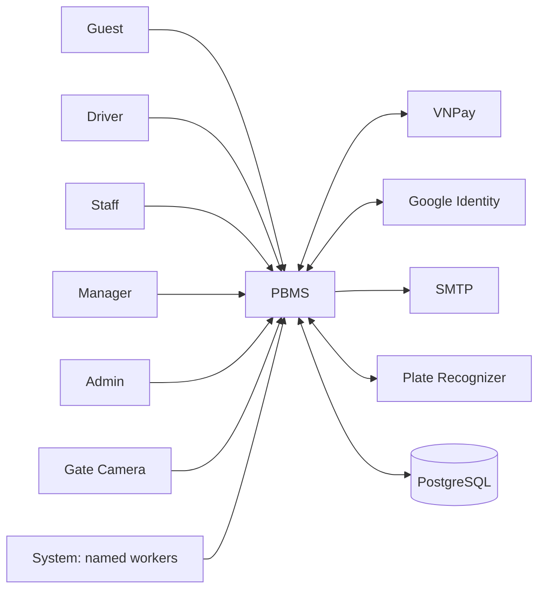
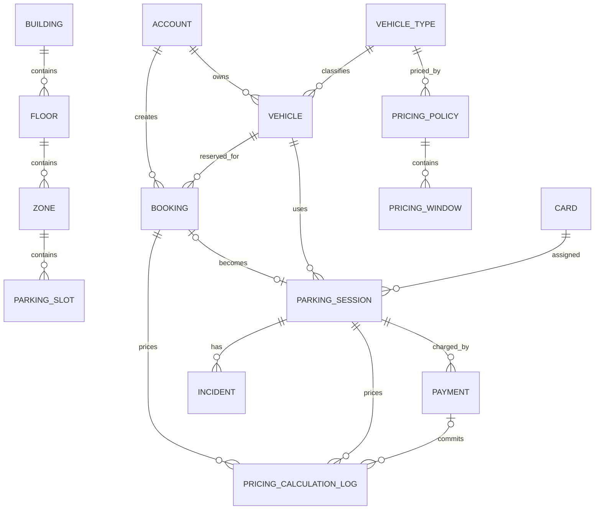
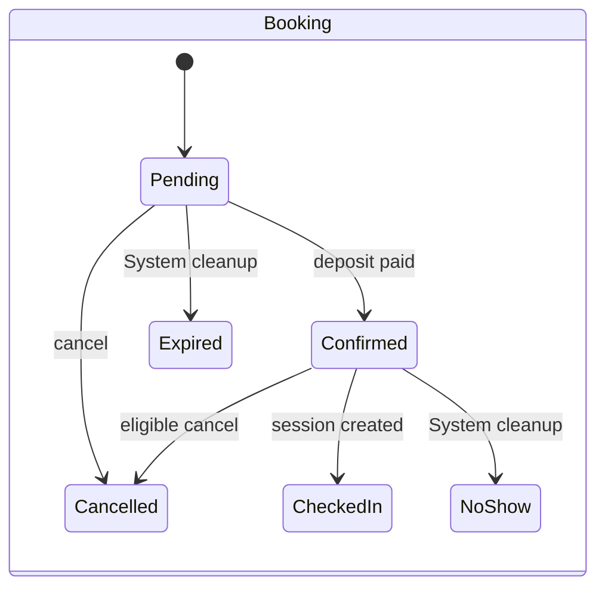
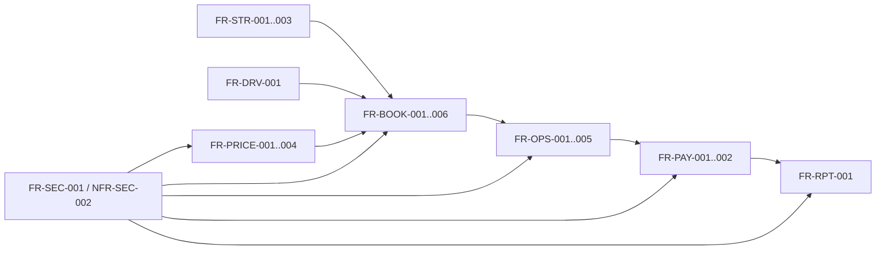

# Parking Building Management System

## Software Requirements Specification

Version 1.4 - REVIEW

This Tier 2 SRS defines the PBMS release baseline after the scope decisions in CR-GEN-003. Current code remains implementation evidence, but the direct product decisions in Section 17 take precedence where remediation or removal is required. An implemented UI without a compatible API, or an API without a completed and authorized release surface, is not claimed as a completed current capability.

## Table Of Contents

- [0. Document Control](#0-document-control)
- [1. Introduction](#1-introduction)
- [2. Overall Description](#2-overall-description)
- [3. Stakeholders, Actors And External Systems](#3-stakeholders-actors-and-external-systems)
- [4. Business Context](#4-business-context)
- [5. Product Features](#5-product-features)
- [6. Use Case Specifications](#6-use-case-specifications)
- [7. Business Rules](#7-business-rules)
- [8. Functional Requirements](#8-functional-requirements)
- [9. Data Requirements And Data Model](#9-data-requirements-and-data-model)
- [10. External Interface Requirements](#10-external-interface-requirements)
- [11. Non-Functional Requirements](#11-non-functional-requirements)
- [12. Access Control Requirements](#12-access-control-requirements)
- [13. State Models](#13-state-models)
- [14. Error Handling And Edge Cases](#14-error-handling-and-edge-cases)
- [15. Acceptance Criteria And Verification](#15-acceptance-criteria-and-verification)
- [16. Requirements Traceability](#16-requirements-traceability)
- [17. Open Questions, Decisions And Risks](#17-open-questions-decisions-and-risks)
- [18. Appendices](#18-appendices)
- [19. Requirement Identification Convention](#19-requirement-identification-convention)
- [20. Requirement Status Convention](#20-requirement-status-convention)
- [21. SRS Review Checklist](#21-srs-review-checklist)
- [22. Approval](#22-approval)

## 0. Document Control

> Last Updated: 2026-07-20 | Status: REVIEW | Author: PBMS Analysis Team

### 0.1 Document Information

| Field | Value |
|---|---|
| Document ID | PBMS-SRS |
| Product | Parking Building Management System (PBMS) |
| Version | 1.4 |
| Status | REVIEW |
| SRS tier | Tier 2 - multiple internal roles and external integrations |
| Change request | CR-GEN-003 |
| Canonical file | `PBMS-SRS/PBMS_SRS_Document.md` |
| Code cutoff | 2026-07-20 |

### 0.2 Revision History

| Version | Date | Status | Change Request | Description |
|---|---|---|---|---|
| 1.0 | 2026-06-15 | REVIEW | Historical | Initial consolidated SRS. |
| 1.1 | 2026-07-12 | REVIEW | Historical | Added booking, pricing, payment, and operational detail. |
| 1.2 | 2026-07-18 | REVIEW | CR-GEN-001 | Reconciled major behavior and deprecated Monthly Subscription. |
| 1.3 | 2026-07-20 | REVIEW | CR-GEN-002 | Re-baselined against current code; adopted the kit's 22-section structure; added Shift Report and password-recovery gaps; corrected pricing scope, actor names, workers, traceability, access control, and validation; incorporated the latest multi-building Driver parking map and incident-category UI. |
| 1.4 | 2026-07-20 | REVIEW | CR-GEN-003 | Resolved ambiguous feature scope; defined direct-JWT login and recovery remediation; retained Grace Period; removed Refund, Monthly Subscription, incident file upload, and automatic retry; excluded Notification and Shift Report from the current release; defined RBAC and pricing-log remediation. |

### 0.3 Review And Approval

| Role | Name | Decision | Date |
|---|---|---|---|
| Product Owner | [TBD] | Pending | [TBD] |
| Technical Lead | [TBD] | Pending | [TBD] |
| Security Reviewer | [TBD] | Pending | [TBD] |
| QA Lead | [TBD] | Pending | [TBD] |

No item in version 1.4 is APPROVED. Human approval is required to move any reviewed baseline to APPROVED.

### 0.4 Change Request And Impact Analysis

CR-GEN-003 records the direct product decisions that resolve the ambiguous and partial capabilities identified during code review. Its impact is:

| Area | Change | Impact |
|---|---|---|
| Authentication | Standardized current login as direct JWT; kept login MFA outside the release; specified recovery-specific OTP/token remediation | F-ACC-001..002, UC-ACC-001..002, FR-ACC-002..004 |
| Payments | Removed refund capability, states, rules, and acceptance scope | F-PAY-001, UC-PAY-001, FR-PAY-003, state model |
| Pricing | Kept Grace Period in the active Pricing Engine and defined the committed-calculation logging boundary | BR-FEE-007, FR-PRICE-003..004, PricingCalculationLog |
| Removed capability | Required complete removal of Monthly Subscription and automatic API retry | FR-MONTH-001, NFR-PERF-001, migration scope |
| Release exclusions | Excluded user Notification and Shift Report while permitting non-exposed future backend code | FR-NOTIF-001, FR-RPT-002, active ERD/process/state scope |
| Incidents | Removed file evidence from the release and allowed every active Incident Type for an owned active session | UC-INC-001, FR-INC-001 |
| Security | Required complete server-side RBAC and ownership enforcement | NFR-SEC-002, Section 12, RISK-SEC-001 |

## 1. Introduction

> Last Updated: 2026-07-20 | Status: REVIEW | Author: PBMS Analysis Team

### 1.1 Purpose

This SRS defines the current functional, data, interface, access-control, and quality requirements of PBMS for product review, implementation, testing, deployment, and controlled change.

### 1.2 Scope

#### 1.2.1 In Scope

- registration, direct-JWT authentication, password recovery, account session handling, and vehicle management;
- parking structure and capacity configuration;
- booking, allocation, check-in, parking-session, checkout, and exceptional exit flows;
- pricing policies including Grace Period, committed calculation logging, and cash/VNPay payments;
- text-only incidents, all active Incident Types for Driver reporting, penalty configuration, cards, blacklists, dashboards, revenue, and audit logs;
- camera capture, Plate Recognizer OCR, SMTP, Google identity, and approved cleanup workers;
- server-side role and ownership enforcement for every non-public endpoint.

#### 1.2.2 Out Of Scope

- automated physical barrier control;
- guaranteed OCR accuracy;
- login OTP/MFA in the current frontend or current authentication flow;
- Refund, refund approval, `REFUND_PENDING`, and `REFUNDED` behavior;
- Monthly Subscription and legacy subscription compatibility;
- user Notification center, unread state, notification delivery, or notification worker behavior;
- incident image/file evidence upload;
- automatic client API retry;
- Shift Report and shift handover.

#### 1.2.3 Future Scope

- optional product-approved login MFA;
- user Notification and Shift Report capabilities behind a separately approved future change;
- removal migrations for Refund and Monthly Subscription artifacts;
- production privacy retention, backup, recovery, and accessibility targets.

### 1.3 Intended Audience

Product owners, business analysts, developers, QA engineers, security reviewers, parking operators, deployment engineers, and maintainers.

### 1.4 Definitions, Acronyms And Abbreviations

| Term | Meaning |
|---|---|
| PBMS | Parking Building Management System; the single name used for synchronous system behavior. |
| System | Non-human automated execution; the current release runs booking-expiry and pricing-policy-expiry cleanup only. |
| Booking | A planned parking interval created before entry. |
| Walk-in | A parking session without a booking. |
| Buffer time | Configurable separation used by service-level overlap checks. |
| Zone booking limit rate | Percentage of zone capacity available to bookings. |
| OCR | Optical character recognition. |
| IPN | VNPay server-to-server payment notification. |
| UTC+7 | Vietnam business time used by current pricing and revenue logic. |
| Dormant | Persisted or coded but not reached by an active end-to-end flow. |
| Deprecated | Retained for history and traceability but excluded from active acceptance. |

### 1.5 References

| Source ID | Source | Baseline and use |
|---|---|---|
| REF-GEN-001 | `parking-system-web` | Commit `8e10c2a76...`; routes, UI, client behavior, package versions |
| REF-GEN-002 | `parking-system-api/src/PBMS.API` and `src/PBMS.Application` | Commit `daf8dfb624...`; endpoints, services, validation, workers |
| REF-GEN-003 | `parking-system-api/src/PBMS.Domain`, `src/PBMS.Infrastructure`, migrations, tests | Commit `daf8dfb624...`; rules, data, persistence, integration |
| REF-GEN-004 | Direct user decisions, 2026-07-20 | Code is the current truth; overwrite this file; normalize actors and worker naming; CR-GEN-003 scope decisions |
| REF-GEN-005 | `Diagrams/PBMS_Business_Analysis.md` | Detailed business analysis aligned to current code |
| REF-GEN-006 | `Diagrams/PBMS_Business_Analysis_Simplified.md` | Simplified layout and summary diagrams |
| REF-GEN-007 | SRS Kit Agent/Core/Context/SRS workflow files | Authoring, output, status, traceability, and validation rules |
| REF-GEN-008 | `PBMS_Remediation_Decision_Report.md` | Team implementation direction, ownership, and release exit criteria for CR-GEN-003 |

Priority order for this revision is REF-GEN-004, current code sources REF-GEN-001 through REF-GEN-003, current analysis REF-GEN-005 through REF-GEN-006, then historical SRS text.

### 1.6 Document Overview

Sections 2 through 8 define context, actors, features, use cases, rules, and functional requirements. Sections 9 through 14 define data, interfaces, quality, access, states, and errors. Sections 15 through 22 define verification, traceability, governance, conventions, review, and approval.

## 2. Overall Description

> Last Updated: 2026-07-20 | Status: REVIEW | Author: PBMS Analysis Team

### 2.1 Product Perspective

PBMS is a browser-based parking-management product composed of a Next.js web client and an ASP.NET Core REST API using Clean Architecture and PostgreSQL.

#### 2.1.1 System Boundary

The PBMS boundary includes web role workspaces, API controllers, application services, domain rules, persistence, background workers, and external-service adapters. VNPay, Google, SMTP, Plate Recognizer, camera hardware, and the browser runtime are outside that boundary.

#### 2.1.2 Context Diagram

### 2.2 Product Functions

PBMS maintains accounts, vehicles, facilities, bookings, sessions, prices, payments, text-only incidents, cards, blacklists, revenue reports, and audit records. It supports gate OCR with manual fallback and runs approved expiry cleanup automatically.

### 2.3 User Classes And Characteristics

| User class | Characteristics and responsibility |
|---|---|
| Guest | Registers, verifies registration email, and signs in. |
| Driver | Manages own vehicles, bookings, sessions, payments, and history. |
| Staff | Operates entry/exit, card, incident, and blacklist activities. |
| Manager | Manages facilities, pricing, operations, and reports. |
| Admin | Manages accounts, configuration, audit, and selected master/operational data. |
| System | Executes approved non-human scheduled booking and pricing-policy cleanup. |

### 2.4 Operating Environment

| Component | Current baseline |
|---|---|
| Web | Next.js 15.1.6, React 18.3.1, TypeScript 5.7.2, Tailwind CSS 3.4.17 |
| API | .NET 10 and ASP.NET Core controllers |
| Persistence | EF Core 10, Npgsql, PostgreSQL |
| Identity | JWT bearer, BCrypt, Google identity |
| Cache/integration | StackExchange Redis package, SMTP, VNPay, Plate Recognizer |

### 2.5 Design And Implementation Constraints

- Camera capture requires browser media permission and a secure context except localhost.
- PostgreSQL must support `btree_gist` for the slot-booking exclusion constraint.
- Frontend route guards are not an authorization boundary.
- External credentials and secrets must not remain in production source configuration.
- Frontend API base URL must match backend `/api` controller routes.
- Current active pricing uses `IPricingCalculationService` and the domain `PricingEngine`; Grace Period must be applied there before the legacy fee service is retired.

### 2.6 Assumptions And Dependencies

- Master data and role data exist before operations begin.
- Staff can correct or manually enter a plate when OCR is unavailable or inaccurate.
- VNPay settlement depends on valid signed gateway data.
- Current code behavior may contain gaps; this SRS exposes those gaps and does not silently promote them to approved requirements.

## 3. Stakeholders, Actors And External Systems

> Last Updated: 2026-07-20 | Status: REVIEW | Author: PBMS Analysis Team

### 3.1 Stakeholders

| Stakeholder | Concern |
|---|---|
| Parking operator | Safe, fast entry/exit and accountable cash handling |
| Driver | Predictable booking, parking, price, and payment experience |
| Management | Capacity, pricing, revenue, incidents, and audit oversight |
| Administration | Identity, configuration, access, audit, and maintainability |
| Development and QA | Testable behavior, stable IDs, and source traceability |
| Security and Legal | Server authorization, secrets, privacy, and retention |

### 3.2 Actors

| Actor ID | Actor | Type | Responsibilities |
|---|---|---|---|
| ACT-GUEST | Guest | Human | Register and authenticate |
| ACT-DRV | Driver | Human/internal user | Own vehicles, bookings, sessions, and payments |
| ACT-STAFF | Staff | Human/internal user | Gate and incident operations |
| ACT-MGR | Manager | Human/internal user | Facility, pricing, operational, and report management |
| ACT-ADMIN | Admin | Human/internal user | Accounts, configuration, audit, and administrative management |
| ACT-SYS | System | Non-human | Run `ExpiredBookingCleanupWorker` and `ExpiredPricingPolicyCleanupWorker`; Notification-only and Shift Report workers are excluded from this release |

### 3.3 Actor Permission Overview

| Capability | Guest | Driver | Staff | Manager | Admin | System |
|---|---:|---:|---:|---:|---:|---:|
| Register/login | X | X | X | X | X | - |
| Own vehicles/bookings/sessions | - | X | - | - | - | - |
| Gate check-in/checkout | - | - | X | Operational view | Operational view | - |
| Manage parking structure | - | - | - | X | X | - |
| Create/edit/activate pricing policy | - | - | - | X | X | - |
| Expire pricing policy automatically | - | - | - | - | - | X |
| Handle incidents/cards/blacklists | - | - | X | X | X | - |
| Manage accounts/audit/configuration | - | - | - | Limited | X | - |

This table states the intended business boundary evidenced by routes and service names. Section 12 records where API enforcement does not yet meet it.

### 3.4 External Systems

| External system | Direction | Purpose | Failure fallback |
|---|---|---|---|
| VNPay | Two-way | Online payment URL, IPN, browser return | Keep payment non-paid and report controlled failure |
| Plate Recognizer | Two-way | License-plate candidate from image | Staff manual entry/correction |
| SMTP | Outbound | Registration and password-recovery OTP email | No unverified account or unverified password change is created |
| Google Identity | Inbound verification | Google login/registration | Reject invalid identity data |
| Browser camera | Inbound | Entry/exit image capture | Manual plate path |
| PostgreSQL | Two-way | Persistent source of truth | Controlled API failure; recovery policy is open |

## 4. Business Context

> Last Updated: 2026-07-20 | Status: REVIEW | Author: PBMS Analysis Team

### 4.1 Problem Statement

Parking operations require consistent capacity control, reservation, gate processing, pricing, payment, incident handling, and accountability across several roles. Manual or fragmented handling creates conflicts, incorrect fees, slow exits, and weak auditability.

### 4.2 Business Goals

| Goal ID | Goal |
|---|---|
| BG-001 | Prevent conflicting bookings and active resource assignments. |
| BG-002 | Reduce gate-processing effort while retaining staff verification. |
| BG-003 | Calculate transparent charges from active policies and incidents. |
| BG-004 | Preserve payment and operational traceability. |
| BG-005 | Give managers current capacity, revenue, and audit information. |
| BG-006 | Enforce role and ownership boundaries at the server. |

### 4.3 Success Criteria

| Criterion ID | Measure |
|---|---|
| SC-001 | Concurrent requests persist no overlapping active booking for the same concrete slot. |
| SC-002 | Each completed session has a consistent vehicle, card, allocation, charge, and payment outcome. |
| SC-003 | Revenue queries include only PAID payments and use UTC+7 business dates. |
| SC-004 | Every Must requirement has passing automated or approved manual evidence. |
| SC-005 | Anonymous, wrong-role, and wrong-owner tests pass for every non-public endpoint before production. |

### 4.4 Current Workflow

Drivers can register, book, pay deposits, view parking data, and submit text-only incidents. Staff operate entry and exit. Managers configure facilities and pricing. PBMS calculates charges and records payment. System performs approved expiry cleanup. The implementation gaps against this decided baseline are listed in Section 17 and `PBMS_Remediation_Decision_Report.md`.

### 4.5 Target Workflow

The accepted target uses direct-JWT login, completes password recovery, activates Grace Period in the current Pricing Engine, enforces server authorization, and logs committed price calculations. Refund, Monthly Subscription, user Notification, incident file upload, automatic API retry, and Shift Report are excluded as specified by CR-GEN-003.

## 5. Product Features

> Last Updated: 2026-07-20 | Status: REVIEW | Author: PBMS Analysis Team

### 5.1 Feature List

| Feature ID | Feature | Primary actors | Priority | Status |
|---|---|---|---|---|
| F-ACC-001 | Registration and authentication | Guest, all human roles | Must | REVIEW |
| F-ACC-002 | Password recovery | Guest | Must | REVIEW |
| F-DRV-001 | Driver vehicle management | Driver | Must | REVIEW |
| F-STR-001 | Parking structure and capacity | Manager, Admin | Must | REVIEW |
| F-BOOK-001 | Booking lifecycle | Driver, Staff, System | Must | REVIEW |
| F-OPS-001 | Entry, OCR, allocation, and session | Staff, Driver | Must | REVIEW |
| F-OPS-002 | Checkout and exceptional exit | Staff | Must | REVIEW |
| F-PRICE-001 | Pricing policy administration | Manager, Admin, System | Must | REVIEW |
| F-PRICE-002 | Charge calculation | PBMS | Must | REVIEW |
| F-PAY-001 | Cash and VNPay payment processing | Driver, Staff, VNPay | Must | REVIEW |
| F-INC-001 | Incidents, penalties, cards, and blacklists | Staff, Manager, Admin | Must | REVIEW |
| F-RPT-001 | Monitoring, revenue, and audit | Staff, Manager, Admin | Should | REVIEW |
| F-RPT-002 | Shift Report | None | Won't | DEPRECATED |
| F-CFG-001 | Dynamic configuration | Admin, Manager | Should | REVIEW |
| F-SEC-001 | Role and permission management | Admin, PBMS | Must | REVIEW |
| F-MONTH-001 | Monthly Subscription | None | Won't | DEPRECATED |

### 5.2 Feature Details

| Feature | Trigger and outcome | Current completeness |
|---|---|---|
| F-ACC-001 | Registration verifies email; password/Google login produces a JWT session | Direct-JWT target; visible login-OTP branch must be removed |
| F-ACC-002 | User completes a recovery-specific OTP challenge and replaces a password | Remediation required; current frontend and API are incompatible |
| F-DRV-001 | Driver creates or maintains a normalized vehicle identity | Implemented API/UI flow |
| F-STR-001 | Manager/Admin maintains Building > Floor > Zone > Slot | Implemented; many controllers lack explicit server roles |
| F-BOOK-001 | Driver requests an interval and completes deposit | Implemented with multi-building/floor slot map, cleanup, and DB exclusion support |
| F-OPS-001/F-OPS-002 | Staff captures plate, checks in, then settles and checks out | Implemented with manual and exceptional paths |
| F-PRICE-001/F-PRICE-002 | Manager/Admin manages vehicle-type policies; PBMS calculates and logs committed fees | Grace Period and committed-log remediation required; no BuildingId |
| F-PAY-001 | Cash completes synchronously or VNPay verifies signed result | Refund behavior must be removed |
| F-INC-001 | Staff/management handles operational exceptions and restrictions | Implemented surfaces; authorization incomplete |
| F-RPT-001 | PBMS calculates dashboard/revenue data and exposes audit logs | Implemented; endpoint authorization varies |
| F-RPT-002 | Shift Report and shift handover | Excluded from current release; backend may remain non-exposed future code |
| F-CFG-001 | Management changes runtime parking configuration | Implemented API; validation and roles require review |
| F-SEC-001 | Admin maps stable permissions to roles; PBMS enforces permission and ownership | Remediation required; current entities are not consistently consumed by endpoint authorization |
| F-MONTH-001 | Subscription purchase/renewal or compatibility | Must be removed from the project after a reviewed migration |

## 6. Use Case Specifications

> Last Updated: 2026-07-20 | Status: REVIEW | Author: PBMS Analysis Team

### 6.1 Use Case Overview

| Use case ID | Name | Primary actor | Feature | Status |
|---|---|---|---|---|
| UC-ACC-001 | Register and authenticate | Guest | F-ACC-001 | REVIEW |
| UC-ACC-002 | Recover password | Guest | F-ACC-002 | REVIEW |
| UC-DRV-001 | Manage vehicle | Driver | F-DRV-001 | REVIEW |
| UC-STR-001 | Manage parking structure | Manager/Admin | F-STR-001 | REVIEW |
| UC-BOOK-001 | Create and pay booking | Driver | F-BOOK-001 | REVIEW |
| UC-OPS-001 | Check in and allocate | Staff | F-OPS-001 | REVIEW |
| UC-SESSION-001 | View or extend session | Driver/Staff | F-OPS-001 | REVIEW |
| UC-OPS-002 | Check out vehicle | Staff | F-OPS-002 | REVIEW |
| UC-PRICE-001 | Manage pricing policy | Manager/Admin/System | F-PRICE-001 | REVIEW |
| UC-PRICE-002 | Calculate parking charge | PBMS | F-PRICE-002 | REVIEW |
| UC-PAY-001 | Complete payment | Driver/Staff/VNPay | F-PAY-001 | REVIEW |
| UC-INC-001 | Handle incident and restriction | Staff/Manager/Admin | F-INC-001 | REVIEW |
| UC-RPT-001 | Monitor, report, and audit | Staff/Manager/Admin | F-RPT-001 | REVIEW |
| UC-RPT-002 | Submit and review Shift Report | None | F-RPT-002 | DEPRECATED |
| UC-MONTH-001 | Purchase Monthly Subscription | None | F-MONTH-001 | DEPRECATED |
| UC-SEC-001 | Manage role permissions | Admin | F-SEC-001 | REVIEW |

### 6.2 Use Case Details

#### UC-ACC-001 Register And Authenticate

- **Preconditions**: Email and username are not already used for registration; external identity is valid when Google is selected.
- **Trigger**: Guest submits registration or login.
- **Main flow**: PBMS sends/verifies registration OTP, creates a verified account, validates password or Google identity, and issues a JWT session directly without a login-OTP challenge.
- **Alternatives**: Duplicate identity, expired/incorrect OTP, failed Google verification, or invalid credentials are rejected.
- **Postconditions**: A verified account or authenticated session exists; otherwise no invalid account/session is created.

#### UC-ACC-002 Recover Password

- **Preconditions**: User is on the forgot-password route.
- **Trigger**: User submits email, OTP, and new password.
- **Main flow**: PBMS accepts a recovery request with a generic response, verifies a recovery-specific OTP, issues a short-lived single-use recovery token, and consumes it to store a new BCrypt password hash.
- **Gap**: The current frontend uses registration OTP endpoints and calls an absent reset endpoint. AUTH-02 in `PBMS_Remediation_Decision_Report.md` must be completed before acceptance.
- **Postconditions**: After remediation, the old password fails, the new password succeeds, and the recovery token cannot be replayed.

#### UC-DRV-001 Manage Vehicle

- **Preconditions**: Driver is authenticated.
- **Trigger**: Driver creates, updates, lists, or removes a vehicle.
- **Main flow**: PBMS validates vehicle type and normalized plate and persists the driver's vehicle.
- **Postconditions**: Vehicle data is available to booking and gate operations.

#### UC-STR-001 Manage Parking Structure

- **Primary actors**: Manager, Admin.
- **Main flow**: Maintain Building, Floor, Zone, and ParkingSlot hierarchy; configure vehicle type, booking limit, and operational slot state.
- **Postconditions**: Capacity and availability queries reflect active structure data.

#### UC-BOOK-001 Create And Pay Booking

- **Preconditions**: Driver, vehicle, building, time interval, and capacity are valid.
- **Main flow**: PBMS checks lead time, duration, conflicts, and capacity; creates Pending booking; creates estimated deposit; confirms after payment.
- **Alternatives**: Cars may select an available slot from the selected building/floor map; motorbikes use a general zone without a concrete slot; expired unpaid bookings are processed by System; cancellation changes Booking state without initiating a refund.
- **Postconditions**: Booking is Pending, Confirmed, Cancelled, Expired, CheckedIn, or NoShow.

#### UC-OPS-001 Check In And Allocate

- **Primary actor**: Staff.
- **Main flow**: Capture or enter plate, optionally use OCR, validate booking/vehicle/card/blacklist/resource conditions, allocate zone or slot, and create an active session.
- **Postconditions**: Vehicle, card, allocation, optional booking, entry image, and staff actor are linked consistently.

#### UC-SESSION-001 View Or Extend Session

- **Primary actors**: Driver, Staff.
- **Main flow**: Query current session and price estimate; extend eligible session after validating overlap/capacity rules.

#### UC-OPS-002 Check Out Vehicle

- **Primary actor**: Staff.
- **Main flow**: Identify active session, capture/verify exit plate, calculate final charge and penalties, settle payment or record unpaid exit, then release card and allocation.
- **Alternatives**: Plate mismatch, lost card, and lost-card rollback require controlled handling.

#### UC-PRICE-001 Manage Pricing Policy

- **Primary actors**: Manager and Admin for human actions; System for scheduled expiry.
- **Main flow**: Manager/Admin creates, edits, activates, and maintains vehicle-type policies and windows including Priority. System runs `ExpiredPricingPolicyCleanupWorker` every 12 hours to deactivate expired active policies.
- **Constraint**: Staff does not administer policies. Current `PricingPolicy` has `VehicleTypeId` and no `BuildingId`.

#### UC-PRICE-002 Calculate Parking Charge

- **Primary actor**: PBMS.
- **Main flow**: Select applicable policy, apply base/increment/Grace Period/cap rules and eligible incident penalties, and return a breakdown. Persist a calculation log when the result creates or changes a payable amount.
- **Alternative**: Missing or false `APPLY_SEGMENTED_PRICING` keeps non-segmented policy selection.

#### UC-PAY-001 Complete Payment

- **Main flow**: Create payment; complete cash immediately or verify VNPay; invalidate older pending duplicates.
- **Postconditions**: Payment state and associated booking/session are consistent.

#### UC-INC-001 Handle Incident And Restriction

- **Main flow**: Driver may report a text description for an active owned-vehicle session using any active Incident Type returned by PBMS; authorized operational users maintain incidents, penalties, card status, and blacklists and apply current restrictions during gate/pricing operations.
- **Constraint**: The current release accepts no image, file, filename, evidence URL, or attachment. PBMS must validate active type and session ownership on the server.

#### UC-RPT-001 Monitor, Report, And Audit

- **Main flow**: Query operational summaries, calculate revenue from PAID payments using UTC+7 groupings, and review permitted audit records.

#### UC-RPT-002 Submit And Review Shift Report

- **Status**: DEPRECATED for the current release.
- **Reason**: Shift Report and shift handover are not exposed, executed, diagrammed, or accepted in this release. Backend code may remain only as non-exposed future code.

#### UC-MONTH-001 Purchase Monthly Subscription

- **Status**: DEPRECATED.
- **Reason**: Product decision requires complete project removal rather than continued compatibility. Historical IDs remain reserved for traceability.

#### UC-SEC-001 Manage Role Permissions

- **Primary actor**: Admin.
- **Main flow**: Admin views stable Permission codes, changes RolePermission mappings, and PBMS validates and persists the mapping before invalidating or versioning the authorization cache.
- **Constraint**: PBMS must preserve at least one Admin access path capable of managing role permissions.
- **Postconditions**: Subsequent non-public requests are allowed only when the authenticated role has the endpoint Permission and any required resource ownership check passes.

## 7. Business Rules

> Last Updated: 2026-07-20 | Status: REVIEW | Author: PBMS Analysis Team

### 7.1 Business Rule Catalogue

| Rule ID | Rule | Status | Source |
|---|---|---|---|
| BR-ACC-001 | Registration OTP has six digits and expires after five minutes. | REVIEW | REF-GEN-002 |
| BR-ACC-002 | OTP resend cooldown is sixty seconds. | REVIEW | REF-GEN-002 |
| BR-ACC-003 | Five failed OTP verifications cause a fifteen-minute lockout. | REVIEW | REF-GEN-002 |
| BR-ACC-004 | Registration verification token expires after ten minutes. | REVIEW | REF-GEN-002 |
| BR-ACC-005 | Password recovery OTP/token uses a distinct purpose, is short-lived and single-use, and does not reveal whether an email exists. | REVIEW | REF-GEN-004, REF-GEN-008 |
| BR-BOOK-001 | Booking lead time is at least fifteen minutes. | REVIEW | REF-GEN-002 |
| BR-BOOK-002 | Booking duration is at least four hours. | REVIEW | REF-GEN-002 |
| BR-BOOK-003 | Booking payment deadline is fifteen minutes after creation. | REVIEW | REF-GEN-002 |
| BR-BOOK-004 | Confirmed booking check-in grace is thirty minutes after planned check-in. | REVIEW | REF-GEN-002 |
| BR-BOOK-005 | Only cars may select a concrete slot during booking. | REVIEW | REF-GEN-002 |
| BR-BOOK-006 | Default slot booking buffer is thirty minutes. | REVIEW | REF-GEN-003 |
| BR-BOOK-007 | Default near-term walk-in threshold is two hours. | REVIEW | REF-GEN-003 |
| BR-BOOK-008 | Zone booking limit is 1..100 percent and defaults to 80. | REVIEW | REF-GEN-002, REF-GEN-003 |
| BR-BOOK-009 | Effective capacity subtracts the ceiling of the vehicle-type buffer ratio. | REVIEW | REF-GEN-002 |
| BR-BOOK-010 | Booking deposit equals the estimate for the full planned interval. | REVIEW | REF-GEN-002 |
| BR-BOOK-011 | Booking cancellation changes Booking state without initiating or recording a refund. | REVIEW | REF-GEN-004, REF-GEN-008 |
| BR-ALLOC-001 | A vehicle cannot have two active sessions. | REVIEW | REF-GEN-002 |
| BR-ALLOC-002 | A card cannot serve two active sessions. | REVIEW | REF-GEN-002 |
| BR-ALLOC-003 | A slot cannot serve overlapping active use. | REVIEW | REF-GEN-002, REF-GEN-003 |
| BR-FEE-001 | Missing or false `APPLY_SEGMENTED_PRICING` selects non-segmented pricing. | REVIEW | REF-GEN-002 |
| BR-FEE-002 | Segmented candidates order by Priority, EffectiveStart, then ID descending. | REVIEW | REF-GEN-002 |
| BR-FEE-003 | A partial increment applies only when its threshold percentage is reached. | REVIEW | REF-GEN-002 |
| BR-FEE-004 | Daily-cap boundaries use Vietnam calendar days. | REVIEW | REF-GEN-002 |
| BR-FEE-005 | Open or Processing incident penalties are included in current pricing. | REVIEW | REF-GEN-002 |
| BR-FEE-006 | Policy overlap validation compares policies of the same priority. | REVIEW | REF-GEN-002 |
| BR-FEE-007 | Excess duration up to and including the configured Grace Period does not create the next increment charge; chargeable excess begins after Grace Period. | REVIEW | REF-GEN-004, REF-GEN-008 |
| BR-LOG-001 | Preview-only price calculation returns a breakdown without persisting PricingCalculationLog. | REVIEW | REF-GEN-004, REF-GEN-008 |
| BR-LOG-002 | A persisted payable amount creates exactly one correlated PricingCalculationLog in the same successful operation. | REVIEW | REF-GEN-004, REF-GEN-008 |
| BR-LOG-003 | Idempotent replay does not create a duplicate committed calculation log. | REVIEW | REF-GEN-004, REF-GEN-008 |
| BR-PAY-001 | A newer payment invalidates older Pending payments for the same booking/session. | REVIEW | REF-GEN-002 |
| BR-PAY-002 | CASH settles synchronously; ONLINE_BANKING settles after VNPay verification. | REVIEW | REF-GEN-002 |
| BR-PAY-003 | [DEPRECATED] Refund state transitions are removed from the PBMS release and project. | DEPRECATED | REF-GEN-004, REF-GEN-008 |
| BR-PAY-004 | Revenue includes only PAID payments. | REVIEW | REF-GEN-002 |
| BR-SHIFT-001..005 | [DEPRECATED] Shift Report rules are excluded from the current release. | DEPRECATED | REF-GEN-004, REF-GEN-008 |

### 7.2 Business Rule Details

#### Booking Timing Decision Table

| Condition | Result |
|---|---|
| Start is less than 15 minutes away | Reject creation |
| Duration is less than 4 hours | Reject creation |
| Pending payment exceeds 15 minutes | System expires booking |
| Confirmed booking exceeds check-in plus 30 minutes | System marks no-show |
| Pending or Confirmed Booking is eligible for cancellation | Booking becomes Cancelled; no refund state is created |

#### Pricing Selection Order

When segmented pricing is enabled, PBMS selects applicable vehicle-type policies by Priority descending, EffectiveStart descending, then identifier descending. PBMS applies configured Grace Period in the active Pricing Engine before charging the next increment block. Policy administration is performed by Manager/Admin. `ExpiredPricingPolicyCleanupWorker` is System behavior, not Staff behavior.

#### Deprecated Rule Families

BR-SHIFT-001 through BR-SHIFT-005, BR-MONTH-001 through BR-MONTH-024, and BR-PAY-003 remain reserved and DEPRECATED. Historical or removed rule IDs must not be reassigned.

## 8. Functional Requirements

> Last Updated: 2026-07-20 | Status: REVIEW | Author: PBMS Analysis Team

### 8.1 Functional Requirement Catalogue

| Domain | Requirement IDs | Count |
|---|---|---:|
| Identity and driver | FR-ACC-001..004, FR-DRV-001 | 5 |
| Structure and booking | FR-STR-001..003, FR-BOOK-001..006 | 9 |
| Entry/session/exit | FR-OPS-001..005, FR-ALLOC-001, FR-SESSION-001..002 | 8 |
| Pricing/payment | FR-PRICE-001..004, FR-PAY-001..002 | 6 |
| Operations/reporting/config/security | FR-INC-001, FR-CARD-001, FR-BLK-001, FR-RPT-001, FR-AUD-001, FR-CFG-001, FR-SEC-001 | 7 |
| Deprecated | FR-PAY-003, FR-RPT-002, FR-NOTIF-001, FR-MONTH-001 | 4 |

### 8.2 Functional Requirement Details

#### FR-ACC-001 Registration Email Verification

- **Statement**: When a Guest registers by password, PBMS shall verify a valid registration OTP before creating the account.
- **Priority**: Must
- **Status**: REVIEW
- **Source**: REF-GEN-001, REF-GEN-002; BR-ACC-001..004
- **Rationale**: Prevent unverified password accounts.
- **Acceptance Criteria**: Valid OTP/token creates the account; expired, locked, invalid, or duplicate input does not.
- **Dependencies**: SMTP, OTP cache/state.
- **Notes**: Google registration follows its identity/verification path.

#### FR-ACC-002 Password And Google Authentication

- **Statement**: When valid password or Google credentials are submitted, PBMS shall return an authenticated JWT session for the matching active account.
- **Priority**: Must
- **Status**: REVIEW
- **Source**: REF-GEN-001, REF-GEN-002
- **Rationale**: Establish authenticated identity.
- **Acceptance Criteria**: Valid active account receives a token; invalid, inactive, or unverified identity is rejected.
- **Dependencies**: JWT settings, BCrypt, Google identity.
- **Notes**: Current release login is direct JWT. Login OTP/MFA is not exposed; dormant backend code may remain for a future change.

#### FR-ACC-003 Client Session Handling

- **Statement**: While an authenticated web session is active, PBMS shall attach its bearer token to API requests and clear local authentication after HTTP 401.
- **Priority**: Must
- **Status**: REVIEW
- **Source**: REF-GEN-001
- **Rationale**: Maintain consistent browser authentication state.
- **Acceptance Criteria**: Protected request contains token; 401 removes local session and requires login.
- **Dependencies**: Web API wrapper, browser storage.
- **Notes**: Server authorization remains required.

#### FR-ACC-004 Password Recovery

- **Statement**: When a Guest completes a valid recovery challenge, PBMS shall replace the password for the matching existing account.
- **Priority**: Must
- **Status**: REVIEW
- **Source**: REF-GEN-001, REF-GEN-002
- **Rationale**: Restore account access safely.
- **Acceptance Criteria**: End-to-end tests prove a generic request response, existing-email recovery, expiry, lockout, password replacement, old-password rejection, and token replay rejection.
- **Dependencies**: Recovery-specific request, verify, and reset endpoints; SMTP; OTP/token state.
- **Notes**: Not currently satisfied. Registration OTP methods must not be reused; implement AUTH-02 from REF-GEN-008.

#### FR-DRV-001 Vehicle Management

- **Statement**: When a Driver maintains a vehicle, PBMS shall validate ownership, vehicle type, and normalized plate identity before persisting the change.
- **Priority**: Must
- **Status**: REVIEW
- **Source**: REF-GEN-001, REF-GEN-002
- **Rationale**: Provide reliable identity for booking and gates.
- **Acceptance Criteria**: Owned valid vehicles can be listed/changed; duplicate or unauthorized changes are rejected.
- **Dependencies**: Account, VehicleType.
- **Notes**: Ownership enforcement requires endpoint security coverage.

#### FR-STR-001 Facility Hierarchy Management

- **Statement**: When Manager or Admin changes parking structure, PBMS shall preserve the Building-Floor-Zone-ParkingSlot hierarchy and referenced vehicle type.
- **Priority**: Must
- **Status**: REVIEW
- **Source**: REF-GEN-001..003
- **Rationale**: Maintain capacity source data.
- **Acceptance Criteria**: Valid hierarchy CRUD succeeds; invalid parent/type references fail.
- **Dependencies**: Server role enforcement.
- **Notes**: Current controllers do not uniformly declare authorization.

#### FR-STR-002 Zone Booking Capacity

- **Statement**: When PBMS evaluates booking availability, PBMS shall apply the zone booking limit and vehicle-type buffer to active capacity.
- **Priority**: Must
- **Status**: REVIEW
- **Source**: REF-GEN-002, REF-GEN-003; BR-BOOK-007..009
- **Rationale**: Reserve practical capacity for parking operations.
- **Acceptance Criteria**: Boundary tests cover 1, 80, and 100 percent plus buffer rounding.
- **Dependencies**: Zone, slots, sessions, bookings, system configuration.
- **Notes**: Near-term walk-ins use the configured threshold.

#### FR-STR-003 Slot State Visibility

- **Statement**: When an authorized user queries or changes a slot, PBMS shall expose and preserve its availability, block, maintenance, occupancy, and booking-relevant state.
- **Priority**: Must
- **Status**: REVIEW
- **Source**: REF-GEN-001, REF-GEN-002
- **Rationale**: Prevent invalid allocation.
- **Acceptance Criteria**: Blocked, maintenance, occupied, or conflicting slot is not offered as available.
- **Dependencies**: ParkingSlot, bookings, sessions.
- **Notes**: None.

#### FR-BOOK-001 Create Booking

- **Statement**: When a Driver requests a valid interval, PBMS shall create one Pending booking only after timing, vehicle, structure, conflict, and capacity checks pass.
- **Priority**: Must
- **Status**: REVIEW
- **Source**: REF-GEN-001..003; BR-BOOK-001..003
- **Rationale**: Create a reliable reservation.
- **Acceptance Criteria**: Valid request persists Pending with deadline; invalid condition persists none.
- **Dependencies**: FR-DRV-001, FR-STR-002.
- **Notes**: Minimum duration is four hours.

#### FR-BOOK-002 Optional Car Slot Selection

- **Statement**: When the booking vehicle is a car, PBMS shall allow an eligible concrete slot to be selected without requiring such selection for other vehicle types.
- **Priority**: Should
- **Status**: REVIEW
- **Source**: REF-GEN-001, REF-GEN-002; BR-BOOK-005
- **Rationale**: Support car-slot reservation without constraining other zones.
- **Acceptance Criteria**: Eligible car slot succeeds; invalid type/slot/conflict fails.
- **Dependencies**: FR-STR-003.
- **Notes**: SlotId may be null. The current Driver dashboard allows building/floor selection and routes an available mapped slot into Parking & Booking.

#### FR-BOOK-003 Booking Capacity Calculation

- **Statement**: While evaluating a booking, PBMS shall include overlapping active bookings and qualifying walk-in sessions in effective capacity.
- **Priority**: Must
- **Status**: REVIEW
- **Source**: REF-GEN-002, REF-GEN-003
- **Rationale**: Avoid oversubscription.
- **Acceptance Criteria**: Capacity boundary and concurrent-request tests produce no over-limit acceptance.
- **Dependencies**: BR-BOOK-006..009, NFR-CON-001.
- **Notes**: Database exclusion protects concrete-slot overlap only.

#### FR-BOOK-004 Booking Deposit

- **Statement**: After Pending booking creation, PBMS shall create a deposit payment equal to the current pricing estimate for the complete planned interval.
- **Priority**: Must
- **Status**: REVIEW
- **Source**: REF-GEN-002; BR-BOOK-010
- **Rationale**: Reserve capacity against estimated value.
- **Acceptance Criteria**: Deposit amount equals pricing breakdown total and links to booking.
- **Dependencies**: FR-PRICE-002, FR-PAY-001.
- **Notes**: Confirmation follows successful payment.

#### FR-BOOK-005 Modify Cancel And Extend Booking

- **Statement**: When an eligible Driver changes a booking, PBMS shall revalidate timing, state, conflict, and capacity before persisting the transition.
- **Priority**: Must
- **Status**: REVIEW
- **Source**: REF-GEN-001, REF-GEN-002; BR-BOOK-011
- **Rationale**: Preserve reservation integrity.
- **Acceptance Criteria**: Valid transition succeeds; invalid state/owner/time/conflict fails; cancellation changes Booking state without creating a refund state.
- **Dependencies**: FR-BOOK-003.
- **Notes**: Ownership must be enforced server-side.

#### FR-BOOK-006 Booking Expiration And No-show

- **Statement**: On each `ExpiredBookingCleanupWorker` cycle, System shall expire overdue Pending bookings and mark overdue Confirmed bookings as NoShow.
- **Priority**: Must
- **Status**: REVIEW
- **Source**: REF-GEN-002; BR-BOOK-003..004
- **Rationale**: Release stale reservations.
- **Acceptance Criteria**: Five-minute worker cycle applies each eligible transition once without changing ineligible bookings.
- **Dependencies**: Hosted worker and persistent time data.
- **Notes**: This is System behavior.

#### FR-OPS-001 Camera Capture And OCR

- **Statement**: When Staff captures a gate image, PBMS shall request an OCR candidate and retain a manual plate-entry fallback.
- **Priority**: Should
- **Status**: REVIEW
- **Source**: REF-GEN-001, REF-GEN-002
- **Rationale**: Accelerate gate handling without trusting OCR blindly.
- **Acceptance Criteria**: Successful OCR returns candidate; OCR/camera failure leaves a usable manual path.
- **Dependencies**: Browser camera, Plate Recognizer.
- **Notes**: Highest-confidence result is advisory.

#### FR-OPS-002 Check-in Validation

- **Statement**: When Staff checks in a vehicle, PBMS shall validate normalized plate, booking eligibility, blacklist, active-session, card, and allocation conditions.
- **Priority**: Must
- **Status**: REVIEW
- **Source**: REF-GEN-002, REF-GEN-003
- **Rationale**: Prevent unsafe or duplicate entry.
- **Acceptance Criteria**: Valid request creates one session; each invalid condition creates none and returns a controlled error.
- **Dependencies**: FR-BLK-001, FR-CARD-001, FR-ALLOC-001.
- **Notes**: Optional booking may be linked.

#### FR-OPS-003 Plate Normalization

- **Statement**: Before plate comparison or persistence, PBMS shall normalize license plates using the same canonical rule.
- **Priority**: Must
- **Status**: REVIEW
- **Source**: REF-GEN-002, REF-GEN-003
- **Rationale**: Avoid formatting-dependent identity errors.
- **Acceptance Criteria**: Equivalent formatted plates compare equal; distinct canonical plates do not.
- **Dependencies**: Vehicle, ParkingSession.
- **Notes**: `NormalizedLicensePlate` is the identity field.

#### FR-ALLOC-001 Session Allocation

- **Statement**: When a session is created, PBMS shall bind an eligible vehicle, card, zone or slot, Staff actor, and optional booking without overlapping active use.
- **Priority**: Must
- **Status**: REVIEW
- **Source**: REF-GEN-002, REF-GEN-003; BR-ALLOC-001..003
- **Rationale**: Maintain resource integrity.
- **Acceptance Criteria**: Duplicate active vehicle/card/slot allocation is rejected.
- **Dependencies**: FR-OPS-002, FR-STR-003.
- **Notes**: None.

#### FR-SESSION-001 Session Query And Update

- **Statement**: When an authorized actor queries an active session, PBMS shall return its current vehicle, card, allocation, timing, booking, image, and pricing-relevant data.
- **Priority**: Must
- **Status**: REVIEW
- **Source**: REF-GEN-001, REF-GEN-002
- **Rationale**: Support driver and staff decisions.
- **Acceptance Criteria**: Existing permitted session returns consistent data; missing or forbidden session does not leak data.
- **Dependencies**: Server authorization and ownership.
- **Notes**: Current API coverage requires remediation.

#### FR-SESSION-002 Session Extension

- **Statement**: When an eligible session is extended, PBMS shall revalidate time, capacity, and reservation conflicts before saving the new end condition.
- **Priority**: Should
- **Status**: REVIEW
- **Source**: REF-GEN-001, REF-GEN-002
- **Rationale**: Prevent extension from consuming reserved capacity.
- **Acceptance Criteria**: Conflict-free extension succeeds; conflicting or invalid extension fails unchanged.
- **Dependencies**: FR-BOOK-003.
- **Notes**: None.

#### FR-OPS-004 Checkout

- **Statement**: When Staff completes an eligible checkout, PBMS shall verify the session and exit plate, calculate final charges, record settlement outcome, and release allocation and card.
- **Priority**: Must
- **Status**: REVIEW
- **Source**: REF-GEN-001, REF-GEN-002
- **Rationale**: Finish parking consistently.
- **Acceptance Criteria**: Successful checkout closes session and releases resources once; failed validation leaves recoverable state.
- **Dependencies**: FR-PRICE-003, FR-PAY-001.
- **Notes**: Exit image may be retained.

#### FR-OPS-005 Unpaid Exit And Lost Card

- **Statement**: When Staff invokes an exceptional exit, PBMS shall record unpaid or lost-card state and allow rollback only where the current state is safely reversible.
- **Priority**: Must
- **Status**: REVIEW
- **Source**: REF-GEN-002
- **Rationale**: Handle operational exceptions without corrupting resources.
- **Acceptance Criteria**: Valid exception and rollback follow defined state; paid completed transaction is not reversed by rollback.
- **Dependencies**: FR-CARD-001, FR-INC-001.
- **Notes**: Staff identity must be server verified.

#### FR-PRICE-001 Pricing Policy Management

- **Statement**: When Manager or Admin maintains pricing, PBMS shall validate vehicle-type policy dates, Priority, same-priority overlap, windows, rules, and activation state.
- **Priority**: Must
- **Status**: REVIEW
- **Source**: REF-GEN-001..003; BR-FEE-006
- **Rationale**: Provide deterministic policy selection.
- **Acceptance Criteria**: Valid policy/window changes succeed; invalid dates, rule values, or same-priority overlap fail.
- **Dependencies**: VehicleType and server role enforcement.
- **Notes**: Policy Priority is exposed in current UI. PricingPolicy has no BuildingId. Staff does not administer policies.

#### FR-PRICE-002 Policy Selection

- **Statement**: When PBMS prices an interval, PBMS shall select the applicable active vehicle-type policy according to the configured segmented-pricing mode and deterministic ordering.
- **Priority**: Must
- **Status**: REVIEW
- **Source**: REF-GEN-002; BR-FEE-001..002
- **Rationale**: Ensure repeatable pricing.
- **Acceptance Criteria**: Boundary tests select the expected policy for both mode values and tied candidates.
- **Dependencies**: FR-PRICE-001, `APPLY_SEGMENTED_PRICING`.
- **Notes**: Missing configuration means false.

#### FR-PRICE-003 Fee Calculation

- **Statement**: When an interval and applicable policy are provided, PBMS shall calculate base, threshold increment, Grace Period, daily cap, and eligible incident penalty amounts with a transparent breakdown.
- **Priority**: Must
- **Status**: REVIEW
- **Source**: REF-GEN-002..004, REF-GEN-008; BR-FEE-003..007
- **Rationale**: Produce correct explainable charges.
- **Acceptance Criteria**: Tests cover Grace Period at zero, below/equal/above boundary, partial thresholds, multi-day UTC+7 caps, and Open/Processing penalties.
- **Dependencies**: Domain PricingEngine.
- **Notes**: Grace Period must be ported into the active domain PricingEngine before the legacy fee implementation is retired.

#### FR-PRICE-004 Committed Pricing Calculation Log

- **Statement**: When PBMS persists or changes a payable amount for a Booking, Parking Session, or Payment, PBMS shall persist exactly one correlated PricingCalculationLog in the same successful operation.
- **Priority**: Must
- **Status**: REVIEW
- **Source**: REF-GEN-002..004, REF-GEN-008
- **Rationale**: Make committed financial amounts reproducible without filling the audit store with preview calculations.
- **Acceptance Criteria**: Booking deposit, paid extension, and final checkout each create one correlated log; preview creates none; rollback and idempotent replay create no orphan or duplicate log.
- **Dependencies**: FR-PRICE-002..003, transactional persistence, correlation/idempotency key.
- **Notes**: Preview and committed calculation methods must remain explicit and distinct.

#### FR-PAY-001 Create And Complete Payment

- **Statement**: When payment is requested, PBMS shall create one current payment and complete CASH synchronously or ONLINE_BANKING only after valid VNPay verification.
- **Priority**: Must
- **Status**: REVIEW
- **Source**: REF-GEN-002; BR-PAY-001..002
- **Rationale**: Protect financial state.
- **Acceptance Criteria**: Valid cash/VNPay reaches PAID once; invalid or superseded requests do not.
- **Dependencies**: VNPay settings for online method.
- **Notes**: Newer payment invalidates older Pending duplicates.

#### FR-PAY-002 VNPay Callback And Browser Return

- **Statement**: When VNPay returns payment data, PBMS shall validate HMAC-SHA512 signature and process server IPN separately from browser redirection.
- **Priority**: Must
- **Status**: REVIEW
- **Source**: REF-GEN-002
- **Rationale**: Prevent forged or double-applied payment results.
- **Acceptance Criteria**: Invalid signature is rejected; repeated valid callback is idempotent; browser return does not bypass settlement checks.
- **Dependencies**: VNPay credentials and routes.
- **Notes**: Amount uses VNPay minor-unit format.

#### FR-PAY-003 Refund State Transition

- **Statement**: [DEPRECATED] PBMS shall not expose or execute a refund state transition in this release.
- **Priority**: Won't
- **Status**: DEPRECATED
- **Source**: REF-GEN-004, REF-GEN-008; CR-GEN-003
- **Rationale**: Product decision removes Refund from the project.
- **Acceptance Criteria**: No refund UI, endpoint, service operation, state, rule, or active test remains after the reviewed code and data migration.
- **Dependencies**: PAY-01 migration and historical-payment inventory.
- **Notes**: ID retained for traceability; no replacement requirement.

#### FR-INC-001 Incident Management

- **Statement**: When an authorized operational actor records an incident, PBMS shall validate its type, session/subject association, status, and applicable penalty data.
- **Priority**: Must
- **Status**: REVIEW
- **Source**: REF-GEN-001..003
- **Rationale**: Track exceptions and charge eligible penalties.
- **Acceptance Criteria**: Valid incident persists and affects pricing only in eligible status; invalid reference is rejected.
- **Dependencies**: IncidentType, PenaltyConfig.
- **Notes**: Driver may use every active Incident Type returned by PBMS for an owned active session. Reports are text-only; remove file/evidence controls and validate active type plus ownership on the server.

#### FR-CARD-001 Card Management

- **Statement**: When Staff or management changes a parking card, PBMS shall preserve unique card identity and prevent concurrent active-session reuse.
- **Priority**: Must
- **Status**: REVIEW
- **Source**: REF-GEN-001..003; BR-ALLOC-002
- **Rationale**: Preserve gate-resource accountability.
- **Acceptance Criteria**: Duplicate/active reuse fails; valid status transition is queryable.
- **Dependencies**: ParkingSession.
- **Notes**: Lost-card behavior links to FR-OPS-005.

#### FR-BLK-001 Blacklist Management

- **Statement**: When a vehicle, card, or plate is actively blacklisted, PBMS shall reject incompatible gate entry and expose the restriction to authorized operations.
- **Priority**: Must
- **Status**: REVIEW
- **Source**: REF-GEN-001, REF-GEN-002
- **Rationale**: Enforce operational restrictions.
- **Acceptance Criteria**: Active match blocks entry; removed/inactive restriction no longer blocks.
- **Dependencies**: FR-OPS-002.
- **Notes**: Controller authorization requires remediation.

#### FR-RPT-001 Dynamic Revenue Reporting

- **Statement**: When an authorized report is requested, PBMS shall calculate revenue only from PAID payments and group supported results by UTC+7 day, month, year, building, or vehicle type.
- **Priority**: Should
- **Status**: REVIEW
- **Source**: REF-GEN-001, REF-GEN-002; BR-PAY-004
- **Rationale**: Provide current financial visibility.
- **Acceptance Criteria**: Non-PAID payments are excluded; boundary payment appears in correct Vietnam period; overall row reconciles.
- **Dependencies**: Payment, session, structure.
- **Notes**: Legacy RevenueStatistic tables are not the active source.

#### FR-RPT-002 Shift Report

- **Statement**: [DEPRECATED] PBMS shall not expose Shift Report or shift handover in the current release.
- **Priority**: Won't
- **Status**: DEPRECATED
- **Source**: REF-GEN-004, REF-GEN-008; CR-GEN-003
- **Rationale**: Product decision excludes the capability from this release.
- **Acceptance Criteria**: No current frontend route, navigation, process, active ERD, business rule, state chart, endpoint exposure, or acceptance test presents Shift Report.
- **Dependencies**: Feature exposure control if backend code is retained.
- **Notes**: Backend code may remain only as non-exposed, non-running future code.

#### FR-NOTIF-001 Shift Report Manager Notification

- **Statement**: [DEPRECATED] PBMS shall not expose or execute user Notification behavior in the current release.
- **Priority**: Won't
- **Status**: DEPRECATED
- **Source**: REF-GEN-004, REF-GEN-008; CR-GEN-003
- **Rationale**: Product decision excludes user notifications from this release.
- **Acceptance Criteria**: No Notification UI/API/unread counter/delivery claim is exposed and no Notification-only worker creates inaccessible rows in the deployed release.
- **Dependencies**: Worker registration and feature exposure control.
- **Notes**: Backend code may remain as non-exposed future code.

#### FR-AUD-001 Audit Log Query

- **Statement**: When Manager or Admin queries audit records, PBMS shall return permitted actor, time, object, action, and outcome data without exposing secrets.
- **Priority**: Should
- **Status**: REVIEW
- **Source**: REF-GEN-002
- **Rationale**: Support accountability and diagnosis.
- **Acceptance Criteria**: Authorized query succeeds; unauthorized query fails; sensitive values are absent.
- **Dependencies**: Audit persistence and server roles.
- **Notes**: Controller currently declares Manager/Admin roles.

#### FR-CFG-001 Dynamic Parking Configuration

- **Statement**: When an authorized administrator changes a supported parking configuration key, PBMS shall validate its type and range before applying it to business behavior.
- **Priority**: Should
- **Status**: REVIEW
- **Source**: REF-GEN-002, REF-GEN-003
- **Rationale**: Change operations safely without code edits.
- **Acceptance Criteria**: Valid supported value affects subsequent calculation; invalid key/value leaves prior value unchanged.
- **Dependencies**: ParkingSystemConfig and server authorization.
- **Notes**: Current reset-demo route requires production review.

#### FR-SEC-001 Role Permission Mapping

- **Statement**: When Admin changes a Role-Permission mapping, PBMS shall validate and persist the mapping and make it effective for subsequent authorization decisions.
- **Priority**: Must
- **Status**: REVIEW
- **Source**: REF-GEN-004, REF-GEN-008; DEC-SEC-001
- **Rationale**: Make the existing Role, Permission, and RolePermission model an enforceable access-control source instead of dormant schema.
- **Acceptance Criteria**: Admin can view/change mappings; non-Admin changes fail; invalid role/permission fails; the last required Admin-management access path cannot be removed; changed mapping affects subsequent requests without redeployment.
- **Dependencies**: NFR-SEC-002, stable Permission codes, policy handler/provider, permission-cache invalidation/versioning.
- **Notes**: Resource ownership remains an additional server check and is not replaced by permission membership.

#### FR-MONTH-001 Monthly Subscription

- **Statement**: [DEPRECATED] PBMS shall contain no runtime Monthly Subscription purchase, renewal, entitlement, compatibility, pricing, card, gate, payment, or revenue capability after migration.
- **Priority**: Won't
- **Status**: DEPRECATED
- **Source**: REF-GEN-002, REF-GEN-003, CR-GEN-001
- **Rationale**: No current end-to-end consumer exists.
- **Acceptance Criteria**: Repository and schema inspection find no runtime subscription entity, controller, service, configuration, foreign key, DTO, UI counter, mock, or decision branch.
- **Dependencies**: MONTH-01 inventory, backup, dependency-ordered migration, and rollback evidence.
- **Notes**: Historical IDs remain reserved, but compatibility code is not retained.

## 9. Data Requirements And Data Model

> Last Updated: 2026-07-20 | Status: REVIEW | Author: PBMS Analysis Team

### 9.1 Modeling Scope

The active model covers identity, structure, driver, booking, session, text-only incident, pricing, payment, configuration, revenue reporting, and audit data. Refund and Monthly Subscription data are removal-migration scope. Notification and Shift Report objects, if retained in backend source for future work, are excluded from the active model.

### 9.2 Conceptual Data Model

#### 9.2.1 Conceptual Entity Summary

| Domain | Main entities |
|---|---|
| Identity | Role, Permission, RolePermission, Account |
| Structure | Building, Floor, Zone, ParkingSlot, VehicleType |
| Driver/operations | Vehicle, Card, Booking, ParkingSession |
| Incidents | IncidentType, Incident, Blacklist, PenaltyConfig |
| Pricing | PricingPolicy, PricingWindow, PricingRule and rule configs, PricingCalculationLog |
| Finance/reporting | Payment, AuditLog |
| Configuration | ParkingSystemConfig |

#### 9.2.2 Conceptual Relationship Summary

Building contains Floors; Floor contains Zones; Zone contains ParkingSlots. Account owns Vehicles and Bookings. Booking references Vehicle, Building, VehicleType, and optional Slot. ParkingSession references vehicle, card, allocation, optional booking, in/out Staff, payments, and incidents. PricingPolicy applies to VehicleType and owns windows/rules. A committed PricingCalculationLog references its applicable Booking, ParkingSession, and Payment.

#### 9.2.3 Conceptual ERD

### 9.3 Logical And Physical Model

#### 9.3.1 Modeling Rules

- Integer identifiers are persistence keys unless code defines otherwise.
- Referential relationships must resolve to active permitted records.
- Multiple entities implement soft delete; normal queries must exclude deleted rows where configured.
- Business timestamps and UTC+7 conversions must not be mixed without an explicit boundary.

#### 9.3.2 Physical Tables

Physical EF Core tables must correspond to the active entities above after remediation. `MonthlySubscription`, `SubscriptionPriceConfig`, and related keys are removal-migration targets and must not remain for compatibility. `ShiftReport` and `Notification` may remain only as excluded future/backend-only tables. `RevenueStatistic` is not an active reporting source.

#### 9.3.3 Physical Table Columns

| Entity | Business-critical fields |
|---|---|
| Account | Id, Username, Email, PasswordHash, RoleId, status/verification fields |
| Vehicle | Id, AccountId, VehicleTypeId, LicensePlate, NormalizedLicensePlate |
| Booking | Id, account/vehicle/building/type/optional slot, planned times, deadline, status |
| ParkingSession | Id, vehicle/card/booking/allocation, check-in/out, Staff IDs, images, status |
| PricingPolicy | Id, VehicleTypeId, Priority, effective dates, active state |
| Payment | Id, BookingId/SessionId, amount, method, Pending/Paid/Failed status, gateway/order data |
| PricingCalculationLog | Purpose, related Booking/Session/Payment identifiers, policy, interval, total, breakdown, timestamp, correlation key |
| ParkingSystemConfig | Key, typed/configured value, state metadata |

#### 9.3.4 Relationship Summary From Physical Tables

Foreign keys implement the conceptual relationships. Application validation supplements database constraints for configurable buffer/capacity and active-resource rules.

#### 9.3.5 Mermaid ERD With Physical Tables

The maintainable full physical ERD is referenced in Section 18.2 rather than duplicated here. The conceptual ERD above is normative for scope; EF configurations and migrations are normative for current physical details.

#### 9.3.6 Cross-Domain Constraints

- `NormalizedLicensePlate` is the canonical plate identity.
- A PostgreSQL exclusion constraint prevents overlapping Pending/Confirmed rows for the same non-null SlotId over half-open planned intervals.
- Payment association and state must agree with its booking or session transition.
- Each persisted payable amount has exactly one correlated committed calculation log; preview calculations create none.

### 9.4 Entity Attributes

Attributes must satisfy DTO validation, domain rules, EF constraints, and database indexes. Incident reports contain structured identifiers and text description only. Pricing Policy scope is vehicle type, not building.

### 9.5 Data Dictionary

| Data item | Definition |
|---|---|
| PaymentStatus PAID | Successfully settled payment included in revenue |
| Booking SlotId | Optional concrete slot; car selection only in active booking behavior |
| Pricing Priority | Deterministic selection precedence exposed in manager UI |
| ImageIn/ImageOut | Gate images stored on parking session |

### 9.6 Data Constraints And Validation Rules

Required fields, numeric ranges, status transitions, uniqueness, normalized plates, foreign keys, soft-delete filters, booking exclusion, and DTO limits must be validated at the strongest practical boundary.

### 9.7 Data Ownership And Source Of Truth

PostgreSQL is the transactional data source. The API is the authoritative validation and authorization boundary. Browser-local authentication state is not authoritative. Current revenue is derived from Payment, not RevenueStatistic. Active pricing is derived from PricingPolicy and its rule graph through PricingEngine.

### 9.8 Data Lifecycle

Bookings progress through Section 13 states. Active sessions bind and later release resources. Payments retain Pending, Paid, or Failed state. Soft-deleted managed records remain logically unavailable.

### 9.9 Data Retention And Deletion

`[TBD]` Product, Legal, and Security must define retention and deletion periods for account data, gate images, plates, text incidents, pricing logs, audit logs, and payment metadata before production approval.

### 9.10 Data Migration

Deployments must apply migrations including `btree_gist` and booking exclusion before relying on concurrent slot protection. Refund and Monthly Subscription removal requires reviewed inventory, archival/mapping, backup, dependency-ordered migration, and rollback evidence. Grace Period remains active and must not be removed.

### 9.11 Data Traceability Matrix

| Entity group | Requirements |
|---|---|
| Account/Vehicle | FR-ACC-001..004, FR-DRV-001, NFR-SEC-002 |
| Structure/Booking | FR-STR-001..003, FR-BOOK-001..006, NFR-CON-001 |
| Session/Card/Incident/Blacklist | FR-OPS-001..005, FR-ALLOC-001, FR-SESSION-001..002, FR-INC-001, FR-CARD-001, FR-BLK-001 |
| Pricing/Payment | FR-PRICE-001..004, FR-PAY-001..002, FR-RPT-001 |
| Audit/Config/Access | FR-AUD-001, FR-CFG-001, FR-SEC-001, NFR-SEC-002 |

## 10. External Interface Requirements

> Last Updated: 2026-07-20 | Status: REVIEW | Author: PBMS Analysis Team

### 10.1 User Interface Requirements

Public routes provide home, direct login, registration, forgot password, and payment result. Driver, Staff, Manager, and Admin have role workspaces. The Driver navigation exposes `Parking & Booking`; its dashboard permits building/floor selection and direct navigation from an available mapped slot to the booking workspace. Incident reporting uses active type selection and text description only. The frontend exposes no login-OTP challenge, refund, Monthly Subscription, Notification, file evidence, automatic retry claim, Shift Report, or shift handover. ProtectedRoute improves navigation but does not replace server authorization.

### 10.2 Software Interface Requirements

- REST controllers use `/api` route prefixes and generally return `BaseResponse` envelopes.
- VNPay URLs and results use HMAC-SHA512 verification and minor-unit amounts.
- Plate Recognizer receives an image and region `vn`; highest confidence is the initial candidate.
- SMTP sends registration and recovery-purpose OTP email.
- Google identity supports existing-account login or verified registration.

### 10.3 Hardware Interface Requirements

PBMS uses browser media APIs for gate image capture. No automatic barrier, loop detector, printer, or dedicated card-reader protocol is specified by current code.

### 10.4 Communication Interface Requirements

Production communication must use HTTPS. CORS origins, frontend API base URL, JWT, VNPay, SMTP, Google, OCR, database, and optional cache settings must be supplied per environment. The frontend default `/api/v1` path must be reconciled with backend `/api` routes.

## 11. Non-Functional Requirements

> Last Updated: 2026-07-20 | Status: REVIEW | Author: PBMS Analysis Team

### 11.1 Non-Functional Requirement Catalogue

| ID | Category | Priority | Status |
|---|---|---|---|
| NFR-SEC-001 | Credential/transport security | Must | REVIEW |
| NFR-SEC-002 | Server authorization | Must | REVIEW |
| NFR-PERF-001 | Web request timeout | Should | REVIEW |
| NFR-CON-001 | Booking concurrency | Must | REVIEW |
| NFR-TIME-001 | Time consistency | Must | REVIEW |
| NFR-AVAIL-001 | External degradation | Should | REVIEW |
| NFR-USAB-001 | Responsive feedback | Should | REVIEW |
| NFR-OBS-001 | Logging/audit | Should | REVIEW |
| NFR-PRIV-001 | Data retention | Must | REVIEW |
| NFR-REC-001 | Backup/recovery | Must | REVIEW |

### 11.2 Non-Functional Requirement Details

#### NFR-SEC-001 Credential And Transport Security

- **Statement**: In production, PBMS shall enforce HTTPS, validate JWT/VNPay signatures, retain BCrypt password hashing, and load secrets outside committed source configuration.
- **Priority**: Must
- **Status**: REVIEW
- **Source**: REF-GEN-001, REF-GEN-002
- **Rationale**: Protect credentials, sessions, and financial callbacks in production.
- **Acceptance Criteria**: Invalid signatures/tokens fail; no production secret is committed; rotation requires no code change.
- **Dependencies**: Deployment secret store and certificates.
- **Notes**: Current committed values require rotation.

#### NFR-SEC-002 Server-side Authorization

- **Statement**: For every non-public API operation, PBMS shall enforce authenticated role and ownership authorization on the server.
- **Priority**: Must
- **Status**: REVIEW
- **Source**: REF-GEN-002
- **Rationale**: Prevent bypass of role and ownership boundaries.
- **Acceptance Criteria**: Endpoint inventory tests reject anonymous, missing-permission, wrong-owner, and caller-supplied identity substitution; Admin mapping changes affect subsequent decisions without redeployment.
- **Dependencies**: FR-SEC-001, stable Permission codes, policy handler/provider, endpoint inventory, and permission-cache invalidation/versioning.
- **Notes**: Not currently satisfied; see RISK-SEC-001.

#### NFR-PERF-001 Interactive API Response

- **Statement**: When an ordinary web API request exceeds ten seconds, PBMS shall abort it and show a recoverable failure state.
- **Priority**: Should
- **Status**: REVIEW
- **Source**: REF-GEN-001
- **Rationale**: Prevent the web interface from remaining indefinitely blocked by a stalled request.
- **Acceptance Criteria**: Simulated delay aborts after configured timeout and clears busy UI.
- **Dependencies**: Web fetch wrapper.
- **Notes**: Automatic retry is excluded. The unused `retryAttempts` configuration must be removed; explicit user-triggered retry may remain.

#### NFR-CON-001 Booking Concurrency

- **Statement**: Under concurrent booking requests, PBMS shall persist at most one overlapping Pending or Confirmed interval for the same concrete slot.
- **Priority**: Must
- **Status**: REVIEW
- **Source**: REF-GEN-002, REF-GEN-003
- **Rationale**: Preserve reservation integrity under races.
- **Acceptance Criteria**: Race test commits at most one conflict candidate and reports the other deterministically.
- **Dependencies**: Booking exclusion migration.
- **Notes**: Broader zone capacity still needs application checks.

#### NFR-TIME-001 Time Consistency

- **Statement**: When calculating business-day pricing or revenue, PBMS shall use explicitly documented UTC+7 boundaries with consistent persisted timestamps.
- **Priority**: Must
- **Status**: REVIEW
- **Source**: REF-GEN-002
- **Rationale**: Keep pricing, reporting, and shift results consistent at calendar boundaries.
- **Acceptance Criteria**: UTC-midnight boundary tests map to the expected Vietnam day in pricing and revenue.
- **Dependencies**: Clock/time-zone policy.
- **Notes**: Shift Report is excluded from the current release.

#### NFR-AVAIL-001 External Service Degradation

- **Statement**: When OCR, email, Google, or VNPay fails, PBMS shall return a controlled error without corrupting account, booking, session, or payment state.
- **Priority**: Should
- **Status**: REVIEW
- **Source**: REF-GEN-001, REF-GEN-002
- **Rationale**: Isolate third-party failure from transactional state.
- **Acceptance Criteria**: Fault-injection tests prove manual OCR fallback and unchanged invalid financial/identity state.
- **Dependencies**: External adapters.
- **Notes**: Notification and Shift Report behavior are outside the current release.

#### NFR-USAB-001 Responsive Role Workspace

- **Statement**: On supported desktop and mobile browser sizes, PBMS shall keep primary role actions usable and show validation, loading, success, and failure feedback.
- **Priority**: Should
- **Status**: REVIEW
- **Source**: REF-GEN-001
- **Rationale**: Keep role workflows operable and understandable across supported screens.
- **Acceptance Criteria**: Primary forms/tables retain mandatory controls and rejected actions show actionable feedback.
- **Dependencies**: Supported-browser decision.
- **Notes**: `[TBD]` Exact browser/version matrix.

#### NFR-OBS-001 Operational Traceability

- **Statement**: When a security-sensitive or operationally significant event occurs, PBMS shall record enough non-secret context to identify actor, time, object, action, and outcome.
- **Priority**: Should
- **Status**: REVIEW
- **Source**: REF-GEN-002, REF-GEN-003
- **Rationale**: Support security review, incident diagnosis, and operational accountability.
- **Acceptance Criteria**: Authentication failure, payment callback, privileged change, and worker failure can be diagnosed without secret leakage.
- **Dependencies**: Logging and audit persistence.
- **Notes**: After PRICE-02 remediation, committed payable calculations log exactly once; preview calculations do not persist logs.

#### NFR-PRIV-001 Data Retention

- **Statement**: Before production operation, PBMS shall enforce approved retention and deletion rules for personal, gate-image, payment, text-incident, pricing-log, and audit data.
- **Priority**: Must
- **Status**: REVIEW
- **Source**: REF-GEN-004
- **Rationale**: Limit privacy and legal exposure from retained operational data.
- **Acceptance Criteria**: Approved schedule maps each data class to retention, access, deletion/anonymization, and evidence.
- **Dependencies**: OQ-DATA-001.
- **Notes**: Not defined by current code.

#### NFR-REC-001 Backup And Recovery

- **Statement**: Before production operation, PBMS shall meet an approved database backup, restore, RPO, and RTO policy verified by a restore exercise.
- **Priority**: Must
- **Status**: REVIEW
- **Source**: REF-GEN-004
- **Rationale**: Ensure transactional data can be recovered after operational failure.
- **Acceptance Criteria**: Approved RPO/RTO exist and a documented restore meets both.
- **Dependencies**: OQ-OPS-002 and deployment platform.
- **Notes**: `[TBD]` Targets are not present in code.

### 11.3 Performance

NFR-PERF-001 is the only current measurable client target. Server throughput and percentile latency remain `[TBD]` and must not be invented.

### 11.4 Availability

NFR-AVAIL-001 defines graceful external failure. Production service-level availability remains `[TBD]`.

### 11.5 Reliability

NFR-CON-001, idempotent payment handling, controlled rollback, and worker isolation form the current reliability baseline.

### 11.6 Scalability

The code supports paged queries in several modules, but no approved load or horizontal-scaling target exists.

### 11.7 Security

NFR-SEC-001 and NFR-SEC-002 are release-critical. Frontend role routes are defense-in-depth only.

### 11.8 Privacy

NFR-PRIV-001 blocks production approval until OQ-DATA-001 is resolved.

### 11.9 Usability

NFR-USAB-001 applies to role workspaces, camera fallback, forms, tables, and error states.

### 11.10 Maintainability

Clean Architecture boundaries, stable requirement IDs, typed API clients, tests, and centralized time/configuration should be retained. Duplicate pricing/time logic should be reconciled.

### 11.11 Compatibility And Portability

PBMS targets supported modern browsers and .NET 10/PostgreSQL deployment. Exact browser versions and production platform remain review items.

### 11.12 Accessibility

`[TBD]` No approved WCAG level or accessibility test baseline is evidenced by current sources.

### 11.13 Logging And Auditing

NFR-OBS-001 applies. Logs must not contain passwords, OTPs, JWTs, gateway secrets, or raw sensitive configuration.

### 11.14 Backup And Recovery

NFR-REC-001 applies.

### 11.15 Compliance

Applicable privacy, payment, accounting, and local operational obligations require Product/Legal review; none is inferred from code alone.

## 12. Access Control Requirements

> Last Updated: 2026-07-20 | Status: REVIEW | Author: PBMS Analysis Team

### 12.1 Authentication Requirements

- Public endpoints are limited to approved registration/login, necessary payment callbacks/returns, and explicitly public reference data.
- JWT identity must be validated before protected action.
- Caller identity must come from verified claims, not an arbitrary request `staffId`, `managerId`, or `accountId` when ownership matters.
- Password recovery requires a distinct, single-use, expiring recovery purpose.

### 12.2 Authorization Requirements

Accounts, AuditLogs, PricingPolicies, PricingEngine, and PenaltyConfigs currently show explicit authorization attributes. Many booking, session, facility, payment, revenue, incident, card, blacklist, and configuration operations do not. SubscriptionPriceConfigs must be removed. Notification and Shift Report endpoints must not be exposed. These implementation facts are gaps and do not weaken NFR-SEC-002.

The target authorization model retains Role, Permission, and RolePermission as active runtime data. Every non-public endpoint maps to a stable Permission code enforced by a server authorization policy. Admin alone manages RolePermission mappings. Resource ownership is checked separately from permission membership, and permission-cache changes must become effective without redeployment.

### 12.3 Access Control Matrix

| Resource/action | Driver | Staff | Manager | Admin | System |
|---|---:|---:|---:|---:|---:|
| Own vehicle/booking/session/payment read | Own | Operational need | Oversight | Oversight | - |
| Gate session create/checkout | - | X | [REVIEW] | [REVIEW] | - |
| Facility write | - | - | X | X | - |
| Pricing read/calculate | Authenticated as permitted | Authenticated as permitted | X | X | - |
| Pricing create/edit/activate | - | - | X | X | - |
| Pricing cleanup endpoint | - | - | X | X | Scheduled execution |
| Incident/card/blacklist | - | X | X | X | - |
| Audit logs | - | - | X | X | - |
| Account delete | - | - | - | X | - |

`[REVIEW]` cells require product confirmation, but absence of a decision does not authorize public access.

## 13. State Models

> Last Updated: 2026-07-20 | Status: REVIEW | Author: PBMS Analysis Team

### 13.1 State Definitions

| Object | Active states represented by current behavior |
|---|---|
| Booking | Pending, Confirmed, Cancelled, Expired, CheckedIn, NoShow |
| Payment | Pending, Paid, Failed |
| Parking Session | Active/ongoing, completed/checked out, exceptional unpaid/lost-card conditions |

### 13.2 State Transitions

| Object | From | Event | To |
|---|---|---|---|
| Booking | Pending | Deposit paid | Confirmed |
| Booking | Pending | Deadline cleanup | Expired |
| Booking | Pending/Confirmed | Eligible cancel | Cancelled |
| Booking | Confirmed | Session created | CheckedIn |
| Booking | Confirmed | Grace cleanup | NoShow |
| Payment | Pending | Cash or verified VNPay | Paid |
| Payment | Pending | Superseded/rejected/expired | Failed |

### 13.3 State Diagram

## 14. Error Handling And Edge Cases

> Last Updated: 2026-07-20 | Status: REVIEW | Author: PBMS Analysis Team

### 14.1 Error Catalogue

| Error ID | Condition | Expected handling |
|---|---|---|
| ERR-AUTH-001 | Invalid/expired/locked OTP or token | Reject without creating/changing account |
| ERR-AUTH-002 | Invalid/expired/replayed recovery OTP or token | Reject without changing the password and return a non-enumerating controlled response |
| ERR-BOOK-001 | Timing, capacity, overlap, state, or owner invalid | Reject atomically with business error |
| ERR-OPS-001 | OCR/camera unavailable | Preserve manual plate path |
| ERR-OPS-002 | Plate/card/vehicle/slot conflict | Reject or enter authorized exception flow |
| ERR-PRICE-001 | No valid policy or invalid rule graph | Return controlled pricing failure; do not fabricate total |
| ERR-PAY-001 | Invalid VNPay signature or duplicate callback | Reject/idempotently preserve prior state |
| ERR-SYS-001 | Worker iteration fails | Log failure and continue recoverably on later cycle |

### 14.2 Edge Cases

- Time intervals crossing Vietnam midnight or multiple daily caps.
- Simultaneous concrete-slot bookings and simultaneous resource assignment.
- OCR plate formatting differs from stored plate formatting.
- Booking cancellation races with check-in or cleanup transition.
- Worker observes a record already transitioned by a user request.
- Recovery is requested for an unknown email; PBMS returns the same generic request response.
- Committed pricing fails after calculation but before persistence; no financial record or orphan calculation log is retained.
- Frontend constants disagree with backend validation; backend remains authoritative.

## 15. Acceptance Criteria And Verification

> Last Updated: 2026-07-20 | Status: REVIEW | Author: PBMS Analysis Team

### 15.1 Acceptance Criteria Catalogue

| AC group | Requirement scope | Minimum evidence |
|---|---|---|
| AC-AUTH | FR-ACC-001..004 | Unit, API integration, direct-login regression, and recovery E2E after implementation |
| AC-SEC | FR-SEC-001, NFR-SEC-001..002 | Endpoint inventory, mapping mutation, cache invalidation, anonymous/missing-permission/wrong-owner tests |
| AC-BOOK | FR-STR-001..003, FR-BOOK-001..006 | Rule boundary, capacity, worker, database-race tests |
| AC-OPS | FR-OPS-001..005, FR-ALLOC-001, FR-SESSION-001..002 | OCR fallback and gate E2E plus exceptional-path tests |
| AC-PRICE | FR-PRICE-001..004 | Policy overlap/priority, Grace Period boundaries, committed-log transaction/idempotency tests |
| AC-PAY | FR-PAY-001..002 | Signature, idempotency, cash, and online payment tests plus refund-surface absence inspection |
| AC-RPT | FR-RPT-001, FR-AUD-001 | UTC+7 revenue, audit access tests, and inspection proving Notification/Shift Report absence |
| AC-NFR | All NFRs | Security scan/review, timeout/fault tests, restore exercise, manual UX evidence |

### 15.2 Verification Methods

| Method | Use |
|---|---|
| Unit test | Domain calculation and validation rules |
| Integration test | Controller, service, repository, migration, worker, and external adapter contracts |
| End-to-end test | Role workflows across web and API |
| Inspection | Source configuration, secrets, route/endpoint inventory, traceability |
| Demonstration | Camera fallback, responsive UI, role operations |
| Restore exercise | Backup/RPO/RTO verification |

All Must requirements require passing evidence or a formally approved exception before release. Current code presence alone is not acceptance evidence.

## 16. Requirements Traceability

> Last Updated: 2026-07-20 | Status: REVIEW | Author: PBMS Analysis Team

### 16.1 Requirements Traceability Matrix

| Goal | Feature | Use case | Requirements | Verification |
|---|---|---|---|---|
| BG-006 | F-ACC-001/002/F-SEC-001 | UC-ACC-001/002/UC-SEC-001 | FR-ACC-001..004, FR-SEC-001, NFR-SEC-001..002 | AC-AUTH, AC-SEC |
| BG-001 | F-DRV-001/F-STR-001/F-BOOK-001 | UC-DRV-001/UC-STR-001/UC-BOOK-001 | FR-DRV-001, FR-STR-001..003, FR-BOOK-001..006, NFR-CON-001 | AC-BOOK |
| BG-002 | F-OPS-001/F-OPS-002 | UC-OPS-001/UC-SESSION-001/UC-OPS-002 | FR-OPS-001..005, FR-ALLOC-001, FR-SESSION-001..002 | AC-OPS |
| BG-003 | F-PRICE-001/F-PRICE-002 | UC-PRICE-001/002 | FR-PRICE-001..004 | AC-PRICE |
| BG-004 | F-PAY-001/F-INC-001 | UC-PAY-001/UC-INC-001 | FR-PAY-001..002, FR-INC-001, FR-CARD-001, FR-BLK-001 | AC-PAY, AC-OPS |
| BG-005 | F-RPT-001/F-CFG-001 | UC-RPT-001 | FR-RPT-001, FR-AUD-001, FR-CFG-001, NFR-TIME-001 | AC-RPT |
| Historical/deprecated | F-RPT-002/F-MONTH-001 | UC-RPT-002/UC-MONTH-001 | FR-PAY-003, FR-RPT-002, FR-NOTIF-001, FR-MONTH-001 | Inspect removal or non-exposure evidence |

### 16.2 Requirement Dependencies

Every active feature maps to at least one use case, requirement, source, and verification group. Deprecated Refund, Notification, Shift Report, and Monthly Subscription IDs remain traceable but are excluded from active release acceptance except for removal/non-exposure inspection.

## 17. Open Questions, Decisions And Risks

> Last Updated: 2026-07-20 | Status: REVIEW | Author: PBMS Analysis Team

### 17.1 Open Questions

| ID | Question | Owner | Impact |
|---|---|---|---|
| OQ-DATA-001 | What retention/deletion rules apply to images and personal/financial/operational data? | Product/Legal/Security | NFR-PRIV-001 |
| OQ-OPS-002 | What production RPO, RTO, and backup frequency are required? | Operations/Product | NFR-REC-001 |

### 17.2 Decisions

| Decision ID | Date | Decision | Source |
|---|---|---|---|
| DEC-GEN-001 | 2026-07-18 | Monthly Subscription is DEPRECATED and excluded from active scope. | CR-GEN-001 |
| DEC-GEN-002 | 2026-07-20 | Current codebase is the behavioral source of truth because SRS lags implementation. | REF-GEN-004 |
| DEC-GEN-003 | 2026-07-20 | The SRS is overwritten at `PBMS-SRS/PBMS_SRS_Document.md`; no suffixed replacement file is created. | REF-GEN-004 |
| DEC-ACTOR-001 | 2026-07-20 | Use PBMS for synchronous system behavior and System for non-human workers; do not call workers people. | REF-GEN-004 |
| DEC-PRICE-001 | 2026-07-20 | Manager/Admin manage pricing policies; Staff does not; System performs scheduled expiry cleanup. | REF-GEN-004, REF-GEN-002 |
| DEC-AUTH-001 | 2026-07-20 | Current password/Google login issues JWT directly; login OTP/MFA is not exposed in this release. | REF-GEN-004, CR-GEN-003 |
| DEC-AUTH-002 | 2026-07-20 | Password recovery remains in scope and uses a distinct OTP purpose plus short-lived single-use recovery token. | REF-GEN-004, REF-GEN-008 |
| DEC-PAY-001 | 2026-07-20 | Refund and its states are removed from the project. | REF-GEN-004, CR-GEN-003 |
| DEC-PRICE-002 | 2026-07-20 | Grace Period remains and must be applied in the active Pricing Engine. | REF-GEN-004, REF-GEN-008 |
| DEC-MONTH-001 | 2026-07-20 | Monthly Subscription and legacy compatibility are removed from the project through a reviewed migration. | REF-GEN-004, CR-GEN-003 |
| DEC-NOTIF-001 | 2026-07-20 | User Notification is not in this release; retained backend code must be non-exposed and non-running. | REF-GEN-004, CR-GEN-003 |
| DEC-INC-001 | 2026-07-20 | Driver Incident reports are text-only and may use every active Incident Type returned by PBMS for an owned active session. | REF-GEN-004, CR-GEN-003 |
| DEC-SEC-001 | 2026-07-20 | Every non-public endpoint requires a stable Permission enforced from RolePermission plus any applicable server-side ownership check; Admin manages mappings. | REF-GEN-004, REF-GEN-008 |
| DEC-PRICE-003 | 2026-07-20 | Committed payable calculations log exactly once; preview calculations do not persist logs. | REF-GEN-004, REF-GEN-008 |
| DEC-WEB-001 | 2026-07-20 | Unused automatic API retry configuration is removed. | REF-GEN-004, CR-GEN-003 |
| DEC-SHIFT-001 | 2026-07-20 | Shift Report and shift handover are excluded from the release; retained backend code must be non-exposed and non-running. | REF-GEN-004, CR-GEN-003 |

### 17.3 Requirement-Related Risks

| Risk ID | Severity | Description | Required disposition |
|---|---|---|---|
| RISK-SEC-001 | Critical | Many operational controllers lack server authorization; frontend route guards are bypassable. | Add roles/ownership policies and full endpoint tests. |
| RISK-SEC-002 | Critical | Sensitive values are committed in API configuration. | Revoke/rotate and externalize before production. |
| RISK-AUTH-001 | Medium | Login-OTP code may still be visible or reachable after direct-JWT scope decision. | Remove frontend branch and hide future backend endpoint from release API surface. |
| RISK-AUTH-002 | High | Forgot-password UI calls an absent reset endpoint and incompatible registration OTP path. | Design and implement recovery end-to-end. |
| RISK-SHIFT-001 | Medium | Shift Report backend or route may remain exposed despite release exclusion. | Remove frontend surface and disable/hide backend exposure under SHIFT-01. |
| RISK-API-001 | High | Frontend base may use `/api/v1` while backend routes use `/api`. | Require validated deployment base URL. |
| RISK-BOOK-001 | Medium | Some frontend timing constants differ from backend rules. | Consume backend config or align UI validation/text. |
| RISK-PRICE-001 | High | Legacy fee service applies Grace Period while the active PricingEngine does not. | Port Grace Period, establish parity, then retire duplicate fee behavior. |
| RISK-PRICE-002 | High | Booking payable amounts may be persisted without a correlated PricingCalculationLog. | Implement transactional committed-calculation logging and idempotency tests. |
| RISK-INC-001 | High | Driver session ownership and active Incident Type eligibility may not be enforced server-side. | Enforce ownership and active-type validation while keeping all active types visible. |
| RISK-INC-002 | Low | Driver UI still implies file evidence is uploaded although only text is submitted. | Remove file control and all evidence-upload claims. |
| RISK-LEG-001 | High | Refund and Monthly Subscription code/schema may survive the removal decision. | Execute reviewed code cleanup and dependency-ordered data migration. |
| RISK-NOTIF-001 | Medium | Notification-only workers may keep writing records inaccessible to users. | Disable worker registration and exclude Notification from active release model. |
| RISK-WEB-001 | Low | Client `retryAttempts` remains declared despite removal decision. | Remove the unused setting and retry claims. |

## 18. Appendices

> Last Updated: 2026-07-20 | Status: REVIEW | Author: PBMS Analysis Team

### 18.1 Glossary

The normative compact glossary is Section 1.4. Domain status names use code spelling in state models and uppercase normalized spelling when describing payment semantics.

### 18.2 Diagrams

- `Diagrams/PBMS_Business_Analysis_Simplified.md` is the summary layout and diagram index.
- `Diagrams/PBMS_Business_Analysis.md` contains detailed process, ERD, rule, and gap diagrams.
- In those diagrams, PBMS denotes synchronous system processing; System denotes the named non-human workers.

### 18.3 Supporting Documents

- `Diagrams/PBMS_Feature_Actor_Based.md`
- `Software-Requirements-Specification-Kit/Agent/AGENTS.md`
- `Software-Requirements-Specification-Kit/Context/SRS-TOC.md`
- `Software-Requirements-Specification-Kit/Context/SRS-Template.md`
- `PBMS_Remediation_Decision_Report.md`
- Current web and API source baselines in Section 1.5

## 19. Requirement Identification Convention

> Last Updated: 2026-07-20 | Status: REVIEW | Author: PBMS Analysis Team

| Prefix | Meaning | Example |
|---|---|---|
| BG | Business goal | BG-001 |
| SC | Success criterion | SC-001 |
| ACT | Actor | ACT-STAFF |
| F | Feature | F-BOOK-001 |
| UC | Use case | UC-BOOK-001 |
| BR | Business rule | BR-BOOK-001 |
| FR | Functional requirement | FR-BOOK-001 |
| NFR | Non-functional requirement | NFR-SEC-001 |
| AC | Acceptance group | AC-BOOK |
| ERR | Error | ERR-PAY-001 |
| OQ | Open question | OQ-DATA-001 |
| DEC | Decision | DEC-GEN-002 |
| RISK | Risk | RISK-SEC-001 |

IDs are stable, unique, never silently reused, and domain grouped. Removed historical IDs remain reserved.

## 20. Requirement Status Convention

> Last Updated: 2026-07-20 | Status: REVIEW | Author: PBMS Analysis Team

| Status | Meaning |
|---|---|
| DRAFT | Being authored and not ready for formal review |
| REVIEW | Evidence-aligned and awaiting human review/approval |
| APPROVED | Explicitly accepted by authorized human reviewers |
| DEPRECATED | Retained for traceability but not an active acceptance target |

Priority uses Must, Should, Could, and Won't. This document does not assign APPROVED automatically. `[TBD]`, `[REVIEW]`, `[CONFLICT]`, and `[ASSUMPTION]` markers identify unresolved content without inventing facts.

## 21. SRS Review Checklist

> Last Updated: 2026-07-20 | Status: REVIEW | Author: PBMS Analysis Team

### 21.1 Scope And Context

- [x] Current web and API commits are identified.
- [x] Code is explicitly prioritized over lagging SRS text.
- [x] Product boundary, actors, external systems, and operating environment are defined.
- [x] System is used for non-human workers and each worker is named.
- [x] Refund, Monthly Subscription, Notification, and Shift Report are excluded from active scope and their historical IDs are DEPRECATED.

### 21.2 Requirements

- [x] Active functional and non-functional requirements use atomic `shall` statements.
- [x] Each detailed requirement has priority, status, source, rationale or acceptance context, criteria, dependencies, and notes.
- [x] Booking constants, pricing priority/scope, payment rules, Grace Period, and pricing-log target behavior are defined.
- [x] Password recovery, direct-JWT login, authorization, removal, and pricing-engine remediation are disclosed.
- [x] No requirement is marked APPROVED without a human decision.

### 21.3 Coverage

- [x] Feature, use case, rule, functional, data, interface, access, state, error, and verification sections are present.
- [x] Staff, Manager, Admin, PBMS, and System responsibilities are differentiated.
- [x] Pricing policy maintenance is Manager/Admin; scheduled cleanup is System.
- [x] Revenue and committed pricing-log data sources are specified.
- [ ] Product/Security/Legal/Operations have resolved all release-blocking open questions.

### 21.4 Traceability And Completion

- [x] Each active feature traces to a use case and requirements.
- [x] Each requirement cites a backward source and forward verification group.
- [x] Data groups trace to requirements.
- [x] Deprecated scope remains traceable without becoming active acceptance scope.
- [ ] QA has attached passing evidence for every Must requirement.
- [ ] Critical and High risks have approved dispositions.

## 22. Approval

> Last Updated: 2026-07-20 | Status: REVIEW | Author: PBMS Analysis Team

Version 1.4 is ready for stakeholder review but is not approved for production acceptance.

| Approval role | Name | Decision | Date | Notes |
|---|---|---|---|---|
| Product Owner | [TBD] | Pending | [TBD] | Resolve scope and open questions |
| Technical Lead | [TBD] | Pending | [TBD] | Confirm code alignment and remediation plan |
| Security Reviewer | [TBD] | Pending | [TBD] | Resolve critical authorization/secrets risks |
| QA Lead | [TBD] | Pending | [TBD] | Attach verification evidence |

---

End of PBMS SRS version 1.4, status REVIEW.
